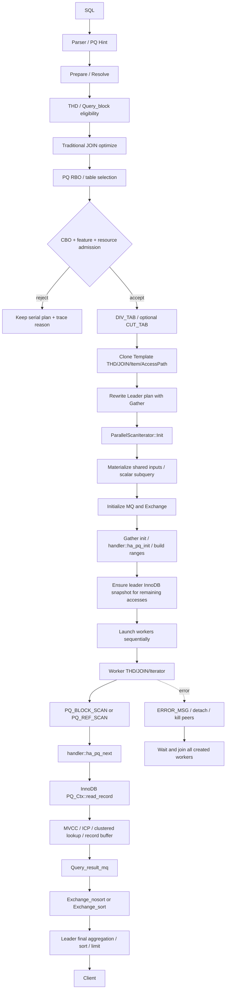

# Parallel Query 当前架构总览

> 文档 ID：`PQ-ARCH-000`
> 状态：`commit-bound-current`
> 适用提交：`1f6c4a5cbeab86dddcf8da7cdb3a3c29bb3509a9` (`stable_branch`)
> 最后静态核对：2026-07-20
> 运行验证：见 `current/quality/verification_evidence.md`

## 1. 目标与范围

Parallel Query（PQ）让一条 SQL 在同一 MySQL 实例内使用多个 worker 执行传统
优化器生成计划的一部分。当前实现不是独立优化器，也不是仅把一个 `rnd_next()`
并发化；它包含控制、资格检查、成本选择、计划克隆和改写、InnoDB B+Tree 切分、
worker 执行、MQ 数据交换以及 leader 最终算子。

本文只描述当前快照的 as-is 架构。历史 multi-partition、thread-pool dispatch、
group reshuffle 等方案属于设计背景，除非当前源码和测试重新证明，否则不属于当前能力。

## 2. 五分钟心智模型

```text
SQL / Hint
  -> Prepare / Resolve
  -> MySQL traditional optimizer creates serial plan
  -> PQ RBO / CBO / resource admission
  -> choose DIV_TAB and optional CUT_TAB
  -> clone Template plan
  -> rewrite Leader plan with Gather/PARALLEL_SCAN
  -> initialize exchange and InnoDB ranges
  -> create worker THD/JOIN/iterator trees
  -> workers scan PQ contexts and send rows/partial results through MQ
  -> leader receives/merges/finalizes and returns client result
  -> join workers and release handler/MQ/thread/memory resources
```

三个概念必须分开：

1. **逻辑切分表**：Optimizer 选择 `DIV_TAB`，Hash Join 可能再选择 `CUT_TAB`。
2. **物理数据切分**：InnoDB 将一个 index/range 边界切成 `PQ_Range/PQ_Ctx`。
3. **完整 worker 子计划**：Worker 执行 Gather 边界以下的 Item、Join、Iterator 图，
   不只是调用并行 scan API。

## 3. 端到端流程



`ParallelScanIterator::Init()` 的当前直接调用顺序是：

```text
exec_scalar_uncorrelated_subquery()
  -> pq_init_record_gather()
  -> m_gather->init()
  -> pq_create_innodb_snapshot()
  -> pq_launch_worker()
```

证据：`sql/parallel_query/pq_iterators.cc::ParallelScanIterator::Init`。

这里有两种相关但不能混为一谈的 read-view 行为：

- `m_gather->init()` 进入 handler/InnoDB 初始化 DIV/CUT scan，构造 scan context 时
  可能由 InnoDB 为 leader transaction 分配 read view。
- 随后的 `pq_create_innodb_snapshot()` 确保 worker 计划中其他普通 InnoDB 访问也有
  可克隆的一致性快照。

两者的完整所有权和 purge 保护仍属于 `PQ-GAP-MVCC-001`，不能只凭调用顺序宣称
全部事务场景已被运行验证。

## 4. 计划模型

| 计划 | 用途 | owner | 关键风险 |
|---|---|---|---|
| Leader 原始/改写计划 | Gather、receive table、最终算子、客户端输出 | 客户连接 THD | 改写 point-of-no-return、fallback 恢复完整性 |
| Template THD/JOIN | Worker 蓝图、共享结构、EXPLAIN worker tree | Gather/Leader 生命周期 | 不应执行的数据、共享对象有效期 |
| Worker THD/JOIN | 执行 Gather 以下子计划 | 单个 worker | leader 指针泄漏、MEM_ROOT、错误合并、销毁顺序 |

主要 AccessPath 类型：

- `PARALLEL_SCAN`：leader Gather 边界。
- `PQ_BLOCK_SCAN`：worker 静态 full/index/range/ref block scan。
- `PQ_REF_SCAN`：ref key 依赖外层行时动态构造 ranges。

## 5. 模块边界

| 模块 | 入口/代表 symbol | 产物 |
|---|---|---|
| Parser/控制 | `sql_hints.yy`、`PT_hint_pq::contextualize` | DOP、no_pq、table hint |
| Resolve | `THD::suite_for_parallel_query`、`Query_block::suite_for_parallel_query` | 初步资格和保存的表达式 |
| RBO/CBO | `JOIN::choose_parallel_tables`、`JOIN::suite_for_parallel_query` | DIV/CUT、拒绝原因、是否采用 PQ |
| Plan rewrite | `make_pq_unit_plan`、`make_pq_leader_plan` | Gather、receive table、leader AccessPath |
| Clone/refix | `pq_dup_*`、`Item::*pq_clone*`、`pq_refix_fields` | Template/Worker 查询图 |
| Worker runtime | `ParallelScanIterator`、`pq_worker_exec` | Worker 生命周期和执行结果 |
| Handler | `handler::ha_pq_init/next/end` | 引擎无关 parallel scan contract |
| InnoDB | `ha_innobase::pq_*`、`PQ_Ctx::read_record` | PQ ranges、visible MySQL records |
| MQ/Exchange | `Query_result_mq`、`Exchange_*` | Worker→Leader rows/partial state |
| Final operators | aggregate/sort/hash/materialize paths | 最终 SQL 语义和客户端结果 |

## 6. 跨模块不变量

### PQ-ARCH-INV-001：串并行语义等价

对于产品声明支持的输入，PQ OFF 与 PQ ON 必须产生等价的 rows、ordering（SQL 要求
时）、error、warning 和外部副作用。浮点聚合、无 ORDER BY 的 LIMIT 等允许差异必须
在支持契约中单独说明，不能隐式放宽。

### PQ-ARCH-INV-002：Range 不重不漏

所有 `PQ_Range/PQ_Ctx` 的并集必须等于串行访问范围，并且除显式允许的 MVI 去重路径
外不得重复消费用户记录。正向、反向、删除记录和 mtr restart 都必须保持此约束。

### PQ-ARCH-INV-003：计划引用隔离

Worker 查询图只能引用 worker-local 对象或有明确共享生命周期的对象，不得借用会在
worker 完成前被 leader 释放或重写的 Item、Field、TABLE、handler、MEM_ROOT 状态。

### PQ-ARCH-INV-004：错误不得变成部分成功

任一 worker、handler、MQ 或 final operator 错误都必须被 leader 观察；在协议已输出
部分结果后不得静默串行重试并产生重复行。

### PQ-ARCH-INV-005：所有已创建 worker 必须终止并 join

正常 EOF、LIMIT 早停、KILL、client disconnect、partial launch、MQ detach 和 error
路径都必须使所有实际创建的 worker 到达唯一终态并被 join。

### PQ-ARCH-INV-006：一致性快照生命周期覆盖执行期

DIV/CUT scan 与 worker 普通 InnoDB access 必须观察相容的逻辑快照；read view、leader
transaction 和 purge protection 的有效期必须覆盖最后一个相关 worker 访问。

### PQ-ARCH-INV-007：资源最终归零

Statement cleanup 后，线程配额、PQ memory accounting、MQ、handler scan、临时表、
hash spill file、VFD 和共享 materialization 必须恢复到定义的基线。

### PQ-ARCH-INV-008：拒绝必须无副作用

Eligibility、RBO、CBO 或资源拒绝后必须保留可执行串行计划，不残留 DIV/CUT 标志、
线程预留、修改过的 Item/AccessPath 或误导性的执行统计。

## 7. 当前能力边界摘要

- 仅支持传统 optimizer/QEP_TAB 路径；hypergraph optimizer 串行回退。
- 当前实例存储引擎检查要求 InnoDB；部分内部 non-transactional temp table 有专门路径。
- 分区表只允许一个 used partition 内部并行，不支持跨多个 used partition。
- Prepared Statement 执行不进入 PQ。
- Stored Procedure/Function/Trigger 内部 SQL 不进入 PQ；stored-function Item 本身也不允许
  进入 worker 计划。
- SERIALIZABLE、attachable transaction、显式 locking read 等不进入 PQ。
- INSERT/REPLACE SELECT 受 feature switch、锁、binlog 和副作用约束，默认不能概括为
  普遍支持。
- Worker 当前由 `mysql_thread_create()` 创建，不是历史 WL 描述的 thread-pool task。

完整约束见 `01_current_support_matrix.md`。

## 8. 错误和恢复边界

当前存在两类不同机制：

1. **Graceful fallback**：计划 clone/refix 的早期阶段可恢复当前串行计划继续优化/执行。
2. **Fail retry**：初始化阶段抛出指定错误且尚未安全输出结果时，重新解析并禁用 PQ
   完整串行执行。

进入 worker 执行或已经输出客户端行后，不能任意切换到串行执行。详细 point-of-no-return
和清理责任见 `modules/03_worker_lifecycle_error_retry.md`。

## 9. 可观测性最小要求

确认一条 SQL 是否使用 PQ，至少使用一种计划证据和一种运行证据：

- EXPLAIN / EXPLAIN TREE / JSON 中的 `<gatherN>`、`PARALLEL_SCAN` 或 parallel execute。
- Optimizer trace 中的 `not_apply_pq_plan` 和 reason。
- Statement 级执行状态或全局 PQ status 增量，作为 leader 已采纳 PQ plan 的辅助证据。

只设置 `force_parallel_execute=ON` 不能证明 PQ 实际被选择。

注意：当前 `PQ_executed`/`PQ_stmt_executed` 在 worker launch 前即可更新，因此不能证明 worker
实际已经运行。当前产品没有稳定的“worker 已运行”外部状态接口；需要该级别结论时，必须结合
受控运行取证（日志、调试器或定向插桩），并在证据中注明其非稳定接口属性。详见
`modules/12_observability_integrations.md`。

## 10. 代码走读起点

```text
pq_resolver.cc
  -> pq_optimizer.cc
  -> sql_parallel.cc
  -> pq_clone.cc / pq_clone_item.cc
  -> pq_iterators.cc
  -> handler.cc / pq_handler.cc
  -> ha_innodb_pq.cc / row0pread_pq.cc
  -> query_result_mq.cc / msg_queue.cc
  -> exchange.cc / exchange_sort.cc
```

修改任一链路前，应加载该模块文档、支持矩阵和质量追踪矩阵，而不是只读取本总览。
