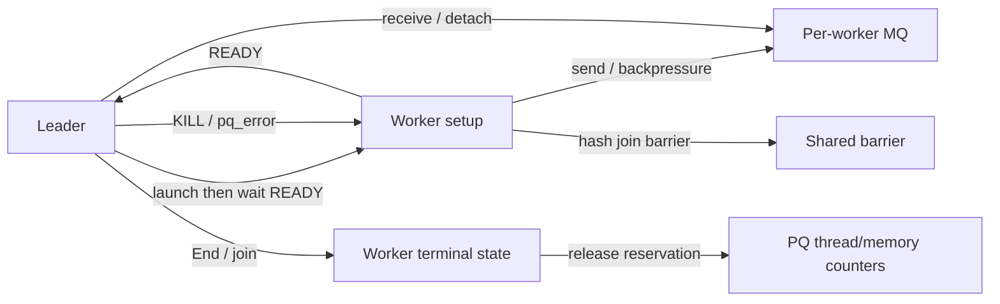

# Runbook：PQ 卡死、KILL 无响应或资源泄漏

> 文档 ID：`PQ-RUN-003`
> 状态：`commit-bound-current`
> 适用提交：`1f6c4a5cbeab86dddcf8da7cdb3a3c29bb3509a9` (`stable_branch`)
> 运行验证：见 `current/quality/verification_evidence.md`

## 1. 症状分类

- leader 长时间不返回，worker 存在但 CPU/IO 均无进展；
- worker 卡在 MQ send、barrier、range queue 或 READY 等待；
- `KILL QUERY` 后 leader/worker 仍存活；
- 语句结束后 `PQ_threads_running` 不回基线；
- 多轮执行后 PQ 内存计数、RSS、临时文件或 handler context 持续增长；
- 后续查询持续增加 `PQ_threads_refused`/`PQ_memory_refused`。

## 2. 现场采集顺序

1. 记录服务器时间、目标 connection id、SQL、DOP、事务和 session 变量。
2. 连续采集至少两组相隔数秒的全线程栈，用于区分等待与缓慢进展。
3. 保存 `SHOW PROCESSLIST`、Performance Schema thread/stage/wait 信息、error log。
4. 保存 `SHOW GLOBAL STATUS LIKE 'PQ%'`；记录语句前、挂起时、KILL 后、连接关闭后。
5. 若有 core-on-demand 能力，在不破坏首现场的前提下获取 core。
6. 最后才执行 `KILL QUERY`；记录发出时间和所有线程退出时间。

当前全局 PQ status 包括 `PQ_threads_running`、`PQ_threads_refused`、
`PQ_memory_refused`、`PQ_memory_used` 和 `PQ_stmt_executed`。它们是服务器级信号，
不直接给出某条语句的 worker 列表。

## 3. 等待图

卡死分析必须回答“谁在等谁，以及解除等待的唯一事件由谁发出”。只看最上层函数名
无法区分正常背压、丢失唤醒、barrier participant 未下降和 worker 未达到 READY。

## 4. 栈形状到检查点

| 栈/现象 | 检查点 | 相关实现 |
|---|---|---|
| leader 等待 worker READY | 创建失败路径是否设置错误并唤醒；串行逐 worker 启动是否停在第 N 个 | `ParallelScanIterator::pq_launch_worker()`、`PQ_worker_manager` |
| worker 卡在 MQ send | leader 是否仍 receive；detach/error 是否唤醒 sender；队列满与 batch publish | `msg_queue.cc`、`query_result_mq.cc` |
| leader 卡在 MQ receive | 所有 worker 是否都有终态消息或 detach；错误消息是否被消费 | `exchange.cc`、`exchange_sort.cc` |
| hash worker 卡在 barrier | 未启动 worker 是否执行 `ArriveAndDrop()`；异常退出是否减少 participant | `pq_iterators.cc`、hash shared context |
| worker 卡在 InnoDB | range queue、index latch、cursor restore、purge/MVCC | `pq_handler.cc`、`row0pread_pq.cc` |
| End/join 卡住 | leader 是否先传播 KILL/pq_error，再 detach 并等待；worker 是否仍阻塞在 send/barrier | `ParallelScanIterator::End()` 路径 |
| counter 不归零 | 预留和释放是否成对；部分启动是否按实际/预留 DOP 清理 | `pq_resource_stat.cc`、Gather cleanup |

## 5. KILL 与错误传播不变量

1. leader 的 KILL/error 最终对每个已创建 worker 可见。
2. MQ send/receive 和共享 barrier 都有 error/KILL 退出边。
3. 每个 worker 只进入一个终态；leader 只 join 已成功创建的线程。
4. 未启动 worker 不能留在 barrier participant 计数中。
5. handler scan、MQ、worker THD/JOIN、read view、共享 temp/hash 对象按所有权逆序释放。
6. 任何失败出口都必须释放线程预留；重复 End/析构不得二次扣减。

## 6. 可重复验证矩阵

对最小 SQL 分别在 worker 创建、plan clone、read-view clone、handler init、首次/中途
`ha_pq_next`、MQ send/receive、hash barrier、leader receive 阶段注入失败或 KILL。
每次验证：客户端有界返回、所有 worker 有界退出、无崩溃、status 回基线、下一条 PQ
仍可执行。DOP 至少覆盖 1、2 和能触发部分启动的值。

已有源码中可检索的注入点包括 `pq_worker_error*`、`pq_launch_worker_1`、
`ha_pq_init_fail`、`ha_pq_next_deadlock`、MQ/Exchange 相关 DBUG。使用前应逐个核对当前
触发位置，避免仅凭名字推断阶段。

## 7. 升级材料

提交：commit/build 信息、最小 SQL 与数据、DOP/变量、两组以上全线程栈、KILL 时间线、
PQ status 时间序列、error log、是否涉及 hash spill/ORDER BY/大结果、复现概率，以及连接
关闭或服务器重启后资源是否恢复。若只有 RSS 增长，还需区分 allocator cache、仍被引用
对象和真正不可达内存；若只有 PQ 内存计数增长，则优先审计计数配对。
