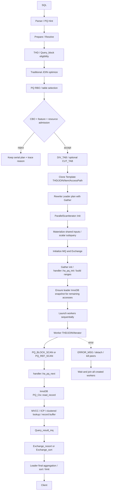
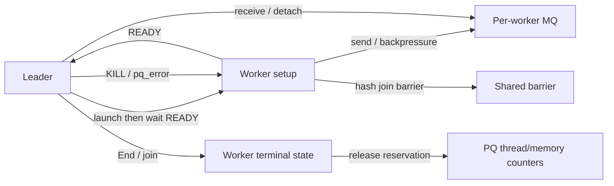

# Parallel Query AI Handbook

> **GENERATED — DO NOT EDIT.** 这是按 `manifest.yaml` 顺序拼装的单文件读取包。
> 权威源位于 `spec/current/`；静态核对与运行验证范围以 manifest 和
> `current/quality/verification_evidence.md` 为准。
> 输入提交：`1b9ffd755d4`；分支：`pq-local-refactor-clean`；
> 绑定 PQ source/test 树：`clean`；采集日期：`2026-07-21`。
> 源码树：`fac8b54f4febf9c81014dace2ae225af6f0d38de5f768a87d3039db39b20fe4f`；PQ 测试树：`8c59c7d8af6db3feffa377ca1aab9de9a822b6a80e2091e7b1cfd1db01b43bea`。
> 源码 hash 范围：`sql/parallel_query/** plus storage/innobase/include/row0pread_pq.h, storage/innobase/row/row0pread_pq.cc, storage/innobase/handler/ha_innodb_pq.cc`；其他接入点仅为 path::symbol 静态证据。

## 输入文档

- [`current/00_architecture_overview.md`](../current/00_architecture_overview.md) — `83947996403c57d279eead8af88283d4e5c7c5fe2f3c12363524e4d061a9d26c`
- [`current/01_current_support_matrix.md`](../current/01_current_support_matrix.md) — `dc6677c66e905c36ca6598aa5c94f1199b6563b4b4af8b4783dc178b16f54e10`
- [`current/modules/01_control_eligibility_cost.md`](../current/modules/01_control_eligibility_cost.md) — `bf229d4315286f59408837f84f73206fac34ec4f7354996229dd6c90c128e4fe`
- [`current/modules/02_plan_rewrite_clone_ownership.md`](../current/modules/02_plan_rewrite_clone_ownership.md) — `60e75acd0595ace60eebb1a90f80e9b5540ddf68b5e858877e4b2e87d275b0f0`
- [`current/modules/03_worker_lifecycle_error_retry.md`](../current/modules/03_worker_lifecycle_error_retry.md) — `c4f798aa5c9330fbe26475b53e6857e4cdffe7c37d10356dce89b82cda20ef75`
- [`current/modules/04_handler_capability_contract.md`](../current/modules/04_handler_capability_contract.md) — `54852351ced72f19e745d0574813460846d760bbd2e12b81eda9e5768b50d582`
- [`current/modules/05_innodb_range_cursor_mvcc.md`](../current/modules/05_innodb_range_cursor_mvcc.md) — `3a8974eae5a35c5147077bfae46ff1331fab41c0f5688fd09d10229a419ecb9e`
- [`current/modules/06_mq_exchange_record_protocol.md`](../current/modules/06_mq_exchange_record_protocol.md) — `5c96f64f5ffc45138915e6f4689395104a6cee43d9a6648cc2d180db9ccbad7b`
- [`current/modules/07_aggregation_order_limit.md`](../current/modules/07_aggregation_order_limit.md) — `903e19efd439be952a9cfe396ea7ced50f314c60345dd135cc4b0b6322bf3b32`
- [`current/modules/08_join_execution.md`](../current/modules/08_join_execution.md) — `d9b04baaa6d1735e5f82b16c53eb1861ec674de5907549162c0cbb049d0d878f`
- [`current/modules/09_subquery_union_derived.md`](../current/modules/09_subquery_union_derived.md) — `f3b5da43009df89e35ef90c1905f99fb282cb20a3037bdf5845c5216a6f22074`
- [`current/modules/10_transaction_dml_binlog.md`](../current/modules/10_transaction_dml_binlog.md) — `fcf0e4c68d02dcfb8517c1884f17b1ecde80f325b691b26ef8ea29261d44a0fa`
- [`current/modules/11_resource_accounting.md`](../current/modules/11_resource_accounting.md) — `d185f8a5fee3e9b711a158b2f3f4ef5fa5dd973c93980b31a9f058c3e39ee3d2`
- [`current/modules/12_observability_integrations.md`](../current/modules/12_observability_integrations.md) — `182c361d69f0bcc5ada7b9d35e354745d7999bccdb37c5e00d856a88bd2764c0`
- [`current/13_context_ownership_refactor.md`](../current/13_context_ownership_refactor.md) — `c2322f4cbda0f8c40870ff3d7eff1fcccca0ec19c631f632260c7954b697487d`
- [`current/quality/requirements_test_traceability.md`](../current/quality/requirements_test_traceability.md) — `ede71c19da054e98b2190f845bf96b45bd56761d47836d1f7084c5f045362c54`
- [`current/quality/fault_injection_release_gates.md`](../current/quality/fault_injection_release_gates.md) — `0305207e76eb169c67c4813540274cf779562b718dea1b8e76e182f0cbc16370`
- [`current/quality/verification_evidence.md`](../current/quality/verification_evidence.md) — `8533ea8df3f1799f707be83d3eb389f2245e667e73f3a49ae43eb97125ff6943`
- [`current/quality/context_refactor_review_2026-07-21.md`](../current/quality/context_refactor_review_2026-07-21.md) — `fff4dfb51ba6ba79d5b2d9094aa6f8fdb7ce0d4f9b9b150eeaf981b4bfc8b5de`
- [`current/runbooks/pq_not_selected.md`](../current/runbooks/pq_not_selected.md) — `9eadc14090e8c63debba39ad3591f04e3f03c91da4b509a5de7fce7bdacb3115`
- [`current/runbooks/wrong_result_or_crash.md`](../current/runbooks/wrong_result_or_crash.md) — `a95744ed7bc6b006f949d813c3ccb0664a85214db766ba48e7d9dcb4d2e9e18d`
- [`current/runbooks/hang_kill_resource_leak.md`](../current/runbooks/hang_kill_resource_leak.md) — `26ac1c109d763aab06797470fbe84402a67fc9a9d8425c55dcf3feeeb0463bda`
- [`current/conformance_gaps.md`](../current/conformance_gaps.md) — `16daeee0ed7022d126982246c325776630ee2a58dba64975c67836b64c20be4a`

---

<!-- BEGIN SOURCE: current/00_architecture_overview.md -->

# Parallel Query 当前架构总览

> 文档 ID：`PQ-ARCH-000`
> 状态：`commit-bound-current`
> 适用提交：`1f6c4a5cbeab86dddcf8da7cdb3a3c29bb3509a9` (`stable_branch`)
> 最后静态核对：2026-07-20
> 运行验证：见 `current/quality/verification_evidence.md`

## 1. 目标与范围

Parallel Query（PQ）让一条 SQL 在同一 MySQL 实例内使用多个 worker 执行传统
优化器生成计划的一部分。当前实现不是独立优化器，也不是仅把一个 `rnd_next()`
并发化；它包含控制、资格检查、成本选择、计划克隆和改写、InnoDB B+Tree 切分、
worker 执行、MQ 数据交换以及 leader 最终算子。

本文只描述当前快照的 as-is 架构。历史 multi-partition、thread-pool dispatch、
group reshuffle 等方案属于设计背景，除非当前源码和测试重新证明，否则不属于当前能力。

## 2. 五分钟心智模型

```text
SQL / Hint
  -> Prepare / Resolve
  -> MySQL traditional optimizer creates serial plan
  -> PQ RBO / CBO / resource admission
  -> choose DIV_TAB and optional CUT_TAB
  -> clone Template plan
  -> rewrite Leader plan with Gather/PARALLEL_SCAN
  -> initialize exchange and InnoDB ranges
  -> create worker THD/JOIN/iterator trees
  -> workers scan PQ contexts and send rows/partial results through MQ
  -> leader receives/merges/finalizes and returns client result
  -> join workers and release handler/MQ/thread/memory resources
```

三个概念必须分开：

1. **逻辑切分表**：Optimizer 选择 `DIV_TAB`，Hash Join 可能再选择 `CUT_TAB`。
2. **物理数据切分**：InnoDB 将一个 index/range 边界切成 `PQ_Range/PQ_Ctx`。
3. **完整 worker 子计划**：Worker 执行 Gather 边界以下的 Item、Join、Iterator 图，
   不只是调用并行 scan API。

## 3. 端到端流程



`ParallelScanIterator::Init()` 的当前直接调用顺序是：

```text
exec_scalar_uncorrelated_subquery()
  -> pq_init_record_gather()
  -> m_gather->init()
  -> pq_create_innodb_snapshot()
  -> pq_launch_worker()
```

证据：`sql/parallel_query/pq_iterators.cc::ParallelScanIterator::Init`。

这里有两种相关但不能混为一谈的 read-view 行为：

- `m_gather->init()` 进入 handler/InnoDB 初始化 DIV/CUT scan，构造 scan context 时
  可能由 InnoDB 为 leader transaction 分配 read view。
- 随后的 `pq_create_innodb_snapshot()` 确保 worker 计划中其他普通 InnoDB 访问也有
  可克隆的一致性快照。

两者的完整所有权和 purge 保护仍属于 `PQ-GAP-MVCC-001`，不能只凭调用顺序宣称
全部事务场景已被运行验证。

## 4. 计划模型

| 计划 | 用途 | owner | 关键风险 |
|---|---|---|---|
| Leader 原始/改写计划 | Gather、receive table、最终算子、客户端输出 | 客户连接 THD | 改写 point-of-no-return、fallback 恢复完整性 |
| Template THD/JOIN | Worker 蓝图、共享结构、EXPLAIN worker tree | Gather/Leader 生命周期 | 不应执行的数据、共享对象有效期 |
| Worker THD/JOIN | 执行 Gather 以下子计划 | 单个 worker | leader 指针泄漏、MEM_ROOT、错误合并、销毁顺序 |

主要 AccessPath 类型：

- `PARALLEL_SCAN`：leader Gather 边界。
- `PQ_BLOCK_SCAN`：worker 静态 full/index/range/ref block scan。
- `PQ_REF_SCAN`：ref key 依赖外层行时动态构造 ranges。

## 5. 模块边界

| 模块 | 入口/代表 symbol | 产物 |
|---|---|---|
| Parser/控制 | `sql_hints.yy`、`PT_hint_pq::contextualize` | DOP、no_pq、table hint |
| Resolve | `THD::suite_for_parallel_query`、`Query_block::suite_for_parallel_query` | 初步资格和保存的表达式 |
| RBO/CBO | `JOIN::choose_parallel_tables`、`JOIN::suite_for_parallel_query` | DIV/CUT、拒绝原因、是否采用 PQ |
| Plan rewrite | `make_pq_unit_plan`、`make_pq_leader_plan` | Gather、receive table、leader AccessPath |
| Clone/refix | `pq_dup_*`、`Item::*pq_clone*`、`pq_refix_fields` | Template/Worker 查询图 |
| Worker runtime | `ParallelScanIterator`、`pq_worker_exec` | Worker 生命周期和执行结果 |
| Handler | `handler::ha_pq_init/next/end` | 引擎无关 parallel scan contract |
| InnoDB | `ha_innobase::pq_*`、`PQ_Ctx::read_record` | PQ ranges、visible MySQL records |
| MQ/Exchange | `Query_result_mq`、`Exchange_*` | Worker→Leader rows/partial state |
| Final operators | aggregate/sort/hash/materialize paths | 最终 SQL 语义和客户端结果 |

## 6. 跨模块不变量

### PQ-ARCH-INV-001：串并行语义等价

对于产品声明支持的输入，PQ OFF 与 PQ ON 必须产生等价的 rows、ordering（SQL 要求
时）、error、warning 和外部副作用。浮点聚合、无 ORDER BY 的 LIMIT 等允许差异必须
在支持契约中单独说明，不能隐式放宽。

### PQ-ARCH-INV-002：Range 不重不漏

所有 `PQ_Range/PQ_Ctx` 的并集必须等于串行访问范围，并且除显式允许的 MVI 去重路径
外不得重复消费用户记录。正向、反向、删除记录和 mtr restart 都必须保持此约束。

### PQ-ARCH-INV-003：计划引用隔离

Worker 查询图只能引用 worker-local 对象或有明确共享生命周期的对象，不得借用会在
worker 完成前被 leader 释放或重写的 Item、Field、TABLE、handler、MEM_ROOT 状态。

### PQ-ARCH-INV-004：错误不得变成部分成功

任一 worker、handler、MQ 或 final operator 错误都必须被 leader 观察；在协议已输出
部分结果后不得静默串行重试并产生重复行。

### PQ-ARCH-INV-005：所有已创建 worker 必须终止并 join

正常 EOF、LIMIT 早停、KILL、client disconnect、partial launch、MQ detach 和 error
路径都必须使所有实际创建的 worker 到达唯一终态并被 join。

### PQ-ARCH-INV-006：一致性快照生命周期覆盖执行期

DIV/CUT scan 与 worker 普通 InnoDB access 必须观察相容的逻辑快照；read view、leader
transaction 和 purge protection 的有效期必须覆盖最后一个相关 worker 访问。

### PQ-ARCH-INV-007：资源最终归零

Statement cleanup 后，线程配额、PQ memory accounting、MQ、handler scan、临时表、
hash spill file、VFD 和共享 materialization 必须恢复到定义的基线。

### PQ-ARCH-INV-008：拒绝必须无副作用

Eligibility、RBO、CBO 或资源拒绝后必须保留可执行串行计划，不残留 DIV/CUT 标志、
线程预留、修改过的 Item/AccessPath 或误导性的执行统计。

## 7. 当前能力边界摘要

- 仅支持传统 optimizer/QEP_TAB 路径；hypergraph optimizer 串行回退。
- 当前实例存储引擎检查要求 InnoDB；部分内部 non-transactional temp table 有专门路径。
- 分区表只允许一个 used partition 内部并行，不支持跨多个 used partition。
- Prepared Statement 执行不进入 PQ。
- Stored Procedure/Function/Trigger 内部 SQL 不进入 PQ；stored-function Item 本身也不允许
  进入 worker 计划。
- SERIALIZABLE、attachable transaction、显式 locking read 等不进入 PQ。
- INSERT/REPLACE SELECT 受 feature switch、锁、binlog 和副作用约束，默认不能概括为
  普遍支持。
- Worker 当前由 `mysql_thread_create()` 创建，不是历史 WL 描述的 thread-pool task。

完整约束见 `01_current_support_matrix.md`。

## 8. 错误和恢复边界

当前存在两类不同机制：

1. **Graceful fallback**：计划 clone/refix 的早期阶段可恢复当前串行计划继续优化/执行。
2. **Fail retry**：初始化阶段抛出指定错误且尚未安全输出结果时，重新解析并禁用 PQ
   完整串行执行。

进入 worker 执行或已经输出客户端行后，不能任意切换到串行执行。详细 point-of-no-return
和清理责任见 `modules/03_worker_lifecycle_error_retry.md`。

## 9. 可观测性最小要求

确认一条 SQL 是否使用 PQ，至少使用一种计划证据和一种运行证据：

- EXPLAIN / EXPLAIN TREE / JSON 中的 `<gatherN>`、`PARALLEL_SCAN` 或 parallel execute。
- Optimizer trace 中的 `not_apply_pq_plan` 和 reason。
- Statement 级执行状态或全局 PQ status 增量，作为 leader 已采纳 PQ plan 的辅助证据。

只设置 `force_parallel_execute=ON` 不能证明 PQ 实际被选择。

注意：当前 `PQ_executed`/`PQ_stmt_executed` 在 worker launch 前即可更新，因此不能证明 worker
实际已经运行。当前产品没有稳定的“worker 已运行”外部状态接口；需要该级别结论时，必须结合
受控运行取证（日志、调试器或定向插桩），并在证据中注明其非稳定接口属性。详见
`modules/12_observability_integrations.md`。

## 10. 代码走读起点

```text
pq_resolver.cc
  -> pq_optimizer.cc
  -> sql_parallel.cc
  -> pq_clone.cc / pq_clone_item.cc
  -> pq_iterators.cc
  -> handler.cc / pq_handler.cc
  -> ha_innodb_pq.cc / row0pread_pq.cc
  -> query_result_mq.cc / msg_queue.cc
  -> exchange.cc / exchange_sort.cc
```

修改任一链路前，应加载该模块文档、支持矩阵和质量追踪矩阵，而不是只读取本总览。

<!-- END SOURCE: current/00_architecture_overview.md -->

---

<!-- BEGIN SOURCE: current/01_current_support_matrix.md -->

# Parallel Query 当前支持矩阵

> 文档 ID：`PQ-CONTRACT-SUPPORT-001`
> 状态：`current-contract`，证据级别为 `static-evidence`
> 适用提交：`1f6c4a5cbeab86dddcf8da7cdb3a3c29bb3509a9` (`stable_branch`)
> 最后静态核对：2026-07-20
> 运行验证：见 `current/quality/verification_evidence.md`

## 1. 使用规则

本矩阵是当前 PQ 支持边界的唯一人工维护事实源。`implemented` 表示当前快照中存在
对应代码路径，不表示本轮已经运行 MTR。任何未列场景默认为 `unknown`，不能根据
历史 WL 推断为支持。

“串行回退”表示 SQL 通常仍可由 MySQL 串行执行；它不是 PQ 执行错误。强制变量或
`PQ` Hint 不能绕过硬资格检查。

“代表测试”指 `stable_branch` 中存在的 `.test`/`.result-pq` 资产。全套 `--pq`
运行结果见 `verification_evidence.md`；它不替代场景行所需的组合级 oracle。原快照中的
customer/trigger overlay probes 不属于本分支，不得作为当前覆盖证据。

## 2. 命令与执行上下文

| 场景 | 状态 | 当前行为/条件 | 主要静态证据 | 代表测试 |
|---|---|---|---|---|
| 普通 `SELECT` | `implemented` | 仍需通过 Query_block/JOIN/engine/资源/CBO 全部检查 | `THD::suite_for_parallel_query`、`make_pq_unit_plan` | `pq_fullscan`、`pq_optimizer_trace` |
| `INSERT ... SELECT` | `partial` | 受 `insert_select` feature flag、binlog、锁和副作用约束；默认 flag 为 off | `PQ_SUPPORT_INSERT_SELECT`、SQL insert 接入点 | `parallel_insert_select*` |
| `REPLACE ... SELECT` | `partial` | 与 INSERT SELECT 类似，需单独验证并发和唯一键副作用 | SQL command gate、replace-select tests | `parallel_replace_select*` |
| 普通 INSERT/UPDATE/DELETE | `serial-fallback` | 不是 PQ 主命令类型 | `THD::suite_for_parallel_query` command gate | `pq_optimizer_trace` |
| SQL `PREPARE/EXECUTE` | `serial-fallback` | 执行阶段 `lex->in_execute_ps=true`，PQ 资格检查拒绝 | `sql_prepare.cc::set_thd_to_ps`、`pq_resolver.cc` | `pq_optimizer_trace` |
| Binary protocol Prepared Statement | `serial-fallback` | 走相同 Prepared_statement 执行上下文 | `Prepared_statement` execution path | 需要独立协议级覆盖 |
| Stored Procedure 内部 SQL | `serial-fallback` | `THD::in_sp_trigger=true` | `sp_head::execute_procedure`、`pq_resolver.cc` | `pq_sp_trigger` |
| Stored Function 内部 SQL | `serial-fallback` | Stored program 执行期间 `in_sp_trigger=true` | `sp_head::execute_function` | `pq_sp_trigger` |
| 顶层 SQL 直接调用 Stored Function | `serial-fallback` | 表达式树中的 `Item_func::FUNC_SP` 命中 `NO_PQ_SUPPORTED_FUNC_TYPES`，整个相关 query block 不进入 PQ | `pq_optimizer.cc::NO_PQ_SUPPORTED_FUNC_TYPES` | `pq_sp_trigger`；仍需协议/组合矩阵 |
| Trigger 内部 SQL | `serial-fallback` | Trigger 执行期间 `in_sp_trigger=true` | `sp_head::execute_trigger` | `pq_sp_trigger`；仍缺 trigger restore 专项故障覆盖 |
| Attachable transaction | `serial-fallback` | THD 级资格检查拒绝 | `THD::suite_for_parallel_query` | optimizer trace 类测试 |
| Hypergraph optimizer | `serial-fallback` | PQ 依赖 QEP_TAB，明确互斥 | `lex->using_hypergraph_optimizer()` gate | `pq_not_support` |

## 3. 事务、隔离和锁

| 场景 | 状态 | 当前行为/条件 | 主要证据 | 代表测试/缺口 |
|---|---|---|---|---|
| READ UNCOMMITTED | `unknown` | 未形成发布级组合契约 | transaction/read-view paths | 需要隔离级别矩阵 |
| READ COMMITTED | `partial` | 代码可建立/克隆 read view，但 statement view 语义需系统验证 | `pq_create_innodb_snapshot`、InnoDB trx | `pq_read_view` |
| REPEATABLE READ | `partial` | 同上；显式事务和 purge 生命周期未在本轮运行验证 | InnoDB PQ scan context | `pq_read_view`、`pq_rec_visible` |
| SERIALIZABLE | `serial-fallback` | THD 级硬拒绝 | `tx_isolation == ISO_SERIALIZABLE` | `pq_not_support` |
| `SELECT ... FOR UPDATE` | `serial-fallback` | PQ 不实现 locking read | Query_block/lock checks | `pq_mdl_lock`、insert-select tests |
| `LOCK IN SHARE MODE` / `FOR SHARE` | `serial-fallback` | 显式 locking read 不进入 PQ | locking clause checks | insert/replace-select tests |
| 显式 `LOCK TABLES` | `serial-fallback` | explicit table lock 被拒绝 | Query_block eligibility | `pq_not_support` |
| Autocommit consistent read | `implemented` | 仍需满足全部支持条件 | normal SELECT path | `pq_fullscan`、`pq_read_view` |
| 显式事务 | `partial` | read view/cleanup 需按隔离级别和并发 DML 验证 | THD/trx lifecycle | `pq_read_view`，缺完整矩阵 |
| XA | `unknown` | 当前规范不声明支持 | no approved contract | 需要定向测试 |
| 并发 INSERT/UPDATE/DELETE/purge | `partial` | 有零散测试，未形成完整 MVCC × scan matrix | InnoDB visibility/cursor paths | `pq_rec_visible`、customer probes |
| 并发 DDL/MDL | `partial` | MDL 有覆盖，page/metadata 变化仍属高风险 | MDL and table metadata paths | `pq_mdl_lock`、`pq_instant_add_column` |

## 4. Engine、表和 partition

| 场景 | 状态 | 当前行为/条件 | 证据 | 代表测试 |
|---|---|---|---|---|
| InnoDB base table | `implemented` | 当前实例 engine gate 要求 InnoDB | `get_instance_storage_engine_type()` | 大多数 PQ tests |
| DSTORE | `serial-fallback` | 明确不支持 | engine gate | `pq_not_support_dstore` |
| 其他普通 engine | `serial-fallback` | handler capability 不满足 | table/handler checks | `pq_not_support` |
| Internal non-transactional temp table | `partial` | materialization 等特定路径可以共享或扫描 | `TABLE::suite_for_pq_division` | `pq_innodb_intrinsic`、derived tests |
| 用户 transactional temporary table | `serial-fallback` | table eligibility 拒绝 | table checks | `pq_not_support` |
| System table/system schema | `serial-fallback` | eligibility 拒绝 | table-list checks | `pq_not_support` |
| 非分区表 | `implemented` | 标准 InnoDB PQ scan | handler/InnoDB PQ | scan tests |
| 分区表且仅一个 used partition | `partial` | 只在该 partition 内做 B+Tree PQ scan | `num_partitions_used()==1` | `pq_partition` |
| 多个 used partitions | `serial-fallback` | 当前明确拒绝；WL008 是历史设计 | `TABLE::suite_for_pq_division` | `pq_partition` |
| Subpartition | `unknown` | 不超出单 used partition 约束的细节需验证 | partition info | 需要定向测试 |
| Table function | `serial-fallback` | Query_block eligibility 拒绝 | table-function check | `pq_not_support` |
| Fulltext | `serial-fallback` | 表 eligibility 拒绝 | `is_fulltext_searched()` | `pq_not_support` |

## 5. Access path 和扫描

| 场景 | 状态 | 当前行为/条件 | 代表 symbol | 代表测试 |
|---|---|---|---|---|
| Full table scan (`JT_ALL`) | `implemented` | 可作为 DIV/CUT | `PQblockScanIterator` | `pq_fullscan` |
| Full index scan | `implemented` | 支持正向/部分反向路径 | handler/InnoDB index init | `pq_coverage_index`、`pq_index_scan_desc` |
| Clustered range scan | `implemented` | Range AccessPath 必须可转换为支持的单一 index range | `pq_range_scan_init` | `pq_range_clust` |
| Secondary range scan | `implemented` | 包含 MVCC/回表约束 | `find_visible_record` | `pq_range_sec` |
| Static `JT_REF` | `implemented` | Key 在计划/round 中确定 | `PQ_BLOCK_SCAN` | `pq_jt_ref` |
| Dependent ref | `partial` | 外表 key 变化时动态构造/切换 ranges | `PQRefIterator`、`pq_ref_build_ranges` | `pq_depend_ref`、`pq_ref_build_range` |
| Reverse range/index scan | `implemented` | 边界和 cursor restore 方向敏感 | InnoDB PQ cursor paths | `pq_range_scan_reverse`、`pq_reverse_index_scan` |
| ICP | `implemented` | 二级索引可先 ICP，必要时回聚簇索引 | `find_visible_record` | `pq_icp` |
| Covering secondary index | `implemented` | 仍需 MVCC 可见性判断 | secondary scan paths | `pq_coverage_index` |
| Non-covering secondary index | `implemented` | 需要 clustered lookup | visible-record paths | `pq_range_sec` |
| Record buffer | `implemented` | context 切换、restart 和 generated column 是高风险边界 | `PQ_Ctx::read_record` | `pq_record_buffer` |
| Dynamic range | `serial-fallback` | 当前 RBO 拒绝 | scan-type checks | `pq_not_support` |
| Multi-range shape not reducible to supported range path | `serial-fallback` | 需满足 AccessPath 约束 | range AccessPath checks | `pq_not_support` |
| MVI duplicate filter | `partial` | 有专门状态和测试，但组合覆盖有限 | iterator duplicate-filter path | `pq_multi_value` |

## 6. SQL operators

| 场景 | 状态 | 当前行为/条件 | 代表测试 |
|---|---|---|---|
| Projection/WHERE | `implemented` | Item 必须可 clone/refix，类型和函数必须支持 | `pq_coverage`、`pq_clone_item` |
| SUM/COUNT/AVG/MIN/MAX | `implemented` | 按 partial/final 规则转换；NULL/overflow/warning 仍需组合验证 | `pq_group_by`、`pq_aggr_no_record` |
| GROUP BY | `implemented` | Worker partial + leader final；排序/临时表路径受约束 | `pq_group_by` |
| `COUNT(DISTINCT ...)` | `partial` | 受 `count_distinct` feature flag、参数类型和 Batch_buffer 内存约束；历史 group reshuffle 不是当前事实 | `pq_agg_distinct`、`pq_distinct` |
| `SUM(DISTINCT ...)` / `AVG(DISTINCT ...)` | `serial-fallback` | `SUM_DISTINCT_FUNC`、`AVG_DISTINCT_FUNC` 位于当前不支持聚合类型列表 | `sql/parallel_query/pq_optimizer.cc::NO_PQ_SUPPORTED_AGG_FUNC_TYPES`、`pq_agg_distinct` |
| HAVING | `partial` | 是否 worker 下推/leader final 取决于聚合和 clone | aggregate tests |
| ORDER BY | `implemented` | Worker 局部有序或 leader sort；可使用 gather merge | `pq_order_by`、`pq_order_const` |
| ORDER BY + LIMIT/OFFSET | `partial` | 稳定性、early detach 和 offset pushdown 有额外条件 | order/limit tests |
| LIMIT without ORDER BY | `partial` | 由 `parallel_limit_no_order_by` 控制；返回集合顺序不保证 | `pq_limit_no_order_by` |
| `SQL_BUFFER_RESULT` | `serial-fallback` | Query_block 资格检查拒绝 | `pq_optimizer_trace` |
| ROLLUP | `serial-fallback` | 当前拒绝 | `pq_not_support`、distinct tests |
| Window functions | `serial-fallback` | 当前拒绝 | `pq_optimizer_trace` |
| DISTINCT SELECT | `partial` | 取决于 distinct/temporary-table/aggregate 路径 | `pq_distinct` |
| Hash Join | `implemented` | build/probe、CUT_TAB、spill flag、barrier 有额外约束 | `pq_hash_join` |
| Semi/Anti/Outer Hash Join | `partial` | Join 类型和 plan shape 受约束 | `pq_semijoin`、hash tests |
| BKA | `partial` | 部分 inner/table shape 被 RBO 拒绝 | `pq_join_bka` |
| Outer join inner 作为 DIV_TAB | `serial-fallback` | DIV_TAB 选择限制 | join eligibility；缺独立负向用例 |
| Semijoin inner 作为 DIV_TAB | `serial-fallback` | DIV_TAB 选择限制 | `pq_semijoin` |

## 7. Subquery、UNION、Derived 和 CTE

| 场景 | 状态 | 当前行为/条件 | 代表测试 |
|---|---|---|---|
| 无关 scalar subquery | `partial` | 可由 leader 预执行并共享；位置和 Item 类型受限 | `pq_subquery` |
| Correlated subquery | `partial` | 支持部分 NST clone/query-block shape，不是普遍支持 | `pq_subquery_correlated` |
| Materialized subquery | `partial` | 临时表共享和生命周期受限 | `pq_subquery`、`pq_semijoin` |
| UNION ALL | `partial` | simple query block 可分别建立 Gather | `pq_union` |
| UNION DISTINCT | `partial` | 进入额外 materialization 路径 | `pq_union` |
| INTERSECT/EXCEPT | `serial-fallback` | Query_block 资格检查拒绝 | `pq_not_support` |
| Materialized derived/view | `partial` | shared storage、DIV_TAB 选择和 outer reference 受限 | `pq_divide_derived`、`pq_derived_view` |
| Outer-correlated derived/view | `serial-fallback` | eligibility 拒绝 | derived tests |
| CTE | `partial` | 与 materialization/query-expression shape 相关 | derived/union tests |
| Recursive CTE | `unknown` | 当前规范不声明 PQ 支持 | 需要定向测试 |

## 8. Item、函数和数据类型

| 场景 | 状态 | 当前行为/条件 | 证据/测试 |
|---|---|---|---|
| 常见数值/字符/日期表达式 | `implemented` | Item 类型必须有完整 clone/refix | `pq_clone_item`、`pq_charset`、`round_truncate_for_pq` |
| BLOB | `partial` | 有专门测试，消息和临时表大小需约束 | `pq_blob` |
| JSON/GEOMETRY | `serial-fallback` | 列在不支持字段/函数类型中 | optimizer unsupported lists |
| MATCH/fulltext | `serial-fallback` | 不支持函数/表访问 | optimizer/table checks |
| Stored Function (`FUNC_SP`) | `serial-fallback` | 不允许进入 worker Item 图 | `NO_PQ_SUPPORTED_FUNC_TYPES` |
| UDF | `serial-fallback` | `UDF_FUNC`/aggregate UDF 不支持 | unsupported lists、`pq_user_func` |
| 用户变量 | `serial-fallback` | `SUSERVAR_FUNC` 不支持，避免共享副作用 | unsupported lists |
| RAND/SYSDATE 等非确定性行为 | `partial` | 需要保持串行语义、seed 和 binlog 行为 | `pq_sysdate_is_now`、clone tests |
| Generated column | `partial` | record conversion/buffer 有专门路径 | `pq_instant_add_column`、record tests |

## 9. 控制、资源和可观测性

| 场景 | 状态 | 当前行为/条件 | 证据/测试 |
|---|---|---|---|
| `PQ` Hint | `implemented` | 设置候选 DOP/table/qb 信息，不能绕过硬检查 | hint parser、`pq_variables` |
| `NO_PQ` Hint | `implemented` | 稳定禁用 PQ | resolver no_pq gate |
| `force_parallel_execute` | `implemented` | 只在未设置 DOP 时进入候选流程，不保证选中 | `sql_parse.cc` |
| RBO | `implemented` | Hint → threshold candidate → threshold=0 最大候选 | `JOIN::choose_parallel_tables` |
| CBO | `implemented` | 比较串行/并行成本和传输/setup cost | access-path cost rewrite、`pq_cbo` |
| 全局线程准入 | `implemented` | 上限 64；拒绝/等待行为受 timeout 控制 | resource stat/sys vars |
| 全局内存准入 | `partial` | 默认 100MB；当前更接近准入 accounting，不应理解为所有运行期分配硬上限 | `pq_resource_stat`、`pq_memory_limit` |
| Worker thread pool dispatch | `design-only` | 当前主路径直接 `mysql_thread_create()` | `pq_iterators.cc` |
| Traditional EXPLAIN | `implemented` | 显示 `<gatherN>`/Parallel execute | `pq_explain` |
| EXPLAIN TREE/JSON/ANALYZE | `implemented` | worker timing/plan 展示仍需格式稳定性测试 | `pq_explain_tree/json/analyze` |
| Optimizer trace rejection | `implemented` | `not_apply_pq_plan` + reason | `pq_optimizer_trace` |
| Global status | `implemented` | 线程、内存、statement 等全局统计 | `pq_variables`、`pq_examined_rows` |
| Per-statement skew/range/MQ 指标 | `unknown` | 当前未形成完整产品接口 | hardening candidate |

## 10. Fallback、retry 和错误

| 场景 | 状态 | 当前行为/条件 | 代表测试 |
|---|---|---|---|
| Eligibility/RBO/CBO 拒绝 | `serial-fallback` | 保留串行计划并记录原因 | `pq_optimizer_trace`、`pq_cbo` |
| Clone/refix 早期失败 | `partial` | `parallel_graceful_fallback` 开启时可恢复当前串行计划 | `pq_fallback` |
| Leader 后期改写/初始化失败 | `partial` | 可能抛 `ER_PARALLEL_FAIL_INIT`，满足条件时完整串行 retry | `pq_auto_retry_failed_parallel_query` |
| Worker 运行期错误 | `rejected` | 终止 PQ，传播错误并 join workers；不得继续返回部分成功 | `pq_worker_error`、`pq_mq_error` |
| 客户端已收到部分结果后的 retry | `rejected` | 不安全，必须禁止 | lifecycle contract |
| KILL QUERY/CONNECTION | `implemented` | leader 向 worker 传播 kill 并清理 | `pq_kill`、`pq_kill_query` |
| LIMIT 早停 | `partial` | leader 必须 detach queues，避免 sender 永久阻塞 | order/limit and lifecycle tests |

## 11. 组合测试要求

单个 `implemented` 行不能推出任意组合都支持。发布或扩大支持范围时至少交叉：

```text
PQ OFF / accepted / rejected / fallback / runtime error
× DOP 1 / 2 / 4 / 8 / DOP > contexts
× full / clustered / secondary / ref / reverse / ICP
× empty / NULL / duplicate / skew / wide row
× autocommit / explicit transaction / isolation level
× no concurrency / DML / purge / DDL / KILL / disconnect
```

Requirement 和测试映射见 `quality/requirements_test_traceability.md`。

<!-- END SOURCE: current/01_current_support_matrix.md -->

---

<!-- BEGIN SOURCE: current/modules/01_control_eligibility_cost.md -->

# Parallel Query 控制、资格与成本契约

> 模块 ID：`PQ-MOD-001`
> 状态：`current-contract`
> 适用提交：`1f6c4a5cbeab86dddcf8da7cdb3a3c29bb3509a9` (`stable_branch`)
> 快照清单：`Docs/features_for_opensource/01_parallel_query/spec/manifest.yaml`；`working_tree=clean`
> source_tree_sha256：`a44b667674af59160db9442dd779a608af349c88a67712b1f364ce4a8a5af90d`
> test_tree_sha256：`066ac7d1945da34e0d1418973542e5f6f94b33529b996185d0498d182331b9f6`
> 最后静态核对：2026-07-20
> 最后运行验证：见 `current/quality/verification_evidence.md`

哈希覆盖边界：`source_tree_sha256` 仅覆盖 manifest 定义的
`sql/parallel_query/**`，以及 `storage/innobase/include/row0pread_pq.h`、
`storage/innobase/row/row0pread_pq.cc`、`storage/innobase/handler/ha_innodb_pq.cc`。
它不单独 content-hash `sql/handler.cc`、`sql/handler.h`、`sql/table.cc`、
`sql/table.h`、`sql/sql_parse.cc`、`sql/sql_class.cc`、`sql/sql_class.h`、
`sql/sql_lex.h`、`sql/sql_select.cc` 或 TempTable 接入文件；这些和其他外部接入证据仅是
绑定 commit + bound PQ source/test tree 上的 `repository/path::QualifiedSymbol` 静态核对，不能据此
推断整个 workspace 或本模块全部 source evidence 具有可复现 content hash。

本文描述清单绑定 bound PQ source/test tree 的 as-is 契约。行为状态只使用 manifest 的
`status_vocabulary`；源码观察的证据为 `static-evidence`，已找到但未运行的测试证据为
`test-present`，运行验证为 `none`。

## 1. 职责与非目标

本模块负责把会话开关、PQ/NO_PQ hint、语句和查询块资格、传统优化器生成的访问路径、
资源准入、feature switch 与成本估算收敛为一个决定：保留串行计划，或把当前
`Query_block/JOIN` 标记为可进入 PQ 计划克隆和 leader 改写阶段。它还负责选择
`DIV_TAB`，必要时标记 `CUT_TAB`，并把拒绝原因写入 optimizer trace。

本模块不负责：

- 克隆 Item、THD、JOIN 或 AccessPath，也不拥有改写后的 leader 计划；这些属于
  `PQ-MOD-002`。
- 创建、调度、终止或 join worker；这些属于 `PQ-MOD-003`。
- 实现存储引擎的并行扫描、物理 range 切分或 `PQ_Ctx`；这些属于 `PQ-MOD-004`
  及 InnoDB/TempTable 实现。
- 证明查询运行结果正确或性能更优。当前成本模型只提供准入决策，运行验证不在本快照
  的证据范围内。

上游是 parser、resolver、prepare 和传统优化器；下游入口是
`sql/parallel_query/sql_parallel.cc::make_pq_unit_plan()`。

## 2. 入口、输入与输出

| 类型 | 路径与稳定 symbol | 契约 |
|---|---|---|
| 入口 | `sql/parse_tree_hints.cc::PT_table_level_hint::contextualize` | 解析 table-level `PQ` hint；有参数时把 DOP 限制到 1024，无参数时使用 `parallel_default_dop`，并把 hint 状态写入 `Opt_hints_*` |
| 入口 | `sql/parse_tree_hints.cc::PT_qb_level_hint::contextualize` | `NO_PQ_HINT_ENUM` 把 `THD::no_pq` 置为 true |
| 入口 | `sql/sql_parse.cc::mysql_execute_command` | 在非只读命令且 `pq_master_enable=false` 时禁止 PQ；`force_parallel_execute` 仅在 DOP 为 0 时补默认 DOP，不覆盖 `no_pq` |
| 入口 | `sql/parallel_query/pq_resolver.cc::THD::suite_for_parallel_query` | 执行语句级硬资格检查，输出 `PQUnsuiteInfo` |
| 入口 | `sql/parallel_query/pq_resolver.cc::Query_block::suite_for_parallel_query` | 执行查询块级语义资格检查 |
| 入口 | `sql/parallel_query/pq_resolver.cc::Query_block::check_suite_for_pq_after_prepare` | 在优化前保存 GROUP/ORDER 映射，并把 WHERE/HAVING 克隆到 PQ MEM_ROOT |
| 入口 | `sql/parallel_query/pq_optimizer.cc::JOIN::choose_parallel_tables` | 选择并可标记 `DIV_TAB/CUT_TAB` |
| 入口 | `sql/parallel_query/pq_optimizer.cc::JOIN::suite_for_parallel_query` | 按资源、表和 feature 顺序作最终准入 |
| 入口 | `sql/parallel_query/sql_parallel.cc::JOIN::is_suit_for_pq_based_cost` | 比较当前串行/并行 access-path 成本 |
| 输入 | `THD` PQ 会话变量和 hint 状态 | 由语句 THD 拥有，有效期覆盖 prepare、optimize、execute 和 statement cleanup |
| 输入 | 已完成传统优化的 `JOIN/QEP_TAB/AccessPath` | 本模块借用；只有传统优化结果满足访问类型限制时才可选择 division table |
| 输入 | `parallel_*` 系统变量 | 读取当前 global/session 值；其单位、默认值和范围属于准入契约 |
| 输出 | `Query_block::parallel_exec`、`THD::has_pq` | 仅最终准入成功时置为 true |
| 输出 | `QEP_TAB::pq_div_tab` 及 CUT 标记 | 供后续 gather 边界、handler 初始化和 worker 计划克隆消费 |
| 输出 | 全局/THD 线程预留计数 | `check_pq_running_threads()` 成功后保留到 statement cleanup |
| 输出 | `PQUnsuiteInfo` 与 `not_apply_pq_plan` trace | 串行回退原因；不是客户端错误 |

`THD::suite_for_parallel_query()` 当前明确拒绝：DOP 为 0、`no_pq`、非
SELECT/INSERT_SELECT/REPLACE_SELECT 命令、prepared statement、stored
procedure/function/trigger 内部 SQL、attachable transaction、SERIALIZABLE、非 InnoDB
实例和 hypergraph optimizer。顶层 SQL 直接调用 stored function 时，
`Item_func::FUNC_SP` 还会命中
`sql/parallel_query/pq_optimizer.cc::NO_PQ_SUPPORTED_FUNC_TYPES`。查询块检查还拒绝
`SQL_BUFFER_RESULT`、ROLLUP、window、多行 VALUES、不支持的 subquery、
INTERSECT/EXCEPT、系统 schema、相关 view/derived、table function、locking、部分临时表
以及不满足查询块或字段约束的 table list。

## 3. 主流程

```text
parse
  PQ hint -> pq_dop / Opt_hints_*
  NO_PQ   -> no_pq=true
    |
prepare / resolve
  THD::suite_for_parallel_query()
  Query_block::suite_for_parallel_query()
  pq_check_table_list()
  check_suite_for_pq_after_prepare()
    | reject: keep serial plan + PQUnsuiteInfo
    v
traditional optimize
  JOIN::choose_parallel_tables(false)        # 探测候选，不作最终标记
    v
final PQ admission
  JOIN::suite_for_parallel_query()
    1. 复核前置资格
    2. get_pq_memory_total() < parallel_memory_limit
    3. choose_parallel_tables(true)          # 标记 DIV/CUT
    4. check_pq_running_threads(dop, timeout)# 预留线程额度
    5. feature switch 检查
    6. is_suit_for_pq_based_cost()
    7. parallel_exec=true; has_pq=true
    | reject: not_apply_pq_plan trace + serial plan
    v
make_pq_unit_plan()                           # PQ-MOD-002
    v
THD::cleanup_after_query()
  release_pq_running_threads()
  clear PQ statement state / PQ MEM_ROOT
```

`JOIN::choose_parallel_tables(bool do_mark)` 先应用基础成本、lateral、字段数、ROLLUP 和
访问类型限制。显式 table PQ hint 优先；否则 `parallel_rows_threshold > 0` 时选择 QEP
顺序中首个达到阈值的候选，阈值为 0 时选择估算行数最大的候选。`do_mark=true` 才写入
`pq_div_tab` 并调用 `MarkCutTable`。

成本判断由 `JOIN::is_suit_for_pq_based_cost()` 完成。当前实现对不可信 row count 直接
准入；重写 access path 成本后，`parl_cost < 0`、`seq_cost < 0`，以及加入 tuple/setup
成本之前的 `parl_cost > seq_cost` 分支也直接准入。其余路径将
`exchange_rows * parallel_tuple_cost + parallel_setup_cost` 加入并行成本，只有串行成本
不低于并行成本才准入。这些是源码现状，不代表已用运行数据证明其经济性。

## 4. 数据结构、所有权和生命周期

| 对象 | 创建者 | owner | worker-local/shared/borrowed | 销毁者 | 生命周期要求 |
|---|---|---|---|---|---|
| `THD::pq_dop/no_pq/has_pq/retry_without_pq` | parser、dispatch、准入逻辑 | statement THD | leader-local | `THD::cleanup_after_query` 重置 | 必须覆盖整条语句及可能的串行重试 |
| `PQUnsuiteInfo` | eligibility 调用者 | 当前调用栈/trace consumer | leader-local | 调用者 | 拒绝原因必须在返回串行路径前可读取 |
| `Query_block::m_suite_for_pq` 与保存的 GROUP/ORDER/谓词 | prepare 检查 | `Query_block`；克隆对象位于 PQ MEM_ROOT | leader-local | PQ MEM_ROOT cleanup | 优化器改写原对象后仍可供计划克隆使用 |
| `JOIN/QEP_TAB` 的 DIV/CUT 标记 | `choose_parallel_tables(true)` | 原始 leader JOIN | leader-local，后续模块借用 | JOIN/statement cleanup | 标记成功后须与后续 gather 边界解释一致 |
| PQ 线程全局计数 | `check_pq_running_threads` | 进程级 PQ 资源统计 | shared | `release_pq_running_threads` 递减 | 一次成功预留对应一次语句清理释放 |
| `THD::pq_threads_running` | 同上 | statement THD | leader-local 记账 | statement cleanup | 记录本语句应返还的额度 |
| PQ memory bucket | PQ 分配/释放路径 | 进程级资源统计 | shared | 各对象销毁及 root cleanup | `get_pq_memory_total()` 只提供准入时快照，不是内存预分配 |

prepare 阶段克隆的 WHERE/HAVING 和映射位于 PQ MEM_ROOT；本模块只建立可克隆前提，
实际模板和改写对象的所有权见 `02_plan_rewrite_clone_ownership.md`。

## 5. 并发、锁和状态机

资格判断和计划标记在 leader 线程内串行进行。线程配额是本模块唯一直接的跨语句共享
并发状态：

- `sql/parallel_query/sql_parallel.cc::check_pq_running_threads()` 在
  `LOCK_pq_threads_running` 下检查/等待并增加全局计数，同时写入当前 THD 的预留数。
- `COND_pq_threads_running` 连接等待者与释放者；释放也必须在同一锁保护下修改计数并唤醒。
- timeout 代码按毫秒拆分为秒和纳秒，而系统变量帮助文字写“microseconds”。在单位统一前，
  文档不能把该变量对外宣称为已经验证的微秒契约。
- 成功预留不等于 worker 已创建；配额直到 `THD::cleanup_after_query()` 才释放。

逻辑状态不是源码 enum，但当前合法转换可归纳为：

```text
UNASSESSED
  -> ELIGIBILITY_REJECTED -> SERIAL
  -> PREPARED_ELIGIBLE
       -> NO_DIVISION_CANDIDATE -> SERIAL
       -> CANDIDATE_MARKED
            -> RESOURCE_REJECTED -> SERIAL
            -> FEATURE_REJECTED  -> SERIAL
            -> COST_REJECTED     -> SERIAL
            -> ADMITTED          -> PQ-MOD-002
```

KILL 不在资格状态机内；若准入期间仍在 condition wait，是否立即响应 KILL 需由该等待实现
和上层语句状态共同保证，本文没有运行证据。重复 cleanup 必须避免二次返还同一额度；当前
静态证据是 cleanup 读取并清理 THD 记账，未做故障注入验证。

## 6. 规范性不变量

- `PQ-CTRL-INV-001`：`THD::no_pq=true` MUST 阻止 PQ；`force_parallel_execute` MUST NOT
  覆盖显式 NO_PQ 或 master-disable 产生的禁止状态。
- `PQ-CTRL-INV-002`：最终接受 PQ MUST 同时满足 THD、Query_block、table/access、资源、
  feature 和成本检查；只有接受路径可设置 `parallel_exec` 与 `has_pq`。
- `PQ-CTRL-INV-003`：prepare 阶段 MUST 在传统优化器破坏或替换表达式映射之前保存
  GROUP/ORDER，并在 PQ MEM_ROOT 克隆需要的 WHERE/HAVING；失败 MUST 保持串行。
- `PQ-CTRL-INV-004`：`DIV_TAB` MUST 是 `pq_check_not_support_tab()` 和
  `TABLE::suite_for_pq_division()` 接受的当前访问路径/引擎组合。
- `PQ-CTRL-INV-005`：线程额度的检查与增加 MUST 在 `LOCK_pq_threads_running` 下原子完成；
  成功预留 MUST 在该语句 cleanup 中返还。
- `PQ-CTRL-INV-006`：任何准入拒绝 SHOULD 保留可执行的串行计划，并 MUST NOT 作为
  worker 运行时错误返回客户端。
- `PQ-CTRL-INV-007`：最终拒绝原因 MUST 通过 `PQ_UNSUITABLE_INFO` 写入
  `not_apply_pq_plan` trace，使“未进入 PQ”与“进入后失败”可区分。
- `PQ-CTRL-INV-008`：成本比较 MUST 使用同一传统计划快照；无效/不可信成本的 fail-open
  分支在改变前 MUST 通过差异测试和回归测试重新定约。
- `PQ-CTRL-INV-009`：`get_pq_memory_total()` MUST 被解释为共享资源的准入快照，
  MUST NOT 被解释为已为本语句保留 `parallel_memory_limit` 容量。

## 7. 错误、fallback、retry 和 cleanup

| 失败阶段 | 错误所有者 | 客户端行为 | 能否 fallback/retry | 必须清理的对象 |
|---|---|---|---|---|
| hint/语句/查询块不合格 | resolver/eligibility | 正常执行串行计划 | serial-fallback | prepare 阶段已建的 PQ root 对象在语句 cleanup 清理 |
| prepare 映射或谓词克隆失败 | `sql/parallel_query/pq_resolver.cc::Query_block::check_suite_for_pq_after_prepare` | 当前实现记录 `INTER_ERROR` 原因并保留串行路径 | serial-fallback；不是自动重试 | 部分 PQ MEM_ROOT 分配 |
| 内存门限达到 | `sql/parallel_query/pq_optimizer.cc::JOIN::suite_for_parallel_query` | 串行执行，trace 为 `MEMORY_LIMIT` | serial-fallback | 尚无 worker；语句 PQ 状态 |
| 没有可用线程额度/等待超时 | `sql/parallel_query/sql_parallel.cc::check_pq_running_threads` | 串行执行，trace 为 `IDLE_THREAD` | serial-fallback | 未成功预留时无额度；已预留路径由 cleanup 返还 |
| feature switch 不允许 | `sql/parallel_query/pq_optimizer.cc::JOIN::suite_for_parallel_query` | 串行执行，trace 为 `DISABLED_IN_PQ_SUPPORT_FEATURES` | serial-fallback | 已做的 DIV/CUT 标记和线程记账随语句结束清理 |
| 并行成本更高 | `sql/parallel_query/sql_parallel.cc::JOIN::is_suit_for_pq_based_cost` | 串行执行，trace 为 `PQ_COST_HIGHER` | serial-fallback | 同上 |
| 后续计划克隆/改写失败 | `sql/parallel_query/sql_parallel.cc::make_pq_unit_plan` | 由 `PQ-MOD-002` 的 fallback/`ER_PARALLEL_FAIL_INIT` 契约决定 | 可能原地 fallback 或全语句串行 retry | 见 `PQ-MOD-002/003` |

本模块的正常“不合格”不是 SQL 错误，不触发 `parallel_fail_retry`。自动重试只处理后续模块
产生的精确错误 `ER_PARALLEL_FAIL_INIT`，不能被用来掩盖准入拒绝。

## 8. 支持、限制和 feature switch

| 能力 | 行为状态 | 当前边界 | 证据 | 缺口/Hardening |
|---|---|---|---|---|
| PQ/NO_PQ hint 与 DOP | `implemented` | DOP 0 禁止；hint 参数上限 1024；NO_PQ 优先 | `static-evidence` | `none` |
| SELECT | `implemented` | 还受查询块、table、access、feature 和成本限制 | `static-evidence` | `none` |
| INSERT_SELECT / REPLACE_SELECT | `partial` | 仅命令类型通过第一层检查，仍须满足其余限制和相应 feature switch | `static-evidence` | `none` |
| SQL/Binary Protocol prepared statement | `serial-fallback` | 执行阶段 `lex->in_execute_ps=true`，`PREPARE_TRIGER_PROCEDURE` 原因 | `static-evidence` | `PQ-GAP-HARD-012` |
| Stored Procedure/Function 内部 SQL、Trigger 内部 SQL | `serial-fallback` | 执行期间 `in_sp_trigger=true`，`PREPARE_TRIGER_PROCEDURE` 原因 | `static-evidence` | `PQ-GAP-HARD-012` |
| 顶层 SQL 直接调用 Stored Function | `serial-fallback` | `Item_func::FUNC_SP` 命中 `NO_PQ_SUPPORTED_FUNC_TYPES` | `static-evidence` | `PQ-GAP-CONF-014`、`PQ-GAP-HARD-012` |
| SERIALIZABLE、attachable transaction | `serial-fallback` | 语句级资格检查拒绝 | `static-evidence` | `none` |
| hypergraph optimizer | `serial-fallback` | 当前只绑定传统优化器 | `static-evidence` | `none` |
| InnoDB base table | `implemented` | 还要求允许的访问类型、单个 used partition、无 fulltext 等 | `static-evidence` | `none` |
| TempTable division | `partial` | 当前仅 full scan；详细 handler 边界见 `PQ-MOD-004` | `static-evidence` | `none` |
| ROLLUP/window/INTERSECT/EXCEPT 等 | `serial-fallback` | 由 Query_block 检查拒绝 | `static-evidence` | `none` |
| 简单聚合、相关子查询 | `partial` | 默认 support flags 包含这两项，仍有表达式和计划限制 | `static-evidence` | `none` |
| count distinct、hash spill、insert select 支持位 | `partial` | 当前默认关闭，开启并不绕过其他资格检查 | `static-evidence` | `none` |
| 成本准入 | `implemented` | 默认 `parallel_cost_threshold=1000`、tuple cost 1.5、setup cost 250 | `static-evidence` | 未登记的 CBO `audit-candidate` |
| 线程准入 | `partial` | 默认 max 64、queue timeout 0；timeout 单位存在静态不一致 | `static-evidence` | `PQ-GAP-CONF-004`、`PQ-GAP-HARD-004` |
| 内存准入 | `partial` | 默认 100 MiB；只检查全局统计快照 | `static-evidence` | `none` |

其他静态默认值：`pq_master_enable=true`、`force_parallel_execute=false`、
`parallel_default_dop=4`、`parallel_rows_threshold=10000`、
`parallel_graceful_fallback=true`、`parallel_fail_retry=true`。

## 9. 可观测性

- optimizer trace 的 `not_apply_pq_plan` 及 `PQ_UNSUITABLE_INFO` 是证明被拒绝阶段和原因的
  首选证据；只看到串行 EXPLAIN 不能区分资格、资源、feature 或成本原因。
- `Query_block::parallel_exec` 和 `THD::has_pq` 是内部接受标记；它们不是对客户端稳定的
  成功完成证明。
- `PQ_stmt_executed` 在 leader 计划构造成功时增加，不等价于 worker 已启动或查询已成功
  返回全部结果。
- PQ memory、running threads 等 status 只能辅助观察；判断泄漏需要比较语句前后并结合
  cleanup/fault-injection 测试。
- 当前测试资产包含 `.test` 与 `.result-pq`，但本快照未运行，不能标为 `verified`。

## 10. 代码与测试映射

下表逐项列出真实测试输入和结果路径；这些文件存在，但本任务没有执行它们。

| Requirement/Invariant | repository/path::QualifiedSymbol | 正向测试资产 | 负向/故障测试资产 | 行为状态 | 证据 | 缺口/Hardening |
|---|---|---|---|---|---|---|
| PQ/NO_PQ、DOP 与 master 开关（INV-001） | `sql/parse_tree_hints.cc::PT_table_level_hint::contextualize`、`sql/parse_tree_hints.cc::PT_qb_level_hint::contextualize`、`sql/sql_parse.cc::mysql_execute_command` | `mysql-test/suite/parallel_query/t/pq_variables.test`、`mysql-test/suite/parallel_query/r/pq_variables.result-pq` | `mysql-test/suite/parallel_query/t/pq_master_disable.test`、`mysql-test/suite/parallel_query/r/pq_master_disable.result-pq`、`mysql-test/suite/parallel_query/t/pq_not_support.test`、`mysql-test/suite/parallel_query/r/pq_not_support.result-pq` | `implemented` | `static-evidence`、`test-present` | `none` |
| 语句和查询块硬资格（INV-002/003） | `sql/parallel_query/pq_resolver.cc::THD::suite_for_parallel_query`、`sql/parallel_query/pq_resolver.cc::Query_block::suite_for_parallel_query`、`sql/parallel_query/pq_resolver.cc::Query_block::check_suite_for_pq_after_prepare` | `mysql-test/suite/parallel_query/t/pq_prepare.test`、`mysql-test/suite/parallel_query/r/pq_prepare.result-pq` | `mysql-test/suite/parallel_query/t/pq_not_support.test`、`mysql-test/suite/parallel_query/r/pq_not_support.result-pq`、`mysql-test/suite/parallel_query/t/pq_optimizer_trace.test`、`mysql-test/suite/parallel_query/r/pq_optimizer_trace.result-pq` | `implemented` | `static-evidence`、`test-present` | `none` |
| PS/SP/Stored Function/Trigger 串行回退（INV-001/002） | `sql/parallel_query/pq_resolver.cc::THD::suite_for_parallel_query`、`sql/parallel_query/pq_optimizer.cc::NO_PQ_SUPPORTED_FUNC_TYPES` | `mysql-test/suite/parallel_query/t/pq_sp_trigger.test`、`mysql-test/suite/parallel_query/r/pq_sp_trigger.result-pq` | Binary PS 协议级和 trigger restore fault 测试为 `none` | `serial-fallback` | `static-evidence`、`test-present` | `PQ-GAP-HARD-012` |
| DIV table 选择（INV-004） | `sql/parallel_query/pq_optimizer.cc::JOIN::choose_parallel_tables`、`sql/parallel_query/pq_optimizer.cc::pq_check_not_support_tab` | `mysql-test/suite/parallel_query/t/pq_variables.test`、`mysql-test/suite/parallel_query/r/pq_variables.result-pq`、`mysql-test/suite/parallel_query/t/pq_cbo.test`、`mysql-test/suite/parallel_query/r/pq_cbo.result-pq` | `mysql-test/suite/parallel_query/t/pq_not_support.test`、`mysql-test/suite/parallel_query/r/pq_not_support.result-pq` | `implemented` | `static-evidence`、`test-present` | `none` |
| 线程与内存准入（INV-005/009） | `sql/parallel_query/sql_parallel.cc::check_pq_running_threads`、`sql/parallel_query/pq_resource_stat.cc::get_pq_memory_total` | `mysql-test/suite/parallel_query/t/pq_variables.test`、`mysql-test/suite/parallel_query/r/pq_variables.result-pq` | `mysql-test/suite/parallel_query/t/pq_memory_limit.test`、`mysql-test/suite/parallel_query/r/pq_memory_limit.result-pq`、`mysql-test/suite/parallel_query/t/pq_optimizer_trace.test`、`mysql-test/suite/parallel_query/r/pq_optimizer_trace.result-pq` | `partial` | `static-evidence`、`test-present` | `PQ-GAP-CONF-004`、`PQ-GAP-HARD-004` |
| feature switch | `sql/parallel_query/pq_optimizer.cc::JOIN::check_pq_support_features_switch`、`sql/parallel_query/pq_optimizer.cc::JOIN::suite_for_parallel_query` | `mysql-test/suite/parallel_query/t/pq_support_features_switch.test`、`mysql-test/suite/parallel_query/r/pq_support_features_switch.result-pq` | `mysql-test/suite/parallel_query/t/pq_support_features_switch.test`、`mysql-test/suite/parallel_query/r/pq_support_features_switch.result-pq` | `implemented` | `static-evidence`、`test-present` | `none` |
| CBO 决策（INV-008） | `sql/parallel_query/sql_parallel.cc::JOIN::is_suit_for_pq_based_cost` | `mysql-test/suite/parallel_query/t/pq_cbo.test`、`mysql-test/suite/parallel_query/r/pq_cbo.result-pq` | `mysql-test/suite/parallel_query/t/pq_optimizer_trace.test`、`mysql-test/suite/parallel_query/r/pq_optimizer_trace.result-pq` | `implemented` | `static-evidence`、`test-present` | 未登记的 CBO `audit-candidate` |
| 拒绝原因可观测（INV-006/007） | `sql/parallel_query/pq_optimizer.cc::add_reason_to_trace`、`sql/parallel_query/pq_optimizer.cc::PQ_UNSUITABLE_INFO` | `mysql-test/suite/parallel_query/t/pq_optimizer_trace.test`、`mysql-test/suite/parallel_query/r/pq_optimizer_trace.result-pq` | `mysql-test/suite/parallel_query/t/pq_optimizer_trace.test`、`mysql-test/suite/parallel_query/r/pq_optimizer_trace.result-pq` | `implemented` | `static-evidence`、`test-present` | `none` |

## 11. 已知缺口和变更影响

当前 `conformance_gaps.md` 已登记本模块的主要 drift 和 hardening 项；
`audit-candidate` 仍不能写成已运行复现缺陷。

- `PQ-GAP-CONF-004` — 行为状态 `partial`；证据 `static-evidence`；缺口类型为 contract
  drift。`parallel_queue_timeout` 的 sysvar 帮助文字写
  microseconds，而 `check_pq_running_threads()` 按 milliseconds 计算绝对超时；外部契约、
  实现和测试注释需要统一。
- `PQ-GAP-HARD-004` — 行为状态 `partial`；证据 `static-evidence`；缺口类型为
  `audit-candidate`。最终准入在
  `choose_parallel_tables(true)` 和线程额度预留之后仍可能因 feature/CBO 拒绝；标记与配额
  保留到 statement cleanup 的副作用和高并发公平性需要运行故障测试确认。
- `PQ-GAP-CONF-014` 与 `PQ-GAP-HARD-012` — 行为状态 `serial-fallback`；证据
  `static-evidence`。PS/SP/Stored Function/Trigger 的当前口径均为
  相关执行上下文或 query block `serial-fallback`；Binary PS、reprepare、nested execution
  和稳定 reason taxonomy 仍需矩阵验证。
- 未单独登记的成本审计项 — 行为状态 `unknown`；证据 `static-evidence`；缺口类型为
  `audit-candidate`。不可信/负成本以及初步
  `parl_cost > seq_cost` 的 fail-open 分支是否符合预期，需要基于 trace、结果一致性与性能
  样本重新验证；若保留为发布门禁，应先在 `conformance_gaps.md` 分配集中 GAP-ID。

### 关联文件（读者导航；下列完整文件路径不构成 stable mapping）

- `sql/parse_tree_hints.cc`、`sql/sql_parse.cc`、`sql/parallel_query/pq_resolver.cc`、
  `sql/parallel_query/pq_optimizer.cc`、`sql/parallel_query/sql_parallel.cc`、
  `sql/parallel_query/pq_resource_stat.h`、`sql/parallel_query/pq_resource_stat.cc` 和 PQ sysvar 定义。
- `00_architecture_overview.md`、`01_current_support_matrix.md` 与
  `conformance_gaps.md`；总览中历史 symbol 与当前实现不一致时应以静态核对后的当前 symbol
  为准并同步修订。
- 至少重跑第 10 节列出的全部精确 `.test` 输入并核对对应 `.result-pq`，并增加 timeout
  单位与晚期拒绝后配额返还的确定性验证。

<!-- END SOURCE: current/modules/01_control_eligibility_cost.md -->

---

<!-- BEGIN SOURCE: current/modules/02_plan_rewrite_clone_ownership.md -->

# Parallel Query 计划改写、克隆与所有权契约

> 模块 ID：`PQ-MOD-002`
> 状态：`current-contract`
> 适用提交：`1f6c4a5cbeab86dddcf8da7cdb3a3c29bb3509a9` (`stable_branch`)
> 快照清单：`Docs/features_for_opensource/01_parallel_query/spec/manifest.yaml`；`working_tree=clean`
> source_tree_sha256：`a44b667674af59160db9442dd779a608af349c88a67712b1f364ce4a8a5af90d`
> test_tree_sha256：`066ac7d1945da34e0d1418973542e5f6f94b33529b996185d0498d182331b9f6`
> 最后静态核对：2026-07-20
> 最后运行验证：见 `current/quality/verification_evidence.md`

哈希覆盖边界：`source_tree_sha256` 仅覆盖 manifest 定义的
`sql/parallel_query/**`，以及 `storage/innobase/include/row0pread_pq.h`、
`storage/innobase/row/row0pread_pq.cc`、`storage/innobase/handler/ha_innodb_pq.cc`。
它不单独 content-hash `sql/handler.cc`、`sql/handler.h`、`sql/table.cc`、
`sql/table.h`、`sql/sql_parse.cc`、`sql/sql_class.cc`、`sql/sql_class.h`、
`sql/sql_lex.h`、`sql/sql_select.cc` 或 TempTable 接入文件；这些和其他外部接入证据仅是
绑定 commit + bound PQ source/test tree 上的 `repository/path::QualifiedSymbol` 静态核对，不能据此
推断整个 workspace 或本模块全部 source evidence 具有可复现 content hash。

本文描述清单绑定 bound PQ source/test tree 的 as-is 契约。行为状态只使用 manifest 的
`status_vocabulary`；源码观察的证据为 `static-evidence`，已找到但未运行的测试证据为
`test-present`，运行验证为 `none`。

## 1. 职责与非目标

本模块负责在传统优化器已经接受 PQ 后：

- 为一个 simple query expression，或由 simple query block 组成的 UNION ALL，决定
  `SEQ_EXEC/PARL_EXEC/ABORT_EXEC`。
- 备份仍可执行的串行 leader 计划，在 PQ MEM_ROOT 上克隆 template THD、Query_block、
  JOIN、QEP_TAB、TABLE、Item 和 AccessPath 关系。
- 创建 `Gather_operator` 及 worker manager 槽位，改写 leader 的首个 QEP_TAB、临时表和
  access path，使 gather 以下由 worker 模板执行，以上继续由 leader 执行。
- 规定 graceful fallback 的明确终点，以及模板、改写对象、共享对象和借用指针的所有权。

本模块不负责 PQ 资格、DIV/CUT 选择和成本准入（`PQ-MOD-001`），不负责真正创建线程、
执行 worker、KILL 或 join（`PQ-MOD-003`），也不实现 handler 的物理切分和取行
（`PQ-MOD-004`）。它不承诺任意新增 Item 自动可克隆；每个受支持具体 Item 类型都必须
提供与其语义匹配的 `pq_clone()` 和必要的 `refix_fields()`。

## 2. 入口、输入与输出

| 类型 | 路径与稳定 symbol | 契约 |
|---|---|---|
| 入口 | `sql/parallel_query/sql_parallel.cc::make_pq_unit_plan` | 对 query expression 逐个调用最终资格和 leader 改写，并在最后重建 unit access paths |
| 入口 | `sql/parallel_query/sql_parallel.cc::make_pq_leader_plan` | 为单个已选中 `DIV_TAB` 的 JOIN 克隆 template 并改写 leader |
| 入口 | `sql/parallel_query/sql_parallel.cc::make_pq_gather_operator` | 创建 template THD/JOIN、克隆 QEP_TAB、建立 readinfo 并分配 Gather/worker manager |
| 入口 | `sql/parallel_query/pq_clone.cc::pq_make_join` | 克隆 Query_block/Item/JOIN 图并执行 PQ prepare |
| 入口 | `sql/parallel_query/pq_clone.cc::pq_dup_tabs` | 克隆 QEP_TAB、POSITION、TABLE/Table_ref、ref/range/condition 等执行结构 |
| 输入 | 已准入的原始 `JOIN` | leader 主 MEM_ROOT 拥有；`idx_div_tab` 必须可由标记解析，CUT 可选 |
| 输入 | prepare 阶段保存的 GROUP/ORDER、WHERE/HAVING | 由 `PQ-MOD-001` 建立，供模板表达式解析和 refix 使用 |
| 输入 | `THD::pq_dop`、`parallel_graceful_fallback` | 决定 manager 数量和失败是否还能恢复串行计划 |
| 输出 | `PQ_exec_status` | `SEQ_EXEC` 保留串行；`PARL_EXEC` 交给执行器；`ABORT_EXEC` 要求语句错误/重试处理 |
| 输出 | `Gather_operator` 与 template JOIN | leader PQ MEM_ROOT 生命周期内有效，成功时挂到改写后的首个 QEP_TAB 和 `THD::pq_gathers` |
| 输出 | 改写后的 `qep_tab1/ref_items1/tmp_fields1` 与 access paths | leader PQ 执行图；成功后替代活动指针，串行副本仍由 `*0` 保存 |

`sql/parallel_query/sql_parallel.h::PQ_exec_status` 的当前值是
`SEQ_EXEC=0`、`PARL_EXEC`、`ABORT_EXEC`。它是计划阶段结果，不是 worker 完成状态。

## 3. 主流程

```text
optimize complete / PQ-MOD-001 admitted
    |
make_pq_unit_plan(unit, leader_thd)
    +-- simple query block
    |     JOIN::suite_for_parallel_query()
    |       -> make_pq_leader_plan()
    +-- UNION ALL of simple query blocks
    |     repeat the same operation for each eligible JOIN
    +-- INSERT/REPLACE SELECT
          temporarily remove target table from name-resolution context
          normal non-ABORT tail restores context before return
          ABORT_EXEC from make_pq_leader_plan returns before that restore block
    |
make_pq_leader_plan(join, thd)
    1. backup_leader_plan()                 # graceful 模式才做完整 backup/digest
    2. switch thd->mem_root to pq_mem_root
    3. resolve DIV/CUT and mark handler::do_parallel_scan
    4. make_pq_gather_operator()
         pq_new_thd(leader)                 # template THD
         pq_make_join(template_thd, join)
         pq_dup_tabs(template_join, join, true)
         setup tmp info / pq_make_join_readinfo()
         unlink temporary Query_block clone links
         allocate Gather + DOP managers
    5. point of no return:
         graceful_fallback=false
         exec_code=ABORT_EXEC
    6. JOIN::make_leader_rewritten_tab()
    7. first rewritten tab->gather = gather; push THD::pq_gathers
    8. restore optimized vars / leader tmp table / tmp info
    9. JOIN::create_access_paths()
   10. invalidate and mark plan cache uncacheable
    |
make_pq_unit_plan(): unit->create_access_paths(thd)
    |
PARL_EXEC -> PQ-MOD-003
```

`pq_make_join()` 内部通过 PQ 专用 select prepare 路径调用 `pq_replace_base_item()`、
`setup_fields()`、GROUP/WHERE/ORDER 解析和具体 `Item::*::refix_fields()`。当前源码没有一个
统一的 `pq_refix_fields` 函数；契约应引用 `pq_select_prepare` 和各 Item 的
`refix_fields()` 实现。`Item::pq_clone()` 的基类默认返回 null，具体受支持类型必须覆盖。

成功创建 Gather 后，源码立即关闭 graceful fallback，再调用
`JOIN::make_leader_rewritten_tab()`。这条赋值边界是当前明确的 point of no return：边界前
在启用 graceful 的情况下允许恢复串行，边界后任何失败都走 `ABORT_EXEC`。

对 INSERT/REPLACE SELECT，当前静态控制流只证明到达函数尾部的非 ABORT 路径会恢复
target table 和 `Name_resolution_context_state`。simple/UNION 分支在
`make_pq_leader_plan()` 返回 `ABORT_EXEC` 时立即 return，位于 restore block 之前；该路径
是否由更外层 cleanup 完整恢复目前是 `unknown`，属于 `audit-candidate`，本文不把它表述为
已运行复现的缺陷。

## 4. 数据结构、所有权和生命周期

| 对象 | 创建者 | owner | worker-local/shared/borrowed | 销毁者 | 生命周期要求 |
|---|---|---|---|---|---|
| 原始 `qep_tab0/ref_items0/tmp_fields0` | 传统优化器 | leader 主 MEM_ROOT/JOIN | leader-local，fallback 借用 | 原 JOIN/主 MEM_ROOT | graceful rollback 完成前不得被不可逆修改 |
| 改写 `qep_tab1/ref_items1/tmp_fields1` | `JOIN::make_leader_rewritten_tab` 等 | leader PQ MEM_ROOT/JOIN | leader-local | JOIN destroy/PQ root cleanup | 从 point of no return 到执行结束保持一致 |
| serial backup 字段 | `Query_block::pq_backup`、`JOIN::pq_backup` | 原 Query_block/JOIN | leader-local | `pq_restore` 或 JOIN cleanup | 只在 graceful 模式有恢复意义 |
| template `THD` 对象 | `pq_new_thd(leader)` | 对象内存位于 leader PQ MEM_ROOT；自身资源由其析构路径拥有 | leader 与 worker 构图阶段 shared template | `pq_free_thd` | 必须晚于所有 worker plan/线程销毁 |
| template Query_block/JOIN/Item/Table 图 | `pq_make_join`、`pq_dup_tabs` | template THD 的内存根与 JOIN | shared template；worker 克隆源 | `pq_free_join` | worker plan 创建期间保持只读语义模板 |
| `Gather_operator` | `make_pq_gather_operator` | leader PQ MEM_ROOT；leader QEP_TAB 挂接 | leader-owned/shared coordinator | `pq_free_gather`，成功路径由 `JOIN::destroy` 触发 | 必须覆盖 handler ctx、全部 worker 和 exchange 生命周期 |
| `PQ_worker_manager[DOP]` | `make_pq_gather_operator` | Gather/leader PQ MEM_ROOT | 每槽协调对象，运行时 leader/worker shared | `pq_free_gather` | 线程退出并 join 后才可析构 |
| `m_pq_hash_join_shared_context` | Gather prepare/执行准备 | Gather 的 destroy-only unique owner，分配于 leader PQ MEM_ROOT | workers 借用内部 raw pointer | Gather destroy | 所有 hash worker/iterator 停止后才能销毁 |
| `m_uncorrelated_subqueries` 中的 Item 指针 | 从原 leader Query_block 收集 | 原 leader Item 图 | borrowed by Gather | 原 leader Item owner | worker 启动前由 leader 求值；指针不得越过语句生命周期 |
| Query_block 原件/克隆双向链接 | `Query_block::pq_link_clone` | 两个 Query_block 临时共同维护 | borrowed raw links | clone 调用 `pq_unlink_clone` | 仅在 clone/readinfo 对照期间有效，之后必须断链 |
| template diagnostics area | Gather | Gather | leader/worker shared under later synchronization | Gather destroy | worker 合并诊断前保持有效 |

`pq_free_gather()` 的销毁顺序是 template JOIN、各 manager、Gather、template THD，并在
切换 `current_thd` 后恢复 leader globals。成功路径中 `sql/sql_select.cc::JOIN::destroy`
从 `qep_tab1[i].gather` 进入该释放函数。任何新增 raw pointer 都必须归入这个顺序，而不能
只依赖 MEM_ROOT 批量释放掩盖析构要求。

template THD 对象本身分配在来源 THD 的 `pq_mem_root`，但新 THD 构造后拥有自己的资源和
PQ root；后续 worker THD 对象又分配在 template THD 的 PQ root。这个嵌套关系不表示
父 MEM_ROOT 自动执行所有 C++ 析构，因此 `pq_free_join/pq_free_thd/pq_free_gather` 的显式
顺序是契约的一部分。

## 5. 并发、锁和状态机

计划克隆和 leader 改写发生在 worker 创建之前，当前由 leader 线程串行执行；此阶段没有
worker 与其并发访问 template。`Query_block::pq_link_clone()` 建立双向 raw pointer，
`pq_make_join_readinfo()` 完成后由 clone 调用 `pq_unlink_clone()`；该链接没有锁，合法性的
前提就是单线程构图和短生命周期。

计划阶段状态机：

```text
SERIAL_READY
  -> SERIAL_BACKED_UP                  # graceful=true
  -> CLONING_TEMPLATE
       -> clone/gather failure
            graceful=true  -> RESTORE_SERIAL -> SEQ_EXEC
            graceful=false -> ABORT_EXEC + ER_PARALLEL_FAIL_INIT
       -> GATHER_READY
            -> POINT_OF_NO_RETURN      # graceful=false; exec_code=ABORT_EXEC
                 -> LEADER_REWRITTEN
                      -> ACCESS_PATH_READY -> PARL_EXEC
                 -> any failure -> ABORT_EXEC + ER_PARALLEL_FAIL_INIT
```

`PQ_exec_status` 与 worker 状态机无共享取值；`PARL_EXEC` 只表示执行图已经可交给执行器。
KILL、MQ detach 和线程终态见 `PQ-MOD-003`。若计划失败，必须在任何 worker 可观察 Gather
之前完成 restore/free；当前架构通过“构图先于 launch”建立该 happens-before。

## 6. 规范性不变量

- `PQ-PLAN-INV-001`：`make_pq_leader_plan()` MUST 仅接收已选定有效 DIV_TAB 的 JOIN；
  CUT_TAB 若存在 MUST 与 template/leader 使用相同边界解释。
- `PQ-PLAN-INV-002`：graceful 模式在 point of no return 之前 MUST 只把新对象分配到
  PQ MEM_ROOT，MUST 保持主 MEM_ROOT 中串行计划可恢复。
- `PQ-PLAN-INV-003`：成功 `make_pq_gather_operator()` 后、调用
  `make_leader_rewritten_tab()` 前 MUST 将 fallback 状态切换为 `ABORT_EXEC`；边界后
  MUST NOT 返回 `SEQ_EXEC`。
- `PQ-PLAN-INV-004`：每个可进入 worker 图的具体 Item MUST 提供语义等价的 clone，
  并在 `pq_select_prepare` 中完成所需 refix；基类 null 返回 MUST 被当作构图失败。
- `PQ-PLAN-INV-005`：原 Query_block 与 clone 的双向链接 MUST 在 readinfo 完成后断开，
  MUST NOT 留下指向已销毁 clone 的 `pq_last_clone/pq_is_clone_of`。
- `PQ-PLAN-INV-006`：template、worker clone 和 leader 改写对象 MUST 使用各自约定的
  MEM_ROOT；borrowed pointer 的 owner MUST 比最后一个使用者活得更久。
- `PQ-PLAN-INV-007`：`Gather_operator` MUST 在所有 worker 退出并且 handler/MQ 不再使用
  其共享对象后销毁；manager 和 template THD MUST NOT 提前释放。
- `PQ-PLAN-INV-008`：计划构造错误在返回 `ABORT_EXEC` 时 MUST 暴露
  `ER_PARALLEL_FAIL_INIT`；`make_pq_unit_plan()` MUST 把最后的 access-path 构造错误
  归一化为该错误。
- `PQ-PLAN-INV-009`：成功 PQ 改写 MUST 使 plan cache 失效并标记 uncacheable，
  MUST NOT 缓存带 statement-root raw pointer 的 PQ 执行图。
- `PQ-PLAN-INV-010`：`PQ_stmt_executed` 只 SHOULD 被解释为 leader PQ 计划已生成，
  MUST NOT 被解释为整条查询成功完成。
- `PQ-PLAN-INV-011`（hardening target，当前行为 `unknown`）：INSERT/REPLACE SELECT 的
  target table 与 `Name_resolution_context_state` MUST 在 `make_pq_unit_plan()` 的所有返回
  分支恢复，包括 `ABORT_EXEC` 早退；当前源码静态路径尚未证明该约束已满足。

## 7. 错误、fallback、retry 和 cleanup

| 失败阶段 | 错误所有者 | 客户端行为 | 能否 fallback/retry | 必须清理的对象 |
|---|---|---|---|---|
| template THD/JOIN/Item/QEP 克隆失败，graceful 开启 | `sql/parallel_query/sql_parallel.cc::make_pq_gather_operator`、`sql/parallel_query/sql_parallel.cc::make_pq_leader_plan` | 恢复并执行串行计划 | 原地 `SEQ_EXEC` fallback | 部分 template JOIN/THD、manager、Gather、clone link、PQ root 临时对象 |
| 同一阶段，graceful 关闭 | `sql/parallel_query/sql_parallel.cc::make_pq_leader_plan` | `ER_PARALLEL_FAIL_INIT` | 可由 `PQ-MOD-003` 的整语句 retry 策略处理 | 同上，但不得假装恢复串行计划 |
| Gather 成功后的 leader rewrite/tmp table 失败 | `sql/parallel_query/sql_parallel.cc::make_pq_leader_plan` | `ER_PARALLEL_FAIL_INIT` | 不可原地 graceful fallback；可能整语句串行 retry | Gather/template/managers、派生物化状态、active pointers、PQ root |
| INSERT/REPLACE SELECT 的 leader plan 返回 `ABORT_EXEC` | `sql/parallel_query/sql_parallel.cc::make_pq_unit_plan` | 返回初始化错误并可能由上层判定 retry | name-resolution context 恢复为 `unknown`；只记录审计风险 | target table list、`Name_resolution_context_state`、第一次尝试的 PQ 对象 |
| unit access path 重建失败 | `sql/parallel_query/sql_parallel.cc::make_pq_unit_plan` | 归一化为 `ER_PARALLEL_FAIL_INIT` | 可能整语句串行 retry | 已生成的 PQ 图最终由语句/JOIN 销毁路径回收 |
| PARL_EXEC 后 worker/handler 错误 | 执行模块 | 见具体运行错误 | 不是本模块的原地 fallback | 见 `PQ-MOD-003/004` |

错误路径先恢复 `thd->mem_root` 和 derived materialize 状态，必要时
`pq_free_gather()`、清空已挂接的 `tab->gather`、恢复 `join->fields`，再调用
`restore_leader_plan()`。只有 `graceful_fallback` 仍为 true 时，该函数才执行完整
`Query_block::pq_restore()` 与 `JOIN::pq_restore()`；否则只把活动数组指针指回 `*0` 并
返回错误。

整语句 retry 是重新 parse/optimize 的第二次执行，不是从改写中点继续，详见
`03_worker_lifecycle_error_retry.md`。

## 8. 支持、限制和 feature switch

| 能力 | 行为状态 | 当前边界 | 证据 | 缺口/Hardening |
|---|---|---|---|---|
| simple query expression | `implemented` | 仍要求相应 JOIN 通过 `PQ-MOD-001` | `static-evidence` | `none` |
| UNION ALL of simple query blocks | `partial` | 逐 query block 改写；其他 set operation 被拒绝 | `static-evidence` | `none` |
| INSERT_SELECT / REPLACE_SELECT context：正常非 ABORT 路径 | `implemented` | 临时移除 target table，到达函数尾部时恢复 name-resolution context | `static-evidence` | `none` |
| INSERT_SELECT / REPLACE_SELECT context：`ABORT_EXEC` 早退 | `unknown` | early return 位于 context restore block 之前；更外层恢复效果未验证 | `static-evidence` | `audit-candidate`；缺专用 DBUG/故障测试 |
| concrete Item clone/refix | `partial` | 多种 Item 有覆盖，但基类默认返回 null；没有静态完备性证明 | `static-evidence` | clone 完备性 `audit-candidate` |
| graceful fallback | `partial` | 仅 clone/refix/Gather 完成前；leader rewrite 开始后明确不可原地恢复 | `static-evidence` | `PQ-GAP-CONF-007` |
| plan cache | `rejected` | 成功 PQ 计划会 invalidate 并设为 uncacheable | `static-evidence` | `PQ-GAP-CONF-015` |
| hypergraph PQ access path | `rejected` | PQ 当前依赖传统 optimizer/QEP_TAB | `static-evidence` | `none` |
| worker 运行期 fallback | `rejected` | 已开始 worker 执行后不能切回原串行 iterator 继续 | `static-evidence` | `none` |
| shared hash-join context | `partial` | 最多一个 parallel-aware hash join；使用 raw borrowed pointer 和同步 | `static-evidence` | ownership `audit-candidate` |

`parallel_graceful_fallback` 控制 point of no return 前的恢复能力；它不改变后续
`ER_PARALLEL_FAIL_INIT` 的错误归一化。`parallel_fail_retry` 属于 dispatch/retry 模块，
不扩大此处可原地恢复的范围。

## 9. 可观测性

- optimizer trace 的 `make_parallel_query_plan`/detail 可定位 Gather 或 leader rewrite 的
  构图失败；DBUG 注入点提供更细粒度的静态测试入口。
- `PQ_stmt_executed` 和 `THD::pq_executed` 在 leader access path 构造后设置，只证明
  `PARL_EXEC` 计划已建立。
- `ER_PARALLEL_FAIL_INIT` 表示 PQ 初始化/计划阶段失败并可进入整语句 retry 判定；它与
  worker 执行期 `ER_PARALLEL_QUERY_ERROR` 不同。
- Debug 构建在 graceful backup/restore 周围比较主 MEM_ROOT digest；这是开发期一致性
  assertion，不是 release 运行观测接口。
- EXPLAIN 是否展示 Gather/PQ 路径可辅助证明改写成功，但不能证明 worker 已启动或结果
  已完整返回。

## 10. 代码与测试映射

下表逐项列出真实测试输入和结果路径；这些文件存在，但本任务没有执行它们。

| Requirement/Invariant | repository/path::QualifiedSymbol | 正向测试资产 | 负向/故障测试资产 | 行为状态 | 证据 | 缺口/Hardening |
|---|---|---|---|---|---|---|
| Item clone 等价性（INV-004） | `sql/parallel_query/pq_clone_item.cc::Item::pq_clone`、`sql/parallel_query/pq_clone.cc::pq_make_join` | `mysql-test/suite/parallel_query/t/pq_clone_item.test`、`mysql-test/suite/parallel_query/r/pq_clone_item.result-pq`、`mysql-test/suite/parallel_query/t/pq_refactor_clone.test`、`mysql-test/suite/parallel_query/r/pq_refactor_clone.result-pq` | `mysql-test/suite/parallel_query/t/refactor_fix_fields.test`、`mysql-test/suite/parallel_query/r/refactor_fix_fields.result-pq` | `partial` | `static-evidence`、`test-present` | clone 完备性 `audit-candidate` |
| refix 与 graceful restore（INV-002/003） | `sql/parallel_query/pq_clone.cc::pq_select_prepare`、`sql/parallel_query/pq_refix_fields_item.cc::Item::refix_fields`、`sql/parallel_query/pq_refix_fields_item.cc::Item_field::refix_fields`、`sql/parallel_query/sql_parallel.cc::restore_leader_plan` | `mysql-test/suite/parallel_query/t/pq_fallback.test`、`mysql-test/suite/parallel_query/r/pq_fallback.result-pq` | `mysql-test/suite/parallel_query/t/refactor_fix_fields.test`、`mysql-test/suite/parallel_query/r/refactor_fix_fields.result-pq`、`mysql-test/suite/parallel_query/t/pq_abort.test`、`mysql-test/suite/parallel_query/r/pq_abort.result-pq` | `partial` | `static-evidence`、`test-present` | `PQ-GAP-CONF-007` |
| leader 改写数组和首 tab（INV-001/003） | `sql/parallel_query/pq_optimizer.cc::JOIN::make_leader_rewritten_tab`、`sql/parallel_query/sql_parallel.cc::make_pq_leader_plan` | `mysql-test/suite/parallel_query/t/pq_check_first_rewritten_tab.test`、`mysql-test/suite/parallel_query/r/pq_check_first_rewritten_tab.result-pq` | `mysql-test/suite/parallel_query/t/pq_abort.test`、`mysql-test/suite/parallel_query/r/pq_abort.result-pq` | `implemented` | `static-evidence`、`test-present` | `none` |
| template/Gather 所有权（INV-005/006/007） | `sql/parallel_query/sql_parallel.cc::make_pq_gather_operator`、`sql/sql_lex.h::Query_block::pq_unlink_clone`、`sql/parallel_query/sql_parallel.cc::pq_free_gather` | `mysql-test/suite/parallel_query/t/pq_refactor_clone.test`、`mysql-test/suite/parallel_query/r/pq_refactor_clone.result-pq` | `mysql-test/suite/parallel_query/t/pq_abort.test`、`mysql-test/suite/parallel_query/r/pq_abort.result-pq` | `partial` | `static-evidence`、`test-present` | ownership `audit-candidate` |
| 初始化错误归一化（INV-008） | `sql/parallel_query/sql_parallel.cc::make_pq_unit_plan`、`sql/parallel_query/sql_parallel.cc::make_pq_leader_plan` | `mysql-test/suite/parallel_query/t/pq_fallback.test`、`mysql-test/suite/parallel_query/r/pq_fallback.result-pq` | `mysql-test/suite/parallel_query/t/pq_auto_retry_failed_parallel_query.test`、`mysql-test/suite/parallel_query/r/pq_auto_retry_failed_parallel_query.result-pq`、`mysql-test/suite/parallel_query/t/pq_abort.test`、`mysql-test/suite/parallel_query/r/pq_abort.result-pq` | `partial` | `static-evidence`、`test-present` | `none` |
| INSERT/REPLACE SELECT 的 ABORT context restore（INV-011） | `sql/parallel_query/sql_parallel.cc::make_pq_unit_plan`、`sql/parallel_query/sql_parallel.cc::make_pq_leader_plan` | `none` | `none`；缺少用 `dup_thd_abort` 或 `pq_leader_abort1/pq_leader_abort3` 触发 INSERT/REPLACE SELECT ABORT 并检查 context/retry 的故障测试 | `unknown` | `static-evidence` | `audit-candidate` |
| plan cache 禁用（INV-009） | `sql/parallel_query/sql_parallel.cc::plan_cache::invalidate_cached_plan`、`sql/parallel_query/sql_parallel.cc::plan_cache::set_uncacheable` | `mysql-test/suite/parallel_query/t/pq_prepare.test`、`mysql-test/suite/parallel_query/r/pq_prepare.result-pq` | `mysql-test/suite/parallel_query/t/pq_prepare.test`、`mysql-test/suite/parallel_query/r/pq_prepare.result-pq` | `rejected` | `static-evidence`、`test-present` | `PQ-GAP-CONF-015` |

## 11. 已知缺口和变更影响

当前 `conformance_gaps.md` 已登记与本模块相关的 drift 和证据缺口：

- `PQ-GAP-CONF-007` 固化 graceful fallback 只覆盖 clone/refix 早期、point of no return
  之后依赖 `ER_PARALLEL_FAIL_INIT` full retry 的当前边界。
- `PQ-GAP-CONF-015` 固化 PQ plan 不进入 plan cache，成功改写后必须 invalidate 串行 cached
  plan 并设置 uncacheable。
- `PQ-GAP-HARD-010` 要求把现有测试资产提升为绑定 commit/build 的运行报告；本任务所有
  clone/rewrite 测试仍只是 `test-present`。
- INSERT/REPLACE SELECT ABORT context restore — 行为状态 `unknown`；证据
  `static-evidence`；缺口类型为 `audit-candidate`。需要对 INSERT/REPLACE SELECT 使用
  `dup_thd_abort` 或 `pq_leader_abort1/pq_leader_abort3` 注入，并验证 target table、
  `Name_resolution_context_state` 和 retry 后续语句；当前精确测试资产为 `none`。
- 未单独登记的 clone 完备性审计项 — 行为状态 `partial`；证据 `static-evidence`；缺口
  类型为 `audit-candidate`。没有机器可检查的“所有可达 concrete Item 类型
  到 `pq_clone/refix_fields` 实现与字段保持”的完备映射；现有测试是代表性覆盖，新增
  Item/字段可能静默落入 null clone 或漏拷贝；若成为发布门禁，应在集中 gap 表分配 ID。
- 未单独登记的 ownership 审计项 — 行为状态 `partial`；证据 `static-evidence`；缺口类型为
  `audit-candidate`。Query_block 临时双向链接、worker 对 template/
  leader 的 raw borrowed pointer 依赖构图顺序和 statement-root 生命周期；断链后缺少覆盖
  全图的运行时 ownership assertion，需用失败点和销毁顺序测试验证并集中登记。

### 关联文件（读者导航；下列完整文件路径不构成 stable mapping）

- `sql/parallel_query/sql_parallel.h`、`sql/parallel_query/sql_parallel.cc`、
  `sql/parallel_query/pq_clone.h`、`sql/parallel_query/pq_clone.cc`、
  `sql/parallel_query/pq_clone_item.cc`、`sql/parallel_query/pq_refix_fields_item.cc`、
  `sql/parallel_query/pq_optimizer.cc`、`sql/sql_lex.h`、`sql/sql_select.cc`。
- `00_architecture_overview.md`、`01_current_support_matrix.md`、本目录其他模块文档和
  `conformance_gaps.md`。引用 refix 时应使用当前真实入口，不延续不存在的统一 symbol。
- 至少重跑第 10 节列出的全部精确 `.test` 输入并核对对应 `.result-pq`；新增 Item 必须
  同时增加成功 clone、故障 fallback、销毁和结果一致性覆盖。

<!-- END SOURCE: current/modules/02_plan_rewrite_clone_ownership.md -->

---

<!-- BEGIN SOURCE: current/modules/03_worker_lifecycle_error_retry.md -->

# Parallel Query Worker 生命周期、错误与重试契约

> 模块 ID：`PQ-MOD-003`
> 状态：`current-contract`
> 适用提交：`1f6c4a5cbeab86dddcf8da7cdb3a3c29bb3509a9` (`stable_branch`)
> 快照清单：`Docs/features_for_opensource/01_parallel_query/spec/manifest.yaml`；`working_tree=clean`
> source_tree_sha256：`a44b667674af59160db9442dd779a608af349c88a67712b1f364ce4a8a5af90d`
> test_tree_sha256：`066ac7d1945da34e0d1418973542e5f6f94b33529b996185d0498d182331b9f6`
> 最后静态核对：2026-07-20
> 最后运行验证：见 `current/quality/verification_evidence.md`

哈希覆盖边界：`source_tree_sha256` 仅覆盖 manifest 定义的
`sql/parallel_query/**`，以及 `storage/innobase/include/row0pread_pq.h`、
`storage/innobase/row/row0pread_pq.cc`、`storage/innobase/handler/ha_innodb_pq.cc`。
它不单独 content-hash `sql/handler.cc`、`sql/handler.h`、`sql/table.cc`、
`sql/table.h`、`sql/sql_parse.cc`、`sql/sql_class.cc`、`sql/sql_class.h`、
`sql/sql_lex.h`、`sql/sql_select.cc` 或 TempTable 接入文件；这些和其他外部接入证据仅是
绑定 commit + bound PQ source/test tree 上的 `repository/path::QualifiedSymbol` 静态核对，不能据此
推断整个 workspace 或本模块全部 source evidence 具有可复现 content hash。

本文描述清单绑定 bound PQ source/test tree 的 as-is 契约。行为状态只使用 manifest 的
`status_vocabulary`；源码观察的证据为 `static-evidence`，已找到但未运行的测试证据为
`test-present`，运行验证为 `none`。

## 1. 职责与非目标

本模块负责从改写后的 `ParallelScanIterator` 开始，初始化共享输入和 exchange、创建
worker 线程、构造 worker-local 计划、复制一致性读快照、执行、传播 KILL/错误、detach
MQ、等待所有已创建线程到达终态并 join。它还定义两类失败的分界：

- PQ 计划/初始化阶段的 `ER_PARALLEL_FAIL_INIT` 可以在严格前置条件下重新 parse、优化并
  串行执行整条语句。
- worker/handler/MQ 运行期错误不能从中间切回串行 iterator，也不属于自动重试入口。

本模块不选择 PQ 或 DOP（`PQ-MOD-001`），不克隆 template 和改写 leader
（`PQ-MOD-002`），不定义存储引擎 `PQ_Ctx` 的扫描实现（`PQ-MOD-004`）。它也不保证
任意插件线程初始化失败都会自动转成终态；该路径是本快照的审计项。

## 2. 入口、输入与输出

| 类型 | 路径与稳定 symbol | 契约 |
|---|---|---|
| 入口 | `sql/parallel_query/pq_iterators.cc::ParallelScanIterator::Init` | 按固定顺序初始化共享物化、子查询、MQ、handler range、leader snapshot 和 worker |
| 入口 | `sql/parallel_query/pq_iterators.cc::ParallelScanIterator::pq_launch_worker` | 顺序创建 DOP 个线程，并等待每个已创建线程报告首次可观察状态 |
| 入口 | `sql/parallel_query/sql_parallel.cc::pq_worker_exec` | worker 线程主函数：建图、snapshot、READY、执行、OVER、清理、终态 |
| 入口 | `sql/parallel_query/pq_iterators.cc::ParallelScanIterator::End` | detach、等待并 join 所有已创建 worker，再合并错误 |
| 入口 | `sql/sql_class.cc::THD::awake` | 将 leader KILL 传播给 Gather 中已经 READY 的 worker |
| 入口 | `sql/sql_parse.cc::retry_without_parallel_query` | 对精确的初始化错误执行一次完整的无 PQ redispatch |
| 输入 | `Gather_operator`、template JOIN、`PQ_worker_manager[DOP]` | 由 leader/Gather 拥有，必须覆盖全部线程生命周期 |
| 输入 | 每 worker 的 `MQueue_handle` | exchange 创建并分配；worker/leader 共享 detach 状态 |
| 输入 | leader THD、read view、KILL 与诊断状态 | worker 仅借用 leader 指针；snapshot 复制失败必须终止 worker |
| 输出 | MQ 数据或 `ERROR_MSG` | 正常数据由 exchange 消费；错误先通知 MQ 并最终合并到 leader diagnostics |
| 输出 | worker 终态和 joined thread handle | 每个成功创建的线程必须到达 `COMPELET` 或 `ERROR` 并被 join |
| 输出 | 客户端 SQL/handler 错误 | 优先传播具体 worker/handler 错误；无具体错误时使用 `ER_PARALLEL_QUERY_ERROR` |

源码枚举 `PQ_worker_state` 的拼写和数值是：`INIT=1`、`READY=2`、
`COMPELET=4`、`ERROR=8`、`OVER=16`。文档保留 `COMPELET` 的当前拼写，避免把不存在的
symbol 当成接口。

## 3. 主流程

执行初始化的直接顺序为：

```text
ParallelScanIterator::Init()
  for each query block:
    force_create_iterators() when needed
    para_exec_init()                         # shared materialized inputs
  exec_scalar_uncorrelated_subquery()        # leader evaluates shared scalar input
  pq_init_record_gather()                    # MQ/exchange and handles
  Gather_operator::init()
    -> handler::ha_pq_init()                 # engine builds shared scan ranges/context
  pq_create_innodb_snapshot(leader)
  pq_launch_worker()
```

worker 创建和执行：

```text
for worker slot i in [0, dop):
  state = INIT
  mysql_thread_create(pq_worker_exec, manager[i])
  if create failed:
    detach that slot's MQ
    continue
  leader wait READY | COMPELET | ERROR | OVER
  if ERROR or injected partial-launch failure:
    mark active workers pq_error
    stop launching

pq_worker_exec(manager)
  my_thread_init()
    failure -> my_thread_exit() -> EXIT_WITHOUT_STATUS  # current static risk
  make_pq_worker_plan()                      # clone from template
  pq_clone_innodb_snapshot(worker, leader)   # when worker graph uses base InnoDB
  signal READY
  copy leader killed state
  ExecuteIteratorQuery()
  signal OVER
  on error:
    leader->pq_error = true
    send_exception_msg(ERROR_MSG)
  detach MQ
  cleanup Query_result / JOIN
  under template THD::LOCK_thd_query:
    merge status, examined_rows and Diagnostics_area
  free worker THD
  signal COMPELET or ERROR
  my_thread_end()/my_thread_exit()
```

结束路径：

```text
ParallelScanIterator::End()
  pq_wait_workers_finished()
    detach every MQ handle
    wait active created threads for COMPELET | ERROR
    my_thread_join() every created thread handle
  pq_error_code()
    preserve HA_ERR_TABLE_DEF_CHANGED special case
    send KILL message when killed
    merge template diagnostics/status into leader
    propagate specific error, otherwise ER_PARALLEL_QUERY_ERROR

ParallelScanIterator::~ParallelScanIterator()
  table()->file->ha_index_or_rnd_end()
  MQ_record_gather::mq_scan_end()
```

## 4. 数据结构、所有权和生命周期

| 对象 | 创建者 | owner | worker-local/shared/borrowed | 销毁者 | 生命周期要求 |
|---|---|---|---|---|---|
| `PQ_worker_manager` | `make_pq_gather_operator` | Gather/leader PQ MEM_ROOT | leader/worker shared control block | `pq_free_gather` | 必须晚于对应 thread join |
| `my_thread_handle` | `mysql_thread_create` | manager slot | leader-owned handle | `my_thread_join` | 每个非零 handle 必须且只须 join 一次 |
| worker `THD` 对象 | worker plan clone，内存来自 template THD PQ root | worker cleanup；template root 提供存储 | worker-local；含 borrowed leader/Gather pointers | `pq_free_thd` | 必须在终态 signal 前完成诊断合并和本地资源释放 |
| worker Query_block/JOIN/iterator tree | `make_pq_worker_plan` | worker THD/root | worker-local，借用 shared contexts | `pq_free_join` | 退出 barriers、handler 和 MQ 使用后才能销毁 |
| leader THD pointer | manager/template copy | 外部连接线程 | borrowed by worker | 连接/statement owner | 所有 worker join 前不得销毁 |
| `MQueue_handle` | leader exchange 初始化 | exchange/Gather | leader/worker shared | MQ scan/exchange cleanup | detach 状态必须在等待 worker 前可见，避免生产者永久阻塞 |
| template Diagnostics_area | Gather/template THD | Gather | shared aggregation target | Gather cleanup | worker 写入时必须持有 `LOCK_thd_query` |
| leader/template/worker read view | InnoDB snapshot helpers | 各 THD/事务对象 | leader source、worker-local clone | 事务/THD cleanup | worker 读取基表前必须复制成功或报错 |
| hash join shared context/barriers | Gather | Gather | workers shared | Gather destroy | 未启动 worker 必须 `ArriveAndDrop`，已启动 worker 必须参与或退出 barrier |
| handler PQ context/ranges | `Gather_operator::init` / engine | leader handler/engine | workers borrowed | leader handler end | 所有 worker join 后才可释放，详见 `PQ-MOD-004` |

worker 完成后先清理本地 Query_result/JOIN，再在 template 诊断区合并状态，最后释放 worker
THD 并发终态信号。leader 只有 join 全部已创建线程后才能销毁 manager、Gather、共享
hash context 或 handler scan context。

## 5. 并发、锁和状态机

正常发布路径与当前静态风险：

```text
INIT -> READY -> OVER -> COMPELET
  \       \       \
   +-------+-------+-> ERROR

INIT -. my_thread_init() failure .-> EXIT_WITHOUT_STATUS
```

`OVER` 表示 `ExecuteIteratorQuery()` 已返回，但本地资源清理和诊断合并尚未结束；它不是
终态。`COMPELET` 与 `ERROR` 是 leader 可 join 前等待的终态。由于 `signal_status()` 是
赋值而非累积 bit，等待代码把多个枚举值按位 OR 只作为“任一状态”掩码使用。

`EXIT_WITHOUT_STATUS` 不是 `PQ_worker_state` 枚举值，而是对当前
`sql/parallel_query/sql_parallel.cc::pq_worker_exec` 静态分支的风险标记：
`my_thread_init()` 失败时函数在取得 manager 并调用 `signal_status()` 之前退出。结合
`PQ_worker_manager::wait_for_status()` 无总 deadline，bounded termination 的当前行为是
`unknown`，不能宣称 INV-002 已由现实现满足。

同步契约：

- `PQ_worker_manager::signal_status()` 在 `m_mutex` 下写 `m_status/thd_worker` 并 signal
  `m_cond`；`wait_for_status()` 在同一 mutex 下循环读取，形成状态发布的 happens-before。
- `wait_for_status()` 每次做 5 秒 timed wait，但没有总 deadline，也不因单次 timeout 返回；
  只有观察到目标状态才退出，返回值仅区分最终是否 `ERROR`。
- leader 顺序 launch：第 i 个 worker 报告 READY/OVER/终态后才创建第 i+1 个，因而同一时刻
  只有一个 worker 在初始 `make_pq_worker_plan()` 区段内。
- worker 合并诊断、rewritten query 相关状态和累计 examined rows 时持有 template THD 的
  `LOCK_thd_query`。
- MQ detach 必须先于等待终态，以解除 worker 发送数据时的反压等待。
- `THD::awake()` 遍历 `THD::pq_gathers`，只对 thread 已创建、active、状态为 READY 且
  `thd_worker` 非空的槽调用 `set_kill_state()`，随后 leader 自身进入 killed 状态。
- manager 的部分字段在 launch/join 路径存在直接访问；当前静态核查没有证明所有读写都由
  `m_mutex` 覆盖，改变状态发布方式时必须整体审计，而不能只改单个 accessor。

## 6. 规范性不变量

- `PQ-WORKER-INV-001`：`ParallelScanIterator::Init()` MUST 保持共享物化、标量子查询、
  MQ、handler context、leader snapshot、worker launch 的当前依赖顺序。
- `PQ-WORKER-INV-002`（hardening target，当前行为 `unknown`）：每个成功创建的 worker
  thread MUST 发布一个可观察的首次状态，并最终发布 `COMPELET` 或 `ERROR`；leader MUST
  join 每个非零 thread handle。`my_thread_init()` 失败的当前早退分支尚未满足“发布终态”
  的静态证明要求。
- `PQ-WORKER-INV-003`：`READY` MUST 仅在 worker plan 和所需 snapshot 已成功建立后发布；
  leader/worker 对 `thd_worker` 的使用 MUST 发生在该发布之后。
- `PQ-WORKER-INV-004`：`OVER` MUST NOT 被当成资源已释放的终态；销毁 manager/Gather
  前 MUST 等待 `COMPELET/ERROR` 并 join。
- `PQ-WORKER-INV-005`：任何 worker 执行错误 MUST 设置 leader PQ error、detach MQ，
  并使同组 worker 能停止；MUST NOT 把已经失败的并行执行报告为正常完整结果。
- `PQ-WORKER-INV-006`：leader 提前满足 LIMIT、发生错误或 KILL 时 MUST 先 detach 全部
  MQ，再等待 worker，避免 worker 永久阻塞在生产路径。
- `PQ-WORKER-INV-007`：worker diagnostics 合并 MUST 持有 `LOCK_thd_query`，具体 SQL/
  handler 错误 MUST 优先于通用 `ER_PARALLEL_QUERY_ERROR`。
- `PQ-WORKER-INV-008`：只有非 fatal、未 killed、精确为 `ER_PARALLEL_FAIL_INIT`、DML、
  且 `!lex->is_exec_completed()` 的语句 MAY 自动串行 retry。
- `PQ-WORKER-INV-009`：retry MUST 重新 parse、prepare、optimize 和 execute 整条语句，
  MUST 设置 `no_pq/retry_without_pq`，MUST NOT 从失败的 PQ iterator 中点继续。
- `PQ-WORKER-INV-010`：运行期 worker/MQ/handler 错误 MUST NOT 进入
  `retry_without_parallel_query()`；客户端可能已观察执行副作用或结果协议状态。
- `PQ-WORKER-INV-011`：statement cleanup MUST 释放准入阶段预留的线程额度、清空 PQ
  MEM_ROOT 和 `pq_gathers`，并重置本语句 PQ 状态。

## 7. 错误、fallback、retry 和 cleanup

| 失败阶段 | 错误所有者 | 客户端行为 | 能否 fallback/retry | 必须清理的对象 |
|---|---|---|---|---|
| point of no return 后的 PQ 计划/初始化失败 | `sql/parallel_query/sql_parallel.cc::make_pq_unit_plan`、`sql/parallel_query/sql_parallel.cc::make_pq_leader_plan` | 第一次产生 `ER_PARALLEL_FAIL_INIT` | 满足 INV-008 时整语句串行 retry | 第一次尝试的计划、PQ root、诊断和状态 |
| worker thread create 全部失败 | `sql/parallel_query/pq_iterators.cc::ParallelScanIterator::pq_launch_worker` | Init 失败，最终传播 PQ 错误 | 无运行期自动 retry | 每槽 MQ detach；所有非零 handle join；barrier participant drop |
| thread 已创建但 `my_thread_init()` 失败 | `sql/parallel_query/sql_parallel.cc::pq_worker_exec` | leader 可能持续等待状态；bounded termination 为 `unknown` | 不得作为已支持 fallback/retry | 需要 hardening 令 manager 获得 ERROR 终态、MQ detach 且 thread 可 join |
| 部分 worker create/启动失败 | `sql/parallel_query/pq_iterators.cc::ParallelScanIterator::pq_launch_worker`、`sql/parallel_query/sql_parallel.cc::pq_worker_exec` | 整个并行执行失败 | 无运行期自动 retry | 未启动槽 detach，已启动 worker 标错、detach、终态、join |
| worker plan/snapshot 失败 | `sql/parallel_query/sql_parallel.cc::pq_worker_exec` | 合并具体诊断或通用 PQ 错误 | 无运行期自动 retry | MQ、worker JOIN/THD、snapshot、本地 result、所有 peers |
| handler/MQ/range 运行错误 | worker iterator/engine/exchange | 传播具体 handler 错误；无具体条件时 `ER_PARALLEL_QUERY_ERROR` | 无运行期自动 retry | handler ctx、MQ、worker tree、线程、共享输入 |
| `HA_ERR_TABLE_DEF_CHANGED` | Gather/handler | 保留该 handler 错误供上层既有逻辑处理 | 由上层表定义变化策略决定，不是 PQ retry | 同上 |
| KILL QUERY | `sql/sql_class.cc::THD::awake` 与 workers | `ER_QUERY_INTERRUPTED` 等 kill 语义 | 不 retry | 全 MQ detach、全部线程终态/join、handler/Gather |
| leader 正常提前停止读取 | `sql/parallel_query/pq_iterators.cc::ParallelScanIterator::End` | 正常上层语义，例如 LIMIT | 不需要 fallback | detach 未消费 MQ，等待/join，随后 handler/MQ cleanup |

retry 实现会清除第一次错误，重建 statement PSI、digest 和 parser state，暂时关闭 general
log，把 `parallel_cost_threshold` 设为 `ULONG_MAX`，设置 `no_pq=true` 和
`retry_without_pq=true`，再调用 `dispatch_sql_command(..., clean_pq_variables=true)`；返回后
恢复临时会话变量。第二次执行由 `mysql_execute_command` 产生相应 retry warning。该流程是
独立的新执行尝试，不延长旧 worker 或旧 handler context 的生命周期。

## 8. 支持、限制和 feature switch

| 能力 | 行为状态 | 当前边界 | 证据 | 缺口/Hardening |
|---|---|---|---|---|
| pthread 风格 worker 创建 | `implemented` | 使用 `mysql_thread_create`；顺序等待 READY，非 thread-pool dispatch | `static-evidence` | `PQ-GAP-CONF-003` |
| 部分 launch 失败处理 | `partial` | 未创建槽 detach；已创建槽进入错误清理，但 thread-init 早退不发布状态 | `static-evidence` | `PQ-GAP-HARD-005` |
| worker snapshot clone | `partial` | worker 图包含 base InnoDB 时复制 leader read view；失败终止 worker | `static-evidence` | `none` |
| MQ detach 与错误消息 | `implemented` | 进入 worker 通用错误路径时发送 `ERROR_MSG`，leader End 先 detach 全部 handle | `static-evidence` | thread-init 早退不进入该路径 |
| KILL 已 READY worker | `implemented` | `set_kill_state()` 可写已 READY worker THD | `static-evidence` | `none` |
| pre-READY KILL 收敛 | `unknown` | pre-READY 不能通过 `set_kill_state()` 直接写 worker THD | `static-evidence` | `PQ-GAP-HARD-005`、`audit-candidate` |
| worker wait deadline | `unknown` | 单次 5 秒 timed wait，但没有总 deadline | `static-evidence` | `PQ-GAP-HARD-005`、`audit-candidate` |
| thread-init failure bounded termination | `unknown` | `INIT` 可进入风险标记 `EXIT_WITHOUT_STATUS` | `static-evidence` | `PQ-GAP-HARD-005`、hardening target |
| 初始化失败串行 retry | `partial` | 只接受精确 `ER_PARALLEL_FAIL_INIT` 且满足 DML/未开始执行等条件 | `static-evidence` | `none` |
| worker 运行期 retry | `rejected` | 不重试，也不从中点串行续跑 | `static-evidence` | `none` |
| EXPLAIN ANALYZE worker timing | `partial` | worker OVER 后汇总 timing；运行验证为 none | `static-evidence` | `none` |

`parallel_fail_retry` 默认开启但不保证任何错误都会重试；`parallel_graceful_fallback` 控制
更早的计划克隆阶段，两个开关的边界不能合并解释。

## 9. 可观测性

- worker 错误首先通过 MQ `ERROR_MSG` 和 detach 状态唤醒 leader，随后由 template
  Diagnostics_area 合并具体 SQL condition；无具体 condition 时才生成
  `ER_PARALLEL_QUERY_ERROR`。
- `ER_PARALLEL_FAIL_INIT` 加 retry warning 表示发生过计划/初始化失败并重新执行；最终成功
  结果本身不能证明第一次没有失败。
- KILL 测试可观察 worker thread 状态、客户端 `ER_QUERY_INTERRUPTED` 以及 PQ 资源计数是否
  回落。
- `PQ_memory`、running thread status 和 handler 计数应在正常、部分 launch、错误、KILL
  四类路径前后对比，单个时点的非零值不能独立证明泄漏。
- `OVER` 是内部过渡状态，外部状态采样不得把它统计为已完成且可销毁。

## 10. 代码与测试映射

下表逐项列出真实测试输入和结果路径；这些文件存在，但本任务没有执行它们。

| Requirement/Invariant | repository/path::QualifiedSymbol | 正向测试资产 | 负向/故障测试资产 | 行为状态 | 证据 | 缺口/Hardening |
|---|---|---|---|---|---|---|
| Init 顺序与正常 worker 生命周期（INV-001/003/004） | `sql/parallel_query/pq_iterators.cc::ParallelScanIterator::Init`、`sql/parallel_query/pq_iterators.cc::ParallelScanIterator::pq_launch_worker`、`sql/parallel_query/sql_parallel.cc::pq_worker_exec` | `mysql-test/suite/parallel_query/t/pq_fullscan.test`、`mysql-test/suite/parallel_query/r/pq_fullscan.result-pq` | `mysql-test/suite/parallel_query/t/pq_worker_error.test`、`mysql-test/suite/parallel_query/r/pq_worker_error.result-pq` | `partial` | `static-evidence`、`test-present` | `PQ-GAP-HARD-005` |
| 全部/部分 launch 失败与 join（INV-002/006） | `sql/parallel_query/pq_iterators.cc::ParallelScanIterator::pq_launch_worker`、`sql/parallel_query/pq_iterators.cc::ParallelScanIterator::pq_wait_workers_finished` | `mysql-test/suite/parallel_query/t/pq_worker_error.test`、`mysql-test/suite/parallel_query/r/pq_worker_error.result-pq` | `mysql-test/suite/parallel_query/t/pq_worker_error.test`、`mysql-test/suite/parallel_query/r/pq_worker_error.result-pq`，使用 `pq_worker_error8/pq_worker_error9` 注入 | `partial` | `static-evidence`、`test-present` | `PQ-GAP-HARD-005` |
| thread-init failure 终态发布（INV-002） | `sql/parallel_query/sql_parallel.cc::pq_worker_exec`、`sql/parallel_query/sql_parallel.cc::PQ_worker_manager::wait_for_status`、`sql/parallel_query/sql_parallel.cc::PQ_worker_manager::signal_status` | `none` | `none`；未找到 `my_thread_init()` failure fault injection | `unknown` | `static-evidence` | `PQ-GAP-HARD-005`、hardening target |
| worker/hash barrier 错误（INV-005/006） | `sql/parallel_query/sql_parallel.cc::pq_worker_exec`、`sql/parallel_query/pq_iterators.cc::ParallelScanIterator::pq_launch_worker` | `mysql-test/suite/parallel_query/t/pq_hash_join_error.test`、`mysql-test/suite/parallel_query/r/pq_hash_join_error.result-pq` | `mysql-test/suite/parallel_query/t/pq_hash_join_error.test`、`mysql-test/suite/parallel_query/r/pq_hash_join_error.result-pq`、`mysql-test/suite/parallel_query/t/pq_worker_error.test`、`mysql-test/suite/parallel_query/r/pq_worker_error.result-pq` | `partial` | `static-evidence`、`test-present` | `PQ-GAP-HARD-005` |
| MQ detach/cleanup（INV-005/006） | `sql/parallel_query/sql_parallel.cc::MQ_record_gather::mq_scan_end`、`sql/parallel_query/pq_iterators.cc::ParallelScanIterator::pq_wait_workers_finished` | `mysql-test/suite/parallel_query/t/pq_leader_exception.test`、`mysql-test/suite/parallel_query/r/pq_leader_exception.result-pq` | `mysql-test/suite/parallel_query/t/pq_mq_error.test`、`mysql-test/suite/parallel_query/r/pq_mq_error.result-pq`、`mysql-test/suite/parallel_query/t/pq_abort.test`、`mysql-test/suite/parallel_query/r/pq_abort.result-pq` | `partial` | `static-evidence`、`test-present` | thread-init early exit `audit-candidate` |
| KILL 传播（INV-003/006） | `sql/sql_class.cc::THD::awake`、`sql/parallel_query/sql_parallel.cc::PQ_worker_manager::set_kill_state` | `mysql-test/suite/parallel_query/t/pq_kill.test`、`mysql-test/suite/parallel_query/r/pq_kill.result-pq` | `mysql-test/suite/parallel_query/t/pq_kill_query.test`、`mysql-test/suite/parallel_query/r/pq_kill_query.result-pq` | `partial` | `static-evidence`、`test-present` | `PQ-GAP-HARD-005` |
| 具体 worker/handler 错误传播（INV-007/010） | `sql/parallel_query/sql_parallel.cc::pq_worker_exec`、`sql/parallel_query/pq_iterators.cc::ParallelScanIterator::pq_error_code` | `mysql-test/suite/parallel_query/t/pq_worker_error.test`、`mysql-test/suite/parallel_query/r/pq_worker_error.result-pq` | `mysql-test/suite/parallel_query/t/pq_range_exception.test`、`mysql-test/suite/parallel_query/r/pq_range_exception.result-pq`、`mysql-test/suite/parallel_query/t/pq_worker_error.test`、`mysql-test/suite/parallel_query/r/pq_worker_error.result-pq` | `partial` | `static-evidence`、`test-present` | `none` |
| 初始化错误整语句 retry（INV-008/009/010） | `sql/sql_parse.cc::retry_without_parallel_query` | `mysql-test/suite/parallel_query/t/pq_auto_retry_failed_parallel_query.test`、`mysql-test/suite/parallel_query/r/pq_auto_retry_failed_parallel_query.result-pq` | `mysql-test/suite/parallel_query/t/refactor_fix_fields.test`、`mysql-test/suite/parallel_query/r/refactor_fix_fields.result-pq` | `partial` | `static-evidence`、`test-present` | `none` |
| 临时对象与 statement cleanup（INV-011） | `sql/sql_class.cc::THD::cleanup_after_query`、`sql/parallel_query/pq_iterators.cc::ParallelScanIterator::~ParallelScanIterator` | `mysql-test/suite/parallel_query/t/pq_tempory_table_release.test`、`mysql-test/suite/parallel_query/r/pq_tempory_table_release.result-pq` | `mysql-test/suite/parallel_query/t/pq_mq_error.test`、`mysql-test/suite/parallel_query/r/pq_mq_error.result-pq`、`mysql-test/suite/parallel_query/t/pq_abort.test`、`mysql-test/suite/parallel_query/r/pq_abort.result-pq` | `partial` | `static-evidence`、`test-present` | repeated End `audit-candidate` |

## 11. 已知缺口和变更影响

当前 `conformance_gaps.md` 已集中登记本模块的 bounded-termination 与证据缺口：

- `PQ-GAP-HARD-005` — 行为状态 `unknown`；证据 `static-evidence`；缺口类型为
  `audit-candidate`，bounded termination 是 hardening target。`pq_worker_exec()` 在
  `my_thread_init()` 失败时直接 `my_thread_exit()`，尚未取得 manager 也未发布终态；leader
  `wait_for_status()` 没有总 deadline，组合路径具有永久等待风险，需要可控 fault injection
  验证并定义终态发布责任。同一 GAP 也覆盖 `set_kill_state()` 只处理 READY worker、且
  wait 没有全局 deadline；worker 正常会在 READY 后复制 leader kill，但 worker plan build/
  snapshot 长时间停滞时的 KILL 收敛需要确定性测试。
- `PQ-GAP-HARD-010` — 现有 MTR 资产没有绑定本快照的统一运行报告；此外未找到覆盖
  repeated `End()`/cleanup re-entry、
  以及客户端在部分结果协议期间断连的确定性 MTR；现有 kill/MQ 测试不能替代这些销毁顺序
  场景。

### 关联文件（读者导航；下列完整文件路径不构成 stable mapping）

- `sql/parallel_query/pq_iterators.h`、`sql/parallel_query/pq_iterators.cc`、
  `sql/parallel_query/sql_parallel.h`、`sql/parallel_query/sql_parallel.cc`、MQ/exchange、
  hash join barrier、`sql/sql_class.h`、`sql/sql_class.cc`、`sql/sql_parse.cc` 和 InnoDB
  snapshot helpers。
- `02_plan_rewrite_clone_ownership.md` 的 point of no return、
  `04_handler_capability_contract.md` 的 handler cleanup 以及 `conformance_gaps.md`。
- 至少重跑第 10 节列出的全部精确 `.test` 输入并核对对应 `.result-pq`；并为 thread-init
  失败、pre-READY KILL 和重复 End 增加有总超时保护的故障验证。

<!-- END SOURCE: current/modules/03_worker_lifecycle_error_retry.md -->

---

<!-- BEGIN SOURCE: current/modules/04_handler_capability_contract.md -->

# Parallel Query Handler 能力与扫描契约

> 模块 ID：`PQ-MOD-004`
> 状态：`current-contract`
> 适用提交：`1f6c4a5cbeab86dddcf8da7cdb3a3c29bb3509a9` (`stable_branch`)
> 快照清单：`Docs/features_for_opensource/01_parallel_query/spec/manifest.yaml`；`working_tree=clean`
> source_tree_sha256：`a44b667674af59160db9442dd779a608af349c88a67712b1f364ce4a8a5af90d`
> test_tree_sha256：`066ac7d1945da34e0d1418973542e5f6f94b33529b996185d0498d182331b9f6`
> 最后静态核对：2026-07-20
> 最后运行验证：见 `current/quality/verification_evidence.md`

哈希覆盖边界：`source_tree_sha256` 仅覆盖 manifest 定义的
`sql/parallel_query/**`，以及 `storage/innobase/include/row0pread_pq.h`、
`storage/innobase/row/row0pread_pq.cc`、`storage/innobase/handler/ha_innodb_pq.cc`。
它不单独 content-hash `sql/handler.cc`、`sql/handler.h`、`sql/table.cc`、
`sql/table.h`、`sql/sql_parse.cc`、`sql/sql_class.cc`、`sql/sql_class.h`、
`sql/sql_lex.h`、`sql/sql_select.cc` 或 TempTable 接入文件；这些和其他外部接入证据仅是
绑定 commit + bound PQ source/test tree 上的 `repository/path::QualifiedSymbol` 静态核对，不能据此
推断整个 workspace 或本模块全部 source evidence 具有可复现 content hash。

本文描述清单绑定 bound PQ source/test tree 中 SQL 层与 storage engine 之间的 as-is 契约。行为
状态只使用 manifest 的 `status_vocabulary`；源码观察的证据为 `static-evidence`，已找到
但未运行的测试证据为 `test-present`，运行验证为 `none`。

## 1. 职责与非目标

本模块负责：

- 定义 SQL 层调用的 `ha_pq_init/ha_pq_next/ha_pq_end` 包装器，以及 storage engine 必须
  实现的 leader init/end、worker init/next/end、dependent-ref range 构建接口。
- 在 optimizer 阶段限制可作为 DIV/CUT table 的引擎、表类型、partition 数量和 access
  path，避免把当前未知 handler 送入 PQ。
- 规定 engine-owned opaque context、共享 range/scan context、worker-local handler 状态
  的所有权和销毁顺序。
- 把 engine `HA_ERR_*`、EOF、generated column 和 MVI duplicate filtering 结果正确交回
  worker iterator。

本模块不决定是否值得使用 PQ（`PQ-MOD-001`），不克隆/改写 SQL 计划
（`PQ-MOD-002`），不调度或 join worker（`PQ-MOD-003`）。通用
`sql/parallel_query/pq_handler.h` 提供切片、队列和 context 基类，但 B+Tree cursor、MVCC、
record conversion 和具体错误转换仍由 engine 实现。

## 2. 入口、输入与输出

| 类型 | 路径与稳定 symbol | 契约 |
|---|---|---|
| 入口 | `sql/handler.cc::handler::ha_pq_init` | leader 调用 engine init；成功把 `handler::inited` 设为 `PQ`，失败设为 `NONE` |
| 入口 | `sql/handler.cc::handler::ha_pq_next` | worker 从 engine context 取一行，更新 generated column、MVI filter 与 row status |
| 入口 | `sql/handler.cc::handler::ha_pq_end` | 结束底层 rnd/index，再按 `pq_ctx` 是否非空选择 leader end 或 worker end |
| 入口 | `sql/parallel_query/sql_parallel.cc::InitPQTab` | 配置 access 模式，调用 `ha_pq_init(dop,keyno)`，保存 `handler::pq_ctx` 到 `PQTab` |
| 入口 | `sql/parallel_query/pq_iterators.cc::PQblockScanIterator::Init`、`sql/parallel_query/pq_iterators.cc::PQblockScanIterator::Read`、`sql/parallel_query/pq_iterators.cc::PQblockScanIterator::End` | worker init/end 和 full/index/range scan 取行 |
| 入口 | `sql/parallel_query/pq_iterators.cc::PQRefIterator::Init`、`sql/parallel_query/pq_iterators.cc::PQRefIterator::Read`、`sql/parallel_query/pq_iterators.cc::PQRefIterator::End` | dependent ref key 变化时构建 ranges 并取行 |
| capability gate | `sql/table.cc::TABLE::suite_for_pq_division` | 只接受 InnoDB/TempTable、允许的临时表、单 used partition、非 fulltext |
| capability gate | `sql/parallel_query/pq_optimizer.cc::pq_check_not_support_tab` | 只接受当前 access type，并拒绝 dynamic range 和不合法 BKA/outer/semi inner division |
| engine API | `sql/handler.h::handler::pq_leader_scan_init`、`sql/handler.h::handler::pq_worker_scan_init`、`sql/handler.h::handler::pq_ref_build_ranges`、`sql/handler.h::handler::pq_worker_scan_next`、`sql/handler.h::handler::pq_leader_scan_end`、`sql/handler.h::handler::pq_worker_scan_end` | 派生 handler 的 virtual contract；进入 PQ 的引擎不得落到基类默认实现 |
| 输入 | `dop`、`keyno`、reverse/range/ref 配置 | leader plan 产生；engine 必须用同一配置建立共享 context |
| 输入 | `void *scan_ctx` | engine 创建、leader 拥有的 opaque pointer；worker 只借用且不得释放 |
| 输出 | row buffer 或 `HA_ERR_*` | 0 表示一行；EOF 和其他错误遵守 handler 既有返回约定 |
| 输出 | worker-local scan attachment | engine handler instance 拥有，`pq_worker_scan_end()` 必须可重复清理 |

当前找到的完整实现者是 `ha_innobase` 和 `temptable::Handler`；`ha_innopart` 覆盖
leader/worker init 并继承其余 InnoDB 行为。不能仅因为某 engine 继承 `handler` 就推断其
具备 PQ 能力。

## 3. 主流程

```text
traditional optimizer / PQ-MOD-001
  TABLE::suite_for_pq_division()
  pq_check_not_support_tab()
    | reject -> serial plan
    v
Gather_operator::init() on leader
  InitPQTab(PQTab, dop)
    configure table/index/range/ref/reverse flags
    handler::ha_pq_init(dop, keyno)
      engine::pq_leader_scan_init(keyno, scan_ctx, dop)
        build physical ranges / queues / shared error state
      success: handler::inited=PQ; handler::pq_ctx=scan_ctx
    PQTab::m_pq_ctx = handler::pq_ctx
    |
worker iterator Init()
  worker_handler::pq_worker_scan_init(keyno, leader_scan_ctx)
    attach worker-local Parallel_worker / cursor state
    |
Read loop
  handler::ha_pq_next(record, leader_scan_ctx)
    engine::pq_worker_scan_next()
    generated-column update
    MVI duplicate filtering
    TABLE row-status update
    |
worker iterator End()
  worker_handler::pq_worker_scan_end()         # idempotent
    |
leader ParallelScanIterator::End()
  detach MQ; wait terminal states; join all workers
    |
leader iterator destructor
  handler::ha_index_or_rnd_end()
    -> handler::ha_pq_end()
       -> engine::pq_leader_scan_end(scan_ctx)
  MQ cleanup
```

`PQRefIterator` 在每个新的 dependent key 首次读取前调用
`pq_ref_build_ranges(scan_ctx, Key_ref&)`，然后由 worker 从新 ranges 取行。当前 call site
忽略该函数的 int 返回值；在明确“无匹配”和“构建错误”的返回语义前，不能宣称错误已被
完整传播。

## 4. 数据结构、所有权和生命周期

| 对象 | 创建者 | owner | worker-local/shared/borrowed | 销毁者 | 生命周期要求 |
|---|---|---|---|---|---|
| `handler::pq_ctx` raw pointer | engine `pq_leader_scan_init` | leader handler/engine | workers borrowed through `PQTab` | engine `pq_leader_scan_end` | 必须覆盖全部 worker init/read/end 和 thread join |
| `PQTab::m_pq_ctx` | `InitPQTab` 复制 raw pointer | Gather 仅保存引用 | borrowed | 不单独销毁 | 与 `handler::pq_ctx` 指向同一 engine object |
| `Parallel_leader_Base` 派生对象 | InnoDB/TempTable leader init | engine leader context | workers shared/borrowed | 对应 leader end | range queues、maps 和 error state 的顶层 owner |
| `PQ_Scan_ctx_Base` 派生对象 | engine leader context | `Parallel_leader_Base` 的 shared ownership 容器 | workers shared | 最后一个 shared owner | cursor/range 所需 engine state 必须比 `PQ_Ctx` 活得久 |
| `PQ_Range` | scan context partition | shared_ptr queues/maps | shared work item | shared_ptr 最后释放 | 一个 range 只能按 engine 调度规则被消费 |
| `PQ_Ctx_Base` 派生对象 | scan context/worker dispatch | worker shared_ptr/local queue | worker-local active context，引用 shared range | worker/end/queue clear | `read_record` 期间 scan/range owner 必须有效 |
| `Parallel_worker` | engine `pq_worker_scan_init` | worker handler/prebuilt shared_ptr | worker-local，借用 leader queues/maps | `pq_worker_scan_end` | repeated End 必须安全清空或保持空状态 |
| InnoDB `m_prebuilt->pq_ctx/pq_worker/pq_ref_info` | worker init/dispatch | worker handler/prebuilt | worker-local | `ha_innobase::pq_worker_scan_end` | key 改变、EOF、error 与 re-init 时不得引用旧 context |
| TempTable `cur_pq_ctx/pq_worker/pq_ref_info` | worker init/dispatch | TempTable worker handler | worker-local | `temptable::Handler::pq_worker_scan_end` | 同上；当前 division 只允许 full scan |
| handler record buffer/MVI unique filter | worker iterator/handler | worker TABLE/handler | worker-local | iterator End/destructor/handler cleanup | re-init 必须 reset，不得跨 worker 共享记录内存 |

leader `scan_ctx` 是 engine-created/leader-owned；传给 worker 的 `void *` 没有类型或引用计数
保护。`PQ-MOD-003` 必须先 join 全部 worker，之后 leader iterator 才能调用
`pq_leader_scan_end()`。颠倒这个顺序会让 worker 的 context、range 和队列指针悬空。

## 5. 并发、锁和状态机

handler 生命周期可归纳为：

```text
leader handler:
  NONE/INDEX/RND -> ha_pq_init -> PQ_ACTIVE
      init error -> NONE
      PQ_ACTIVE -> all workers joined -> ha_pq_end -> ENDED

worker handler:
  NONE -> pq_worker_scan_init -> PQ_ATTACHED
      -> dispatch/read context zero or more times
      -> pq_worker_scan_end -> DETACHED
      -> pq_worker_scan_end -> DETACHED           # 必须幂等
```

并发协调主要在 engine 的 `Parallel_leader_Base`、range/context queue、key map 和 error state
内部；generic handler wrapper 没有为 opaque `scan_ctx` 增加锁。必须由具体 engine 保证：

- leader 完成 range/context 建立后才发布给 worker；`ParallelScanIterator::Init()` 的顺序
  提供初始 happens-before。
- 多 worker dispatch 不得把同一不可共享 cursor 同时交给两个 worker；共享 range 对象的
  可变状态必须受 engine 同步保护。
- 一个 worker 设置的共享 engine error 必须让其他 worker 停止继续取行，并最终转换为
  leader 可观察的 `HA_ERR_*`/PQ error。
- reverse、key、range/ref 配置必须在发布前固定；worker 使用从 leader 复制的配置，不能
  读取正在变化的 leader handler 字段。
- worker cleanup 可从 MaterializeIterator 的重复 Init/End 路径多次进入，因此
  `pq_worker_scan_end()` 必须在未 open、已 end 或空 state 上安全返回。

KILL 由 worker 上层 iterator/THD 检查并驱动 detach；handler scan next 仍必须及时返回
已有 engine error/EOF。generic API 没有单独的 cancel callback。

## 6. 规范性不变量

- `PQ-HANDLER-INV-001`：optimizer MUST 只把当前明确允许的 engine/table/access 组合标为
  DIV/CUT；`PQ` hint MUST NOT 绕过 capability gate。
- `PQ-HANDLER-INV-002`：进入 PQ 的 concrete handler MUST 覆盖其路径可能调用的全部
  virtual PQ 方法，MUST NOT 落到基类 `assert(false); return 0` 默认实现。
- `PQ-HANDLER-INV-003`：成功 `ha_pq_init()` MUST 产生非空、类型匹配、可供 DOP workers
  使用的 leader context，并将 `handler::inited` 置为 PQ；失败 MUST 返回非零 `HA_ERR_*`
  且保持 `inited=NONE`。
- `PQ-HANDLER-INV-004`：worker MUST 在第一次 `ha_pq_next()` 前成功执行
  `pq_worker_scan_init()`，并在退出路径执行幂等 `pq_worker_scan_end()`。
- `PQ-HANDLER-INV-005`：engine scan context 和共享 range/map MUST 比最后一个 worker
  使用者活得更久；leader end MUST 发生在全部 worker join 之后。
- `PQ-HANDLER-INV-006`：`pq_worker_scan_next()` MUST 用 0 表示有效行，用
  `HA_ERR_END_OF_FILE` 表示耗尽，并用非零 handler 错误表示失败；MUST NOT 用成功返回掩盖
  未实现能力。
- `PQ-HANDLER-INV-007`：`ha_pq_next()` MUST 在成功取行后完成 generated-column 更新、
  MVI duplicate filtering 和 row-status 更新，与普通 handler wrapper 语义保持一致。
- `PQ-HANDLER-INV-008`：dependent ref 的 key/range 更新 MUST 在读取该 key 的首行之前完成；
  构建失败和“无工作”的返回语义 MUST 可被 caller 区分并传播。
- `PQ-HANDLER-INV-009`：partitioned table 只有一个 used partition 时 MAY 进入当前
  InnoDB partition PQ；多个 used partitions MUST 串行回退。
- `PQ-HANDLER-INV-010`：worker end 和 shared-info reset/set 的幂等要求 MUST 在具体 engine
  实现中保持，不能仅依赖 Debug assertion。

## 7. 错误、fallback、retry 和 cleanup

| 失败阶段 | 错误所有者 | 客户端行为 | 能否 fallback/retry | 必须清理的对象 |
|---|---|---|---|---|
| optimizer capability 拒绝 | `sql/table.cc::TABLE::suite_for_pq_division`、`sql/parallel_query/pq_optimizer.cc::pq_check_not_support_tab` | 正常串行执行 | serial-fallback | 无 handler PQ context |
| leader handler init 返回错误 | concrete engine 与 `sql/handler.cc::handler::ha_pq_init` | `sql/parallel_query/sql_parallel.cc::InitPQTab` 打印具体 handler 错误，PQ Init 失败 | 已越过计划 fallback 边界时不原地续跑；按上层错误契约处理 | 部分 engine leader/context/ranges，handler init state |
| worker handler init 返回错误 | concrete engine 与 `sql/handler.h::handler::pq_worker_scan_init` | 整个 PQ 执行失败 | 无运行期 serial retry | worker-local handler/prebuilt state、所有 peers、leader ctx |
| scan next 返回 EOF | concrete engine | 正常结束该 worker/range | 不需要 fallback | 当前 worker context 按 End 清理 |
| scan next 返回 deadlock/DDL/内部错误 | concrete engine 与 `sql/handler.cc::handler::ha_pq_next` | 传播具体 `HA_ERR_*`/SQL condition | 无运行期 serial retry | MQ detach、worker end/join、leader context |
| dependent-ref range 构建异常 | concrete engine | 当前 caller 返回消费语义不明确 | 当前行为 `unknown`；缺口类型为 `audit-candidate` | 新旧 ref context、range queues、worker attachment |
| worker repeated End | iterator/engine | 应安全返回，不能覆盖原始错误 | 不适用 | 已空的 worker pointers/buffers |
| leader end | concrete engine | 正常无客户端输出；错误按 handler cleanup 规则处理 | 不适用 | engine leader、scan contexts、ranges/maps、shared error state |

基类 virtual 默认实现当前在 Debug 中 `assert(false)`，而 Release 去除 assertion 后返回 0
或无动作。对 init/next/end 这会把“未实现”伪装为成功，属于静态确认的 fail-open 缺口，
不能把 optimizer 的硬编码 gate 当成充分的接口防线。

## 8. 支持、限制和 feature switch

| 能力 | 行为状态 | 当前边界 | 证据 | 缺口/Hardening |
|---|---|---|---|---|
| InnoDB full table/index scan | `implemented` | 正向和 reverse 配置进入 B+Tree range/context 切分 | `static-evidence` | `none` |
| InnoDB clustered/secondary range | `implemented` | 只接受单一 `INDEX_RANGE_SCAN` shape，MVCC/回表由 InnoDB 实现 | `static-evidence` | `none` |
| InnoDB static/dependent JT_REF | `partial` | dependent key 动态建 range；返回语义存在审计项 | `static-evidence` | dependent-ref `audit-candidate` |
| InnoDB partition | `partial` | 仅一个 used partition；`ha_innopart` 覆盖 init | `static-evidence` | `none` |
| InnoDB intrinsic/internal temp | `partial` | 受 table category、materialization 和 access path 限制 | `static-evidence` | `none` |
| TempTable full scan | `implemented` | 仅 internal TempTable full scan division | `static-evidence` | `none` |
| TempTable index/range/ref division | `serial-fallback` | optimizer 拒绝；engine init 也返回 `HA_ERR_UNSUPPORTED` | `static-evidence` | `none` |
| `DB_TYPE_DSTORE` table | `serial-fallback` | `sql/parallel_query/pq_optimizer.cc::JOIN::choose_parallel_tables` 明确拒绝 | `static-evidence` | `none` |
| 其他普通 storage engine | `serial-fallback` | 没有 capability 声明/override，当前不应进入 PQ | `static-evidence` | `PQ-GAP-HARD-001` |
| dynamic range / unsupported MRR shape | `serial-fallback` | optimizer access gate 拒绝 | `static-evidence` | `none` |
| BKA as DIV | `partial` | 只有 `pq_check_not_support_tab` 接受的特定 plan shape 可进入 | `static-evidence` | `none` |
| outer/semi inner as DIV | `serial-fallback` | 当前 division-table gate 拒绝 | `static-evidence` | `none` |
| fulltext / multi-used-partition / user transactional temp | `serial-fallback` | `TABLE::suite_for_pq_division` 拒绝 | `static-evidence` | `none` |
| generated column / MVI filter | `partial` | wrapper 有处理，组合覆盖有限 | `static-evidence` | `none` |
| generic engine capability query | `unknown` | 当前没有显式“支持哪些 PQ operation”的协商接口 | `static-evidence` | capability `audit-candidate` |

handler 能力没有独立 feature switch；全局 PQ 开关和 optimizer support flags 只控制候选，
不能让一个缺少 virtual override 的 engine 变成可用实现。

## 9. 可观测性

- `handler::ha_pq_init` 的 DBUG 点 `ha_pq_init_fail` 可返回
  `HA_ERR_TABLE_DEF_CHANGED`，但本次静态搜索未找到对应 MTR 使用。
- `sql/handler.cc::handler::ha_pq_next` 的 `ha_pq_next_deadlock` 被
  `mysql-test/suite/parallel_query/t/pq_worker_error.test` 使用，对应期望输出为
  `mysql-test/suite/parallel_query/r/pq_worker_error.result-pq`；资产意图是证明具体
  `HA_ERR_LOCK_DEADLOCK` 能穿过 worker diagnostics 到客户端，本任务未运行该用例。
- `InitPQTab` 调用 `handler::print_error()`；错误日志/客户端错误应保留 engine code，只有
  缺少具体 condition 时才由上层产生通用 PQ 错误。
- EXPLAIN/optimizer trace 可证明某 table 是否被选为 DIV/CUT，但不能证明具体 engine
  override 被调用；需要 DBUG、handler status 或运行堆栈辅助。
- PQ memory/thread status 在 handler init、scan error、KILL 和 end 前后应回落；这仍需运行
  fault test，当前证据不是 `verified`。

## 10. 代码与测试映射

下表逐项列出真实测试输入和结果路径；这些文件存在，但本任务没有执行它们。

| Requirement/Invariant | repository/path::QualifiedSymbol | 正向测试资产 | 负向/故障测试资产 | 行为状态 | 证据 | 缺口/Hardening |
|---|---|---|---|---|---|---|
| InnoDB table/index scan（INV-003/004/005/006） | `storage/innobase/handler/ha_innodb_pq.cc::ha_innobase::pq_leader_scan_init`、`storage/innobase/handler/ha_innodb_pq.cc::ha_innobase::pq_worker_scan_init`、`storage/innobase/handler/ha_innodb_pq.cc::ha_innobase::pq_worker_scan_next`、`storage/innobase/handler/ha_innodb_pq.cc::ha_innobase::pq_worker_scan_end` | `mysql-test/suite/parallel_query/t/pq_fullscan.test`、`mysql-test/suite/parallel_query/r/pq_fullscan.result-pq` | `mysql-test/suite/parallel_query/t/pq_worker_error.test`、`mysql-test/suite/parallel_query/r/pq_worker_error.result-pq` | `implemented` | `static-evidence`、`test-present` | `none` |
| clustered/secondary range | `storage/innobase/handler/ha_innodb_pq.cc::ha_innobase::pq_range_scan_init`、`storage/innobase/handler/ha_innodb_pq.cc::ha_innobase::pq_worker_scan_next` | `mysql-test/suite/parallel_query/t/pq_range_clust.test`、`mysql-test/suite/parallel_query/r/pq_range_clust.result-pq`、`mysql-test/suite/parallel_query/t/pq_range_sec.test`、`mysql-test/suite/parallel_query/r/pq_range_sec.result-pq` | `mysql-test/suite/parallel_query/t/pq_range_exception.test`、`mysql-test/suite/parallel_query/r/pq_range_exception.result-pq` | `implemented` | `static-evidence`、`test-present` | `none` |
| static/dependent ref（INV-008） | `sql/parallel_query/pq_iterators.cc::PQRefIterator::Read`、`storage/innobase/handler/ha_innodb_pq.cc::ha_innobase::pq_ref_build_ranges` | `mysql-test/suite/parallel_query/t/pq_jt_ref.test`、`mysql-test/suite/parallel_query/r/pq_jt_ref.result-pq`、`mysql-test/suite/parallel_query/t/pq_depend_ref.test`、`mysql-test/suite/parallel_query/r/pq_depend_ref.result-pq`、`mysql-test/suite/parallel_query/t/pq_ref_build_range.test`、`mysql-test/suite/parallel_query/r/pq_ref_build_range.result-pq` | `mysql-test/suite/parallel_query/t/pq_range_exception.test`、`mysql-test/suite/parallel_query/r/pq_range_exception.result-pq` | `partial` | `static-evidence`、`test-present` | dependent-ref `audit-candidate` |
| internal temp / TempTable | `storage/temptable/src/handler_pq.cc::temptable::Handler::pq_leader_scan_init`、`storage/temptable/src/handler_pq.cc::temptable::Handler::pq_worker_scan_next` | `mysql-test/suite/parallel_query/t/pq_innodb_intrinsic.test`、`mysql-test/suite/parallel_query/r/pq_innodb_intrinsic.result-pq` | `mysql-test/suite/parallel_query/t/pq_not_support.test`、`mysql-test/suite/parallel_query/r/pq_not_support.result-pq` | `partial` | `static-evidence`、`test-present` | `none` |
| one-used-partition（INV-009） | `sql/table.cc::TABLE::suite_for_pq_division`、`storage/innobase/handler/ha_innodb_pq.cc::ha_innopart::pq_leader_scan_init` | `mysql-test/suite/parallel_query/t/pq_partition.test`、`mysql-test/suite/parallel_query/r/pq_partition.result-pq` | `mysql-test/suite/parallel_query/t/pq_partition.test`、`mysql-test/suite/parallel_query/r/pq_partition.result-pq` | `partial` | `static-evidence`、`test-present` | `none` |
| wrapper row/error semantics（INV-006/007） | `sql/handler.cc::handler::ha_pq_next` | `mysql-test/suite/parallel_query/t/pq_fullscan.test`、`mysql-test/suite/parallel_query/r/pq_fullscan.result-pq`、`mysql-test/suite/parallel_query/t/pq_range_sec.test`、`mysql-test/suite/parallel_query/r/pq_range_sec.result-pq` | `mysql-test/suite/parallel_query/t/pq_worker_error.test`、`mysql-test/suite/parallel_query/r/pq_worker_error.result-pq`，使用 `ha_pq_next_deadlock` 注入 | `implemented` | `static-evidence`、`test-present` | `none` |
| worker cleanup 幂等（INV-004/010） | `storage/innobase/handler/ha_innodb_pq.cc::ha_innobase::pq_worker_scan_end`、`storage/temptable/src/handler_pq.cc::temptable::Handler::pq_worker_scan_end` | `mysql-test/suite/parallel_query/t/pq_tempory_table_release.test`、`mysql-test/suite/parallel_query/r/pq_tempory_table_release.result-pq` | `mysql-test/suite/parallel_query/t/pq_mq_error.test`、`mysql-test/suite/parallel_query/r/pq_mq_error.result-pq`、`mysql-test/suite/parallel_query/t/pq_abort.test`、`mysql-test/suite/parallel_query/r/pq_abort.result-pq` | `partial` | `static-evidence`、`test-present` | repeated cleanup `audit-candidate` |
| unsupported engine/access gate（INV-001/002） | `sql/table.cc::TABLE::suite_for_pq_division`、`sql/parallel_query/pq_optimizer.cc::pq_check_not_support_tab`、`sql/handler.h::handler::pq_leader_scan_init` | `mysql-test/suite/parallel_query/t/pq_not_support.test`、`mysql-test/suite/parallel_query/r/pq_not_support.result-pq` | `none`；未发现直接调用基类默认 virtual 的组件测试 | `partial` | `static-evidence`、`test-present` | `PQ-GAP-HARD-001` |

## 11. 已知缺口和变更影响

当前 `conformance_gaps.md` 已登记 fail-closed 和测试证据缺口：

- `PQ-GAP-HARD-001` — 行为状态 `partial`；证据 `static-evidence`；fail-closed 是 hardening
  target。`handler` 的 PQ virtual 基类默认实现使用
  `assert(false)` 后返回成功值；Release 构建 fail-open，Debug 构建 abort。默认实现应统一
  fail-closed，并增加不支持 engine/fake handler 的契约测试。
- `PQ-GAP-HARD-010` — 当前 handler 正向和故障 MTR 均为 `test-present`，不能作为
  本快照的运行通过证据。
- 未单独登记的 capability 审计项 — 行为状态 `unknown`；证据 `static-evidence`；缺口类型
  为 `audit-candidate`。当前没有显式 capability query，optimizer 依赖
  engine type 和 access shape 硬编码。扩展 engine 或放宽 RBO 时容易遗漏某个 required
  virtual 或 idempotent cleanup，需要建立 capability-to-operation 映射并集中登记。
- 未单独登记的 dependent-ref 审计项 — 行为状态 `unknown`；证据 `static-evidence`；缺口
  类型为 `audit-candidate`。`pq_ref_build_ranges()` 返回 int，但
  `PQRefIterator::Read()` 和 InnoDB 初始化中的调用未消费返回值；返回值可能同时承载“无工作”
  与失败语义，需先定约、在集中 gap 表分配 ID，再增加 fault propagation 测试。

### 关联文件（读者导航；下列完整文件路径不构成 stable mapping）

- `sql/handler.h`、`sql/handler.cc`、`sql/table.h`、`sql/table.cc`、
  `sql/parallel_query/pq_handler.h`、`sql/parallel_query/pq_handler.cc`、
  `sql/parallel_query/pq_iterators.h`、`sql/parallel_query/pq_iterators.cc`、
  `sql/parallel_query/pq_optimizer.cc`、`sql/parallel_query/sql_parallel.cc`。
- `storage/innobase/handler/ha_innodb_pq.cc`、`storage/innobase/handler/ha_innodb.h`、
  `storage/innobase/handler/ha_innopart.h`、`storage/temptable/include/temptable/handler.h`、
  `storage/temptable/src/handler_pq.cc`。
- `01_current_support_matrix.md`、其他模块文档和 `conformance_gaps.md`；新增 engine/
  access path 必须同时声明 capability、错误码、context owner、幂等 cleanup 和负向测试。
- 至少重跑第 10 节列出的全部精确 `.test` 输入并核对对应 `.result-pq`，并新增基类
  fail-closed 与 `ha_pq_init_fail` 覆盖。

<!-- END SOURCE: current/modules/04_handler_capability_contract.md -->

---

<!-- BEGIN SOURCE: current/modules/05_innodb_range_cursor_mvcc.md -->

# 05 InnoDB Range、Cursor 与 MVCC 契约

- 模块 ID：`PQ-MOD-005`
- 文档状态：`current-contract`，代码事实以当前 `stable_branch` 为准
- 代码基线：`1f6c4a5cbeab86dddcf8da7cdb3a3c29bb3509a9` (`stable_branch`)
- 基线范围：manifest 中的 commit、`source_tree_sha256` 与 `test_tree_sha256` 仅覆盖其定义的 PQ source/test file set。
- 静态复核日期：2026-07-20
- 运行时验证：见 `current/quality/verification_evidence.md`；不把 suite 成功解释为 cursor 并发组合已全部证明
- 上游契约：`../00_architecture_overview.md`、`../01_current_support_matrix.md`

## 1. 职责与非职责

### 1.1 职责

本模块描述 InnoDB 作为 Parallel Query（PQ）DIV/CUT 扫描提供方时的当前契约：

- 把索引 B+Tree 的逻辑扫描区间切成可并发消费的半开区间 `[first, second)`；
- 在 leader 初始化阶段完成一级分片，在 worker 取任务时按需进行二级分片；
- 为 full/index/range/ref、正向/反向、聚簇/二级索引扫描建立持久游标；
- 在恢复游标后维持“当前记录尚未处理”与“当前记录已经处理”两种位置语义；
- 使用 leader 事务上下文判定 DIV/CUT 扫描记录的可见性，并在需要时构造旧版本；
- 在二级索引路径中组合 ICP、二级页可见性信息、聚簇回表和 delete-mark 过滤；
- 为普通 worker 执行计划中的非 DIV/CUT InnoDB 访问分配 worker 自己的事务/read view，并从 leader snapshot 克隆逻辑快照；
- 在 leader、worker、scan context、slice、cursor 与 record buffer 之间建立所有权和清理边界。

### 1.2 非职责

本模块不负责：

- 选择是否执行 PQ、选择 DIV_TAB/CUT_TAB 或计算 DOP；
- clone SQL 执行计划、启动线程或汇总结果；
- 定义 MQ 行协议；
- 证明 purge 与跨线程 read view 生命周期在所有时序下安全；当前代码只提供静态线索，该问题保留为质量风险；
- 跨多个 used partition 的并行扫描；当前入口只接受一个 used partition；
- 把 worker 的普通 InnoDB read view 与 DIV/CUT scan context 共享为同一个对象；当前实现明确不是这一模型。

## 2. 入口、输入与输出

### 2.1 入口

| 层次 | 入口 | 作用 |
|---|---|---|
| SQL/handler | `Gather_operator::init()` / `InitPQTab()` | 调用 `handler::ha_pq_init()` 建立 leader 扫描上下文 |
| InnoDB leader | `ha_innobase::pq_leader_scan_init()` | 启动事务、分配 leader read view，并分派 index/range/ref 初始化 |
| InnoDB partition | `ha_innopart::pq_leader_scan_init()` | 取得首个 used partition，并在该 partition 内初始化扫描 |
| InnoDB worker | `ha_innobase::pq_worker_scan_init()` | 创建 worker 侧 `Parallel_worker`，引用 leader 的共享切片管理器 |
| 取任务 | `Parallel_worker::get_ctx()` | 从全局/本地队列获取或细分 range，生成 worker `PQ_Ctx` |
| 读记录 | `ha_innobase::pq_worker_scan_next()` → `PQ_Ctx::read_record()` | 恢复/推进游标，做可见性、ICP、回表、转换及 record buffer 处理 |
| 快照保障 | `pq_create_innodb_snapshot()` | gather 初始化之后确保 leader 对普通 InnoDB 访问具有可克隆 snapshot |
| worker 快照 | `pq_clone_innodb_snapshot()` | 在 worker 自己的事务上创建/克隆普通 InnoDB 访问所需 read view |

### 2.2 输入

- leader `THD`、`trx_t`、目标 `TABLE/handler`、索引号、DOP；
- full/index scan 的负无穷到正无穷边界，或 range/ref 的 key tuple 和查找标志；
- 正向/反向标志、ICP 条件、record buffer 配置；
- dependent ref 的运行时 key；
- 分区表的 used-partition bitmap；
- leader 已建立或可建立的事务一致性读上下文。

### 2.3 输出

- leader 持有的 `Parallel_leader` 和一组 `shared_ptr<PQ_Scan_ctx_Base>`；
- `PQ_slices_mngr` 中可被多个 worker 领取的逻辑 ranges；
- 每个 worker 当前使用的 `PQ_Ctx`、持久游标和 MySQL record；
- 正常记录、`HA_ERR_END_OF_FILE`，或传播到 leader 的首个 handler 错误；
- 对普通 worker-plan InnoDB 访问而言，是 worker 事务中独立分配的 read view；对 DIV/CUT 游标而言，可见性仍读取 scan context 借用的 leader `trx_t`。

## 3. 主流程

### 3.1 leader 初始化与 snapshot 时序

当前时序必须按以下三类动作区分，不能把它们统称为“worker 共享 leader read view”：

1. `ParallelScanIterator::Init()` 先执行 `pq_init_record_gather()`；其中 `m_gather->init()` 进入 handler/InnoDB DIV/CUT 初始化。
2. `ha_innobase::pq_leader_scan_init()` 或 `ha_innopart::pq_leader_scan_init()` 启动/登记 leader 事务，并调用 `trx_assign_read_view(trx)`。随后建立 `Parallel_leader`、`PQ_Scan_ctx` 和初始 ranges。`PQ_Scan_ctx::m_trx` 保存的是 leader `trx_t` 的借用指针。
3. gather 初始化返回后，`ParallelScanIterator::Init()` 调用 `pq_create_innodb_snapshot(leader_thd)`。这是 leader 侧的补充保障：如果执行计划里还有未由 DIV/CUT 初始化触发 snapshot 的普通 InnoDB 访问，leader 此时必须具备可供 worker 克隆的 snapshot。
4. 每个 worker 在 `pq_worker_exec()` 中检查其 worker plan 是否含任意普通 InnoDB base table（InnoDB 且不是内部临时表）；仅在此条件成立时调用 `pq_clone_innodb_snapshot(worker_thd, leader_thd)`。该函数取得 worker 自己的 `trx_t`，通过 `trx_clone_read_view()` 在 worker 事务中分配 read view。它与 leader read view 逻辑上表示同一 snapshot，但不是同一个对象，也不把 leader `ReadView *` 直接挂到 worker 事务上。
5. 第 4 步的 clone 只供 worker plan 中的普通 InnoDB iterator 使用。DIV/CUT 路径的 `PQ_Ctx::read_record()` 经 `PQ_Scan_ctx::m_trx` 做可见性判断，仍由 leader scan context 的可见性处理；它不改用 worker read view。

InnoDB server read-only mode（`srv_read_only_mode`，即 `innodb_read_only`）是显式分支：`pq_create_innodb_snapshot()` 和 `pq_clone_innodb_snapshot()` 可令 read view 为空；`find_visible_record()` 对该 no-view 路径有专门处理。普通 `START TRANSACTION READ ONLY` 不可由此分支推导为已支持，当前状态为 `unknown`。文档和审计不得把空 read view 自动解释为错误。

### 3.2 一级 B+Tree 切分

1. `ha_innobase::pq_index_scan_init()`、`ha_innobase::pq_range_scan_init()` 或 `ha_innobase::pq_ref_scan_init()` 把扫描条件转换为 `PQ_Borders`。空 start/end 分别表示负无穷/正无穷；range 使用前闭后开语义承接相邻边界。
2. `Parallel_leader_Base::build_ranges()` 调用引擎 `make_pq_scan_ctx()`，并把返回的 `shared_ptr` 放入 leader 的 `m_scan_ctxs`，延长 scan context 生命周期。
3. 在 index S latch 保护下，`PQ_Scan_ctx::partition(level=0)` 遍历 B+Tree，构造第一级 `PQ_Range` 列表。
4. 每个 range 由两个 `Iter`/边界描述。相邻 range 复用逻辑边界，最后一个 range 保留原始 end，确保并集覆盖原区间且不重复越界。
5. ranges 进入共享 slice 管理器，更新深度和 slice 数量，然后释放 index S latch。

### 3.3 二级切分与任务领取

1. worker 优先从全局队列领取 range；无现成任务时，可对已领取 range 调用 `PQ_Range::split()`。
2. `split()` 再次持有 index S latch，并执行 `partition(level=1)`，把较大的一级区间细分。
3. 有序扫描使用 `m_spliting_id` 串行化 split 发布顺序；未轮到的线程以 20 微秒间隔等待。该机制保护逻辑顺序，不等于线程公平性保证。
4. worker 为子 range 创建 `PQ_Ctx`，放入 worker 本地双队列；后续 read round 通过队列轮换和 `reset_for_next_read_round()` 复用游标模板。
5. dependent ref 在运行时 key 变化时重建/切换上下文；leader 用 `pq_key_map` 互斥去重同一个 ref key 的 range 构建。

### 3.4 ref 与 dependent ref 边界

- 常量 ref 可在 leader 初始化期直接构造 exact-key range。
- dependent ref 到 worker 执行时才获得 key；`PQRefIterator::Read()` 调用 `ha_innobase::pq_ref_build_ranges()`，在共享 key map 中查找或创建对应切片。
- leader 为确定真实边界临时关闭 ICP，避免在边界定位阶段因 worker 条件产生假阴性；边界确定后正常扫描仍可执行 ICP。
- ref key 被复制到 PQ 配置拥有的缓冲区，不能借用调用者易失的 key buffer。
- key 变化后 worker 必须清理旧 ctx 关联状态并使用匹配新 key 的 range；不得把旧 key 的游标继续推进。

### 3.5 持久游标定位、恢复与推进

1. `Iter` 持有复制后的 tuple、heap 和 persistent cursor；`PQ_Ctx` 从 scan context 的模板游标创建 worker 私有游标状态。
2. 当前分支的 `PQ_PCursor::restore_position()` 直接调用 `btr_pcur_t::restore_position()`，并按保存的 `m_rel_pos` 和 equality 结果调整位置；它不是 `sel_restore_position_for_mysql()` 包装。
3. `PQ_Ctx::read_record()` 首次 restore 后读取当前候选记录；已消费记录跨 mtr restart 时，`PQ_PCursor::yield()` restore 后按正/反向显式移动一条。该边界的“不重不漏”是当前契约，但尚无 restore-window 专项注入覆盖。
4. range end 必须结束当前 context，不得跨入相邻 worker range；infimum/supremum、purge 后 predecessor/successor 和反向页边界均属于高风险审计点。
5. record buffer 有可用行时先出队；buffer 填充跨越 range end 时必须记录结束状态，防止下一次调用继续读取越界行。
6. 每轮在需要的位置保存 pcur、提交 mtr；二级回表导致 latch 变化时，代码提交并重新开始 mtr，再按当前 `restore_position()` 和扫描方向恢复。

### 3.6 MVCC、二级索引与 ICP

`PQ_Scan_ctx::find_visible_record()` 的当前决策链是：

1. 聚簇索引记录：读取记录事务 ID；若 leader snapshot 不可见，则构造可见旧版本；找不到可见版本或 delete-mark 时过滤。
2. 二级索引记录：先执行 ICP，以便尽早丢弃明显不匹配的二级记录。
3. 若 read view 不能凭二级页 `PAGE_MAX_TRX_ID` 证明可见，或者查询不是覆盖索引，则查询聚簇记录并按 leader snapshot 做最终可见性判断。
4. 回表结果为 delete-mark、无可见版本或 ICP 不匹配时，该候选不输出。
5. 可见记录经 `row_sel_store_mysql_rec()` 等路径转换到 MySQL record；转换或引擎错误进入统一错误传播。

因此“支持二级索引”是当前代码事实；源码中个别历史注释仍写着不支持二级索引，不能据此覆盖实际分支。该注释漂移列入质量风险。

## 4. 所有权与生命周期

| 对象/资源 | 创建者 | 所有者 | 借用者 | 生命周期终点/清理 |
|---|---|---|---|---|
| `Parallel_leader` | `ha_innobase::pq_index_scan_init()`、`ha_innobase::pq_range_scan_init()` 或 `ha_innobase::pq_ref_scan_init()` | leader handler/PQ ctx | gather、worker init | `ha_innobase::pq_leader_scan_end()` 删除 |
| `PQ_Scan_ctx` | 引擎 `make_pq_scan_ctx()` | `shared_ptr`；leader `m_scan_ctxs` 保活 | range、worker `PQ_Ctx` 以 raw pointer 访问 | leader 清空 `m_scan_ctxs` 后，且无其他 `shared_ptr` 时销毁 |
| leader `trx_t` | InnoDB/leader THD | leader THD/InnoDB | `PQ_Scan_ctx::m_trx` 借用 | 语句/事务清理；PQ 必须先结束所有借用者 |
| leader read view | `trx_assign_read_view()` | leader `trx_t` | DIV/CUT 可见性、worker clone 源 | 由 leader 事务生命周期管理；跨线程保活/purge 仍需专项证明 |
| worker read view | `pq_clone_innodb_snapshot()` | worker `trx_t` | worker 普通 InnoDB iterator | worker 事务/THD 清理；不是 DIV/CUT ctx 的所有者 |
| `PQ_Range` | scan context partition | `shared_ptr<PQ_Range>` | slice、worker ctx | 所有 range 引用释放后销毁 |
| `Iter` 边界 | `PQ_Scan_ctx::create_range()` | range/config | `PQ_Ctx` 只读使用 | range/config 销毁 |
| worker `PQ_Ctx` | `PQ_Scan_ctx::create_context()` | worker 本地队列/当前 ctx | handler next | worker scan end 清理本地状态 |
| pcur、heap、blob heap | `PQ_Ctx`/`Iter` | 对应 ctx/iter | InnoDB row read | ctx/iter 销毁或 reset |
| copied ref key | dependent-ref 配置 | `PQ_Config_Base` | range 查找 | 配置销毁时释放 |
| index S latch | partition/split 调用者 | InnoDB latch subsystem | 当前切分线程 | 每次 partition 退出前释放；计数辅助审计 |

关键生命周期关系：`PQ_Ctx` 内部保存 scan context raw pointer，因此 leader 的 `m_scan_ctxs` 必须覆盖所有 worker ctx；worker 退出并清空本地队列之前，leader 不得先销毁 scan contexts 或 leader `trx_t`。

## 5. 并发、锁与状态机

### 5.1 并发角色

- leader：创建 read view、scan contexts 和一级 ranges；持有全局生命周期根。
- worker：并发领取 range、可选二级 split、读记录，并把首错写入 leader 错误状态。
- InnoDB purge/DML：与 consistent read 并发，正确性依赖 leader snapshot 及其生命周期。

### 5.2 同步点

| 状态 | 同步原语 | 保护内容 |
|---|---|---|
| B+Tree partition/split | index S latch | 切分期间 B+Tree 结构与边界读取 |
| 全局 slice 分配 | atomic slice id、mutex、condition variable | range 发布、领取、完成计数 |
| ordered split | atomic `m_spliting_id` + 等待 | 二级切分按逻辑 range id 发布 |
| dependent ref key map | `pq_key_map` mutex | 同 key 的 manager/scan context 唯一创建 |
| 首错 | atomic error / compare-and-set 语义 | 保留第一个可报告错误 |
| worker 本地队列 | worker 私有 | 当前/standby ctx 轮转，无跨 worker 共享写 |

### 5.3 游标状态

```text
UNPOSITIONED
  -> POSITION_AT_START
  -> PENDING_RECORD | PROCESSED_RECORD
  -> VISIBLE_CHECK
  -> OUTPUT_OR_SKIP
  -> SAVE_POSITION
  -> NEXT/PREV
  -> RANGE_END
```

恢复后必须保留 pending/processed 区别；否则会造成首行丢失或重复。二级回表、mtr 重启和 record buffer 都不得绕过该状态语义。

## 6. 规范性不变量

- `PQ-INNODB-INV-001`：每个逻辑 range **必须**是半开区间 `[start, end)`；相邻 ranges **不得**重复输出边界记录，也**不得**留下未覆盖间隙。
- `PQ-INNODB-INV-002`：一级/二级切分读取 B+Tree 结构时**必须**持有 index S latch，并在所有返回路径释放。
- `PQ-INNODB-INV-003`：`PQ_Ctx` 借用的 `PQ_Scan_ctx` 和 leader `trx_t` **必须**存活到该 ctx 最后一次 read/end 之后。
- `PQ-INNODB-INV-004`：DIV/CUT 记录可见性**必须**基于 scan context 中的 leader 事务 snapshot；不得静默切换为各 worker 独立生成的较新 snapshot。
- `PQ-INNODB-INV-005`：worker 普通 InnoDB 访问需要 read view 时，**必须**在 worker 自己的 `trx_t` 上分配/克隆；不得把 leader `ReadView *` 作为共享所有权对象直接安装到 worker。
- `PQ-INNODB-INV-006`：leader snapshot creation 与 worker read-view allocation **必须**被视为两个不同生命周期事件；日志、文档和修复不得混淆。
- `PQ-INNODB-INV-007`：恢复 pcur 后，pending 记录**必须**在推进前处理；processed 记录**必须**在再次输出前推进。
- `PQ-INNODB-INV-008`：二级索引候选在无法仅凭二级页证明 snapshot 可见或需要非覆盖列时，**必须**回到聚簇记录做最终可见性判定。
- `PQ-INNODB-INV-009`：ICP 只可过滤当前候选；dependent-ref 边界定位阶段**不得**因 ICP 假阴性缩窄 exact-key range。
- `PQ-INNODB-INV-010`：range end、delete-mark、不可见旧版本和 `HA_ERR_KEY_NOT_FOUND` 等控制结果**必须**与真正 handler 错误区分；只有错误才写入首错状态。
- `PQ-INNODB-INV-011`：分区表仅在 `num_partitions_used() == 1` 时进入该路径；worker **不得**越过已选 partition。
- `PQ-INNODB-INV-012`：reverse scan **必须**同时反转游标推进和边界解释，而不是只反转其中一项。
- `PQ-INNODB-INV-013`：record buffer 中已经物化的记录**必须**遵守同一 range end 与 snapshot；buffer refill **不得**偷读相邻 range。
- `PQ-INNODB-INV-014`：首个非控制类 InnoDB 错误**必须**可被 leader 观察，后续 worker **不应**覆盖更早的根因。

## 7. 错误、回退、重试与清理

| 场景 | 当前传播 | 回退/重试 | 必需清理 |
|---|---|---|---|
| leader scan context/range 构造失败 | `ha_pq_init()` 返回 handler 错误，PQ 初始化失败 | 由上层 graceful fallback/retry 策略决定；引擎自身不重试切分 | 释放已建 scan contexts、latch、range/key buffer |
| leader read view 分配失败 | leader THD/事务错误，经 gather 初始化传播 | 仅初始化阶段可能由上层串行回退 | 不得启动依赖该 snapshot 的 worker |
| worker read view clone 失败 | `pq_clone_innodb_snapshot()` 令 worker 失败，leader `pq_error` | 上层可能整句串行重试，不能在原 worker 内换 snapshot 继续 | worker trx/THD、MQ、所有已启动 worker 均结束 |
| partition/split 错误 | range errno/leader atomic error | 不在同一 ctx 内盲目重切 | 释放 index S latch，唤醒等待者 |
| range 正常结束 | `HA_ERR_END_OF_FILE`/range-end 控制结果 | worker 领取下一 ctx | 保存/关闭当前 pcur，不能写首错 |
| key 未找到/不可见/delete-mark | 跳过候选或结束 exact range | 继续当前 range | 正确提交 mtr、释放回表 latch |
| 记录转换/回表/IO 错误 | `pq_worker_scan_next()` 首错上报并转换 MySQL handler code | 当前并行执行终止；是否全句重试由上层控制 | 当前 ctx、record buffer、blob heap、worker scan end |
| KILL/leader 提前结束 | worker 观察 THD/PQ 错误并停止 | 不恢复原 PQ 流 | leader 必须等待 worker，之后销毁 scan contexts/trx 借用 |
| dependent ref key 构造失败 | 当前 worker/leader error | 不得复用半初始化 key manager | 释放 copied key 和未发布 ranges |

清理顺序的规范方向是：停止/唤醒 worker → worker `ha_innobase::pq_worker_scan_end()` 清本地 ctx → join worker → leader `ha_innobase::pq_leader_scan_end()` 删除 `Parallel_leader` → 事务/THD 清理。静态代码存在这一路径，但异常时序完整性仍需 fault-injection 运行证明。

## 8. 支持范围、限制与开关

| 能力 | 行为状态 | 证据 | 条件/限制 |
|---|---|---|---|
| InnoDB full/table scan | implemented | static-evidence | 表和 query block 通过 PQ 资格检查 |
| index scan | implemented | static-evidence | 支持正向/反向；边界按索引顺序解释 |
| range scan | implemented | static-evidence | `INDEX_RANGE_SCAN`；MRR 条件受优化器限制 |
| constant ref | implemented | static-evidence | exact-key range |
| dependent ref | partial | static-evidence | 运行时 key map、边界构造和 ctx reset 必须一致 |
| 聚簇索引 MVCC | implemented | static-evidence | 基于 leader scan-context 事务 |
| 二级索引/覆盖索引 | implemented | static-evidence | 视页可见性和列需求决定是否回表 |
| ICP | implemented | static-evidence | dependent-ref 边界定位期临时关闭 |
| reverse scan | implemented | static-evidence | range/ref/index 均有对应测试资产 |
| record buffer | implemented | static-evidence | 必须保持 range end/restore 语义 |
| 分区表 | partial | static-evidence | 只允许一个 used partition；不是跨 partition PQ |
| READ COMMITTED / REPEATABLE READ | partial | static-evidence | 静态路径存在；并发 DML/purge 时序未在本任务运行证明 |
| InnoDB server read-only mode (`innodb_read_only`) | partial | static-evidence | `srv_read_only_mode` 令 read view 为空，走 no-view 可见性路径 |
| 普通 `START TRANSACTION READ ONLY` | unknown | none | 不得从 `srv_read_only_mode` 分支推导支持 |
| SERIALIZABLE | serial-fallback | static-evidence | 上层资格检查转串行 |
| XA/复杂显式事务 | unknown | none | 不应从静态代码推导完整支持 |

本模块没有单独的 InnoDB PQ 开关；它受全局/会话 PQ 主开关、hint、DOP、事务隔离级别、表类型和优化器资格检查共同约束。

## 9. 可观测性

- EXPLAIN/optimizer trace 可显示 PQ 是否选中、DIV/CUT 表和 access path；它不展示具体 read view 对象身份。
- handler/worker 错误最终进入 leader diagnostics；首错保存意在避免后续噪声覆盖根因。
- `PQ_Scan_ctx` 的 index S-lock 计数、range/slice 数量和 worker sent/read 行数可作为调试线索，但不是完整用户接口。
- DBUG/fault points 覆盖 range reset、handler read、worker 初始化等路径；只有实际运行才能证明唤醒和清理。
- 审计 snapshot 问题时至少同时记录：leader `trx_t`、leader read view、worker `trx_t`、worker read view、scan context 指向的 `trx_t`，否则容易把逻辑同快照误判为对象共享。

## 10. 源码与测试映射

### 10.1 源码锚点

| 契约 | 源码锚点 |
|---|---|
| range/border/config/slice 所有权 | `sql/parallel_query/pq_handler.h`：`PQ_Range`、`PQ_Borders`、`PQ_Config_Base`、`PQ_slices_mngr`、`PQ_Ctx_Base`、`Parallel_worker`、`Parallel_leader_Base` |
| 一级/二级切分和 ctx 领取 | `sql/parallel_query/pq_handler.cc`：`PQ_Range::split()`、`Parallel_leader_Base::build_ranges()`、`Parallel_worker::get_ctx()` |
| InnoDB 对象模型 | `storage/innobase/include/row0pread_pq.h`：`Iter`、`PQ_Config`、`PQ_Scan_ctx`、`PQ_Ctx` |
| leader/worker snapshot | `storage/innobase/handler/ha_innodb_pq.cc`：`pq_create_innodb_snapshot()`、`pq_clone_innodb_snapshot()`、`ha_innobase::pq_leader_scan_init()`、`ha_innopart::pq_leader_scan_init()` |
| index/range/ref/dependent-ref 初始化 | `storage/innobase/handler/ha_innodb_pq.cc`：`ha_innobase::pq_index_scan_init()`、`ha_innobase::pq_range_scan_init()`、`ha_innobase::pq_ref_scan_init()`、`ha_innobase::pq_ref_build_ranges()`；`sql/parallel_query/pq_iterators.cc`：`PQRefIterator::Read()` |
| worker next/end | `storage/innobase/handler/ha_innodb_pq.cc`：`ha_innobase::pq_worker_scan_next()`、`ha_innobase::pq_leader_scan_end()`、`ha_innobase::pq_worker_scan_end()` |
| cursor/MVCC/二级索引 | `storage/innobase/row/row0pread_pq.cc`：`PQ_PCursor::restore_position()`、`PQ_Scan_ctx::partition()`、`find_visible_record()`、`PQ_Ctx::read_record()` |
| snapshot 调用顺序 | `sql/parallel_query/pq_iterators.cc`：`ParallelScanIterator::Init()`；`sql/parallel_query/sql_parallel.cc`：`pq_worker_exec()` |
| 单分区 gate | `sql/table.cc`：`TABLE::suite_for_pq_division()`；`storage/innobase/handler/ha_innodb_pq.cc`：`ha_innopart::pq_leader_scan_init()` |

### 10.2 现有测试资产

| 主题 | MTR 资产 | 证据 |
|---|---|---|
| full/range/secondary | `pq_fullscan`、`pq_range_clust`、`pq_range_sec` | test-present |
| reverse/index/ref | `pq_range_scan_reverse`、`pq_reverse_index_scan`、`pq_ref_reverse_scan` | test-present |
| constant/dependent ref | `pq_jt_ref`、`pq_depend_ref`、`pq_ref_build_range` | test-present |
| ICP/record buffer | `pq_icp`、`pq_record_buffer` | test-present |
| MVCC/可见性/InnoDB server read-only mode | `pq_read_view`、`pq_rec_visible`、`pq_readonly` | test-present |
| partition | `pq_partition` | test-present |
| cursor 回归 | `pq_read_record_crash`、`pq_restart_after_select` | test-present；缺 restore-window 专项注入 |
| purge/并发事故探针 | `none` | 原 customer probes 未进入 `stable_branch`；需重新引入可维护的定向用例 |
| 初始化/范围错误 | `pq_range_exception`、`pq_worker_error`、`pq_abort` | test-present |

测试映射只证明资产存在，不等于当前基线通过。需要运行时验证时必须从 `build-ninja/mysql-test/mysql-test-run.pl` 执行。

## 11. 已知缺口、变更影响与质量风险

### 11.1 当前质量风险

| ID | 风险 | 证据与影响 | 建议验证 |
|---|---|---|---|
| `PQ-INNODB-RISK-001` | leader `trx_t`/read view 被 worker scan context 跨线程借用 | `PQ_Scan_ctx::m_trx` 为 raw pointer；正确性依赖 leader 清理晚于全部 worker | ASAN/TSAN + KILL/早退/purge 压测，核对 purge view 注册周期 |
| `PQ-INNODB-RISK-002` | snapshot 术语混淆导致错误修复 | leader snapshot creation、post-gather safeguard、worker read-view allocation 是三个事件 | 增加对象身份与 view low-limit 调试日志，做 RC/RR 差分 |
| `PQ-INNODB-RISK-003` | cursor restore 边界窗口出现丢行/重行 | 当前 `btr_pcur_t::restore_position()` + 显式方向移动与 mtr restart、reverse、buffer 交叉复杂 | 正反向、页分裂、purge、record buffer 组合测试；补 restore-window 专项注入 |
| `PQ-INNODB-RISK-004` | 二级索引历史注释与实现漂移 | 实现包含 ICP/回表/MVCC，注释仍称不支持 | 代码审查时以分支和测试为准，并清理误导注释（不属于本任务修改范围） |
| `PQ-INNODB-RISK-005` | ordered split 忙等和异常发布造成停滞 | 依赖 `m_spliting_id` 顺序推进，等待采用短周期轮询 | 注入 split worker 失败/KILL，确认所有等待者可退出 |
| `PQ-INNODB-RISK-006` | 单 partition 被误表述为多 partition 并行 | gate 与 `get_first_used_partition()` 只支持一个 used partition | EXPLAIN + 多 used partition 负向资格用例 |
| `PQ-INNODB-RISK-007` | dependent-ref key/context 复用错误 | key map、ICP 临时关闭、copied key、read-round reset 交织 | 多 key、NULL key、反向 ref、并发 worker 差分 |

### 11.2 变更影响清单

修改以下任一位置时，必须重新审查本模块：

- `trx_assign_read_view()`、`trx_clone_read_view()` 或 read view 注册/释放语义；
- `ParallelScanIterator::Init()` 或 `pq_worker_exec()` 的初始化顺序；
- `PQ_Scan_ctx`/`PQ_Ctx` 的指针所有权；
- `sel_restore_position_for_mysql()`、pcur store/restore 状态；
- B+Tree partition 算法、range 边界表示或 ordered split 发布；
- 二级索引可见性、ICP、回表、record buffer；
- partition 资格 gate；
- leader/worker scan end、KILL 或 retry 清理顺序。

任何此类变更都应同时复核 `PQ-INNODB-INV-*`、架构级 `PQ-ARCH-INV-*`、支持矩阵和上述 MTR 映射。

<!-- END SOURCE: current/modules/05_innodb_range_cursor_mvcc.md -->

---

<!-- BEGIN SOURCE: current/modules/06_mq_exchange_record_protocol.md -->

# 06 MQ、Exchange 与 Record Protocol 契约

- 模块 ID：`PQ-MOD-006`
- 文档状态：`current-contract`，仅代表当前稳定基线静态实现
- 代码基线：`1f6c4a5cbeab86dddcf8da7cdb3a3c29bb3509a9 (`stable_branch`)`
- 基线范围：manifest 中的 commit、`stable_branch` 已提交基线、`source_tree_sha256` 与 `test_tree_sha256` 仅覆盖其定义的 PQ source/test file set，不声明覆盖整个 workspace。
- 静态复核日期：2026-07-20
- 运行时验证：见 `current/quality/verification_evidence.md`；不把 suite 成功解释为模块级全覆盖
- 上游契约：`../00_architecture_overview.md`、`../01_current_support_matrix.md`

## 1. 职责与非职责

### 1.1 职责

本模块定义 worker 到 leader 的进程内消息交换契约：

- 每个 worker 一个 SPSC ring queue，所有 worker 共享一个 leader receiver event；
- 用单调读写字节计数和 power-of-two ring 处理回绕；
- 用 4 字节 payload length framing 组装一条完整消息；
- 把 worker 临时表字段、NULL/常量状态、可选 rowid 和变长字段编码为 record payload；
- 把 payload 解码回 leader 临时表 `record[0]`；
- 在无序路径进行轮询汇总，在有序路径对各 worker 的局部有序流做 k-way merge；
- 用 detach 表示 producer 完成或 leader 提前停止消费，并在 detach 后先排空已发布数据；
- 用长度为 1 的特殊消息通知 leader worker/发送路径错误；
- 为 `COUNT(DISTINCT)` 的进程内 batch buffer 指针传递提供专用编码和回收通道。

### 1.2 非职责

本模块不负责：

- 跨进程、跨主机或持久化协议兼容；协议包含原生指针，明确只适用于同一 mysqld 进程；
- 自描述 schema 协商；leader 和 worker 必须由同一克隆计划得到一致字段布局；
- 选择 ORDER BY、stable sort 或最终 LIMIT 的 SQL 语义；
- 为多 producer/多 consumer 提供通用无锁队列；每个 ring 的拓扑是一个 worker sender 和一个 leader receiver；
- 证明当前 `detached` 普通枚举字段在 C++ memory model 下不存在 data race；静态实现缺少显式原子/锁，列为质量风险；
- 把 `MQ_TMP_DETACHED` 作为已验证的运行状态；静态检索只看到判断，未找到当前路径的设置者。

## 2. 入口、输入与输出

### 2.1 入口

| 入口 | 调用方 | 作用 |
|---|---|---|
| `MQ_record_gather::mq_scan_init()` | leader `ParallelScanIterator` | 根据 Filesort/stable 需求创建 `Exchange_sort` 或 `Exchange_nosort` |
| `Exchange::init()` | leader | 为每个 worker 分配 ring、sender event、handle，并创建共享 receiver event |
| `Query_result_mq::send_result_set_metadata()` | worker | 创建 worker 临时表及字段编码工作区 |
| `Query_result_mq::send_data()` | worker | 编码一行并按段写入对应 MQ |
| `MQueue_handle::send()` | worker | 发送 framed payload 或字段 raw segment |
| `MQueue_handle::receive()` | leader | 非阻塞/阻塞拼装一条完整 framed payload |
| `Exchange_nosort::read_mq_record()` | leader | round-robin 取下一行并解码 |
| `Exchange_sort::read_mq_record()` | leader | 从各局部有序流取全局下一行并解码 |
| `ParallelScanIterator::pq_wait_workers_finished()` | leader | LIMIT/KILL/结束时先 detach 全部 queue，再等待 worker |

### 2.2 输入

- worker 输出字段列表与 leader 接收字段列表；
- worker 临时表 field 原始存储格式；
- 每个字段的 const/null 状态；
- 可选 DIV_TAB `handler::ref` rowid；
- Filesort order、group 方向、stable-output 标志；
- `pq_msg_queue_size`、`pq_msg_queue_spin_lock`；
- `parallel_batch_max_slot`、`parallel_batch_max_mem_size`；
- worker/leader KILL 和 `pq_error` 状态。

### 2.3 输出

- leader 临时表中的一条重建 record；
- 对 stable/order 路径，是全局比较意义下的下一条 record；
- `MQ_SUCCESS`、`MQ_WOULD_BLOCK` 或 `MQ_DETACHED`；
- 所有 producer 完成后的 EOF；
- 特殊 error payload 触发的 leader `pq_error`；
- `COUNT(DISTINCT)` leader merge 所消费并释放的 `Batch_buffer`。

## 3. 主流程

### 3.1 队列建立

1. `Exchange::init()` 读取 `pq_msg_queue_size`，通过 `lower_exponent()` 向下取不大于配置值的 2 的幂作为实际 ring size。
2. leader 在 `pq_mem_root` 上创建一个共享 `MQ_event m_receiver`。
3. 对每个 worker 创建一个 sender event、一段 ring buffer、一个 `MQueue` 和一个 `MQueue_handle`。
4. handle 初始化 1 KiB 接收缓存和一个 `Batch_buffer_manager`。接收缓存可按消息长度倍增。
5. `pq_init_record_gather()` 把第 `i` 个 handle 借给第 `i` 个 worker；ring 不在 worker THD 的 mem_root 上所有。

ring size 向下取整意味着配置值不是实际容量的精确值；容量相关诊断应报告实际 `m_ring_size`。

### 3.2 SPSC 发送、接收与回绕

发送方：

1. 原子读取 `m_bytes_read` 和 `m_bytes_written`，计算 `used = written - read` 与 available。
2. available 为 0 时唤醒 receiver；blocking 模式等待 sender event，nowait 模式返回 `MQ_WOULD_BLOCK`。
3. 有空间时按 ring 尾部长度拆分 `memcpy()`；数据拷贝完成后更新单调 write counter，再唤醒 receiver。
4. 检测 leader/PQ error 或 `MQ_HAVE_DETACHED` 时停止发送并返回 `MQ_DETACHED`。

接收方：

1. 从 `m_bytes_read + m_consume_pending` 计算逻辑读位置，并读取已发布 write counter。
2. 足够时一次读取目标字节；跨 ring 尾部时执行两段复制。
3. 不足但尾部有连续数据时先消费该段，调用者在下一次 receive 继续拼装。
4. read counter 采用 `m_consume_pending` 批量提交；超过 ring 四分之一或需要等待时更新共享读位置并唤醒 sender。
5. nowait 且暂时无数据返回 `MQ_WOULD_BLOCK`；blocking 路径等待共享 receiver event。

`MQueue_handle` 保存 length-word 是否完整、已收 payload 字节数和期望长度，因此一条消息可以跨 ring 边界，也可以跨多次 nowait receive 调用。

### 3.3 framing 与 detach

通用 `send(void *, len)` 的 wire framing 是：

```text
uint32 payload_length (native in-process representation)
byte[payload_length] payload
```

`receive()` 先完整拼出 4 字节长度，再确保本地 buffer 足够，最后拼出全部 payload 才返回 `MQ_SUCCESS`。

detach 有两类来源：

- worker 正常完成或错误退出后设置 `MQ_HAVE_DETACHED`；
- leader 已取得足够行（典型为 LIMIT）、KILL 或清理时，先对所有 handle 设置 `MQ_HAVE_DETACHED`，再等待/join workers，解除满 ring 上的 sender 阻塞。

接收端观察 detach 时只承诺排空已成功 framing 的完整消息：在确认 write counter 稳定且不存在可完成的完整 frame 后返回 `MQ_DETACHED`。若 detach 发生在一条消息只写完 length 或部分 payload 的窗口，handle 不会把该不完整尾帧作为成功 record 返回；其已消费字节是保留还是丢弃，依当前 receive/cleanup 路径处理，不构成成功消息或额外的 drain 承诺。该时序的资源与错误语义需要 fault injection 证明。

### 3.4 record payload 编码

`Query_result_mq::send_data()` 依次构造以下 segments；第一段是 framing length，自身不计入 payload：

```text
uint32 payload_length
payload :=
  [rowid bytes]                    // stable output 时存在
  uint16 null_header_length
  byte[null_header_length] null/const header
  byte[...] fields                // 仅 non-const 且 non-null 字段
```

字段 header 每个字段占 2 bit：

| bit pair | 含义 | 是否发送 field bytes |
|---|---|---|
| `00` | 非常量、非 NULL | 是 |
| `01` | 非常量、NULL | 否 |
| `10` | 常量、非 NULL | 否；leader 使用自身克隆 Item |
| `11` | 常量、NULL | 否；leader 更新 Item null 状态 |

编码细节：

- null header 第 0 字节保存协议自己的长度/布局信息，字段 bit 从后续位置读取；
- fixed-length field 发送 `Field::pack_length()` 字节；
- `VARCHAR/VAR_STRING` 先额外发送 1 字节 `length_bytes`，再发送 field 原始 `[length prefix + value]`；
- stable output 在 payload 最前发送 DIV_TAB `handler::ref`，长度为 `ref_length`；
- `AVG` 等附加状态通过 Item/Field 的额外长度接口并入字段原始表示；
- `COUNT(DISTINCT)` 使用 `PTR_SIGN`，发送的是 `Batch_buffer *` 指针值本身，长度为本机指针宽度，不复制整棵 distinct tree 到 ring；
- payload length 是 rowid、2 字节 header 长度、header 和实际字段 segments 的总和，不包含最前面的 4 字节 length word。

该协议没有版本号、字节序转换或 schema tag。leader 与 worker 对字段顺序、类型、pack length、rowid 长度和指针宽度必须完全一致。

### 3.5 解码与错误消息

1. `Exchange::convert_mq_data_to_record()` 先检查 KILL、leader `pq_error` 和 `msg_len == 1`。
2. 当前协议把任何长度为 1 的 payload 视为错误；worker 通过 `send_exception_msg(ERROR_MSG)` 发送该 sentinel。接收端没有再检查 payload byte 的枚举值。
3. stable 输出先复制 rowid；随后读取 `uint16 null_len` 和 bit header。
4. 对 `00` 字段按 field 类型复制 raw bytes，对 `01` 设置 field NULL，对常量状态更新 leader Item 的 `null_value`。
5. 变长字段先恢复 `length_bytes`，再据其读取 1/2 字节长度前缀和 value。
6. 解码执行近似消息长度上界检查；错误令 leader `pq_error=true`，本次 record 不输出。

因为 `msg_len == 1` 被保留给错误，正常 record payload **必须**不可能等于 1。当前 record 至少包含 2 字节 null-header length 和 header，满足该约束；未来压缩/协议重构必须重新审查。

### 3.6 无序 gather

`Exchange_nosort` 以 round-robin 访问尚未结束的 handles：

- 某 queue 返回 `MQ_WOULD_BLOCK` 时切换到下一 queue；
- 所有 active queues 本轮都无数据时，在共享 receiver event 上等待；
- queue detach 且数据已排空后，将其标记 `read_done` 并把 active reader 数减一；
- active reader 数为 0 时返回 EOF；
- 输出顺序只受到达和轮询影响，不承诺串行物理扫描顺序。

### 3.7 有序 gather

`Exchange_sort` 的正确性前提是每个 worker 自己的输出流已按同一比较规则单调有序：worker filesort、ordered index scan 或为 rebuilt GROUP 添加的局部排序承担该前提。

1. 初始化时为每个 worker 分配一个当前最小 record 和最多 100 条的 batch cache。
2. 首次建 heap 前，以 blocking 模式确保每个未完成 worker 至少贡献一条 head record，或确认该流已完成。
3. 以 binary heap 选择各 worker head 中的最小值；消费后只从同一 worker 补充并调整 heap。
4. 可 nonblocking 预取同一 worker 最多 100 条，并在 index-sort 场景依据 batch 最大值和其他 heap 节点决定能否连续输出。
5. 有 Filesort order 时由 `Sort_param::make_sortkey()` 生成比较 key；stable output 在 key 相等时以 rowid `handler::cmp_ref()` 作为 tie breaker。
6. 只有 stable 而无显式 sort order 时，直接按 rowid 比较。
7. GROUP 使用倒序索引时，`m_desc_groups` 修正 leader merge 的方向。

有序 merge 不能修复单个 worker 内部的乱序；任何 worker-side sort 消除、reverse 标志或 group 方向变更都必须同步审查 Exchange_sort。

## 4. 所有权与生命周期

| 对象/资源 | 创建者 | 所有者 | 借用者 | 清理 |
|---|---|---|---|---|
| `MQ_record_gather` | `ParallelScanIterator` | leader `pq_mem_root`/iterator | leader scan | `mq_scan_end()` 调 Exchange cleanup |
| `Exchange_*` | `MQ_record_gather::mq_scan_init()` | leader `pq_mem_root` | leader gather/read | `Exchange::cleanup()`；mem_root 最终回收存储 |
| shared receiver event | `Exchange::init()` | Exchange/leader | 所有 sender 与 leader | `Exchange::cleanup()` destroy |
| per-worker sender event | `Exchange::init()` | 对应 handle/Exchange | 一个 worker、leader receiver | handle cleanup destroy |
| ring buffer | `Exchange::init()` | leader `pq_mem_root`，handle cleanup 负责析构路径 | 对应 SPSC sender/receiver | worker 全停后 cleanup |
| `MQueue` | `Exchange::init()` | leader `pq_mem_root` | handle | mem_root 生命周期；其内部资源由 handle cleanup 处理 |
| `MQueue_handle` | `Exchange::init()` | leader `pq_mem_root`/Exchange | 对应 worker 和 leader | handle cleanup + mem_root |
| receive local buffer | handle init/扩容 | handle，分配在 leader `pq_mem_root` | leader receive | handle cleanup/mem_root |
| `Batch_buffer_manager` | handle init | handle；对象在 mem_root，内部 slots/buffers 为普通 heap | worker distinct 发送、leader merge | manager destructor 删除 slots/buffers |
| `Batch_buffer_slot` | manager | manager `m_all_slot` | 当前 distinct row | 所有 buffer release 后回 free stack |
| `Batch_buffer` | slot | slot | worker 写、leader 经指针读 | leader `release()`；最终 slot destructor 关闭 cached file 并 delete buffer |
| sort batch/heap/key | `Exchange_sort::alloc/init` | leader `pq_mem_root`/Exchange_sort | leader merge | `Exchange_sort::cleanup()` + mem_root |

`COUNT(DISTINCT)` 的指针消息建立了特殊跨线程借用：worker 创建的 batch buffer 实际由 leader-owned handle manager 管理，worker 发送指针后不得自行释放；leader merge 完整读完后必须 `release()`。错误、detach 或 leader 早停若跳过 release，会耗尽 slot 或遗留临时文件，属于重点审计路径。

## 5. 并发、锁与状态机

### 5.1 ring 并发模型

```text
worker-i (only producer) -> ring-i -> leader (only consumer)
                                      ^
worker-0..N sender event ---- shared receiver event
```

- byte counters 通过 CAS helper 原子读写，并辅以 acquire/release/full barrier；
- ring data 先复制，再发布 write counter；receiver 读取 published counter 后复制数据；
- 每个 sender event 只服务一个 queue；receiver event 由所有 workers 共享；
- `MQ_event::latch` 和 `wait_lock` 是原子，mutex/condition variable 只保护阻塞等待与唤醒；
- `detached` 是普通 enum，当前静态实现未显示与所有读写配对的原子或 mutex；不能仅凭 compiler barrier 宣称满足 C++ happens-before。

### 5.2 handle 接收状态

```text
NEED_LENGTH
  -> PARTIAL_LENGTH
  -> NEED_PAYLOAD(expected_bytes)
  -> PARTIAL_PAYLOAD
  -> COMPLETE
  -> NEED_LENGTH

任意阶段 -> DETACHED（仅完整消息返回前不得伪造成功）
```

`m_length_word_complete`、`m_partial_bytes`、`m_expected_bytes` 和 `m_consume_pending` 都是 leader 单线程私有状态，不允许多个 receiver 同时调用同一 handle。

### 5.3 batch manager 并发

slot free stack 与 slot 总表由 MySQL mutex/condition variable 保护。slot 达上限后 `get_next_slot()` 以 5 秒 timed wait 循环等待；当前循环没有显式检查 KILL、`pq_error` 或永久无 release 的终止条件，属于潜在挂起风险。

## 6. 规范性不变量

- `PQ-MQ-INV-001`：每个 `MQueue` **必须**保持一个 producer、一个 consumer；不得让两个 worker 写同一 ring 或两个 leader reader 并发读同一 handle。
- `PQ-MQ-INV-002`：sender **必须**先完成 ring data copy，再发布 write counter；receiver **必须**只读取已发布范围。
- `PQ-MQ-INV-003`：`written - read` **必须**始终位于 `[0, ring_size]`，单调计数不得回退。
- `PQ-MQ-INV-004`：实际 ring size **必须**为非零 2 的幂；MOD 回绕依赖该条件。
- `PQ-MQ-INV-005`：一条正常消息**必须**包含完整 4 字节 length 和完整 payload 后才返回 `MQ_SUCCESS`。
- `PQ-MQ-INV-006`：normal record payload 长度**不得**为 1；当前接收协议把所有 `msg_len == 1` 解释为 worker error。
- `PQ-MQ-INV-007`：leader 和 worker **必须**使用相同字段顺序、field pack layout、const/null bit 数和 rowid 长度；协议不提供运行时 schema 协商。
- `PQ-MQ-INV-008`：stable payload 中的 rowid **必须**来自 DIV_TAB 当前 record 的 `handler::position()` 结果，并使用同一 handler 的 `cmp_ref()` 比较。
- `PQ-MQ-INV-009`：`Exchange_sort` 使用的每个 worker 输入流**必须**局部单调有序；全局 heap merge 不得接收任意乱序流。
- `PQ-MQ-INV-010`：排序 key 相等且要求 stable output 时，**必须**使用 rowid tie breaker；不得退回 worker 到达顺序。
- `PQ-MQ-INV-011`：detach 后 receiver **必须**先排空已发布的完整数据，再把该 queue 标记 read done；leader 早停则必须先 detach 再等待 worker。
- `PQ-MQ-INV-012`：worker 错误时应先尽力发送 error sentinel，再 detach；若 sentinel 无法发送，`pq_error`/diagnostics **必须**提供另一条可观察错误通道。
- `PQ-MQ-INV-013`：`PTR_SIGN` 只可用于同进程、同生命周期域中的 `Batch_buffer *`；不得序列化到网络、磁盘结果或延迟到 handle manager 销毁后读取。
- `PQ-MQ-INV-014`：每个成功发送给 leader 的 distinct batch **必须**恰好 release 一次；不得提前释放或永久占用 slot。
- `PQ-MQ-INV-015`：所有等待 sender/receiver 的路径在 KILL、PQ error 或 detach 时**必须**最终可退出，避免 join worker 永久阻塞。

## 7. 错误、回退、重试与清理

| 场景 | 当前行为 | 回退/重试 | 清理要求 |
|---|---|---|---|
| Exchange/ring/handle 分配失败 | `Exchange::init()` 返回错误，PQ 初始化失败 | 可由上层 graceful fallback/整句 retry | 清理已分配 event、rings、handles、manager |
| sender 满 ring | blocking 等待；nowait 返回 `MQ_WOULD_BLOCK` | 同一消息状态继续 | detach/KILL 必须唤醒 sender |
| receiver 暂无数据 | nosort 切换 queue；全部空时等 receiver event | 继续轮询 | KILL/PQ error 退出 |
| receive buffer 扩容失败 | 报 `ER_STD_BAD_ALLOC_ERROR` 并返回 detached 类结果 | 当前 PQ 终止 | leader detach queues、join workers |
| worker row 编码/发送失败 | 尝试 `send_exception_msg(ERROR_MSG)`；worker 进入错误清理 | 当前 PQ 终止；传播错误 | worker temp table/arrays、MQ、batch pointer；leader detach、join workers |
| leader 收到长度 1 | `convert_mq_data_to_record()` 置 `pq_error`，不输出该 record | 当前 PQ 终止 | detach 其余 queues 并 join workers |
| 解码长度/字段错误 | leader `pq_error` | 当前 PQ 终止 | 不得继续把损坏 buffer 当 record |
| leader LIMIT 提前满足 | 所有 queues 设置 HAVE_DETACHED，然后等 worker | 正常终止，不是错误重试 | sender 必须从满 ring 等待中退出 |
| worker 正常 EOF | worker detach；leader 排空后 reader done | 继续其他 queues | active reader 只减一次 |
| distinct batch spill IO 错误 | worker/leader aggregate 报 PQ error | 当前 PQ 终止 | release slot、关闭 cached file |
| distinct slot 耗尽 | timed wait 循环 | 当前实现无本地取消分支 | 必须依赖 release；这是挂起审计重点 |
| KILL | event wait 检查 THD kill，leader/worker 设置错误/detach | 不在原 PQ 恢复 | detach、唤醒、join、Exchange cleanup |

error sentinel 与普通 rows 在同一 queue 中有序：leader可能先解码 sentinel 前已经发布的 rows，但一旦发现 sentinel，整次并行执行必须按错误处理，不能把此前部分 rows 作为成功结果提交给客户端。

worker 已启动后的编码、发送或执行错误属于运行期错误，**不得**把当前语句切换为串行 retry；
必须终止 PQ、传播诊断，并完成 detach、join 与资源清理。只有 worker 启动前、尚未输出结果、
且精确命中初始化失败契约的 `ER_PARALLEL_FAIL_INIT` 才可能触发整句串行 retry；完整边界见
`modules/03_worker_lifecycle_error_retry.md`。

## 8. 支持范围、限制与开关

| 能力 | 行为状态 | 证据 | 限制/开关 |
|---|---|---|---|
| 固定/变长字段 record exchange | implemented | static-evidence | 依赖相同 cloned schema；复杂不支持类型在优化器前置拒绝 |
| NULL/const 字段省略 | implemented | static-evidence | 2 bit/field；leader Item 状态必须一致 |
| BLOB/字符集 | partial | static-evidence | 仍依赖 field raw layout 与 clone 正确性 |
| 无序 round-robin gather | implemented | static-evidence | 不承诺串行物理顺序 |
| ORDER/GROUP k-way merge | implemented | static-evidence | 每 worker 局部有序是硬前提 |
| stable rowid tie-break | implemented | static-evidence | 只适用于可提供稳定 `handler::ref` 的 divided table |
| worker error sentinel | implemented | static-evidence | 以 payload length 1 识别，协议可扩展性弱 |
| detach drain | partial | static-evidence | 仅排空完整 framed messages；不完整尾帧不能成功，按当前 receive/cleanup 路径消费或丢弃 |
| COUNT(DISTINCT) pointer/batch | partial | static-evidence | feature 默认关闭；同进程原生指针；BLOB distinct 被前置拒绝 |
| MQ 跨进程/异构 ABI | rejected | static-evidence | 无 endian/schema/version/pointer portability |

关键变量：

- `pq_msg_queue_size`：每 worker 配置容量，实际向下取 2 的幂；
- `pq_msg_queue_spin_lock`：event 阻塞前 spin 次数；
- `parallel_batch_max_slot`：每 handle distinct batch slot 上限，默认 8；
- `parallel_batch_max_mem_size`：每 batch 内存阈值，默认 1 MiB，超出可转 cached file。

## 9. 可观测性

- worker/leader THD 的 `pq_error`、KILL、diagnostics 和 error log 是主要错误信号。
- `Query_result_mq` 维护 worker sent-row 等统计；Exchange active readers 和 queue read-done 可用于调试 EOF。
- EXPLAIN 可显示 merge sort/stable 选择，但不暴露 ring occupancy、partial framing 或 detach 原因。
- DBUG 点覆盖 MQ init、receive 扩容、field decode、send、merge sort allocation/store、异常消息失败等路径。
- 挂起现场应记录每 queue 的 `m_bytes_written`、`m_bytes_read`、`m_consume_pending`、framing state、detach、sender/receiver latch、worker 状态和 outstanding batch slots。
- 当前 event 帮助注释以 10ms 描述默认等待，但代码将按毫秒计算的差值作为 `microseconds` 传给 `wait_for()`；实际等待单位需要运行测量，不能只信注释。

## 10. 源码与测试映射

### 10.1 源码锚点

| 契约 | 源码锚点 |
|---|---|
| ring、event、framing、detach、batch 类型 | `sql/parallel_query/msg_queue.h`：`MQ_event`、`MQueue`、`MQueue_handle`、`Batch_buffer*` |
| send/receive 与回绕 | `sql/parallel_query/msg_queue.cc`：`send_bytes()`、`send()`、`receive_bytes()`、`receive()` |
| batch 内存/临时文件/slot | `sql/parallel_query/msg_queue.cc`：`Batch_buffer::write()`、`Batch_buffer::read()`、`Batch_buffer::release()`、`Batch_buffer_manager::get_next_slot()`、`Batch_buffer_manager::release_slot()` |
| worker record 编码 | `sql/parallel_query/query_result_mq.cc`：`pq_build_mq_fields()`、`pq_build_mq_count_distinct_item()`、`Query_result_mq::send_data()` |
| Exchange 建立/解码/nosort | `sql/parallel_query/exchange.cc`：`Exchange::init()`、`Exchange::convert_mq_data_to_record()`、`Exchange_nosort::get_next()`、`Exchange_nosort::read_next()`、`Exchange_nosort::read_mq_record()` |
| k-way merge/stable rowid | `sql/parallel_query/exchange_sort.cc`、`sql/parallel_query/exchange_sort.h`：`Exchange_sort::init()`、`Exchange_sort::build_heap()`、`Exchange_sort::read_mq_record()`、`Exchange_sort::cleanup()`、`heap_compare_records()` |
| sort/nosort 选择 | `sql/parallel_query/sql_parallel.cc`：`MQ_record_gather::mq_scan_init()` |
| handle 分配、early detach、join | `sql/parallel_query/pq_iterators.cc`：`pq_init_record_gather()`、`pq_wait_workers_finished()` |
| worker error/normal detach | `sql/parallel_query/sql_parallel.cc`：`pq_worker_exec()` |
| distinct tree merge | `sql/item_sum.cc`：`Aggregator_distinct::save_distinct_to_mq()`、`merge_count_distinct_tree()` |

### 10.2 现有测试资产

| 主题 | MTR 资产 | 证据 |
|---|---|---|
| MQ 初始化/发送/接收错误 | `pq_mq_error` | test-present |
| worker error/fallback | `pq_worker_error`、`pq_abort`、`pq_auto_retry_failed_parallel_query` | test-present |
| KILL/断开/early detach | `pq_kill`、`pq_kill_query`、`pq_limit_no_order_by` | test-present |
| order/stable/常量 | `pq_order_by`、`pq_order_const`、`pq_hash_join` 中 ISSUE 627 场景 | test-present |
| distinct batch | `pq_agg_distinct`、`pq_support_features_switch` | test-present |
| 字段编码 | `pq_blob`、`pq_charset`、`pq_clone_item` | test-present |
| 内存/临时资源 | `pq_memory_limit`、`pq_tempory_table_release` | test-present |
| hash join 错误经 MQ | `pq_hash_join_error` | test-present |

## 11. 已知缺口、变更影响与质量风险

### 11.1 当前质量风险

| ID | 风险 | 静态证据/影响 | 建议验证 |
|---|---|---|---|
| `PQ-MQ-RISK-001` | `detached` 跨线程读写缺少显式原子/锁 | 字段是普通 enum；compiler/full barrier 不能自动构成标准 C++ 同步 | TSAN 定向 send/receive/early LIMIT/KILL；必要时建立明确 atomic 契约 |
| `PQ-MQ-RISK-002` | event 等待时间单位不一致 | elapsed 按毫秒计算，`wait_for` 参数却是微秒 | 运行测量空队列 CPU、唤醒延迟和超时频率 |
| `PQ-MQ-RISK-003` | `MQ_TMP_DETACHED` 语义漂移 | 当前代码有判断和“以后恢复”注释，但静态调用图未见设置者 | 删除/启用前必须先定义状态转换和 framing 语义 |
| `PQ-MQ-RISK-004` | partial length/payload 与 detach 交叉 | receiver 保存部分状态，detach 后不完整消息不会完成 | fault injection 覆盖 0..4 字节 prefix、payload 各偏移、ring wrap |
| `PQ-MQ-RISK-005` | error 仅以 `msg_len==1` 识别 | 无 type/version 字段；未来短 record 或控制消息可能冲突 | 协议变更时引入显式 type 并做兼容审查 |
| `PQ-MQ-RISK-006` | distinct slot 永久等待 | slot 耗尽循环只有 5 秒 timed wait，没有显式 KILL/pq_error break | KILL、leader early exit、batch IO error 下验证 slot 全 release |
| `PQ-MQ-RISK-007` | native pointer 误越生命周期 | `PTR_SIGN` 直接发送 `Batch_buffer *` | ASAN + distinct error/detach；禁止协议跨进程复用 |
| `PQ-MQ-RISK-008` | ordered merge 隐含局部有序前提被破坏 | heap 只维护每流 head，无法检测中途降序 | 每 worker 输出单调性断言/调试计数，覆盖 reverse/group/index sort |
| `PQ-MQ-RISK-009` | nosort active-reader 索引维护复杂 | read_done 后 active 数和 `m_next_queue` 同时变化 | 部分 worker 未启动/先结束/错误组合测试 |
| `PQ-MQ-RISK-010` | 解码长度校验为上界估算而非完整逐段 bounds check | 字段 loop 依赖 cloned schema，损坏长度可能扩大影响 | fuzz record header、varlen length、rowid 与字段数 |

### 11.2 变更影响清单

修改以下任一内容时必须重新审查本模块：

- ring counter、barrier、event 或 detach 表示；
- `Field_raw_data`、null/const header、varstring encoding、AVG extra bytes；
- leader/worker temp-table schema clone；
- error/control message；
- stable rowid 生成或 `handler::ref_length/cmp_ref()`；
- worker-side filesort、ordered index、reverse/group direction；
- distinct batch owner、slot manager 或 cached-file 生命周期；
- leader LIMIT/KILL/worker join 清理顺序。

此类变更应同步复核 `PQ-MQ-INV-*`、聚合/排序模块、架构级 worker 清理不变量和相应 MTR 资产。

<!-- END SOURCE: current/modules/06_mq_exchange_record_protocol.md -->

---

<!-- BEGIN SOURCE: current/modules/07_aggregation_order_limit.md -->

# 07 聚合、ORDER 与 LIMIT 契约

- 模块 ID：`PQ-MOD-007`
- 文档状态：`current-contract`，仅代表当前稳定基线静态实现
- 代码基线：`1f6c4a5cbeab86dddcf8da7cdb3a3c29bb3509a9 (`stable_branch`)`
- 基线范围：manifest 中的 commit、`stable_branch` 已提交基线、`source_tree_sha256` 与 `test_tree_sha256` 仅覆盖其定义的 PQ source/test file set，不声明覆盖整个 workspace。
- 静态复核日期：2026-07-20
- 运行时验证：见 `current/quality/verification_evidence.md`；不把 suite 成功解释为模块级全覆盖
- 上游契约：`../00_architecture_overview.md`、`../01_current_support_matrix.md`
- 下游协议：`06_mq_exchange_record_protocol.md`

## 1. 职责与非职责

### 1.1 职责

本模块定义 PQ 高层结果算子的当前契约：

- 把可分解聚合改写为 worker partial aggregate 和 leader final aggregate；
- 为 `SUM`、`COUNT`、`AVG`、`MIN`、`MAX` 和 `GROUP BY` 重建 leader 聚合表达式；
- 处理隐式分组/空输入，避免空 worker 发送伪造 partial row；
- 在安全条件下把 HAVING 放到 worker，否则保留在 leader final result 上；
- 支持特性开关控制的 `COUNT(DISTINCT)` worker tree/batch 与 leader global merge；
- 选择 worker filesort、ordered index、Exchange_sort merge 或 leader 后置普通 sort；
- 在需要 stable output 时用 DIV_TAB rowid 打破相等 sort key；
- 控制 LIMIT 是否可下推到 worker、leader 最终 LIMIT、无 ORDER BY LIMIT 的产品开关，以及 OFFSET pushdown 与 PQ 的优先级。

### 1.2 非职责

本模块不负责：

- ring queue 的 framing、detach 和字段 raw 编码细节；见模块 06；
- 定义 SQL 聚合函数的一般串行实现；本模块只描述 PQ 改写如何复用这些实现；
- 支持 window、ROLLUP、`GROUP_CONCAT`、JSON aggregate、variance/stddev、bit aggregate、`SUM(DISTINCT)` 或 `AVG(DISTINCT)`；当前资格检查拒绝这些形态；
- 承诺无 ORDER BY LIMIT 返回与某次串行物理扫描相同的行；SQL 未指定顺序且产品开关默认接受任意满足条件的 N 行；
- 承诺浮点 partial reduction 与固定串行加法顺序 bit-for-bit 相同；两阶段合并改变结合顺序，列为语义差分风险；
- 证明所有 warning/overflow/charset/collation 组合均已运行验证。

## 2. 入口、输入与输出

### 2.1 入口

| 入口 | 作用 |
|---|---|
| `JOIN::save_optimized_vars()` / `restore_optimized_vars()` | 保存并重建 GROUP/ORDER/HAVING、streaming aggregation 等优化结果 |
| `JOIN::set_push_down_having()` | 判定 HAVING 是否可由 worker 执行 |
| `JOIN::make_worker_tmp_table()` | 创建与 leader 接收布局一致的 worker 输出临时表 |
| `JOIN::make_leader_tmp_table()` | 创建 leader 接收临时表并重建 final aggregate |
| `pq_replace_avg_func()` | 标记 leader AVG 布局，使临时字段可携带 sum+count |
| `pq_build_sum_funcs()` | 把 leader temp-table `Item_field` 重建为 final `Item_sum` |
| `Item_sum_*::pq_rebuild_sum_func()` | 按具体聚合类型构造 leader combine 函数 |
| `ParallelScanIterator::pq_make_filesort()` | 构造 Exchange_sort 所需 group/order/stable Filesort |
| `MQ_record_gather::mq_scan_init()` | 选择有序或无序 Exchange |
| `disable_pq_if_limit_without_orderby()` | 根据会话开关拒绝无 ORDER LIMIT 的 PQ |
| worker plan clone 的 LIMIT 处理 | 对 aggregate/特定 rebuilt-group 禁止 worker LIMIT pushdown |

### 2.2 输入

- 优化后的 select fields、GROUP BY、HAVING、ORDER BY、DISTINCT、LIMIT/OFFSET；
- worker 和 leader 的 temp-table schema/ref slice；
- aggregate 类型、参数类型、NULL 属性、decimal precision/scale；
- worker 的局部 partial rows；
- ordered-index 使用状态、最后一个 filesort 位置、reverse group 方向；
- `parallel_limit_no_order_by`、`op_over_pq_offset_threshold`、`pq_support_features_switch`；
- stable output 所需 DIV_TAB rowid。

### 2.3 输出

- leader final aggregate/group rows；
- 满足 HAVING 的最终 rows；
- 按 ORDER BY 全局有序并在要求时稳定的 rows；
- 应用最终 OFFSET/LIMIT 后的 result；
- 不适合 PQ 时的明确资格原因，如 `LIMIT_NO_ORDERBY`、`AGGR_DISTINCT`、`COUNT_DISTINCT_NOT_SUPPORT_NEED_TEMP`、不支持聚合类型或 OFFSET pushdown 优先；
- worker/leader aggregate、sort、MQ 的错误和 warnings 汇总到 leader diagnostics。

## 3. 主流程

### 3.1 计划保存、worker clone 与 leader 重写

1. 串行优化完成后，`save_optimized_vars()` 保存 grouped、implicit grouping、streaming aggregation、ordered-index usage、GROUP/ORDER 列表以及 HAVING。
2. `set_push_down_having()` 基于表达式性质决定 HAVING 归属；决策随模板计划复制到 worker。
3. worker plan clone 重建 Items 和 temp table；`Query_result_mq` 从 `REF_SLICE_PQ_TMP` 发送 partial rows。
4. leader 调用 `restore_optimized_vars()` 恢复 GROUP/ORDER 与最终 HAVING 视图，随后 `make_leader_tmp_table()` 创建 `<receive_data>` 临时表。
5. leader 把原始 aggregate 映射到接收临时表字段，通过 `pq_build_sum_funcs()` 构造第二阶段 combine aggregate。
6. leader 在重写后的 plan 上再次建立 GROUP/sort/aggregate access paths，并从 MQ temp rows 计算最终结果。

worker/leader temp table 的字段数和 `reclength` 必须完全一致；worker 创建时对照 gather 保存的 leader 布局，不一致即发 error sentinel 并终止。

### 3.2 两阶段聚合映射

| 原聚合 | worker 发送 | leader 重建/合并 | 关键语义 |
|---|---|---|---|
| `SUM(x)` | 每 worker/group 的局部 SUM | 对 partial SUM 再执行 `Item_sum_sum` | 全 NULL group 保持 NULL；decimal 精度与 warning 需一致 |
| `COUNT(x/*)` | 每 worker/group 的局部 count | `Item_sum_count(..., is_fake=true)` 把输入 count 相加 | 不能把 partial row 个数误当原始行数 |
| `AVG(x)` | 局部 sum 作为 value，并通过 extra bytes 携带局部 count | `PQ_REBUILD` AVG 累加 sum 与 extra count，最终除总 count | count 为 0 时 NULL；worker 不先发送已经除过的平均值 |
| `MIN(x)` | 局部最小值 | 对 partial minima 再取 MIN | collation、temporal、NULL 规则复用 `Item_sum_hybrid` |
| `MAX(x)` | 局部最大值 | 对 partial maxima 再取 MAX | 同上 |
| `GROUP BY g` | 每 worker 按 g 局部聚合 | leader 再按同一 g 聚合 partial groups | 同一 g 可来自多个 workers，必须再次合并 |

`AVG` 的字段布局是专用协议：`PQ_WORKER` 返回 sum 而不是 avg，`val_extra()` 发送 `m_count`；leader `PQ_REBUILD` 的 `add/reset_field/update_field` 将输入 extra count 加入总 count。decimal 临时字段扩大以同时容纳 sum 与 `longlong` count，leader resolve 阶段避免重复增加 `div_precincrement`。

### 3.3 空输入与 NULL

`AggregateIterator::Read()` 对 PQ 有显式空-worker分支：

- 某个 worker 没读到任何输入时，不发送 `(COUNT=0, 其他字段=NULL)` 之类的伪 partial row；否则非聚合字段可能被 leader 错误污染。
- 如果所有 workers 都不发送行，leader 自己在 final aggregate 的空输入分支生成 SQL 所要求的一行隐式聚合结果：例如 COUNT 为 0，SUM/AVG/MIN/MAX 为 NULL。
- 有显式 GROUP BY 且无输入时不生成 group row。
- NULL 参数不增加 COUNT/AVG count；MIN/MAX/SUM 的 NULL 行继续由现有 Item_sum 语义过滤。

该分支是结果正确性的硬契约，不能用“每 worker 总要发一个 aggregate row”的常规直觉替换。

### 3.4 GROUP BY 与 streaming merge

1. worker 对各自输入做 local grouping，向 MQ 发送 group key 与 partial aggregates。
2. 若原计划用 `ORDERED_INDEX_GROUP_BY`，`pq_rebuilt_group` 被标记；worker 最后临时表增加按原 group fields 的排序，确保每个 worker 输出局部有序。
3. leader `pq_make_filesort()` 从保存的 group list 重建 merge order；`mark_desc_groups()` 标记倒序索引 group，避免 leader 固定按升序误合并。
4. `Exchange_sort` 合并各 worker group streams；leader streaming aggregate 可在相邻相同 key 上做 final combine。
5. 如果 leader 不采用有序 streaming merge，则由 leader temp table/普通 grouping 完成全局去重和聚合；不能省略第二阶段。

release 构建中还存在针对单主表、ordered-index GROUP BY + LIMIT 的记录数启发式，决定 PQ 预估扫描量是否劣于串行；该 gate 位于 `#ifdef NDEBUG`，debug/release 行为差异列为质量风险。

### 3.5 HAVING 归属

`JOIN::set_push_down_having()` 当前规则：

- HAVING 含 aggregate 或 grouping function：不得下推，worker 的 HAVING 清空，leader 对 final aggregate 评估。
- select list 含 aggregate、查询无 GROUP BY 且未优化掉 group：即使 HAVING 自身无 aggregate，也不得下推。原因是隐式聚合空输入仍会在 leader 产生一行，该行必须由 leader HAVING 决定是否过滤。
- 其余被判定安全的 HAVING 可下推：worker 保留 query-block HAVING，leader 将自身 HAVING 置空，避免重复过滤。

下推的 HAVING 必须只依赖 worker 已有的局部语义；任何新增 aggregate/grouping expression 识别都要同步修改该决策。

### 3.6 `COUNT(DISTINCT)` 特殊路径

当前只为 `COUNT(DISTINCT ...)` 提供专门 PQ combine：

1. 每个 worker 的 `Aggregator_distinct` 建立 Unique tree；NULL key 不加入。
2. worker 把 tree 的 keys 写入 `Batch_buffer`，必要时从内存转 cached file。
3. MQ 不复制 tree 内容，而发送 `Batch_buffer *` 原生指针。
4. leader `Aggregator_distinct::merge_count_distinct_tree()` 读取每个 batch，把 keys 加入 leader 自己的 global Unique tree；读完 release buffer。
5. leader `endup()` 按 global distinct key 数产生最终 count。

限制：

- `count_distinct` feature flag 默认关闭，必须显式开启；
- `SUM(DISTINCT)`、`AVG(DISTINCT)` 仍在不支持列表；
- aggregate 参数含 BLOB/TEXT 类不支持字段时拒绝；
- `need_tmp_before_win` 与 count distinct 组合拒绝；window 本身也不在当前 PQ 支持范围；
- 指针协议只适用于同进程且依赖 batch manager 生命周期，详见模块 06。

### 3.7 ORDER BY 与 stable output

ORDER 可能落在三种位置：

1. worker-side filesort/ordered index 产生局部有序流，leader `Exchange_sort` 全局归并；
2. leader 为 stable table/index scan 根据使用索引字段构造 merge Filesort，即使显式 ORDER 已被优化掉，也可恢复索引键比较；reverse range 同步反转 order direction；
3. 若 sort 位于 rewritten primary tables 之后的 leader temp stage，则保留/重建 leader 普通 filesort，而不是假设 MQ 流已经满足最终 ORDER。

`pq_check_stable_sort()` 会在不适合 merge-stable 的形态关闭 stable 输出。尤其在无显式 ORDER 且计划含 hash join 或 BKA 时，不强制按 DIV_TAB rowid 稳定归并：这些 join 已重排 rows，强制 stable 没有串行语义价值，并可能形成 worker 等 barrier、MQ 满、leader 等特定 worker 的死锁环。

有显式 ORDER 时，Exchange_sort 比较完整 sort key；只有要求 stable 时才在 key 相等后比较 rowid。SQL 只要求 ORDER key 的偏序时，stable tie-break 是实现稳定性策略，不改变 key 顺序。

### 3.8 LIMIT、OFFSET 与提前停止

最终 LIMIT 始终由 leader plan 保证。worker LIMIT 是否保留取决于安全性：

- 含 aggregate 时，worker clone 把 `m_select_limit` 和 `select_limit_cnt` 设为无限，避免在 partial aggregate 前截断原始输入。
- rebuilt GROUP 且最后 sort 位于 primary tables 之后时，同样禁止 worker LIMIT pushdown，避免每 worker 截断 group/sort 后破坏 global result。
- 其他安全形态可让 worker 保留局部 LIMIT；leader 仍施加 global LIMIT。ORDER BY top-N 依赖每 worker 局部有序，global top-N 必定位于各局部 top-N 的并集；无 ORDER 时接受任意 N 行。
- leader `LimitOffsetIterator` 达到最终 limit 后返回 EOF；PQ iterator 清理先 detach 所有 queues，再等 workers，使阻塞 sender 退出。
- `parallel_limit_no_order_by=false` 时，非内部、非隐式单行分组且无 ORDER 的 LIMIT 令 PQ 资格失败；默认值为 true。
- optimizer 发现可向 InnoDB push OFFSET 时，PQ 与 offset pushdown 不同时启用：offset 小于 `op_over_pq_offset_threshold` 时保留 PQ 并放弃 offset pushdown；达到阈值时禁用 PQ，采用 handler offset pushdown。
- worker 不能在并行 range 中独立跳过全局 OFFSET，因为各 worker 缺乏全局顺序/计数；OFFSET 应在 leader 最终流上执行，或选择非 PQ 的 handler pushdown 路径。

## 4. 所有权与生命周期

| 对象/资源 | 创建者 | 所有者 | 借用者 | 生命周期终点 |
|---|---|---|---|---|
| saved GROUP/ORDER/HAVING | original `JOIN` | leader PQ plan/pq mem root | template/worker clone | leader plan restore/free |
| worker aggregate Items | worker plan clone | worker `pq_mem_root`/JOIN | worker iterators、Query_result_mq | worker JOIN/THD 清理 |
| worker output temp table | `make_worker_tmp_table()` | worker JOIN | encoder | `Query_result_mq::cleanup()`/worker free |
| leader receive temp table | `make_leader_tmp_table()` | leader JOIN | Exchange decode、final aggregate/sort | leader JOIN/tmp-table cleanup |
| leader final `Item_sum` | `pq_build_sum_funcs()` | leader `pq_mem_root` | final AggregateIterator | leader plan cleanup |
| AVG sum/count state | worker/leader Item/Field | 对应 Item/临时 field | MQ encoder/decoder | Item/table cleanup；不能只复制 sum 丢失 count |
| Filesort/Sort_param | plan/`pq_make_filesort()` | leader/worker JOIN 或 Exchange_sort | local sort/global merge | sort/Exchange cleanup |
| stable rowid | DIV_TAB handler 当前 record → MQ record cache | cache record | heap comparator | record cache/Exchange cleanup |
| distinct `Batch_buffer` | worker 从 leader-owned handle manager 获取 | handle manager/slot | worker tree writer、leader global merge | leader merge release；manager 最终析构 |
| diagnostics/warnings | worker THD | worker，结束时合并到 template/leader | leader result/error reporting | statement结束 |

leader final aggregate 不得持有 worker Item 或 worker temp-table storage 的裸引用；跨线程传递必须经过 MQ raw value/extra state，count distinct 的受控 batch pointer 是当前唯一特例。

## 5. 并发、锁与状态机

### 5.1 聚合阶段

```text
worker W0..Wn independently:
  SCAN -> LOCAL GROUP/AGG -> LOCAL SORT(optional) -> MQ -> DONE

leader:
  MQ MERGE/DECODE -> FINAL GROUP/AGG -> HAVING -> FINAL SORT -> OFFSET/LIMIT
```

worker aggregate state完全私有；leader combine 只消费已经物化的 partial rows。除 count-distinct batch 生命周期外，聚合函数内部状态不在 workers 之间共享。

### 5.2 ORDER 状态

- local filesort/ordered index 完成后才能发布有序流；
- Exchange_sort 为每个 active worker 保留 head/batch，heap 只在所有未完成流都有 head 或 EOF 后输出；
- leader early LIMIT 可在 heap/aggregate 上游仍有数据时触发 detach；worker 侧必须把 detach 视为正常提前终止，不再阻塞发送。

### 5.3 diagnostics

每个 worker 有独立 THD/Diagnostics_area。worker 结束时在 leader/template THD 的 query lock 下调用 `pq_merge_status()` 并复制 conditions。错误、warning 数量和顺序可能受并发结束顺序影响；对同一数据的语义一致性需要差分验证。

## 6. 规范性不变量

- `PQ-AGG-INV-001`：所有可分解聚合**必须**保留足以重建 final result 的状态；AVG **必须**同时传 sum 和 count。
- `PQ-AGG-INV-002`：COUNT 的 leader combine **必须**累加 worker counts，不得计算 partial rows 的数量。
- `PQ-AGG-INV-003`：同一 GROUP key 可出现在多个 worker；leader **必须**进行全局 regroup/combine，不能直接串接 partial groups。
- `PQ-AGG-INV-004`：无输入的 worker **不得**为 top-level PQ final aggregate发送伪空行；所有 workers 无输入时，leader **必须**产生串行 SQL 规定的空输入结果。
- `PQ-AGG-INV-005`：NULL 过滤、empty-set 结果、decimal precision/scale、overflow 和 warning 处理**应**与对应串行 Item_sum 语义一致。
- `PQ-AGG-INV-006`：含 aggregate/grouping function 的 HAVING **必须**在 leader final aggregate 后评估；不得基于 worker partial value提前过滤。
- `PQ-AGG-INV-007`：被安全下推的 HAVING 在 leader **不得**再次作为 final HAVING 重复应用；未下推时 worker **不得**应用。
- `PQ-AGG-INV-008`：`COUNT(DISTINCT)` 的 leader **必须**按原始 distinct keys 做全局去重，不能相加各 worker distinct counts。
- `PQ-AGG-INV-009`：count-distinct batch key layout、tree key length 与 leader global tree **必须**一致；每个 batch **必须**恰好 release 一次。
- `PQ-ORDER-INV-001`：Exchange_sort 的每个 worker input **必须**按相同比较规则局部有序。
- `PQ-ORDER-INV-002`：全局 ORDER **必须**比较完整 sort key，包含 ASC/DESC、NULL、collation 和 varlen 规则；不能只比较首字段。
- `PQ-ORDER-INV-003`：需要 stable output 且 sort key 相等时**必须**以稳定 rowid 打破平局；rowid 必须来自同一 divided-table handler 语义。
- `PQ-ORDER-INV-004`：hash join/BKA 造成重排且无显式 ORDER 时，系统**不得**把 rowid merge 描述为 SQL 顺序保证。
- `PQ-LIMIT-INV-001`：leader **必须**应用最终 OFFSET/LIMIT；任何 worker local limit 都只能是语义安全的上游剪枝。
- `PQ-LIMIT-INV-002`：aggregate 或需完整 rebuilt-group 输入时，worker **不得**在聚合/分组前截断到 query LIMIT。
- `PQ-LIMIT-INV-003`：无 ORDER LIMIT 启用时只承诺基数与谓词正确，不承诺与串行物理扫描选择相同行；关闭开关时**必须**转串行。
- `PQ-LIMIT-INV-004`：leader 达到 LIMIT 后**必须**detach queues 再等待 workers，防止 sender 因 ring 满永久阻塞。
- `PQ-LIMIT-INV-005`：PQ worker **不得**各自执行全局 OFFSET skip；handler offset pushdown 与 PQ 同一 query block **不得**同时生效。

## 7. 错误、回退、重试与清理

| 场景 | 当前传播 | 回退/重试 | 清理要求 |
|---|---|---|---|
| Item clone/rebuild/refix 失败 | leader/worker plan build 失败 | 早期可 graceful fallback；leader plan深度改写后通常 abort，由上层整句 retry 决定 | 恢复/释放 ref slices、tmp tables、JOIN |
| worker/leader temp schema 不一致 | worker 发 error sentinel并置 `pq_error` | 当前 PQ 终止 | worker temp table、MQ、leader gather |
| aggregate add/finalize 错误 | worker 或 leader THD error | 当前 PQ 终止；可由全句 retry 策略处理 | aggregate/temp buffers、worker join |
| AVG extra count/field 保存错误 | 报 PQ error | 不得只用 sum 继续 | 清理 Item/field 状态并恢复 original metadata |
| empty-input field save 错误 | leader 转为 `ER_PARALLEL_QUERY_ERROR` | 当前 PQ 终止 | 清空临时 NULL flags/fields |
| Filesort/Sort_param/heap 分配失败 | gather 初始化或读阶段错误 | 初始化期可能回退；执行期终止 | sort buffers、Exchange、workers |
| count-distinct batch 分配/IO/read 错误 | error sentinel或 leader error | 当前 PQ 终止 | release buffer/slot，关闭 cached file |
| HAVING 表达式错误 | 所在 worker/leader THD error | 当前 PQ 终止 | diagnostics 合并、worker stop |
| leader 达 LIMIT | 正常 EOF，随后 detach | 正常提前终止 | detach 全 queues、join workers、释放 sort/aggregate |
| KILL | worker/leader error path | 不重用当前 PQ 状态 | 同上，并合并正确 kill diagnostics |

串行 retry 必须重新优化/执行完整语句，不能复用已经消费部分 MQ、partial aggregate 或 partially advanced LIMIT 状态。

## 8. 支持范围、限制与开关

| 能力 | 行为状态 | 证据 | 条件/限制 |
|---|---|---|---|
| `SUM/COUNT/AVG/MIN/MAX` | implemented | static-evidence | 支持类型还受 field/function 资格检查 |
| 隐式聚合 | implemented | static-evidence | `simple_aggregate` feature 默认开启；单表无 GROUP 的场景受该 flag gate |
| `GROUP BY` | implemented | static-evidence | worker partial + leader final；ordered-index/group-limit 有成本 gate |
| HAVING | partial | static-evidence | aggregate HAVING 留 leader；安全非聚合 HAVING 可下推 |
| `COUNT(DISTINCT)` | partial | static-evidence | `count_distinct` feature 默认关闭；特殊 batch pointer 协议 |
| `SUM/AVG(DISTINCT)` | serial-fallback | static-evidence | 资格检查拒绝 |
| SELECT DISTINCT | partial | static-evidence | 可能转换为 GROUP/leader temp 去重；复杂形态按支持矩阵判断 |
| ORDER BY | implemented | static-evidence | local sort/index + global merge，或 leader 后置 sort |
| stable output | partial | static-evidence | 依赖 rowid；hash/BKA 无 ORDER 时不强制 |
| LIMIT + ORDER | partial | static-evidence | local top-N 仅在安全形态；leader final limit |
| LIMIT 无 ORDER | partial | static-evidence | `parallel_limit_no_order_by`；结果行集合可非确定 |
| OFFSET | partial | static-evidence | leader skip；大 offset 可选择 handler pushdown并禁用 PQ |
| window/ROLLUP | serial-fallback | static-evidence | 上层资格检查拒绝 |
| `GROUP_CONCAT`/JSON/UDF/variance/bit aggregate | serial-fallback | static-evidence | 聚合类型表拒绝 |

`pq_support_features_switch` 当前默认集合包含 `simple_aggregate`，不包含 `count_distinct`。`parallel_limit_no_order_by` 默认 true，`op_over_pq_offset_threshold` 默认 1000。

## 9. 可观测性

- optimizer trace 记录 PQ 不适合原因、DOP 和 merge_sort 选择；EXPLAIN 可见 local sort、global gather、aggregate 层。
- `pq_unsuite_info` 能区分 feature switch、unsupported aggregate、count-distinct temp 限制、无 ORDER LIMIT、offset priority 等前置拒绝。
- worker timing/examined rows 在结束时汇总到 template/leader；diagnostics conditions 也被合并。
- 对结果差分，应分别比较：无序 multiset、有序 row sequence、NULL/empty、decimal/warning、LIMIT cardinality。无 ORDER LIMIT 不应直接文本顺序 diff。
- 运行诊断应记录 `pq_rebuilt_group`、`pq_last_sort_idx`、`pq_stable_sort`、`m_ordered_index_usage`、HAVING pushdown flag、worker/local limit 与 leader final limit。

## 10. 源码与测试映射

### 10.1 源码锚点

| 契约 | 源码锚点 |
|---|---|
| GROUP/ORDER/HAVING 保存恢复 | `sql/parallel_query/pq_optimizer.cc`：`save_optimized_vars()`、`restore_optimized_vars()`、`set_push_down_having()` |
| aggregate 支持表/feature gate | `sql/parallel_query/pq_optimizer.cc`：`NO_PQ_SUPPORTED_AGG_FUNC_TYPES`、`check_simple_agg()`、`check_count_distinct()` |
| AVG 标记/final rebuild | `sql/parallel_query/sql_parallel.cc`：`pq_replace_avg_func()`、`pq_build_sum_funcs()` |
| 具体 sum rebuild | `sql/parallel_query/pq_clone_item.cc`：`Item_sum_count::pq_rebuild_sum_func()`、`Item_sum_sum::pq_rebuild_sum_func()`、`Item_sum_avg::pq_rebuild_sum_func()`、`Item_sum_min::pq_rebuild_sum_func()`、`Item_sum_max::pq_rebuild_sum_func()` |
| worker/leader temp table | `sql/sql_select.cc`：`JOIN::make_worker_tmp_table()`、`make_leader_tmp_table()`、`make_tmp_tables_info()` |
| empty input | `sql/iterators/composite_iterators.cc`：`AggregateIterator::Read()` |
| AVG sum/count 计算 | `sql/item_sum.h`：`PqAvgType`；`sql/item_sum.cc`：`Item_sum_avg::val_extra()`、`Item_sum_avg::reset_field()`、`Item_sum_avg::update_field()`、`Item_avg_field::val_extra()` |
| count distinct tree/batch | `sql/item_sum.cc`：`Aggregator_distinct::save_distinct_to_mq()`、`merge_count_distinct_tree()` |
| worker record/batch encoding | `sql/parallel_query/query_result_mq.cc`：`send_data()`、`pq_build_mq_count_distinct_item()` |
| leader merge sort构造 | `sql/parallel_query/pq_iterators.cc`：`pq_make_filesort()`、`pq_init_record_gather()` |
| group desc/local sort/stable gate | `sql/parallel_query/sql_parallel.cc`：`mark_desc_groups()`、`pq_make_join_readinfo()`、`pq_check_stable_sort()` |
| global k-way merge | `sql/parallel_query/exchange_sort.cc`：`Exchange_sort::init()`、`Exchange_sort::build_heap()`、`Exchange_sort::read_mq_record()`、`heap_compare_records()` |
| worker LIMIT suppression | `sql/parallel_query/pq_clone.cc`：`pq_make_join()` 中 select limit 处理 |
| 无 ORDER LIMIT gate | `sql/parallel_query/pq_optimizer.cc`：`disable_pq_if_limit_without_orderby()` |
| OFFSET/PQ 优先级 | `sql/sql_select.cc`：offset pushdown 与 `op_over_pq_offset_threshold` 分支 |
| leader final OFFSET/LIMIT | `sql/iterators/composite_iterators.cc`：`LimitOffsetIterator::Init()`、`LimitOffsetIterator::Read()` |

### 10.2 现有测试资产

| 主题 | MTR 资产 | 证据 |
|---|---|---|
| SUM/COUNT/AVG/MIN/MAX/GROUP | `pq_group_by`、`pq_aggr_no_record`、`pq_clone_item` | test-present |
| NULL/empty/AVG precision/overflow | `pq_aggr_no_record`、`pq_group_by` 中 AVG/overflow 回归 | test-present |
| HAVING | `pq_group_by`、`pq_clone_item`、`BUG2023110202800` 所在回归资产 | test-present |
| count distinct/feature gate | `pq_agg_distinct`、`pq_support_features_switch` | test-present |
| SELECT DISTINCT | `pq_distinct` | test-present |
| ORDER/stable/reverse | `pq_order_by`、`pq_order_const`、`pq_reverse_index_scan`、`pq_range_scan_reverse` | test-present |
| LIMIT/ORDER/OFFSET | `pq_limit_no_order_by`、`pq_group_by` | test-present |
| error/resource | `pq_mq_error`、`pq_worker_error`、`pq_memory_limit` | test-present |
| hash join + order deadlock regression | `pq_hash_join` 中 ISSUE 627 场景 | test-present |

## 11. 已知缺口、变更影响与质量风险

### 11.1 当前质量风险

| ID | 风险 | 静态证据/影响 | 建议验证 |
|---|---|---|---|
| `PQ-AGG-RISK-001` | AVG sum/count layout 漂移 | worker/leader Item type、field pack length、extra count 多处协作 | decimal/real、NULL、空输入、group、overflow 的 PQ/NO_PQ 差分 |
| `PQ-AGG-RISK-002` | 空 worker 伪 partial row 回归 | 正确性依赖 AggregateIterator 的 PQ 专用 EOF 分支 | DOP 大于页/行数、谓词只命中单 worker、全空输入 |
| `PQ-AGG-RISK-003` | HAVING 错误下推 | aggregate 和隐式分组空行需要 leader final evaluation | aggregate/nonaggregate/grouping function/constant/error expression 组合 |
| `PQ-AGG-RISK-004` | 浮点 reduction 顺序差异 | partial sums 改变加法结合顺序 | 定义允许误差并做高动态范围、NaN/Inf、DOP 差分 |
| `PQ-AGG-RISK-005` | warnings/overflow 合并顺序不稳定 | worker diagnostics 按线程完成并发汇总 | strict mode、decimal overflow、truncation，核对 errno/warning count |
| `PQ-AGG-RISK-006` | count-distinct pointer/slot 泄漏 | error/detach 后 batch 可能未进入正常 merge-release | ASAN + KILL/early LIMIT/IO fault/slot=1 |
| `PQ-AGG-RISK-007` | ordered group 方向或局部单调性破坏 | reverse index、optimized-away group/order 和 merge sort 共同决定顺序 | ASC/DESC/NULL/collation、多 worker 同 key 边界 |
| `PQ-AGG-RISK-008` | release-only GROUP+LIMIT gate | 成本 gate 被 `NDEBUG` 条件包围 | 对 debug/release EXPLAIN 资格做一致性审计并记录预期差异 |
| `PQ-ORDER-RISK-001` | stable rowid 被错误用于 join shuffle | 无 ORDER hash/BKA 已显式关闭；未来 plan type 可能漏判 | 新 join iterator 接入时扩展 gate，跑死锁与顺序测试 |
| `PQ-LIMIT-RISK-001` | worker local LIMIT 下推形态漏判 | aggregate/rebuilt-group 有显式禁用，其余依赖 top-N 安全推理 | ORDER+ties、DISTINCT、derived/UNION、join、OFFSET 组合 |
| `PQ-LIMIT-RISK-002` | 无 ORDER LIMIT 差分误报或产品预期不清 | 默认允许任意 N 行 | 测试比较谓词和行数，不比较固定文本顺序；产品文档显式说明 |
| `PQ-LIMIT-RISK-003` | early detach 资源闭环 | leader 到 limit 时 workers 可能正阻塞 MQ/sort/aggregate | KILL/limit=0/limit=1、小 ring、慢 worker 的资源归零测试 |

### 11.2 变更影响清单

修改以下任一内容时必须重新审查本模块：

- Item_sum 的 result type、tmp-field layout、NULL/empty/overflow 语义；
- aggregate clone/rebuild 或 ref slice；
- worker/leader temp table schema；
- HAVING pushdown规则；
- GROUP ordered-index、streaming aggregation、reverse direction；
- Filesort、Exchange_sort、stable rowid；
- LIMIT/OFFSET access path 或 worker clone pushdown；
- count-distinct feature flag、Unique tree、Batch_buffer protocol；
- diagnostics 合并顺序或串行 retry。

变更审查必须同时核对 `PQ-AGG-INV-*`、`PQ-ORDER-INV-*`、`PQ-LIMIT-INV-*`、模块 06 协议和支持矩阵。

<!-- END SOURCE: current/modules/07_aggregation_order_limit.md -->

---

<!-- BEGIN SOURCE: current/modules/08_join_execution.md -->

# 08 Join 执行契约

- 模块 ID：`PQ-MOD-008`
- 文档状态：`current-contract`，仅代表当前稳定基线静态实现
- 代码基线：`1f6c4a5cbeab86dddcf8da7cdb3a3c29bb3509a9 (`stable_branch`)`
- 基线范围：manifest 中的 commit、`stable_branch` 已提交基线、`source_tree_sha256` 与 `test_tree_sha256` 仅覆盖其定义的 PQ source/test file set，不声明覆盖整个 workspace。
- 静态复核日期：2026-07-20
- 运行时验证：见 `current/quality/verification_evidence.md`；不把 suite 成功解释为模块级全覆盖
- 上游契约：`../00_architecture_overview.md`、`../01_current_support_matrix.md`
- 相关模块：`05_innodb_range_cursor_mvcc.md`、`06_mq_exchange_record_protocol.md`、`07_aggregation_order_limit.md`

## 1. 职责与非职责

### 1.1 职责

本模块定义 PQ worker 内 Join 的当前执行契约：

- 在 access-path tree 中标记 hash join 的 build/probe 输入是否包含 DIV_TAB 或 CUT_TAB 的 partial results；
- 区分 parallel-oblivious hash join 与 build/probe 都是 partial input 的 parallel-aware hash join；
- 选择 CUT_TAB，并阻止 LIMIT、去重、weedout、非 inner join 保留侧和 rowid/spill 等不安全切分；
- 在 parallel-aware hash join 中管理 per-worker hash maps、共享查找视图、总内存预算、执行 barrier 和销毁 barrier；
- 在内存不足时执行 hash-table refill，或在 feature switch 允许时使用共享 chunk files spill；
- 保持 inner、semi、anti、left outer 的 match/unmatched、NULL key、extra condition 和 duplicate 语义；
- 约束普通 nested-loop/BKA join 中可被选为 DIV/CUT 的表；
- 在 worker 启动失败、提前 End、KILL 和 dependent-subquery 重入时维护 barrier participant；
- 由 leader 预物化可共享的 semijoin materialized table，再让 workers 只读复用。

### 1.2 非职责

本模块不负责：

- 选择整个语句是否进入 PQ、clone THD/JOIN 或实现 MQ framing；
- 跨 worker shuffle/repartition join key；当前 parallel-aware 模型是共享访问 per-worker maps/chunks，不是网络式 repartition exchange；
- 支持 FULL OUTER hash join；当前 iterator 对 `JoinType::FULL_OUTER` 只有不可达断言；
- 承诺任意 semi/anti/outer/BKA 计划都可并行；当前为条件性、部分支持；
- 证明多个 parallel-aware hash join nodes 共用一个 gather context 时相互隔离；当前 gather 只有一个 shared-context 指针，该形态列为质量风险；
- 证明 spill、barrier、KILL 的所有时序已动态通过；本任务只做静态审计。

## 2. 入口、输入与输出

### 2.1 入口

| 入口 | 作用 |
|---|---|
| `JOIN::choose_parallel_tables()` | 选择 DIV_TAB，并在 access path 建好后调用 `MarkCutTable()` |
| `MarkCutTable()` | 从 hash build subtree 选择安全 CUT_TAB |
| `pq_make_join_readinfo()` | 标记 DIV/CUT handler scan，并调用 `MarkPartialInputsForHashJoin()` |
| `MarkPartialInputsForHashJoin()` | 设置 build/probe partial flags；需要时创建 shared context |
| `CreateIteratorFromAccessPath()` | 根据 partial flags 把 shared context 传给 worker `HashJoinIterator` |
| `HashJoinIterator::Init()/BuildHashTable()/Read()` | 执行 build、barrier、probe、refill/spill 和 join-type 语义 |
| `HashJoinIterator::End()` / destructor | 退出 execution barrier，并保护跨 worker hash-row storage 的销毁 |
| `ParallelScanIterator::pq_launch_worker()` | reset barriers，并为未构造/未启动 worker drop participant |
| `ParallelScanIterator::para_exec_init()` | worker 启动前由 leader 初始化可共享 materialized tables |

### 2.2 输入

- original/worker access path tree、QEP_TAB 顺序和 table maps；
- DIV_TAB/CUT_TAB 标记、build/probe row estimates、DOP；
- equijoin keys、非等值 extra conditions、JoinType；
- `join_buffer_size`、spill permission、rowid storage requirement；
- `parallel_rows_threshold`、`pq_hash_join_max_hash_table_refills`；
- `pq_support_features_switch.hash_join_spill_to_disk`；
- worker THD KILL/error、leader-owned VfdManager 和 PQ mem root。

### 2.3 输出

- inner join 的全部匹配组合；
- semijoin 每个 probe row 至多一个匹配输出；
- antijoin 仅无匹配 probe rows；
- left outer join 的全部匹配或一条 build-side NULL-complemented row；
- hash join 的 EOF 或 worker error；
- EXPLAIN 可用的 partial build/probe 标志；
- spill chunks、probe-saving files、shared maps 在 statement 结束前完成清理。

## 3. 主流程

### 3.1 DIV/CUT 标记与安全边界

1. DIV_TAB 由 hint、`parallel_rows_threshold` 或最大估算表选择；候选必须支持 PQ scan。
2. `MarkCutTable()` 找到 probe subtree 含 DIV_TAB 的 hash join，并在其 build subtree 收集 TABLE/REF/INDEX/INDEX_RANGE scan 候选。
3. 以下 subtree 不允许包含 CUT_TAB：非 inner nested-loop/BKA/hash join 的 inner/build 保留语义侧；`LIMIT_OFFSET`；REMOVE_DUPLICATES；索引去重；duplicate-removal semijoin；WEEDOUT。
4. `allow_spill_to_disk && store_rowids` 的 hash join 不选择该 CUT 方案，避免 parallel-aware spill 破坏 rowid。
5. threshold 大于 0 时按 prefix rows 超过阈值一半选择首个安全候选；threshold 为 0 时按估算 records 从大到小选择。
6. `IsPartialResultsInputHashJoin()` 根据 DIV/CUT table map 标记 `partial_results_from_build_input` 和 `partial_results_from_probe_input`。

CUT 的意义是让原本需要每 worker 完整扫描的大 build input 也被分片。它只能在去重、LIMIT 和非 inner join unmatched 语义仍可由 hash join 全局阶段恢复时使用。

### 3.2 parallel-oblivious 与 parallel-aware

| 模式 | partial input | hash table | probe lookup | 典型约束 |
|---|---|---|---|---|
| parallel-oblivious | build/probe 至多一侧 partial | 每 worker 独立 map | 只查本 worker map | 另一侧必须提供语义所需完整数据，或每 worker 结果并集天然正确 |
| parallel-aware | build 和 probe 都 partial | 每 worker 写自己的 map，context 汇总 map 指针 | 每 worker probe 查所有 worker maps | 必须 build barrier 后才允许跨 map 读 |

`MarkPartialInputsForHashJoin()` 只有在某 hash node 两侧都 partial 时才在 gather 上创建 `PQHashJoinSharedContext`。worker iterator 构造时取得该 context；仅一侧 partial 时 `m_pq_hash_join == nullptr`，仍执行普通 HashJoinIterator，但每 worker 数据范围不同。

### 3.3 shared context 与 build/probe 阶段

1. shared context 以 DOP 初始化 execution/destruction barriers，以 `join_buffer_size` 初始化共享总内存预算，并创建 mutex-protected `ChunkFilesWrapper`。
2. 每个 worker `HashJoinIterator` 构造时递增 constructed-worker 计数，并取得共享 chunk wrapper。
3. 每个 worker 的 `HashJoinRowBuffer` 仍拥有自己的 hash map 和 MEM_ROOT；`Init()` 在 `HashTableMutex` 下把 map pointer 注册到 context。
4. build round 开始时所有 workers 进入 execution barrier；completion function 清 `has_more_data` 和 map pointer list/count。
5. workers 并行读取各自 build input，只写自己的 map。遇到 buffer full 时设置共享 `has_more_data=true`。
6. scope guard 中的第二个 execution barrier 分隔 build 和 probe。barrier 完成前不得读取其他 worker map。
7. probe 阶段 `HashJoinRowBuffer::pq_find()/all()` 遍历 context 中所有 maps；此时 map list 和 map contents 只读。
8. 下一次 refill/chunk round 再通过 barrier 清 maps、重建并重新进入只读 probe phase。

`m_hash_maps` 返回无锁 const vector 是阶段隔离设计，不是任意并发安全容器：注册/清理必须发生在 barrier 管控的 build 边界，probe 期间不得修改 vector 或 map。

### 3.4 join key、extra conditions 与 JoinType

1. build row 由全部 equijoin conditions 构造 hash key；普通 `=` 中出现 SQL NULL 时不插入，因为永不匹配；NULL-safe equality 由 condition 自身编码语义处理。
2. probe row 同样构造 key；NULL key 对 inner/semi 直接无输出，对 anti/outer 进入 unmatched 路径。
3. hash lookup 得到候选链后，先恢复 build table buffers，再评估 non-equi extra conditions；只有通过 extra conditions 才算 match。
4. JoinType 输出规则：
   - INNER：返回所有通过条件的 build matches；
   - SEMI：返回第一个 match 后转下一 probe row；
   - ANTI：发现任一 match 即丢弃 probe row；全程无 match 时返回 probe row；
   - OUTER：返回所有 matches；全程无 match 时设置 build input NULL-row flag 并返回一条补 NULL row。
5. semi/anti 在无 extra condition 时可拒绝同一 local map 内重复 key以节省内存；不能把这个优化解释为跨 workers 的全局去重协议。
6. degenerate anti join 无 condition 且 build 非空时可直接 EOF；build 全局是否为空必须等 parallel-aware build barrier 后才能判断。

### 3.5 Bloom filter

- 只有 build partial、probe 非 partial 且存在 equijoin key时才考虑 worker-local Bloom filter。
- build/probe 都 partial 的 shared-map 模式禁用 Bloom filter；constructor 对该组合有断言。
- Bloom 只允许 false positive，不允许 false negative；返回 false 才可直接排除 probe key。
- hash join 转 spill 后禁用 Bloom，因为内存 map 只含部分 build rows，继续用它会错误过滤属于磁盘 chunk 的匹配。

### 3.6 内存预算、refill 与 spill

parallel-aware 内存预算通过 `PQHashJoinSharedContext::MemoryFull()` 汇总各 worker MEM_ROOT allocation delta。任一 worker使总量超过 `join_buffer_size` 后，所有 workers 在 barrier 后按共享 `has_more_data` 判断 build 尚未耗尽。

spill 关闭时：

- iterator 将 `allow_spill_to_disk=false`，通过反复 build/probe refill 完成；
- 非 inner join启用 probe-row saving file，只把尚未匹配 rows 带到下一轮，防止 semi/anti/outer 重复或过早 unmatched 输出；
- 优化阶段估算 refills 超过 `pq_hash_join_max_hash_table_refills`（默认 1）时直接取消 PQ 资格。

spill 开启时：

1. 第一个内存满 worker在 `HashTableMutex` 下初始化共享 build/probe chunk pairs；估算 build rows 乘 DOP。
2. 所有 worker按 join-key hash 将剩余 build/probe rows 写入同一组 chunks；每个 chunk 使用分片 mutex。
3. barrier completion function推进 `CurrentChunkIndex()`、rewind build/probe chunk、清 shared maps。
4. workers从当前 build chunk并发填充各自 maps，barrier 后对同一 probe chunk查全体 maps。
5. outer join probe chunk保存 match flag；build chunk一次装不下或多轮 refill 时，只有所有 rounds 都未匹配才输出 NULL-complemented row。
6. shared wrapper使用 leader THD 的 mutex-enabled VfdManager；worker不得 delete 该 manager。

`ChunkFilesWrapper` 的锁顺序必须保持：shared-context hash-table mutex → wrapper global mutex → chunk mutex → Barrier mutex → VfdManager LRU mutex。`Size()`、`Clear()` 和 current-chunk 的部分无锁访问依赖 barrier/phase前提。

### 3.7 barrier participant 与销毁

- barriers 初始 participant 为 DOP。
- worker iterator构造后计入 `NumberOfConstructedWorkers()`；worker plan construction 的现有调用路径依赖串行化。
- 启动前，对 dependent subquery 重用的 context先 `Reset(DOP)`，此时不得有 active waiter。
- 未构造/未启动的 workers由 `pq_launch_worker()` scope guard对两个 barriers执行 `ArriveAndDrop()`。
- 正常/提前 `End()`：先从 execution barrier drop，令剩余 workers不等已退出线程；随后在 destruction barrier等待，防止本 worker MEM_ROOT 中的 map rows仍被其他 worker读取。
- iterator 已构造但执行前失败且未调用 End：destructor 对两个 barriers drop。

该顺序是避免 skew、partial startup 和 error deadlock的核心契约。worker MEM_ROOT 只有在 destruction barrier允许后才能释放。

### 3.8 semijoin materialization 共享

`Semijoin_mat_exec::pq_clone()` 在 leader PQ mem root中创建共享的 `PQ_shared_info *` cell。`ParallelScanIterator::Init()` 在 MQ、DIV/CUT 和 worker launch之前，对 access paths post-order执行 `para_exec_init()`：leader先完整 materialize并通过 handler发布 shared info。

worker创建 iterator时若发现 shared info已存在，就不构造/执行 materialization child，而把自己的 temp-table handler附着到共享 table。内存临时表已转换成 InnoDB 时，worker按共享 type转换本地表壳。每次 Init都重新 attach，每次 End都 reset handler shared info；底层数据的 owner仍是 leader初始化的共享表。

### 3.9 nested-loop 与 BKA

- 非 hash joins仍在每个 worker cloned plan中按普通 iterator语义执行；PQ 只分片被标记的 DIV/CUT scan。
- `pq_check_not_support_tab()` 禁止把 outer join inner table、semijoin inner table或 active BKA inner table选为普通 DIV_TAB。
- CUT 屏蔽按 access-path node 的直接语义发生：对当前 nested-loop、BKA 或 hash node，若它本身是 semi/anti/outer，则只把该 node 的直接 inner（hash join 为 build）input table map 加入屏蔽集；它不是把该 join 的整个 subtree 一概判为不可 CUT。
- 候选 subtree 内若嵌套了 non-inner node，则该嵌套 node 自己的 inner/build map 仍会被屏蔽；其 outer/probe 一侧及该 node 外的候选路径不因该嵌套 node 被整体排除。`SetCutTable()` 继续只收集普通 TABLE/REF/INDEX/RANGE scan 候选。
- `UseBKA()` 当前只接受可表示为 left-deep 的 BKA outer join；多表 right side不走该 BKA路径。
- outer BKA 与 hash/BNL 的不安全混用通过 `QueryMixesOuterBKAAndBNL()` 让 iterator选择避开两种优化组合。
- 无显式 ORDER 时，hash/BKA造成 row shuffle，stable-sort gate不以 DIV_TAB rowid强行恢复一个虚构的串行顺序。

## 4. 所有权与生命周期

| 对象/资源 | 创建者 | 所有者 | 借用者 | 清理/终点 |
|---|---|---|---|---|
| `PQHashJoinSharedContext` | `MarkPartialInputsForHashJoin()` | gather 的智能指针；storage从 leader PQ mem root取得 | 所有相关 worker iterators | 所有 workers join后随 gather清理 |
| per-worker `HashJoinIterator` | worker access-path iterator factory | worker JOIN/MEM_ROOT | executor | End/destructor |
| per-worker hash map/row MEM_ROOT | `HashJoinRowBuffer::Init()` | 对应 worker row buffer | 其他 workers在 probe phase借用 rows | destruction barrier后才可销毁 |
| `m_hash_maps` pointer vector | shared context | shared context | probe readers | barrier completion下 clear；不得留下悬空 map |
| global memory/count atomics | shared context | shared context | all workers | 每 build round reset/更新 |
| execution barrier | shared context | shared context | all constructed/launched workers | End/drop后 participant减少；重入前 reset |
| destruction barrier | shared context | shared context | workers退出 | 最后 participant到达后允许 MEM_ROOT销毁 |
| `ChunkFilesWrapper` | shared context | `shared_ptr` | all worker iterators | 最后 shared_ptr/context清理 |
| chunk pair/Vfd files | wrapper，使用 leader VfdManager | wrapper/leader VfdManager | workers | Clear/destructor/statement cleanup |
| probe-row saving files | 各 worker iterator | worker iterator，VfdManager来自 leader | 当前 worker | round切换/iterator销毁 |
| Bloom filter | worker iterator | 当前 worker | 当前 probe phase | rebuild/spill禁用/iterator销毁 |
| semijoin `PQ_shared_info` cell | leader clone | leader PQ mem root | leader/worker Semijoin_mat_exec | plan restore/free；handler End只 reset attachment |
| shared materialized table | leader `para_exec_init()` | leader table/handler | worker handlers只读借用 | leader/gather statement cleanup |

## 5. 并发、锁与状态机

### 5.1 parallel-aware round

```text
ROUND_BEGIN
  -> barrier(clear maps, has_more=false)
  -> BUILD_PRIVATE_MAPS
  -> barrier(publish complete map set)
  -> PROBE_ALL_MAPS
  -> REFILL_OR_NEXT_CHUNK
  -> ROUND_BEGIN | END
```

build期间 map只有 owner worker写；probe期间所有 maps只读。禁止一个 worker仍在 `StoreRow()` 时另一个 worker调用 `pq_find()`。

### 5.2 共享状态保护

| 状态 | 保护 |
|---|---|
| map pointer注册/clear | `HashTableMutex`，clear由 barrier completion触发 |
| map contents | 单写 owner + build/probe execution barrier |
| total allocated bytes | atomic fetch-add delta |
| global row count、has-more-build | atomic |
| chunk set增删/推进 | global mutex或barrier completion |
| chunk read/write | chunk-hashed mutex |
| participant/generation | Barrier内部 mutex/cv |
| worker MEM_ROOT释放 | destruction barrier |
| shared temp-table建立 | leader先完成，workers启动后只读attach |

## 6. 规范性不变量

- `PQ-JOIN-INV-001`：包含 DIV/CUT 的 hash input **必须**准确标记 build/probe partial flags；错误标记会产生漏匹配或重复。
- `PQ-JOIN-INV-002`：build、probe都 partial 时，每个 probe lookup **必须**覆盖所有已发布 worker maps；只查local map会漏匹配。
- `PQ-JOIN-INV-003`：parallel-aware build和probe之间**必须**有全员 barrier；probe期间 map list和map contents **不得**修改。
- `PQ-JOIN-INV-004`：worker-owned map rows被其他 worker读取时，其 MEM_ROOT **必须**保持存活，直到 destruction barrier完成。
- `PQ-JOIN-INV-005`：未构造、未启动、提前End或构造后失败的 participant **必须**恰好 drop一次，避免永久等待或计数下溢。
- `PQ-JOIN-INV-006`：barrier `Reset(DOP)` **只能**在无active waiters时执行。
- `PQ-JOIN-INV-007`：对当前 semi/anti/outer join node，其直接 inner/build 保留语义侧**不得**被不安全 CUT；候选 subtree 中嵌套 non-inner node 的 inner/build map 也必须屏蔽。此规则不得被表述为 semi/anti/outer 整个 subtree 都不可 CUT；LIMIT/去重/WEEDOUT下也不得切出跨worker语义缺口。
- `PQ-JOIN-INV-008`：non-equi extra conditions **必须**在候选hash match后、确认 JoinType match之前评估。
- `PQ-JOIN-INV-009`：SEMI每probe row最多输出一次；ANTI发现任一有效match不得输出；OUTER只有全局无match才输出补NULL row。
- `PQ-JOIN-INV-010`：普通 equality的SQL NULL key不得匹配；ANTI/OUTER仍须保留其unmatched语义。
- `PQ-JOIN-INV-011`：non-inner join跨refill/spill时，unmatched row **不得**在后续 build部分尚未检查前提前输出。
- `PQ-JOIN-INV-012`：spill后 Bloom filter **必须**禁用，除非它覆盖全部build data且无false negative证明。
- `PQ-JOIN-INV-013`：shared chunk全局推进/clear和无锁Size/current访问**必须**位于既定barrier phase。
- `PQ-JOIN-INV-014`：parallel-aware spill使用rowid时**必须**遵守cut-selection限制；不得把来自不同worker表壳的rowid混为稳定身份。
- `PQ-JOIN-INV-015`：semijoin shared materialization **必须**在workers读取前由leader完整发布；workers不得并发重复写同一shared table。
- `PQ-JOIN-INV-016`：FULL OUTER不得进入当前hash iterator的成功路径。

## 7. 错误、回退、重试与清理

| 场景 | 当前传播 | 回退/重试 | 必需清理 |
|---|---|---|---|
| CUT/shared-context分配失败 | worker/plan构建返回错误 | 初始化期由PQ fallback/retry策略决定 | 未发布context、plan、handler状态 |
| 部分worker未启动 | leader launch失败路径 | 当前PQ终止或上层retry | 对缺席participant drop，已启动workers置error并join |
| build/probe child Init/Read错误 | HashJoinIterator返回1，worker发error sentinel | 当前PQ终止 | End/destructor drop barrier，MQ detach，worker join |
| join-key/extra-condition错误 | worker THD error | 当前PQ终止 | 同上，不能把error当no-match |
| hash map OOM | `FATAL_ERROR`报告 `ER_OUTOFMEMORY` | 当前PQ终止；BUFFER_FULL则refill/spill | maps/MEM_ROOT按barrier安全释放 |
| 估算refill过多且spill关闭 | 前置取消PQ，原因 `HASH_JOIN_SPILL` | 串行执行 | 无worker资源产生 |
| chunk/probe-saving IO错误 | iterator error | 当前PQ终止 | close Vfd/chunks，drop barriers，join workers |
| KILL/worker提前退出 | Read检查kill；End/drop唤醒其余workers | 不复用当前join round | execution/destruction participants、chunks/maps/MQ全部闭环 |
| shared materialization失败 | leader `para_exec_init()`置 `pq_error`，workers不启动 | 初始化期错误/上层策略 | shared info/table、已建iterators |
| semijoin attach type变化 | worker把本地temp壳转成shared InnoDB type；失败传播 | 当前PQ终止 | reset shared info，释放本地壳 |
| leader LIMIT提前结束 | PQ iterator detach MQ并等待workers | 正常提前停止 | hash End/drop、destruction wait、chunks/files清理 |

整句串行 retry必须重新创建 JOIN、hash maps、barriers和materialized table；不得重用已进入某一 generation 的 shared context。

## 8. 支持范围、限制与开关

| 能力 | 行为状态 | 证据 | 条件/限制 |
|---|---|---|---|
| inner nested-loop join | implemented | static-evidence | DIV候选和scan类型需通过PQ资格 |
| inner hash join | implemented | static-evidence | parallel-oblivious和部分parallel-aware |
| semijoin | partial | static-evidence | inner table不可普通DIV；策略/去重/materialization受约束 |
| antijoin | partial | static-evidence | unmatched必须跨全部build/refill确认 |
| left outer join | partial | static-evidence | inner侧不可不安全切分；NULL-complement和match flag |
| BKA | partial | static-evidence | BKA inner不可DIV；只接受当前left-deep条件，复杂BKA/hash混用降级 |
| shared semijoin materialization | partial | static-evidence | leader预物化、worker只读attach |
| Bloom filter | partial | static-evidence | partial build only；shared two-sided和spill禁用 |
| hash refill | implemented | static-evidence | spill关闭时估算超过阈值取消PQ |
| parallel-aware spill | partial | static-evidence | `hash_join_spill_to_disk`默认关闭；rowid/cut有限制 |
| FULL OUTER | rejected | static-evidence | 当前iterator断言不可达 |
| hypergraph optimizer | serial-fallback | static-evidence | 上层资格检查拒绝 |

关键变量：`join_buffer_size` 是parallel-aware全体workers共享预算，不是每worker各一份；`pq_hash_join_max_hash_table_refills`默认1，仅在parallel hash spill关闭时参与资格；`hash_join_spill_to_disk`默认关闭。

## 9. 可观测性

- EXPLAIN tree显示hash join和partial build/probe信息，可辅助判断parallel-oblivious/aware；DIV/CUT表也应可从plan看出。
- optimizer trace可显示DIV/CUT选择和 `HASH_JOIN_SPILL` 等不适合原因。
- Performance Schema hash-join memory统计、worker timing/examined rows和VFD资源可用于spill诊断。
- DBUG点覆盖OOM、Bloom miss、refill估算、hash worker错误和barrier/launch异常；只有实际fault injection能证明无挂起。
- hang现场至少采集：barrier generation/participant/remaining、constructed/launched workers、每worker state、map count/bytes、has-more、chunk index/row counters、VFD和MQ detach。
- 结果审计需按JoinType比较multiset，并单独验证NULL keys、duplicate keys、extra conditions和unmatched rows；不能只比较行数。

## 10. 源码与测试映射

### 10.1 源码锚点

| 契约 | 源码锚点 |
|---|---|
| CUT选择/partial标记/context建立 | `sql/join_optimizer/access_path.cc`：`SetCutTable()`、`MarkCutTable()`、`IsPartialResultsInputHashJoin()`、`MarkPartialInputsForHashJoin()` |
| hash access-path字段 | `sql/join_optimizer/access_path.h`：`AccessPath::hash_join` partial flags |
| shared context | `sql/parallel_query/pq_hash_join_shared_context.h`、`sql/parallel_query/pq_hash_join_shared_context.cc`：`PQHashJoinSharedContext`、`MemoryFull()` |
| barrier | `sql/parallel_query/barrier.h`：`Reset()`、`ArriveAndWait()`、`ArriveAndDrop()` |
| shared chunks/锁序 | `sql/parallel_query/chunk_files_wrapper.h`：`ChunkFilesWrapper` |
| Bloom | `sql/parallel_query/bloom_filter.h`：`BloomFilter` |
| iterator构造与spill gate | `sql/join_optimizer/access_path.cc` iterator factory；`sql/sql_executor.cc`：`CreateHashJoinAccessPath()` |
| build/probe/JoinType/spill | `sql/iterators/hash_join_iterator.cc`、`sql/iterators/hash_join_iterator.h`：`HashJoinIterator::Init()`、`HashJoinIterator::BuildHashTable()`、`HashJoinIterator::ReadNextHashJoinChunk()`、`HashJoinIterator::Read()` |
| per-worker maps/shared lookup | `sql/iterators/hash_join_buffer.cc`、`sql/iterators/hash_join_buffer.h`：`HashJoinRowBuffer::Init/StoreRow/pq_find/all/size` |
| worker context与barrier reset/drop | `sql/parallel_query/pq_iterators.cc`：`pq_launch_worker()`、`ParallelScanIterator::End()` |
| DIV/CUT handler和partial标记调用 | `sql/parallel_query/sql_parallel.cc`：`pq_make_join_readinfo()` |
| DIV/BKA/outer/semijoin资格 | `sql/parallel_query/pq_optimizer.cc`：`pq_check_not_support_tab()`；`sql/sql_executor.cc`：`UseBKA()`、`QueryMixesOuterBKAAndBNL()` |
| semijoin shared-info clone | `sql/parallel_query/pq_clone.cc`：`Semijoin_mat_exec::pq_clone()` |
| materialization发布/attach | `sql/parallel_query/pq_iterators.cc`：`para_exec_init()`；`sql/iterators/composite_iterators.cc`：`MaterializeIterator::pq_sharing_table/init_shared_table/Init/End` |

### 10.2 现有测试资产

| 主题 | MTR资产 | 证据 |
|---|---|---|
| oblivious/aware、refill、barrier、spill | `pq_hash_join`、`parallel_query/include/pq_on_disk_hash_join.inc` | test-present |
| hash fault injection | `pq_hash_join_error` | test-present |
| semi/materialization策略 | `pq_semijoin` | test-present |
| BKA | `pq_join_bka` | test-present |
| outer/zero rows | `pq_left_join_zero_rows`、`pq_hash_join` 的semi/anti/outer段 | test-present |
| derived/shared materialization | `pq_derived_view` | test-present |
| KILL/worker error/abort | `pq_kill`、`pq_kill_query`、`pq_worker_error`、`pq_abort` | test-present |
| ORDER与hash deadlock | `pq_hash_join` 中 ISSUE 627 场景 | test-present |

## 11. 已知缺口、变更影响与质量风险

### 11.1 当前质量风险

| ID | 风险 | 静态证据/影响 | 建议验证 |
|---|---|---|---|
| `PQ-JOIN-RISK-001` | gather只有一个hash shared context | context类声明面向单个hash node，但遍历可遇到多个two-sided partial nodes | 构造多parallel-aware hash nodes，检查map/chunk/barrier是否串扰；必要时按node隔离context |
| `PQ-JOIN-RISK-002` | barrier participant异常路径漏drop或重复drop | constructor、End、destructor、launch scope多处维护计数 | 部分plan构造/部分thread启动/Init错误/early EOF/KILL组合 |
| `PQ-JOIN-RISK-003` | worker MEM_ROOT过早释放 | shared map rows分配在worker MEM_ROOT，其他worker跨map读取 | ASAN + skew + worker提前End，验证destruction barrier |
| `PQ-JOIN-RISK-004` | map vector无锁读取依赖phase | `HashMaps()`直接返回vector；安全性完全依赖build/probe barrier | TSAN + barrier fault，增加debug phase断言 |
| `PQ-JOIN-RISK-005` | global map count初始化/round reset依赖 | atomic成员无显式member initializer，正常路径靠首个 `ClearHashMaps()` 置0 | 验证所有size/empty调用均晚于clear；建议显式初始化（不属本任务） |
| `PQ-JOIN-RISK-006` | non-inner unmatched跨refill/spill错误 | probe-saving和match flag路径复杂 | semi/anti/outer、NULL、extra condition、多refill、多chunk差分 |
| `PQ-JOIN-RISK-007` | CUT资格遗漏新access path | blacklist依赖逐类枚举 LIMIT/去重/weedout/non-inner | 新iterator接入时做cut-safety审查和negative EXPLAIN测试 |
| `PQ-JOIN-RISK-008` | shared chunk无锁Size/current假设破坏 | wrapper文档依赖唯一初始化者和barrier completion | TSAN + 小buffer/高DOP/VFD=1/KILL |
| `PQ-JOIN-RISK-009` | spill+rowid语义 | MarkCutTable有防护，但新weedout/materialization组合可能绕过 | rowid-required access paths + spill on/off差分 |
| `PQ-JOIN-RISK-010` | semijoin shared table attach/reset生命周期 | leader发布、多个worker handler attach、每次End reset | dependent subquery重复Init/End、heap-to-InnoDB转换、KILL |
| `PQ-JOIN-RISK-011` | test注释与当前eligibility可能漂移 | 部分测试描述parallel-aware semi/anti/outer；当前 `SetCutTable()` 仅屏蔽每个 non-inner node 的直接 inner/build map | 以EXPLAIN partial flags验证实际模式，不仅依赖测试注释 |

### 11.2 变更影响清单

修改以下任一内容时必须重新审查本模块：

- DIV/CUT选择和access-path traversal；
- JoinType方向、build/probe约定或extra-condition placement；
- `PQHashJoinSharedContext`粒度、map注册、memory accounting；
- Barrier participant/generation或worker launch/End顺序；
- hash-row MEM_ROOT ownership；
- chunk/VFD/rowid/spill/refill；
- semi/anti/outer unmatched和duplicate策略；
- BKA/nested-loop资格；
- semijoin/derived materialization sharing；
- stable ORDER对hash/BKA的gate。

变更审查必须同步核对 `PQ-JOIN-INV-*`、模块05的DIV/CUT扫描、模块06的error/detach、模块07的ORDER/LIMIT，以及当前支持矩阵。

<!-- END SOURCE: current/modules/08_join_execution.md -->

---

<!-- BEGIN SOURCE: current/modules/09_subquery_union_derived.md -->

# Parallel Query Subquery、UNION 与 Derived 当前契约

> 模块 ID：`PQ-MOD-009`
> 状态：`commit-bound-current`
> 适用提交：`1f6c4a5cbeab86dddcf8da7cdb3a3c29bb3509a9` (`stable_branch`)
> 最后静态核对：2026-07-20
> 最后运行验证：见 `current/quality/verification_evidence.md`

> Snapshot authority：`Docs/features_for_opensource/01_parallel_query/spec/manifest.yaml`。该 manifest 绑定
> implementation commit `1f6c4a5cbeab86dddcf8da7cdb3a3c29bb3509a9`、`stable_branch` 已提交基线、
> `source_tree_sha256=a44b667674af59160db9442dd779a608af349c88a67712b1f364ce4a8a5af90d`
> 和 `test_tree_sha256=066ac7d1945da34e0d1418973542e5f6f94b33529b996185d0498d182331b9f6`。
> 两个 hash 只覆盖 manifest 定义的 PQ source/test file set，不覆盖或复现整个 bound PQ source/test tree。

## 1. 职责与非目标

本模块定义高级 SQL shape 在 PQ 中的当前边界，重点是：

- subquery 的资格分类和执行频率；
- correlated subquery 在父 worker 中执行的边界；
- UNION ALL、UNION DISTINCT 和 materialization 的计划接入；
- derived、view、CTE 和共享 materialized storage 的生命周期；
- Prepared Statement、Stored Procedure、Stored Function 和 Trigger 与上述路径的交叉边界。

本模块不重复定义通用 Item/AccessPath clone、worker 状态机、MQ 协议和聚合算法；这些
契约分别属于 `modules/02_plan_rewrite_clone_ownership.md`、
`modules/03_worker_lifecycle_error_retry.md`、
`modules/06_mq_exchange_record_protocol.md` 和
`modules/07_aggregation_order_limit.md`。

## 2. 入口、输入与输出

| 类型 | 路径与稳定 symbol | 契约 |
|---|---|---|
| 资格分类 | `sql/sql_union.cc::Query_expression::subquery_suite_for_parallel_query` | 将 query expression 分类为 `kImpossible`、`kOnceByLeader` 或 `kMultipleByWorkers` |
| Query block gate | `sql/parallel_query/pq_resolver.cc::Query_block::suite_for_parallel_query` | `kImpossible` 必须使当前 query block 不进入 PQ |
| Worker 内 subquery gate | `sql/parallel_query/pq_optimizer.cc::JOIN::suite_for_parallel_query` | `kMultipleByWorkers` 的 subquery 本身不建立新的 Gather，而是在父 query block 的 worker 内串行执行 |
| Query expression 改写 | `sql/parallel_query/sql_parallel.cc::make_pq_unit_plan` | 对满足条件的 simple/UNION/materialized query expression 建立 PQ leader plan |
| Leader 预执行 | `sql/parallel_query/pq_iterators.cc::ParallelScanIterator::exec_scalar_uncorrelated_subquery` | worker 启动前执行可共享的无关 scalar subquery |
| 共享 materialization | `sql/parallel_query/pq_iterators.cc::ParallelScanIterator::Init`、`para_exec_init` | worker 启动前完成共享临时表初始化 |
| Clone | `sql/parallel_query/pq_clone.cc`、`sql/parallel_query/pq_clone_item.cc` | 构造 template/worker query graph，并修复 outer reference、table 和 Item 引用 |
| PTRC key 修复 | `sql/item_subselect.cc::Item_subselect` PQ 特殊路径 | 根据原 query block 的 PTRC key table 建立 clone 对应关系 |

输入是传统优化器已经 prepare/optimize 的 `Query_expression`、`Query_block`、`JOIN`、
subquery Item 和 materialization AccessPath。输出可能是：

1. 当前 query block 的 Gather；
2. 在 leader 上预执行并共享的 scalar value 或 materialized storage；
3. 在父 worker 中执行的 correlated subquery clone；
4. 带稳定拒绝原因的串行计划。

## 3. 主流程与执行频率

```text
prepare / resolve
  -> subquery_suite_for_parallel_query()
     -> kImpossible
        -> current query block serial-fallback
     -> kOnceByLeader
        -> clone metadata
        -> ParallelScanIterator::Init()
        -> materialize shared inputs
        -> execute uncorrelated scalar subquery once
        -> initialize Gather/read view
        -> launch workers
     -> kMultipleByWorkers
        -> do not create a nested Gather for this subquery
        -> clone into parent worker query graph
        -> evaluate according to the parent worker's row flow
```

当前分类规则的静态事实如下：

| Shape | 分类/行为 | 关键约束 |
|---|---|---|
| Non-correlated scalar subquery | `kOnceByLeader` | 必须可缓存、不是 max/min 特殊 subquery |
| Non-correlated EXISTS/simple scalar | `kOnceByLeader` | `uncacheable == 0` |
| Non-correlated derived/view | `kOnceByLeader` | derived 不得 outer-correlated |
| Correlated EXISTS/single-row subquery | `kMultipleByWorkers` | simple query expression；feature switch 开启；位置受限；不含未实现的嵌套 shape |
| Lateral dependency | `kImpossible` | 当前不进入 PQ |
| Recursive subquery expression | `kImpossible` | 当前分类器拒绝，相关 query block 使用 serial-fallback |
| Top-level/independent recursive CTE | 不适用 | 未由 subquery classifier 独立定义；当前支持状态为 `unknown` |
| Unsupported IN/ALL/ANY/row shape | `kImpossible` 或后续拒绝 | 必须以实际 trace reason 判断，不能由语法名称推断支持 |

`kMultipleByWorkers` 的含义不是“每次 outer row 创建一组新 PQ workers”。源码在
`JOIN::suite_for_parallel_query()` 中明确让该 subquery query block 不独立并行；它被
包含在父 query block 的 worker 计划中。因此执行次数由父 worker 实际消费的行数、
表达式位置、排序/临时表复用和 MySQL subquery cache 共同决定。

UNION 路径由 `Query_expression::optimize()` 在普通优化和 materialization 安排完成后调用
`make_pq_unit_plan()`：

- simple query block 可建立一个 Gather；
- UNION ALL 的成员 query block 可分别成为 PQ 候选；
- UNION DISTINCT 需要额外 materialization，不能按 UNION ALL streaming 语义解释；
- INTERSECT/EXCEPT 在 resolver gate 中拒绝 PQ；
- derived/view/CTE 的 materialized table 只有在 storage、相关性和 DIV_TAB 选择均满足时
  才能进入部分支持路径。

## 4. 数据结构、所有权和生命周期

| 对象 | 创建者 | owner | 分类 | 销毁者 | 生命周期要求 |
|---|---|---|---|---|---|
| 原 `Query_expression/Query_block` | Parser/Resolver | leader THD | borrowed by PQ planning | 普通 statement cleanup | clone、refix 和 fallback 完成前必须有效 |
| `Gather_operator::m_uncorrelated_subqueries` 条目 | leader plan 构造 | Gather/leader | shared metadata | Gather cleanup | 指向的原 Item 在 leader 预执行结束前有效 |
| 无关 scalar subquery 结果 | leader 预执行 | leader Item/query graph | immutable shared value | leader statement cleanup | worker 启动前完成，worker 只能读取 |
| Shared materialized temp table | leader/materialization iterator | leader/Gather | shared storage | leader/Gather cleanup | 初始化完成先于 worker 读取，销毁晚于最后一个 worker |
| Template subquery graph | plan clone | Gather | template | Gather cleanup | 不执行，只作为 worker clone 蓝图和 EXPLAIN 结构 |
| Worker subquery graph | `make_pq_worker_plan` | worker THD | worker-local | worker cleanup | Field/Table/Item 不得借用会提前释放的 leader-local 对象 |
| Correlated outer reference | clone/refix | worker graph 或显式 shared owner | worker-local/borrowed | 随对应 owner | 必须绑定到同一 worker 的父 query block 行上下文 |
| `m_query_blocks_to_materialize` | UNION/materialization setup | query expression/leader | leader mutable state | query-expression cleanup | graceful fallback 前必须恢复串行计划需要的原状态 |
| PTRC key mapping | `Item_subselect` PQ 路径 | worker/template THD | worker-local metadata | `ptrc::cleanup`/THD cleanup | key table 必须映射到 clone 后的 TABLE，不能引用原 TABLE |

## 5. 并发、锁和状态

- Leader 对 shared materialization 和无关 scalar subquery 的成功初始化，必须
  happens-before 任一 worker 开始执行。
- worker 启动后，共享 scalar value 和只读 materialized input 不得再被 leader 改写。
- correlated subquery 的 mutable execution state 必须 worker-local；没有明确同步协议的
  cache、iterator、handler 或 diagnostics 不得跨 worker 共享。
- materialized temp table 若允许多个 worker 读取，handler shared state 和 readinfo 的
  clone/attach 必须覆盖 EOF、KILL 和 worker error。
- UNION 多个 Gather 的错误必须汇聚到同一客户端 statement，不能让一个成员成功掩盖
  另一个成员失败。
- PTRC 与 subquery clone 存在显式映射逻辑，不能把“PTRC 是另一个特性”视为无交叉影响。

## 6. 规范性不变量与 Requirement

### `PQ-HSQL-REQ-001` / `PQ-HSQL-INV-001`：分类决定执行位置

每个 subquery query expression MUST 在计划改写前得到唯一执行分类；
`kImpossible` MUST NOT 进入 worker 图，`kOnceByLeader` MUST NOT 在多个 worker 重复执行，
`kMultipleByWorkers` MUST NOT 为该 subquery 创建嵌套 worker 集合。

### `PQ-HSQL-REQ-002` / `PQ-HSQL-INV-002`：Leader 预执行先于 Worker

可共享 scalar subquery 和 materialized input MUST 在启动第一个 worker 前成功完成；失败时
MUST NOT 启动依赖该结果的 worker。

### `PQ-HSQL-REQ-003` / `PQ-HSQL-INV-003`：相关引用隔离

Correlated subquery 的 outer reference MUST 绑定到当前 worker 的父 query block 对象，
MUST NOT 读取另一个 worker 或 leader 的可变 row buffer。

### `PQ-HSQL-REQ-004` / `PQ-HSQL-INV-004`：共享 Materialization 生命周期

共享 materialized storage MUST 在最后一个消费者退出后才销毁；初始化失败、KILL、LIMIT
早停和 worker error 都 MUST 只清理一次。

### `PQ-HSQL-REQ-005` / `PQ-HSQL-INV-005`：Set operation 语义等价

UNION ALL MUST 保留重复行；UNION DISTINCT MUST 保留全局去重语义。PQ OFF 与 PQ ON 的
rows、error、warning 和要求的 order MUST 等价。

### `PQ-HSQL-REQ-006` / `PQ-HSQL-INV-006`：执行上下文拒绝不可绕过

Prepared Statement 执行、Stored Program 内部 SQL、Trigger 内部 SQL 和表达式树中包含
`FUNC_SP` Item 的相关 query block MUST 整体串行回退，PQ Hint 和 force 变量 MUST NOT
绕过。

### `PQ-HSQL-REQ-007` / `PQ-HSQL-INV-007`：拒绝无计划副作用

高级 SQL shape 被拒绝后，MUST 保留可执行的串行 query expression，且不得残留 shared
materialization、DIV/CUT 标记、PTRC clone key 或线程预留。

## 7. 错误、fallback、retry 和 cleanup

| 失败阶段 | 错误所有者 | 客户端行为 | fallback/retry | 必须清理/恢复 |
|---|---|---|---|---|
| Subquery 分类为不可能 | resolver/query block | 正常串行执行 | serial-fallback | 不得创建 PQ 对象 |
| Subquery/derived clone 或 refix 早期失败 | leader planner | 通常继续串行或返回初始化错误 | 仅在 graceful fallback point-of-no-return 前可原地回退 | clone map、saved Items、materialization 列表、DIV/CUT |
| Leader scalar subquery 预执行失败 | leader | 按普通 scalar subquery/IGNORE 语义返回 error 或 warning | worker 尚未启动；是否进入完整 retry 取决于最终错误码，当前没有独立发布契约 | scalar result、diagnostics、未启动 Gather 资源 |
| Shared materialization 初始化失败 | leader iterator | 初始化失败 | 不允许假定总能 retry；必须由 lifecycle contract 和错误码决定 | temp table、handler、MQ、read view 前置资源 |
| Correlated subquery worker 运行错误 | worker，leader 汇总 | statement error，不能部分成功 | runtime 阶段禁止串行续跑 | worker graph、MQ、shared materialization、全部 worker join |
| UNION member leader rewrite 失败 | leader planner | 串行回退或 `ER_PARALLEL_FAIL_INIT` | 按改写 point-of-no-return 决定 | 所有 member 的串行状态和 materialization 列表 |
| KILL/client disconnect | leader + workers | cancel/error | 禁止隐藏式串行 retry | 所有消费者退出后再释放 shared storage |

`INSERT IGNORE ... SELECT (scalar subquery)` 有专门错误处理：scalar subquery 自身失败但错误被
IGNORE 规则容忍时，不应无条件使整个 PQ 失败。该行为必须与串行路径的 warning 和插入行数
一致。

## 8. 支持、限制和 feature switch

| 场景 | 当前状态 | 当前契约 |
|---|---|---|
| 无关 scalar subquery | `partial` | 可 leader-once；类型、cacheability 和 Item clone 受限 |
| Correlated EXISTS/single-row | `partial` | `correlated_subquery` switch 开启时支持部分位置和 simple shape |
| Correlated IN/ALL/ANY、复杂嵌套 | `serial-fallback` | 当前分类/clone 约束拒绝 |
| Lateral | `serial-fallback` | `m_lateral_deps` 直接拒绝 |
| Derived/view | `partial` | non-outer-correlated，materialization 与 temp engine 还需满足约束 |
| Outer-correlated derived/view | `serial-fallback` | table-list gate 拒绝 |
| UNION ALL | `partial` | simple member 可分别进入 PQ |
| UNION DISTINCT | `partial` | 依赖 leader materialization 与全局去重 |
| INTERSECT/EXCEPT | `serial-fallback` | resolver 明确拒绝 |
| CTE | `partial` | 取决于 merge/materialization 和 query-expression shape |
| Recursive subquery expression | `serial-fallback` | `Query_expression::subquery_suite_for_parallel_query()` 对 recursive subquery 返回 `kImpossible` |
| Top-level/independent recursive CTE | `unknown` | 尚无独立发布级契约和定向测试；不从 recursive subquery 拒绝外推 |
| SQL/Binary Prepared Statement execute | `serial-fallback` | `lex->in_execute_ps` 硬拒绝；`pq_prepare` 不是协议 PS 支持证明 |
| Stored Procedure 内部 SQL | `serial-fallback` | `THD::in_sp_trigger` 硬拒绝 |
| Stored Function 内部 SQL | `serial-fallback` | stored program 执行上下文硬拒绝 |
| 顶层 SQL 调用 Stored Function | `serial-fallback` | 表达式树中的 `Item_func::FUNC_SP` 命中 unsupported gate，整个相关 query block 不进入 PQ |
| Trigger 内部 SQL | `serial-fallback` | trigger nested statement 不进入 PQ |
| PQ INSERT/REPLACE SELECT 触发 target trigger | `partial` | select side 可为 PQ 候选，target DML/trigger 在 leader 侧；副作用契约见模块 10 |

## 9. 可观测性

- EXPLAIN TREE/JSON 中每个 `<gatherN>` 只能证明对应 query block 进入 PQ，不能证明整个
  statement 的所有 subquery 都并行。
- `not_apply_pq_plan` 的 `UNSUPPORTED_SUBQUERY_TYPE`、`SUB_MTIP_WORKER`、
  `VIEW_OR_DERIVED_TABLE` 等 reason 用于说明拒绝或 worker 内执行分类。
- `PQ_stmt_executed` 在 worker launch 前按采用的 leader query-block plan 递增；
  UNION/多 query block statement 可增加多次。它不是 worker-run 证据，也不能表达
  scalar subquery 执行一次还是 correlated subquery 实际执行多少次。
- EXPLAIN ANALYZE 可展示 worker plan/timing，但当前没有稳定的 subquery execution-frequency
  产品指标。
- fallback/retry 必须联合观察 plan reason、warning/error、最终 leader-plan marker
  `PQ_executed` 和 worker/cleanup 证据；不能只检查 force 变量或把 marker 当作 worker run。

## 10. 代码与测试映射

下列测试是静态 Requirement 映射；suite 运行范围见 `current/quality/verification_evidence.md`，不得据此推导组合级 `verified`。

| Requirement/Invariant | 源码 symbol | 正向测试 | 负向/故障测试 | 证据状态 |
|---|---|---|---|---|
| `PQ-HSQL-REQ-001` / `INV-001` | `Query_expression::subquery_suite_for_parallel_query` | `pq_subquery`、`pq_subquery_correlated` | `pq_optimizer_trace` | `static-partial` |
| `PQ-HSQL-REQ-002` / `INV-002` | `ParallelScanIterator::exec_scalar_uncorrelated_subquery`、`Init` | `pq_subquery`、`pq_explain_analyze` | `pq_fallback` | `static-partial` |
| `PQ-HSQL-REQ-003` / `INV-003` | `pq_clone_item.cc`、`pq_refix_fields_item.cc` | `pq_subquery_correlated` | 同用例中的拒绝/历史 bug shapes | `static-partial` |
| `PQ-HSQL-REQ-004` / `INV-004` | `para_exec_init`、materialization clone paths | `pq_divide_derived`、`pq_derived_view` | `pq_divide_derived_low_mmap`、`pq_worker_error` | `static-partial` |
| `PQ-HSQL-REQ-005` / `INV-005` | `Query_expression::optimize`、`make_pq_unit_plan` | `pq_union`、`pq_explain_tree` | `pq_fallback` | `static-partial` |
| `PQ-HSQL-REQ-006` / `INV-006` | `THD::suite_for_parallel_query`、`NO_PQ_SUPPORTED_FUNC_TYPES` | `pq_sp_trigger` | `pq_optimizer_trace`；binary PS 与 trigger restore fault 为 `none` | `static-partial`; 缺独立协议/故障覆盖 |
| `PQ-HSQL-REQ-007` / `INV-007` | `restore_leader_plan`、`reset_derived_materialize_query_blocks` | `pq_fallback` | `pq_auto_retry_failed_parallel_query` | `static-partial` |

## 11. 已知缺口和变更影响

- `PQ-GAP-HSQL-001`：缺少按位置、相关性、cacheability、materialization 和执行频率组织的
  机器可检查支持矩阵。
- `PQ-GAP-HSQL-002`：缺少 binary protocol PS、reprepare、重复 EXECUTE 和 SQL PREPARE
  的独立拒绝覆盖。
- `PQ-GAP-HSQL-003`：`pq_sp_trigger` 以通用 stored-program regression 为主，尚未形成
  Procedure 内 SELECT、顶层 `FUNC_SP`、Trigger nested SQL 和 PQ DML target trigger 的
  路径矩阵。
- `PQ-GAP-HSQL-004`：没有产品级指标证明 leader-once 和 worker-multiple 的实际次数。
- `PQ-GAP-HSQL-005`：shared materialization 在 worker partial launch、KILL、error 和 cleanup
  重入下缺少统一生命周期断言。
- `PQ-GAP-HSQL-006`：PTRC × correlated subquery/view 的 clone key、cache lifetime 和
  fallback 只有零散回归资产。
- `PQ-GAP-HSQL-007`：Recursive subquery expression 为 `serial-fallback`；top-level/independent
  recursive CTE 和复杂 CTE reuse 仍为 `unknown`，不得从普通 CTE 用例推断支持。

修改本模块相关代码时，必须联动检查 resolver、`sql_union.cc`、clone/refix、
`ParallelScanIterator::Init`、PTRC、模块 02/03/10/12 以及质量追踪矩阵。

<!-- END SOURCE: current/modules/09_subquery_union_derived.md -->

---

<!-- BEGIN SOURCE: current/modules/10_transaction_dml_binlog.md -->

# Parallel Query 事务、DML 与 Binlog 当前契约

> 模块 ID：`PQ-MOD-010`
> 状态：`commit-bound-current`
> 适用提交：`1f6c4a5cbeab86dddcf8da7cdb3a3c29bb3509a9` (`stable_branch`)
> 最后静态核对：2026-07-20
> 最后运行验证：见 `current/quality/verification_evidence.md`

> Snapshot authority：`Docs/features_for_opensource/01_parallel_query/spec/manifest.yaml`。该 manifest 绑定
> implementation commit `1f6c4a5cbeab86dddcf8da7cdb3a3c29bb3509a9`、`stable_branch` 已提交基线、
> `source_tree_sha256=a44b667674af59160db9442dd779a608af349c88a67712b1f364ce4a8a5af90d`
> 和 `test_tree_sha256=066ac7d1945da34e0d1418973542e5f6f94b33529b996185d0498d182331b9f6`。
> 两个 hash 只覆盖 manifest 定义的 PQ source/test file set，不覆盖或复现整个 bound PQ source/test tree。

## 1. 职责与非目标

本模块定义 PQ 与事务、锁、一致性读、INSERT/REPLACE SELECT、binlog 和完整串行 retry
之间的当前契约。核心目标是防止以下三类语义被混淆：

1. worker 对 select side 的一致性读；
2. leader 对 target table 的 DML、唯一键、trigger 和 binlog 副作用；
3. 计划初始化失败后，在尚无外部副作用时重新解析并串行执行。

本模块不证明 InnoDB cursor/range 的底层 MVCC 实现；该部分属于
`modules/05_innodb_range_cursor_mvcc.md`。通用 worker error/cleanup 属于
`modules/03_worker_lifecycle_error_retry.md`。

## 2. 入口、输入与输出

| 类型 | 路径与稳定 symbol | 契约 |
|---|---|---|
| Command/transaction gate | `sql/parallel_query/pq_resolver.cc::THD::suite_for_parallel_query` | 只允许 SELECT/INSERT SELECT/REPLACE SELECT 候选；拒绝 attachable transaction、SERIALIZABLE、PS 和 stored-program context |
| Lock gate | `sql/parallel_query/pq_resolver.cc::Query_block::pq_check_table_list` | 显式 table lock 和 locking clause 不进入 PQ |
| DML/binlog gate | `sql/parallel_query/pq_optimizer.cc::check_pq_suite_for_insert_select` | INSERT/REPLACE SELECT 需要 feature switch 开启且当前 statement 使用 ROW binlog format |
| Leader snapshot | `storage/innobase/handler/ha_innodb_pq.cc::pq_create_innodb_snapshot` | 启动 worker 前确保 leader consistent-read view 可供 clone |
| Worker snapshot | `storage/innobase/handler/ha_innodb_pq.cc::pq_clone_innodb_snapshot` | 为 worker trx 克隆 leader read view |
| Scan context visibility | `storage/innobase/row/row0pread_pq.cc::PQ_Scan_ctx::find_visible_record` | DIV/CUT scan 使用 scan context transaction/read view 判断可见性 |
| Target DML | `sql/sql_insert.cc::Query_result_insert` 及 INSERT/REPLACE command path | leader 消费 Gather 行并执行 target table 写入、唯一键和 trigger 语义 |
| Retry | `sql/sql_parse.cc::retry_without_parallel_query` | 仅对指定初始化错误、未完成执行且未 KILL 的 DML 完整重解析并禁用 PQ |
| Statement cleanup | `sql/sql_class.cc::THD::cleanup_after_query` | 释放 PQ 配额和 MEM_ROOT，恢复 statement/replication/PTRC 相关状态 |

输入包括 leader THD 的 transaction/isolation/binlog 状态、SELECT side 计划、target DML
command、feature switch 以及当前 statement binlog format。输出是：

- 一次只读 PQ SELECT；
- select side 为 PQ、target side 仍由 leader 执行的 INSERT/REPLACE SELECT；
- 明确的串行回退；
- 初始化失败后的完整串行 retry；
- 运行期错误且不得 retry 的失败结果。

## 3. 主流程

```text
command dispatch
  -> THD / Query_block eligibility
     -> reject SERIALIZABLE / attachable trx / explicit locking read
  -> traditional DML/SELECT optimize
  -> check_pq_suite_for_insert_select()
     -> feature switch off: serial-fallback
     -> current statement not ROW binlog: serial-fallback
  -> PQ plan rewrite
  -> ParallelScanIterator::Init()
     -> materialize/scalar inputs
     -> Gather/handler init for DIV/CUT
     -> pq_create_innodb_snapshot(leader)
     -> launch workers
        -> pq_clone_innodb_snapshot(worker, leader)
        -> worker reads SELECT side and sends rows through MQ
  -> leader consumes rows
     -> SELECT: client output/final operators
     -> INSERT/REPLACE SELECT: target write, constraints, trigger, binlog
  -> normal statement commit/rollback and PQ cleanup
```

当前调用顺序必须保持为：

```text
pq_init_record_gather()
  -> m_gather->init()
  -> pq_create_innodb_snapshot()
  -> pq_launch_worker()
```

`m_gather->init()` 可能在构造 DIV/CUT scan context 时触发 leader transaction read view；
随后的 `pq_create_innodb_snapshot()` 负责确保 worker 计划中的其他普通 InnoDB access 也有
可 clone 的 view。这两个角色相关但不等价。

## 4. 数据结构、所有权和生命周期

| 对象 | 创建者 | owner | 分类 | 销毁者 | 生命周期要求 |
|---|---|---|---|---|---|
| Leader THD transaction | 客户连接 | leader THD | leader-local | 普通 transaction/connection lifecycle | 覆盖整个 statement 和最后一个 worker access |
| Leader read view | InnoDB leader trx | leader trx/MVCC | shared source | InnoDB transaction cleanup | worker clone 与 DIV/CUT scan 使用期间不得提前关闭 |
| Worker trx/read view | `pq_clone_innodb_snapshot` | worker THD/trx | worker-local clone | worker THD/InnoDB cleanup | 逻辑快照必须与 leader scan context 相容 |
| `PQ_Scan_ctx::m_trx` | InnoDB leader scan init | scan context 借用 leader trx | borrowed shared | leader scan end | 最后一个 `PQ_Ctx` 读取结束前有效 |
| Target table handler/locks | INSERT/REPLACE command | leader THD | leader-local | DML/statement cleanup | worker 不得直接执行 target write |
| Binlog statement/row cache | server binlog layer | leader transaction | leader-local | commit/rollback | retry 前必须无已提交或不可逆记录 |
| Trigger/SP execution state | stored-program runtime | leader substatement | leader-local | substatement cleanup | trigger 内部 SQL 设置 `in_sp_trigger`，不得递归进入 PQ |
| Retry parser/digest/PSI state | `retry_without_parallel_query` | leader THD | leader mutable | second dispatch cleanup | second attempt 使用原 SQL，PQ 必须禁用 |

## 5. 并发、锁和状态机

### 5.1 锁语义

- `SELECT ... FOR UPDATE`、`FOR SHARE`/`LOCK IN SHARE MODE` 和显式 `LOCK TABLES`
  不属于 PQ consistent read，必须串行回退。
- INSERT/REPLACE SELECT 的 select-from table 在 statement-based replication 下需要锁语义，
  而 PQ worker 没有对应 locking-read 实现，因此只有当前 statement 被判定为 ROW format
  才能进入候选路径。
- Target table 的 write lock、unique-key conflict、auto-increment 和 trigger 仍由 leader 的
  普通 DML 路径负责。
- 并发 DML、purge 和 DDL 不能改变同一 statement 中不同 worker 的逻辑快照。

### 5.2 Retry 状态

```text
PQ planning/init
  -> no error                         -> execute once
  -> graceful-fallback eligible      -> restore serial plan in same dispatch
  -> ER_PARALLEL_FAIL_INIT
       and DML
       and non-fatal
       and not killed
       and !lex->is_exec_completed()
       -> clear first error
       -> close/start statement PSI
       -> reset digest and parser state
       -> suppress duplicate general-log entry
       -> no_pq=true / cost threshold=max
       -> dispatch original SQL once serially
  -> any runtime/side-effect stage error -> propagate; no retry
```

`lex->is_exec_completed()` 是当前 retry 防线，但发布契约必须更强：能产生
`ER_PARALLEL_FAIL_INIT` 的所有位置都必须位于 client rows、target rows、trigger、binlog 和
外部审计副作用之前。

## 6. 规范性不变量与 Requirement

### `PQ-TRX-REQ-001` / `PQ-TRX-INV-001`：一致性快照

同一 statement 的 DIV/CUT scan、worker 普通 InnoDB access 和 leader final access MUST
观察相容的逻辑快照；read view 和 purge protection MUST 覆盖最后一个相关 worker。

### `PQ-TRX-REQ-002` / `PQ-TRX-INV-002`：锁读取拒绝

PQ MUST NOT 执行 locking read。任何 locking clause 或显式 table lock MUST 在 worker
启动前串行回退，且 trace MUST 给出拒绝证据。

### `PQ-TRX-REQ-003` / `PQ-TRX-INV-003`：DML 副作用单一所有者

INSERT/REPLACE SELECT 的 SELECT side 可以由 workers 产生行，但 target write、constraint、
trigger、affected rows 和 binlog side effect MUST 只由 leader 普通 DML 路径执行。

### `PQ-TRX-REQ-004` / `PQ-TRX-INV-004`：ROW binlog gate

Parallel INSERT/REPLACE SELECT MUST 仅在 feature switch 开启且
`is_current_stmt_binlog_format_row()` 为真时采用 PQ；否则 MUST 保持串行锁与复制语义。

### `PQ-TRX-REQ-005` / `PQ-TRX-INV-005`：Retry 无副作用

完整串行 retry MUST 只发生在客户端未收到结果、target table 未写入、trigger 未产生不可逆
副作用且 binlog 未形成可提交事件时。进入 worker runtime 或 target DML 后 MUST NOT retry。

### `PQ-TRX-REQ-006` / `PQ-TRX-INV-006`：错误、warning 与 IGNORE 等价

PQ OFF/ON 对 error code、SQLSTATE、warning、affected rows、last insert id 和
INSERT IGNORE/REPLACE 冲突处理 MUST 等价。

### `PQ-TRX-REQ-007` / `PQ-TRX-INV-007`：日志和 instrumentation 只计一次逻辑语句

Retry 后 general log MUST 不重复写 SQL；slow log、audit、statement PSI、digest、status 和
binlog MUST 能表达一次逻辑 statement 及其 retry 事实，不得产生两个成功副作用记录。

### `PQ-TRX-REQ-008` / `PQ-TRX-INV-008`：拒绝上下文不可绕过

SERIALIZABLE、attachable transaction、Prepared Statement execute、Stored Program/Trigger
内部 SQL 的拒绝 MUST 不受 PQ Hint、force 变量或 retry 影响。

## 7. 错误、fallback、retry 和 cleanup

| 失败阶段 | 错误所有者 | 客户端行为 | 能否 fallback/retry | 必须清理的对象 |
|---|---|---|---|---|
| Eligibility/locking/binlog gate | resolver/optimizer | 正常串行执行 | serial-fallback | 不得建立 worker、read-view clone 或 target PQ state |
| Clone/refix 早期失败 | leader planner | 串行执行或初始化错误 | point-of-no-return 前 graceful fallback | leader plan、DIV/CUT、materialization、线程预留 |
| Leader plan/init 抛 `ER_PARALLEL_FAIL_INIT` | leader | 原错误清除后串行重试，或变量关闭时返回错误 | 仅满足 `retry_without_parallel_query` 全部条件时 | 第一 attempt 的 plan、PSI、digest、PQ state |
| Leader/worker read-view 创建或 clone 失败 | InnoDB/PQ runtime | 初始化错误 | 只有最终错误被定义为安全 init error 时可 retry；当前缺专项契约 | worker trx/view、leader scan、MQ、已创建 workers |
| Worker SELECT side runtime error | worker→leader | statement error | 禁止 retry | 全部 worker、MQ、read view、handler |
| Leader target DML/trigger/binlog error | leader DML | 普通 DML error/rollback | 禁止因 PQ 自动 retry | target locks、transaction/binlog cache、trigger state |
| KILL/disconnect | leader/workers | cancel/error | 禁止 retry | workers join、read views、target statement、MQ |

## 8. 支持、限制和 feature switch

| 场景 | 当前状态 | 当前契约 |
|---|---|---|
| Autocommit consistent-read SELECT | `implemented` | 仍需通过全部 PQ gate |
| READ COMMITTED | `partial` | 有 read-view clone 路径，缺完整并发矩阵 |
| REPEATABLE READ | `partial` | 有静态路径和零散测试，显式事务/purge 生命周期未形成发布证明 |
| READ UNCOMMITTED | `unknown` | 当前规范不声明组合支持 |
| SERIALIZABLE | `serial-fallback` | THD gate 硬拒绝 |
| 显式事务 | `partial` | isolation、并发 DML、commit/rollback 需组合验证 |
| XA session | `unknown` | handler worker init 使用 InnoDB trx registration 不等于已批准 XA 支持 |
| Locking read/explicit lock | `serial-fallback` | Query block gate 拒绝 |
| INSERT SELECT | `partial` | `insert_select` switch 默认 off；当前 statement 必须 ROW format |
| REPLACE SELECT | `partial` | 同一 gate；unique conflict/trigger/affected rows 需独立等价验证 |
| INSERT/REPLACE IGNORE | `partial` | error-to-warning 和 scalar subquery 容忍规则存在专门路径 |
| Statement/Mixed 最终未采用 ROW 的 DML | `serial-fallback` | 保持普通串行锁与 binlog 语义 |
| Read-only replica 上 SELECT | `partial` | 存在 read-only/replica 静态测试资产，不代表复制应用线程已验证 |
| 普通 INSERT/UPDATE/DELETE | `serial-fallback` | 不属于 PQ 主 command |

## 9. 可观测性

- Optimizer trace 必须区分 command/transaction/lock 拒绝与 `SWITCH_INSERT_SELECT`。
- EXPLAIN 只能证明 SELECT side 的 Gather；它不能证明 target write、trigger 或 binlog 已被
  并行化，后者本来就应由 leader 执行。
- Slow log 通过 `sql/log.cc` 对 SELECT/INSERT SELECT/REPLACE SELECT 输出
  leader-plan marker `PQ_executed`；该 marker 在 worker launch 前设置，不证明 worker 已运行或
  target DML 已产生副作用。
- Retry 第二次 dispatch 临时设置 `OPTION_LOG_OFF`，用于避免 general log 重复；同时重启
  statement PSI 并重置 digest。
- 当前没有稳定产品字段记录 `graceful-fallback`、`full retry`、首次错误阶段和 target rows
  是否已开始，因此 release gate 必须通过 DBUG、warning、log 和副作用联合判断。

## 10. 代码与测试映射

下列测试是静态 Requirement 映射；suite 运行范围见 `current/quality/verification_evidence.md`，不得据此推导组合级 `verified`。

| Requirement/Invariant | 源码 symbol | 正向测试 | 负向/故障测试 | 证据状态 |
|---|---|---|---|---|
| `PQ-TRX-REQ-001` / `INV-001` | `pq_create_innodb_snapshot`、`pq_clone_innodb_snapshot`、`PQ_Scan_ctx::find_visible_record` | `pq_read_view`、`pq_rec_visible` | customer purge/restore probes | `static-partial` |
| `PQ-TRX-REQ-002` / `INV-002` | `Query_block::pq_check_table_list` | `pq_optimizer_trace` | `parallel_insert_select`、`parallel_replace_select` locking clauses | `static-partial` |
| `PQ-TRX-REQ-003` / `INV-003` | `Query_result_insert`、MQ/Gather path | `parallel_insert_select`、`parallel_replace_select` | behavior-change tests with concurrent DML | `static-partial` |
| `PQ-TRX-REQ-004` / `INV-004` | `check_pq_suite_for_insert_select` | `parallel_insert_select*`、`parallel_replace_select*` | feature-switch off/locking tests | `static-partial`; binlog-format matrix limited |
| `PQ-TRX-REQ-005` / `INV-005` | `retry_without_parallel_query`、`make_pq_leader_plan` | `pq_auto_retry_failed_parallel_query` | `pq_fallback`、`pq_optimizer_trace` DBUG branches | `static-partial` |
| `PQ-TRX-REQ-006` / `INV-006` | worker IGNORE handler、leader DML path | correlated subquery INSERT IGNORE case、parallel DML tests | unique/conflict/concurrent DML cases | `static-partial` |
| `PQ-TRX-REQ-007` / `INV-007` | retry PSI/digest/general-log reset、`sql/log.cc` | `pq_slow_log` | `pq_auto_retry_failed_parallel_query` | `static-gap`; audit/binlog exact-once 未证明 |
| `PQ-TRX-REQ-008` / `INV-008` | `THD::suite_for_parallel_query` | `pq_optimizer_trace` | `pq_sp_trigger`、`pq_prepare` | `static-partial` |

## 11. 已知缺口和变更影响

- `PQ-GAP-TRX-001`：缺少 RU/RC/RR/SERIALIZABLE × autocommit/显式事务 ×
  full/range/ref/reverse × 并发 DML/purge/DDL 的发布矩阵。
- `PQ-GAP-TRX-002`：leader read view、scan-context borrowed trx、worker cloned view 和 purge
  protection 的完整所有权证明尚未闭环。
- `PQ-GAP-TRX-003`：XA 为 `unknown`；worker 内部启动 InnoDB trx 的代码不能作为 XA
  statement 支持证明。
- `PQ-GAP-DML-001`：INSERT/REPLACE SELECT 的 ROW/MIXED/STATEMENT、`sql_log_bin`、GTID、
  rollback、unique conflict、auto-increment 和 trigger 组合缺统一 oracle。
- `PQ-GAP-DML-002`：`ER_PARALLEL_FAIL_INIT` 的所有 raise site 缺机器可检查的“target side
  尚无副作用”证明。
- `PQ-GAP-RETRY-001`：general log 有去重实现，slow log、audit、PFS、digest、binlog 与 status
  的逻辑语句计数仍缺 retry 专项断言。
- `PQ-GAP-LOCK-001`：parallel INSERT/REPLACE SELECT 有意改变 selected-from table 锁行为，
  需要对外支持契约和隔离级别矩阵，而不能只依赖 behavior-change MTR 注释。

修改事务、read view、DML、binlog 或 retry 时，必须联动检查模块 03/05/09/12、普通串行
DML 路径、复制与日志集成，以及质量门禁。

<!-- END SOURCE: current/modules/10_transaction_dml_binlog.md -->

---

<!-- BEGIN SOURCE: current/modules/11_resource_accounting.md -->

# Parallel Query 资源准入与 Accounting 当前契约

> 模块 ID：`PQ-MOD-011`
> 状态：`commit-bound-current`
> 适用提交：`1f6c4a5cbeab86dddcf8da7cdb3a3c29bb3509a9` (`stable_branch`)
> 最后静态核对：2026-07-20
> 最后运行验证：见 `current/quality/verification_evidence.md`

> Snapshot authority：`Docs/features_for_opensource/01_parallel_query/spec/manifest.yaml`。该 manifest 绑定
> implementation commit `1f6c4a5cbeab86dddcf8da7cdb3a3c29bb3509a9`、`stable_branch` 已提交基线、
> `source_tree_sha256=a44b667674af59160db9442dd779a608af349c88a67712b1f364ce4a8a5af90d`
> 和 `test_tree_sha256=066ac7d1945da34e0d1418973542e5f6f94b33529b996185d0498d182331b9f6`。
> 两个 hash 只覆盖 manifest 定义的 PQ source/test file set，不覆盖或复现整个 bound PQ source/test tree。

## 1. 职责与非目标

本模块定义 PQ 对线程、PQ MEM_ROOT、MQ ring、临时表、batch spill、hash spill 和 VFD 的
当前资源契约，区分：

- 采用 PQ 计划前的准入；
- 计划/执行期间的实际资源增长；
- 正常、fallback、KILL、partial launch 和 error 路径的归还；
- 当前已有 accounting 与尚未被硬上限覆盖的资源。

本模块不把 `parallel_memory_limit` 描述为进程级或 statement 级完整硬限制。当前静态实现
只对 `key_memory_pq_mem_root` 的部分分配进行 bucket accounting，并在采用计划前检查全局
总量；worker temp、普通 iterator、batch cached file、hash spill 和其他 allocator 不能由该
计数自动推断。

## 2. 入口、输入与输出

| 类型 | 路径与稳定 symbol | 契约 |
|---|---|---|
| 线程准入 | `sql/parallel_query/sql_parallel.cc::check_pq_running_threads` | 原子化检查全局上限，成功时同时增加全局和 leader THD reservation |
| 线程归还 | `sql/parallel_query/pq_resource_stat.cc::release_pq_running_threads` | 减少全局 reservation 并 broadcast waiter |
| Statement cleanup | `sql/sql_class.cc::THD::cleanup_after_query` | 归还 THD reservation、清空 `pq_mem_root`、复位 PQ/VFD 状态 |
| Memory accounting | `sql/parallel_query/pq_resource_stat.cc::add_pq_memory/sub_pq_memory/get_pq_memory_total` | 只统计 `key_memory_pq_mem_root` bucket |
| Memory admission | `sql/parallel_query/pq_optimizer.cc::JOIN::suite_for_parallel_query` | 当前全局已统计量达到 `parallel_memory_limit` 时拒绝 PQ |
| MQ allocation | `sql/parallel_query/exchange.cc::Exchange::init/cleanup` | leader `pq_mem_root` 分配每 worker ring、event、queue 和 handle |
| Batch spill | `sql/parallel_query/msg_queue.cc::Batch_buffer::write` | 超过 batch memory buffer 后使用 cached temporary file |
| Hash spill/VFD | `sql/iterators/hash_join_iterator.cc::GetVfdManager`、`InitializeChunkFiles` | PQ worker 借用 leader THD 的 VFD manager 和共享 chunk files |
| VFD concurrency | `sql/sql_executor.cc` 的 PQ hash-join `SetNeedsMutex(true)` 路径 | worker 共享 VFD manager 时开启互斥保护 |
| Worker creation | `sql/parallel_query/pq_iterators.cc::pq_launch_worker` | 当前使用 `mysql_thread_create()`，不是 thread-pool task |

## 3. 主流程

```text
JOIN::suite_for_parallel_query()
  -> get_pq_memory_total() >= parallel_memory_limit ? reject
  -> choose DIV/CUT and validate Items
  -> check_pq_running_threads(requested DOP, queue timeout)
       -> no capacity and timeout=0: reject
       -> timeout>0: wait on COND_pq_threads_running
       -> success: global += DOP; leader THD reservation += DOP
  -> feature-switch check
  -> CBO check
       -> reject: reservation remains until statement cleanup
       -> accept: build PQ plan
  -> allocate pq_mem_root plan/MQ objects
  -> launch zero to DOP actual worker threads
  -> runtime temp/batch/hash/VFD allocations
  -> End/join/handler cleanup
  -> THD::cleanup_after_query()
       -> release reserved DOP
       -> pq_mem_root->Clear()
       -> reset VFD manager mutex mode
```

当前 reservation 是请求 DOP，不是实际成功创建 worker 数，也不是有效取得 scan context 的
worker 数。三者必须分别理解：

```text
requested/reserved DOP >= created workers >= workers that consumed a context
```

## 4. 数据结构、所有权和生命周期

| 对象 | 创建者 | owner | 分类 | 销毁者 | 生命周期要求 |
|---|---|---|---|---|---|
| `parallel_threads_running` | server global | global PQ admission | shared under mutex | decrement by statement cleanup | 不得 underflow/overflow；等待者必须在归还后被唤醒 |
| `THD::pq_threads_running` | admission | leader THD | statement reservation | `THD::cleanup_after_query` | 记录预留量，不是 live thread 精确计数 |
| `pq_memory_used[16]` | PSI callbacks | server global | lock-free buckets | matching free callbacks | add/sub 必须成对且整数宽度足够 |
| `THD::pq_mem_root` | leader THD | leader | statement arena | `Clear()`/THD release | 所有从该 arena 借用的对象完成后才能清空 |
| MQ ring/events/handles | `Exchange::init` | Gather/leader MEM_ROOT | per-worker + shared receiver | `Exchange::cleanup` + MEM_ROOT clear | detach、event cleanup 先于 arena clear |
| Receive/materialized temp table | leader plan/iterator | leader/Gather | leader/shared | iterator/query cleanup | 最后一个 worker 使用结束后释放 |
| `Batch_buffer` heap buffer | batch manager | slot/buffer object | shared by protocol owner | destructor | `delete[]` 与 cached file close 必须都执行 |
| Batch cached file | `Batch_buffer::write` | `Batch_buffer` | temporary file | `Batch_buffer` destructor | error/KILL 也必须 close/remove |
| Hash `ChunkFilesWrapper` | hash iterator/shared context | leader/shared hash context | shared | shared-context/iterator destruction | barrier、mutex 和文件生命周期必须覆盖所有 workers |
| `VfdManager` | THD constructor | leader THD | shared by PQ hash workers | leader THD | worker 不得 delete；statement cleanup 恢复 mutex mode |
| Worker OS thread | `pq_launch_worker` | worker manager + leader join responsibility | per-worker | join/OS | 只对创建成功的 thread join，reservation 按 statement 统一归还 |

## 5. 并发、锁和公平性

### 5.1 线程准入

- `LOCK_pq_threads_running` 保护 check、increment 和 decrement；归还后 broadcast
  `COND_pq_threads_running`。
- `parallel_queue_timeout` 实现以 `timeout_ms` 命名，并用 `/1000` 秒及余数乘
  `1,000,000` 纳秒换算，即按毫秒解释；sysvar help 当前写 microseconds。
- waiter 被唤醒后按剩余毫秒重新等待，没有 FIFO、会话权重、普通 OLTP 保留配额或 DOP
  自动降级契约。
- reservation 发生在 feature-switch 和 CBO 之前；后续串行回退依赖 statement cleanup
  才归还，因此长时间串行执行可能占用 PQ quota。这是静态确认的时序，运行影响仍需测量。

### 5.2 Memory 和文件

- `pq_memory_used` 和总和使用 `uint`，allocator callback 的长度是 `size_t`；大分配或长期
  并发累计存在截断/回绕审计风险。
- admission 使用“当前全局总量是否达到 limit”，没有按候选 DOP/预计新增量预留 budget；
  多个 statement 可能在检查后并发增长。
- MQ ring 来自 `pq_mem_root`，但 Batch_buffer 使用普通 heap 并可能 spill cached file；hash
  join 还使用 iterator memory、shared chunk files 和 leader VFD manager。
- `parallel_memory_limit` 因而是部分全局准入信号，不是所有运行期对象的强制上限。

### 5.3 锁顺序

Parallel-aware hash join 的已记录锁顺序是：

```text
PQHashJoinSharedContext::HashTableMutex
  -> ChunkFilesWrapper global/per-chunk mutex
  -> Barrier mutex
  -> VfdManager LRU mutex
```

新增 spill/resource 代码 MUST 保持该顺序，且不得在等待 worker barrier 时持有会阻止其他
worker 清理的资源锁。

## 6. 规范性不变量与 Requirement

### `PQ-RES-REQ-001` / `PQ-RES-INV-001`：Reservation 成对

每次成功的线程 reservation MUST 在 statement 的所有正常、拒绝、fallback、retry、KILL
和 error 路径恰好归还一次。全局计数 MUST NOT underflow，等待者 MUST 最终被通知。

### `PQ-RES-REQ-002` / `PQ-RES-INV-002`：Live、Created 与 Reserved 不混淆

可观测性和准入逻辑 MUST 区分 requested/reserved DOP、成功创建 worker 数和有效扫描
worker 数；不得把 `PQ_threads_running` 解释为 OS live thread 的精确数量。

### `PQ-RES-REQ-003` / `PQ-RES-INV-003`：Memory accounting 不回绕

所有被声明计入 PQ memory limit 的分配 MUST 使用足够宽的计数并成对 add/sub；任何整数
回绕、bucket 越界或遗漏 MUST NOT 使超限 statement 被当作低用量。

### `PQ-RES-REQ-004` / `PQ-RES-INV-004`：MQ 资源按 Worker 完整清理

每个创建的 queue、ring、sender event 和 handle MUST 在 normal EOF、LIMIT、KILL、partial
launch 和 error 中 detach/cleanup；shared receiver MUST 晚于所有 sender 停止使用。

### `PQ-RES-REQ-005` / `PQ-RES-INV-005`：Temp/Spill/VFD 无泄漏

Receive/materialized temp table、Batch cached file、hash chunk file 和 VFD handle MUST 在
statement cleanup 后恢复基线；cleanup MUST 可处理未完全初始化的对象。

### `PQ-RES-REQ-006` / `PQ-RES-INV-006`：拒绝不长期占用资源

Eligibility、feature-switch、CBO 或计划失败后的串行执行 MUST NOT 长期占用不再需要的 PQ
配额。当前实现依赖 statement cleanup 的时序属于 `PQ-GAP-RES-002`。

### `PQ-RES-REQ-007` / `PQ-RES-INV-007`：公平等待有界

配置非零 timeout 时，等待 MUST 使用单一、明确的时间单位且总等待有界；KILL 和连接关闭
MUST 能终止等待。公平性策略必须显式定义，不能依赖 condvar 调度偶然性。

### `PQ-RES-REQ-008` / `PQ-RES-INV-008`：Thread-pool 声明符合实现

当前 worker 由 `mysql_thread_create()` 创建。任何文档或观测 MUST NOT 声称 worker 经
thread pool 调度；若未来集成，必须重新定义 admission、ownership、join 和 PFS 契约。

## 7. 错误、fallback、retry 和 cleanup

| 失败阶段 | 错误所有者 | 客户端行为 | fallback/retry | 必须清理的对象 |
|---|---|---|---|---|
| Memory admission reject | optimizer | 串行执行 + reason/status | serial-fallback | 不得新增 memory reservation |
| Thread capacity reject/timeout | admission | 串行执行 + reason/status | serial-fallback | waiter state，无 THD reservation |
| Feature/CBO 在 reservation 后拒绝 | optimizer | 串行执行 | serial-fallback | 当前由 statement cleanup 归还 reservation |
| MQ allocation/handle init 失败 | leader/Gather | init error | 是否 full retry 由 lifecycle 错误码决定 | 已创建 queue/event/handle、pq_mem_root |
| Worker 部分创建 | leader worker manager | error 或降低实际 worker 的当前路径 | 禁止假定可安全继续；按状态机处理 | 已创建 threads join、未创建 barrier participant 调整 |
| Batch cached file I/O 失败 | worker/leader aggregate path | statement error | runtime 禁止 retry | heap buffer、cached file、MQ、workers |
| Hash chunk/VFD I/O 失败 | hash iterator | statement error | runtime 禁止 retry | chunk files、shared hash context、VFD handles、barriers |
| KILL/LIMIT/disconnect | leader/workers | cancel/early EOF | 禁止隐藏 retry | MQ detach、threads join、temp/spill、reservation/memory |

## 8. 支持、限制和 feature switch

| 资源能力 | 当前状态 | 当前契约 |
|---|---|---|
| 全局线程 reservation 上限 | `implemented` | 默认 64；按 requested DOP 整体准入 |
| Capacity wait | `partial` | condvar + timeout；单位文档与实现冲突，公平性未定义 |
| DOP 自动降级 | `unknown` | 当前准入未显示从请求 DOP 自动降到可用 DOP |
| PQ MEM_ROOT accounting | `implemented` | PSI callback bucket 统计 |
| 全运行期 memory hard limit | `unknown` | 当前不可声明；多类分配不在该 accounting 中 |
| MQ ring accounting | `partial` | ring 位于 PQ MEM_ROOT；实际 size 取 `lower_exponent` |
| Batch memory/file | `partial` | 有 max memory/slot 和 cached-file spill，缺全局统一 accounting |
| Receive/materialized temp table | `partial` | owner path 存在，缺全退出路径基线断言 |
| Parallel hash spill/VFD | `partial` | 共享 leader VFD manager 与 chunk files；spill switch 默认 off |
| Worker thread-pool dispatch | `design-only` | 当前直接创建 OS threads |

## 9. 可观测性

当前全局 status：

- `PQ_threads_refused`；
- `PQ_memory_refused`；
- `PQ_threads_running`；
- `PQ_memory_used`；
- `PQ_stmt_executed`。

这些值存在以下解释限制：

- `PQ_threads_running` 更接近已预留 DOP，不是精确 live/active/effective worker；
- `PQ_memory_used` 只反映 PQ memory key 的部分分配；
- `PQ_stmt_executed` 在 worker launch 前按采用的 leader query-block plan 递增，UNION
  可多增；它不是逻辑 statement 或 actual worker-run 计数；
- refused 计数不带 query、digest、requested DOP、等待时间和拒绝阶段；
- 没有稳定的 MQ peak/wait、temp bytes、spill bytes/file count、VFD count 或 per-worker
  resource 指标。

发布级资源验证必须采集 statement 前基线、执行中峰值和 cleanup 后基线，单次
`SHOW STATUS` 截图不足以证明无泄漏。

## 10. 代码与测试映射

下列测试是静态 Requirement 映射；suite 运行范围见 `current/quality/verification_evidence.md`，不得据此推导组合级 `verified`。

| Requirement/Invariant | 源码 symbol | 正向测试 | 负向/故障测试 | 证据状态 |
|---|---|---|---|---|
| `PQ-RES-REQ-001` / `INV-001` | `check_pq_running_threads`、`release_pq_running_threads`、`cleanup_after_query` | `pq_variables` | `pq_check_first_rewritten_tab`、`pq_worker_error` | `static-partial` |
| `PQ-RES-REQ-002` / `INV-002` | `pq_launch_worker`、global status | `pq_variables` | partial-launch DBUG cases | `static-gap`; 无三类 DOP 指标 |
| `PQ-RES-REQ-003` / `INV-003` | `add_pq_memory/sub_pq_memory` | `pq_memory_limit` | memory refusal path | `static-gap`; 宽度/溢出未覆盖 |
| `PQ-RES-REQ-004` / `INV-004` | `Exchange::init/cleanup`、MQ detach | normal PQ suite | `pq_mq_error`、`pq_kill`、order/LIMIT cases | `static-partial` |
| `PQ-RES-REQ-005` / `INV-005` | Batch destructor、hash/VFD owner paths | `pq_tempory_table_release`、`pq_hash_join` | `pq_hash_join_error`、`pq_agg_distinct` low-memory case | `static-partial` |
| `PQ-RES-REQ-006` / `INV-006` | `JOIN::suite_for_parallel_query` admission order | 无定向用例 | feature/CBO rejection tests | `static-gap` |
| `PQ-RES-REQ-007` / `INV-007` | condvar timeout loop | `pq_variables` queue-timeout section | KILL during admission wait 缺失 | `static-partial` |
| `PQ-RES-REQ-008` / `INV-008` | `pq_launch_worker::mysql_thread_create` | none | none | `confirmed-static`; no thread-pool MTR |

## 11. 已知缺口和变更影响

- `PQ-GAP-RES-001`：`size_t` 分配长度累计到 `uint` bucket/total，存在截断和回绕风险；
  缺 limit−1/limit/limit+1、大分配和并发累计测试。
- `PQ-GAP-RES-002`：线程 reservation 早于 feature-switch/CBO，拒绝后直到 statement cleanup
  才归还；缺长串行 query 下的公平性验证。
- `PQ-GAP-RES-003`：`parallel_queue_timeout` help 写 microseconds，实现按 milliseconds；
  属于已确认接口漂移，需产品决策统一单位。
- `PQ-GAP-RES-004`：当前 memory limit 未覆盖 worker 普通 allocation、Batch heap/file、temp、
  hash 和 VFD 的完整运行期预算。
- `PQ-GAP-RES-005`：缺 requested/reserved/created/effective DOP、wait duration、MQ peak、temp
  bytes、spill/VFD 的 per-statement observability。
- `PQ-GAP-RES-006`：缺多 session PQ 与普通 OLTP 的公平性、饥饿和 p95/p99 release gate。
- `PQ-GAP-RES-007`：缺 cleanup re-entry、partial init、KILL during admission wait、file I/O error
  后精确资源基线断言。
- `PQ-GAP-RES-008`：历史 WL 声称 thread-pool dispatch，当前主路径直接创建 thread；当前
  contract 必须维持 `design-only`，直到代码和测试共同变化。

修改资源路径必须联动检查模块 03/06/08/10/12、全局 status、sysvar help、PFS memory/thread
instrumentation 和 fault-injection release gates。

<!-- END SOURCE: current/modules/11_resource_accounting.md -->

---

<!-- BEGIN SOURCE: current/modules/12_observability_integrations.md -->

# Parallel Query 可观测性与集成当前契约

> 模块 ID：`PQ-MOD-012`
> 状态：`commit-bound-current`
> 适用提交：`1f6c4a5cbeab86dddcf8da7cdb3a3c29bb3509a9` (`stable_branch`)
> 最后静态核对：2026-07-20
> 最后运行验证：见 `current/quality/verification_evidence.md`

> Snapshot authority：`Docs/features_for_opensource/01_parallel_query/spec/manifest.yaml`。该 manifest 绑定
> implementation commit `1f6c4a5cbeab86dddcf8da7cdb3a3c29bb3509a9`、`stable_branch` 已提交基线、
> `source_tree_sha256=a44b667674af59160db9442dd779a608af349c88a67712b1f364ce4a8a5af90d`
> 和 `test_tree_sha256=066ac7d1945da34e0d1418973542e5f6f94b33529b996185d0498d182331b9f6`。
> 两个 hash 只覆盖 manifest 定义的 PQ source/test file set，不覆盖或复现整个 bound PQ source/test tree。

## 1. 职责与非目标

本模块定义如何证明 PQ 被选择、被拒绝、发生 fallback/retry 或运行失败，并记录 PQ 与以下
子系统的当前边界：

- Traditional/TREE/JSON EXPLAIN 和 EXPLAIN ANALYZE；
- optimizer trace 和全局 status；
- Performance Schema thread/memory/statement instrumentation；
- plan cache、Partial Result Cache（PTRC）；
- general log、slow log、audit log；
- binlog/replication 和 read-only replica；
- thread pool。

本模块不把测试文件存在解释为已验证，也不把 `force_parallel_execute=ON`、PQ Hint、
slow log `PQ_executed` 或 global `PQ_stmt_executed` 解释为 worker 已实际运行。前两项是
候选输入，后两项只证明 leader PQ plan 已构造/采用。证明实际 worker 运行还需要
created/effective workers、launch/READY 和 row-consumption 等指标；当前没有完整稳定产品接口。

## 2. 入口、输入与输出

| 类型 | 路径与稳定 symbol | 契约 |
|---|---|---|
| TREE plan | `sql/join_optimizer/explain_access_path.cc` 的 `PARALLEL_SCAN/PQ_BLOCK_SCAN/PQ_REF_SCAN` 分支 | 展示 Gather、DOP、parallel table/index/ref scan |
| PQ timing | `sql/parallel_query/explain_pq_access_path.cc`、`CollectWorkerIterTimingInfo` | EXPLAIN ANALYZE 汇总 template/worker timing |
| Traditional/JSON | `sql/opt_explain.cc`、`sql/opt_explain_json.cc` | 展示 parallel execute、DIV/CUT 和 plan attributes |
| Rejection trace | `sql/parallel_query/pq_optimizer.cc::add_reason_to_trace` | 写入 `not_apply_pq_plan`、select number 和 reason |
| Global status | `sql/mysqld.cc` status table、`sql/parallel_query/pq_resource_stat.cc` | 暴露 thread/memory/refused/statement 全局计数 |
| Leader-plan marker | `sql/parallel_query/sql_parallel.cc::make_pq_leader_plan` | worker launch 前设置 `THD::pq_executed` 并递增 `pq_stmt_executed`；表示 leader PQ plan 已构造/采用，不表示 worker 已运行 |
| Plan cache | `sql_parallel.cc::plan_cache::invalidate_cached_plan/set_uncacheable` | PQ 胜出时作废此前决定的 serial cached plan；当前不缓存 PQ plan |
| PTRC clone | `sql/item_subselect.cc` PQ key mapping、`sql/parallel_query/pq_clone.cc` | 将原 PTRC key table 映射到 clone query graph |
| PTRC cleanup | `sql/parallel_query/sql_parallel.cc::pq_free_thd` | worker THD 独立调用 `ptrc::cleanup` |
| Slow log | `sql/log.cc` 的 `PQ_executed` 输出 | SELECT/INSERT SELECT/REPLACE SELECT 记录 leader-plan marker；不是 worker-run marker |
| Retry logging/PSI | `sql/sql_parse.cc::retry_without_parallel_query` | 抑制第二次 general-log SQL，重启 statement PSI，重置 digest |
| Audit error | `sql_parallel.cc::pq_worker_exec` diagnostics 合并路径 | worker error 向 leader/audit 报告时保护 rewritten query 访问 |
| Replication gate | `pq_optimizer.cc::check_pq_suite_for_insert_select` | 只有当前 statement 为 ROW binlog 时允许 parallel INSERT/REPLACE SELECT |
| PFS keys | `sql/mysqld.cc::key_thread_parallel_query`、`sql/psi_memory_key.cc::key_memory_pq_mem_root` | 注册 worker thread 与 PQ MEM_ROOT instrumentation |

## 3. 证明路径

### 3.1 采用 PQ

```text
SQL
  -> EXPLAIN TREE/JSON/Traditional shows Gather or parallel scan
  -> execute statement
  -> statement-specific result/error/warning oracle
  -> correlate leader-plan marker with created/effective worker, launch/READY,
     row-consumption and cleanup evidence
```

EXPLAIN 中以下标记是当前计划证据：

- `Gather: N workers, parallel scan on ...`；
- `Parallel table scan`、parallel index/range/ref lookup；
- AccessPath 类型 `PARALLEL_SCAN`、`PQ_BLOCK_SCAN`、`PQ_REF_SCAN`；
- Traditional/JSON 中的 parallel execute 和 DIV/CUT 信息。

EXPLAIN 是规划证据，不保证 worker 实际成功启动、获得 context 或完成。
`PQ_executed`/`PQ_stmt_executed` 也在 worker launch 之前更新，只能与计划证据一起证明 leader
PQ plan 已构造/采用。实际 worker 运行必须另有 created/effective count、launch/READY、
row-consumption 和 cleanup 证据；当前此证据链是 observability gap。

### 3.2 拒绝、fallback 和 retry

```text
eligibility/RBO/CBO/resource reject
  -> serial plan
  -> optimizer trace: not_apply_pq_plan + select_number + reason

clone/refix graceful fallback
  -> serial plan in same dispatch
  -> trace/warning/path evidence required

ER_PARALLEL_FAIL_INIT full retry
  -> first statement PSI ended
  -> digest/parser reset
  -> second dispatch with no_pq
  -> no duplicate general-log SQL
  -> final error/warning/log + leader-plan marker evidence required;
     marker alone does not prove worker run

worker runtime error
  -> error propagation + worker join
  -> no serial retry
```

当前 reason 主要是可读字符串而非稳定产品枚举；同一个
`PREPARE_TRIGER_PROCEDURE` 分类合并 PS、SP、trigger、attachable transaction 和
SERIALIZABLE。诊断工具不能假定该字符串永久稳定或能精确区分子场景。

## 4. 数据结构、所有权和生命周期

| 对象 | 创建者 | owner | 分类 | 销毁者 | 生命周期要求 |
|---|---|---|---|---|---|
| `PARALLEL_SCAN` + Gather metadata | leader plan rewrite | leader/Gather | plan state | plan/statement cleanup | EXPLAIN 使用期间 template plan 有效 |
| Template worker timing | worker timing merge | Gather/template JOIN | shared aggregate | Gather cleanup | worker 退出前不得销毁；合并必须线程安全 |
| `THD::pq_executed` | leader plan adoption, before worker launch | leader THD | statement-level leader-plan marker | statement dispatch reset | slow log 写出后再复位；不推导 worker run |
| Global PQ counters | server global | server | shared | process lifetime | 并发更新不得丢失或回绕 |
| Optimizer trace object | leader THD | statement trace | leader-local | statement cleanup | 每个 rejected query block 保留 select number/reason |
| Cached serial plan | plan cache | query expression/cache | shared cache state | invalidation/destroy | PQ 计划胜出后不得继续复用该 serial cache entry |
| PTRC parameters/keys | PTRC + clone path | leader/template/worker THD | local or explicitly mapped | `ptrc::cleanup` | clone key 指向对应 clone TABLE；worker cleanup 独立执行 |
| Slow/general/audit event | logging/audit subsystem | leader logical statement | external record | subsystem | retry 不得伪装成两次成功语句；worker 不应产生独立客户端 command |
| PFS worker thread record | PSI thread API | server/PFS | per-worker | thread end | thread start/end 与实际 worker 生命周期一致 |

## 5. 并发与集成边界

- Worker 通过同一个 `key_thread_parallel_query` 注册，但当前 key 带 singleton flag；是否能
  准确表达多个并发 PQ workers 属于 instrumentation 审计项。
- `pq_stmt_executed` 当前是全局 `uint`，`make_pq_leader_plan` 在 worker launch 前直接 `++`。
  它可按被采用的 query block 递增；UNION/多 query block statement 因此可增加多次，
  不能解释为逻辑 statement 数或实际 worker-run 数。并发精确性同样未验证。
- EXPLAIN ANALYZE 将实际 worker timing 合并到 template plan；未创建、提前退出和错误 worker
  必须与实际 created DOP 对齐。
- Plan cache 不支持 PQ plan。普通优化阶段可能先决定 cache，PQ 胜出后必须 invalidate 并把
  query block 标为 uncacheable。
- PTRC 与 PQ 不是互斥的独立黑盒：subquery clone 会映射 PTRC keys，worker THD 还需独立
  cleanup；某些 aggregate context 遇到 PTRC path 会重置 pushed aggregate state。
- Audit command/query 事件属于 leader logical statement。Worker error 可合并 diagnostics，
  但不应被记录成额外客户端 SQL command。
- Worker 当前直接 `mysql_thread_create()`；thread pool 配置不是 PQ admission 或 scheduling
  证据。

## 6. 规范性不变量与 Requirement

### `PQ-OBS-REQ-001` / `PQ-OBS-INV-001`：采用路径可证明

每个声明使用 PQ 的测试或诊断 MUST 提供 Gather/PQ AccessPath 和 leader-plan marker，
并另行证明 created/effective workers、launch/READY、row consumption 以及结果/错误/cleanup。
force 变量、hint、用例文件名、slow log `PQ_executed` 或 global `PQ_stmt_executed`
MUST NOT 单独作为 worker 实际运行的充分证据。

### `PQ-OBS-REQ-002` / `PQ-OBS-INV-002`：拒绝原因可归因

每个稳定 eligibility/RBO/CBO/resource 拒绝 MUST 输出可归因到 query block 和阶段的 reason，
且拒绝后运行状态 MUST 显示未执行 PQ。

### `PQ-OBS-REQ-003` / `PQ-OBS-INV-003`：计数不丢失且语义明确

Global/per-statement 指标 MUST 区分 reservation、created/effective workers、actual PQ
execution、fallback 和 retry；并发更新 MUST NOT 丢失、回绕或把串行 fallback 计为成功 PQ。

### `PQ-OBS-REQ-004` / `PQ-OBS-INV-004`：Plan cache 不复用 PQ 不兼容状态

PQ leader plan 胜出后 MUST invalidate serial cached plan；Prepared Statement execute 当前
MUST serial-fallback，不能通过 cached/reprepared plan 绕过。

### `PQ-OBS-REQ-005` / `PQ-OBS-INV-005`：PTRC 语义与生命周期

PTRC key、cached result 和 cleanup MUST 绑定到正确的 clone query graph；PQ OFF/ON MUST
保持 rows/error/warning，KILL/error/fallback 后 MUST 不残留 worker PTRC state。

### `PQ-OBS-REQ-006` / `PQ-OBS-INV-006`：日志表达一次逻辑语句

General/slow/audit/PFS/digest MUST 对 graceful fallback 和 full retry 给出一致、无重复成功
副作用的记录；worker MUST NOT 伪装为独立客户端 command。

### `PQ-OBS-REQ-007` / `PQ-OBS-INV-007`：执行上下文状态一致

PS、SP 内部 SQL、Stored Function 相关 query block 和 Trigger 内部 SQL 的观测 MUST 与
`serial-fallback` 契约一致；其中 `FUNC_SP` 所在相关 query block 整体不得显示 Gather。

### `PQ-OBS-REQ-008` / `PQ-OBS-INV-008`：复制语义可验证

Parallel INSERT/REPLACE SELECT MUST 只在 ROW binlog gate 后执行，binlog event、GTID、
replica result 和 source affected rows MUST 与串行执行等价；read-only replica SELECT 与
replication apply thread 行为必须分别声明。

## 7. 错误、fallback、retry 和 cleanup

| 阶段 | 需要保留的观测 | 禁止行为 | Cleanup/重置 |
|---|---|---|---|
| Eligibility/RBO/CBO reject | query block + reason + serial plan | 计入成功 PQ statement | 清除候选 PQ state |
| Graceful fallback | 原拒绝/失败阶段、最终 serial plan | 伪装为从未尝试且无法诊断 | 恢复 cached/materialization/plan state |
| Full retry | 首次 init error、retry 标志、最终 serial 结果 | general log 重复 SQL、两次 binlog side effect | 重启 PSI/digest，复位 PQ flags |
| Worker runtime error | worker/phase、客户端 error、join/cleanup 状态 | 串行 retry、部分成功 | worker PTRC、PFS thread、MQ、status 合并 |
| EXPLAIN ANALYZE error/KILL | created workers 和 partial timing | 把 requested DOP 当全部完成 | template timing 和 worker records cleanup |
| Plan cache/PTRC setup failure | cache decision、fallback stage | 复用半改写 cache entry | invalidate/cleanup clone cache state |

## 8. 支持、限制和 feature switch

| 集成 | 当前状态 | 当前契约 |
|---|---|---|
| Traditional EXPLAIN | `implemented` | 显示 parallel execute/DOP/DIV/CUT |
| EXPLAIN TREE/JSON | `implemented` | 展示 Gather 和 PQ scan path |
| EXPLAIN ANALYZE | `implemented` | 有 worker timing 汇总；错误/partial worker 格式稳定性仍需验证 |
| Optimizer trace rejection | `implemented` | `not_apply_pq_plan` + reason；reason taxonomy 不够细 |
| Global status | `implemented` | 线程、内存、refused、statement；均为全局粒度 |
| Per-statement worker/range/MQ/skew | `unknown` | 当前没有完整稳定接口 |
| Plan cache PQ plan | `rejected` | PQ 胜出后 invalidate/uncacheable；当前不缓存 PQ plan |
| Prepared Statement PQ | `serial-fallback` | execute context gate 拒绝 |
| Stored Procedure/Function/Trigger 内部 SQL | `serial-fallback` | `in_sp_trigger` gate 拒绝 |
| 顶层 Stored Function 相关 query block | `serial-fallback` | `FUNC_SP` unsupported gate 拒绝整个相关 query block |
| PTRC × PQ | `partial` | 存在 clone key 和 worker cleanup 特殊路径，缺完整支持矩阵 |
| Slow log `PQ_executed` | `implemented` | 对 SELECT/INSERT SELECT/REPLACE SELECT 写 leader-plan marker；不证明 worker run |
| General log retry suppression | `implemented` | second dispatch 临时 `OPTION_LOG_OFF` |
| Audit log × PQ | `partial` | 有测试资产和 worker error 保护代码，缺内容/次数断言 |
| PFS thread/memory | `partial` | 注册 key；跨套件与多 worker 精度未完成发布证明 |
| ROW binlog parallel DML | `partial` | gate 存在；event/GTID/replica 等价矩阵不足 |
| Read-only replica SELECT | `partial` | 有静态 MTR 资产；不代表 apply-thread DML 支持 |
| Thread-pool dispatch | `design-only` | 当前直接创建 worker threads |

## 9. 最小观测组合

| 目标 | 必须采集 |
|---|---|
| 证明 leader PQ plan 已采用 | EXPLAIN TREE/JSON 中 Gather + slow log `PQ_executed` 或受控 `PQ_stmt_executed` delta，并说明 query-block/UNION 计数语义 |
| 证明 worker 实际运行 | created/effective worker count + launch/READY + row-consumption + statement result/error + join/cleanup；当前无完整稳定产品接口 |
| 证明 serial rejection | optimizer trace reason + 无 Gather 的最终 plan + 串行结果 |
| 证明 graceful fallback | 注入点/失败阶段 + 最终 serial plan + warning/error + 资源基线 |
| 证明 full retry | `ER_PARALLEL_FAIL_INIT` 注入 + retry warning/flag + general/slow/audit/PFS 记录 + 单次副作用 |
| 证明 runtime error | worker/handler/MQ 注入 + 客户端 error + 无 retry + workers/resources cleanup |
| 证明 PTRC 兼容 | PQ/PTRC OFF/ON 四象限 + plan cache/PTRC plan evidence + result/error + cleanup |
| 证明复制等价 | source plan + ROW binlog events/GTID + replica rows/checksum + source/replica error |

## 10. 代码与测试映射

下列测试是静态 Requirement 映射；suite 运行范围见 `current/quality/verification_evidence.md`，不得据此推导组合级 `verified`。

| Requirement/Invariant | 源码 symbol | 正向测试 | 负向/故障测试 | 证据状态 |
|---|---|---|---|---|
| `PQ-OBS-REQ-001` / `INV-001` | EXPLAIN PQ AccessPath branches、leader-plan marker | `pq_explain`、`pq_explain_tree/json/analyze` | `pq_optimizer_trace` | `static-gap`; 无完整 worker-run 证据链 |
| `PQ-OBS-REQ-002` / `INV-002` | `add_reason_to_trace`、`PQ_UNSUITABLE_INFO` | `pq_optimizer_trace`、`pq_opt_trace` | resource/unsupported cases in same tests | `static-partial` |
| `PQ-OBS-REQ-003` / `INV-003` | global status、`pq_stmt_executed` | `pq_variables`、`pq_examined_rows` | `pq_memory_limit` | `static-gap`; 并发精度/per-statement 缺失 |
| `PQ-OBS-REQ-004` / `INV-004` | `invalidate_cached_plan/set_uncacheable` | plan/cache-related regression assets | `pq_prepare`、`pq_optimizer_trace` | `static-partial`; PS protocol 未独立覆盖 |
| `PQ-OBS-REQ-005` / `INV-005` | `Item_subselect` PTRC mapping、`ptrc::cleanup` | `pq_bugfix` 的 PQ+PTRC case | none dedicated | `static-gap` |
| `PQ-OBS-REQ-006` / `INV-006` | retry log/PSI reset、`sql/log.cc` | `pq_slow_log` | `pq_auto_retry_failed_parallel_query`、`pq_audit_log` | `static-partial`; audit test 不断言事件内容 |
| `PQ-OBS-REQ-007` / `INV-007` | PS/SP gate、`FUNC_SP` unsupported list | `pq_sp_trigger` | `pq_optimizer_trace` | `static-partial`; reason 分类合并 |
| `PQ-OBS-REQ-008` / `INV-008` | ROW gate、binlog/replication path | `pq_replica_enable`、parallel insert/replace tests | non-ROW fallback cases | `static-gap`; event/GTID/replay 未形成矩阵 |

## 11. 已知缺口和变更影响

- `PQ-GAP-OBS-001`：缺 requested/created/effective DOP、per-worker rows/bytes/skew、range split、
  MQ wait/peak、fallback/retry stage 和 cleanup result 的 per-statement 接口。
- `PQ-GAP-OBS-002`：拒绝原因是字符串 taxonomy，且 PS/SP/trigger/transaction 合并到一个
  reason；自动诊断缺稳定 reason code。
- `PQ-GAP-OBS-003`：`THD::pq_executed` 和 `pq_stmt_executed` 在 `make_pq_leader_plan`
  中于 worker launch 前更新，只表示 leader PQ plan 已构造/采用；后者可按
  query block 递增，UNION/多 query block 逻辑 statement 可增加多次，且存在全局
  `uint`、非原子 `++` 的并发精度/宽度缺口。当前还没有完整稳定的
  created/effective worker、launch/READY、row-consumption 和 cleanup per-statement 指标，
  因此 slow log `PQ_executed`/global `PQ_stmt_executed` 不得当作实际 worker-run 证据。
- `PQ-GAP-INT-PLAN-001`：当前 plan cache 不支持 PQ plan；缺 cache hit/miss、invalidated plan、
  fallback/reprepare 的独立矩阵。
- `PQ-GAP-INT-PTRC-001`：PTRC 与 PQ 有真实 clone/cleanup 交叉，但只有零散 bug case；缺
  四象限、subquery/view/materialization、KILL/error/fallback 和 memory 生命周期测试。
- `PQ-GAP-INT-AUDIT-001`：`pq_audit_log` 运行 SQL 和连接，但没有静态可见的 audit event
  内容、次数、worker error 或 retry 去重断言。
- `PQ-GAP-INT-PFS-001`：PFS 相关跨套件有 disabled-pq 项，且 single key 对多 worker 的
  表达精度需要验证。
- `PQ-GAP-INT-REPL-001`：`pq_replica_enable` 主要检查 read-only replica 上 SELECT；未证明
  parallel DML binlog event、GTID、replica apply 和 crash/restart 等价。
- `PQ-GAP-INT-TP-001`：历史 thread-pool 设计与当前 direct thread creation 不一致；当前
  只能标为 `design-only`。

修改 EXPLAIN、trace、status、cache、PTRC、logging、audit、replication 或 worker 创建方式时，
必须同步模块 01/03/09/10/11、支持矩阵、traceability 和 release gates。

<!-- END SOURCE: current/modules/12_observability_integrations.md -->

---

<!-- BEGIN SOURCE: current/13_context_ownership_refactor.md -->

# PQ Context Ownership Refactor

> 文档 ID：`PQ-ARCH-CTX-013`
> 状态：`commit-ready`（完整 Release/Debug/ASAN MTR 矩阵和性能对照仍待后续验收）
> 稳定对照基线：`stable_branch` 的 `1b9ffd755d4`
> 范围：THD、Query_block、JOIN 的 Parallel Query（PQ）状态所有权重构

## 1. 问题与目标

历史实现把 PQ 状态直接散落在 `THD`、`Query_block` 和 `JOIN` 三个 MySQL
核心对象中。字段和方法与通用 SQL 状态交错，导致 PQ 生命周期、clone、fallback
和 worker 销毁路径难以完整审阅，也提高了后续增加 PQ 状态时遗漏 owner 的风险。

本变更的目标是把已存在的 PQ 状态按原 owner 聚合到三个按值持有的 context 中：

```text
THD         -- owns by value --> PQ_thd_context
Query_block -- owns by value --> PQ_query_block_context
JOIN        -- owns by value --> PQ_join_context
```

它是物理所有权迁移，不是优化器或执行器功能变更。以下行为不在本变更范围内：

- 支持的 SQL、hint、DOP、资格检查和 serial fallback 规则；
- DIV_TAB/CUT_TAB 选择、Gather 插入、worker 计划、InnoDB PQ scan；
- MQ 协议、错误传播、KILL 语义、内存资源模型；
- DStore capability gate、C API bulk bind、MTR 框架或 result 选择逻辑。

这些不变量是本次验收的首要合同；出现 Gather、worker 数、访问路径、join shape
或 fallback 原因变化时，必须定位根因，禁止仅更新 result 接受差异。

## 2. 设计边界

### 2.1 THD context

`PQ_thd_context` 位于 `sql/parallel_query/pq_context.h`，负责一条连接/worker
所拥有的 PQ 状态：PQ `MEM_ROOT`、leader/worker 拓扑、gather 集合、worker manager、
DOP、retry/executed 标记、found rows、clone phase 和 EXPLAIN ANALYZE 状态。worker-to-leader
错误取消信号由私有 `std::atomic<bool> m_error` 和 `has_error()` / `set_error()` /
`clear_error_after_workers_join()` 承载。

构造、析构和语句 cleanup 仍由 `THD` 触发：

```text
THD constructor       -> initialize_mem_root()
THD destructor        -> destroy_mem_root()
cleanup_after_query() -> cleanup_statement()
worker clone          -> copy_from()
```

`THD::in_sp_trigger` 不迁入 context。它是通用 stored-program 生命周期状态，PQ
仅用它拒绝不适合并行化的语句；迁入会扩大非 PQ 行为风险。

### 2.2 Query_block context

`PQ_query_block_context` 聚合 query-block 级的 PQ 资格、clone 双向链接、where/having
备份、Item clone 临时标记、distinct worker 标记，以及 group/order/window 的
backup/restore 对象。found-rows 状态仍属于 `PQ_thd_context`。`Query_block` 保留原有薄包装 API，例如 `pq_link_clone()`、
`pq_unlink_clone()`、`pq_backup()`、`pq_restore()` 和 `pq_is_clone()`。

clone 链接仍是双向关系；serial fallback 恢复后必须断开过期 clone 链接，避免 worker
或 template 生命周期结束后留下悬挂引用。

### 2.3 JOIN context

`PQ_join_context` 聚合计划改写期间的 `JOIN` 状态：保存的优化器 flags、QEP_TAB
backup/indirection slices、临时表/fields 状态、DIV/CUT table index、排序与 group
状态、ref item slices、MQ handler、having pushdown 和 COUNT DISTINCT 标记。

`JOIN` 继续拥有原 API 和调用时序，例如 `save_optimized_vars()`、
`restore_optimized_vars()`、`alloc_qep1()`、`alloc_indirection_slices1()`、
`setup_tmp_table_info()` 和 `pq_restore()`。`JOIN::shallow_clone()` 不复制 PQ state，
保持原成员的非复制语义。

## 3. 等价性合同

| 范畴 | 必须保持的行为 | 静态证据 |
| --- | --- | --- |
| THD 生命周期 | 同一时点初始化、清理和释放 PQ MEM_ROOT；trigger/SP guard 不变 | `sql_class.cc` 与 `PQ_thd_context::{initialize,destroy,cleanup}_*` |
| Worker 拓扑 | worker 指向 leader；只复制原有 `has_pq`/DOP 状态 | `sql_parallel.cc`、`PQ_thd_context::copy_from` |
| 错误/KILL | local error、leader killed、leader PQ error、leader THD error 的短路顺序不变 | `THD::is_pq_error()` |
| Clone | 原/clone 双向链接、prepare MEM_ROOT 切换、unlink 时机不变 | `PQ_query_block_context` |
| Fallback | 恢复 where/having、group/order、optimizer/QEP state 后重建 serial plan | `PQ_query_block_context::restore`、`PQ_join_context::restore_plan` |
| Plan rewrite | leader/template/worker 的计划对象和调用序不变 | `pq_clone.cc`、`pq_optimizer.cc`、`sql_parallel.cc` |
| Non-PQ state | stored-program trigger state、通用 THD/JOIN/Query_block 字段不迁移 | owner header review |

迁移后的 context 仍暂时暴露字段给现有 PQ 调用点。这是降低本轮等价性风险的刻意
边界；后续如需收敛到窄 API，应作为单独变更逐步处理，不能与所有权迁移混合。

## 4. 热路径与性能合同

`MQueue_handle::send_bytes()` 和 `receive_bytes()` 在轮询中调用
`THD::is_pq_error()`。该 predicate 必须保持头内联，不能重构为跨编译单元的
`PQ_thd_context` wrapper：在本项目 `WITH_LTO=OFF` 的 Release 构建中，若调用点
不可见，通常会形成每轮 MQ 检查的跨编译单元调用；必须以目标二进制反汇编确认，
不能仅凭源代码推断。

最终实现保留基线的判断顺序：

```text
leader == null ? local_error :
  local_error || leader_killed || leader_pq_error || leader_thd_error
```

Release 符号审计要求 `mysqld` 中不存在
`PQ_thd_context::is_error` 符号；`MQueue_handle::{send_bytes,receive_bytes}`
应继续直接包含该 predicate 的优化代码。验收命令为：

```bash
cmake --build build-ninja-release --target mysqld -j 8
nm -nm build-ninja-release/runtime_output_directory/mysqld | c++filt | \
  rg 'PQ_thd_context::is_error|MQueue_handle::(send_bytes|receive_bytes)'
otool -tvV build-ninja-release/runtime_output_directory/mysqld
```

记录构建提交、编译器、架构和 `WITH_LTO` 值；接受条件是没有前述 wrapper 符号，且
MQ 两个循环不会调用该 wrapper。`has_error()` 为头内联 relaxed atomic load：它只消除
worker 写、leader 读 cancellation flag 的 data race，不发布 Diagnostics_area 或计划数据。
context 是 owner 内嵌对象；除该既有错误信号的原子化外，本重构不引入 mutex、virtual dispatch、
shared ownership 或由 context 引入的额外 heap indirection（不对既有 PQ 容器的分配行为作泛化声明）。

对象布局可能发生轻微变化，因此“没有新增同步/分配”不等于已经证明零性能回归。
最终验收必须以同机器、同配置的 stable/refactor 对照记录 PQ 吞吐、P95/P99 和
每连接常驻内存；未取得该证据前不得宣传绝对性能无影响。

已在 macOS arm64、AppleClang Debug 二进制上用
`lldb -b -o 'image lookup -t <type>'` 读取 DWARF 的 `byte-size`，得到：

| 类型 | stable `1b9ffd755d4` | refactor | 差值 |
| --- | ---: | ---: | ---: |
| `THD` | 14304 | 14312 | +8 bytes |
| `JOIN` | 1136 | 1144 | +8 bytes |
| `Query_block` | 1056 | 1056 | 0 |

这只量化对象布局，不能替代 Release 工作负载、缓存行为和连接常驻内存的对照。

## 5. 计划结构合同

下表把允许归一化的动态 metrics 与不可掩盖的结构事实区分开：

| 场景 | 代表 MTR | 必须保持 | 可归一化 |
| --- | --- | --- | --- |
| 并行 full/index/range scan | `pq_fullscan`、`pq_range_sec`、`pq_icp` | Gather、parallel scan、关键 access path、DOP | cost、rows estimate、actual time |
| 聚合/排序 | `pq_group_by`、`pq_agg_distinct`、`pq_limit_no_order_by` | Gather 边界、partial/final aggregate、sort/limit shape | 动态 metrics |
| Join | `pq_hash_join`、`pq_join_bka`、`pq_left_join_zero_rows` | join type/order、Gather 位置、结果 | 动态 metrics |
| Subquery/clone | `pq_subquery_correlated`、`pq_derived_view`、`pq_explain_analyze` | clone/refix 语义、Gather、subquery access | cost、actual time、row estimate |
| 生命周期/错误 | `pq_clone_item`、`refactor_fix_fields`、`pq_fallback`、`pq_record_buffer`、`pq_read_view`、`pq_kill`、`pq_kill_query`、`pq_worker_error`、`pq_mq_error` | clone cleanup、serial fallback、record-buffer、worker/read-view 生命周期、KILL/error 传播 | 不适用 |
| Fallback/negative | `pq_prepare`、`pq_sp_trigger`、`pq_not_support` | 无 PQ 或规定 fallback reason；语义与错误码 | 不适用 |
| Capability | `pq_not_support_dstore` | 无 DStore 时 DStore-only 用例 capability skip | 不适用 |

禁止使用 `--record` 自动接受计划差异；动态 EXPLAIN ANALYZE 指标可以使用明确、
最小范围的正则归一化，但不得匹配或替换表名、Gather、DOP、join/access path 或
fallback reason。

## 6. 验收矩阵

对 stable 与 refactor 必须执行同一逻辑矩阵，并记录成功数、失败数、framework skip
和用例自身 capability skip。每个失败都先与 stable 对照归类为基线/环境/重构回归。

| 构建 | 通用回归 | PQ 回归 | 额外要求 |
| --- | --- | --- | --- |
| Release | `--suite=main` | `--pq --suite=main,parallel_query` | Debug-only 用例应说明为预期 skip |
| Debug | `--suite=main` | `--pq --suite=main,parallel_query` | 覆盖 DBUG-only clone/fallback/error 路径 |
| ASAN | `--sanitize --suite=main` | `--sanitize --pq --suite=main,parallel_query` | `sanitize_report` 通过；不关闭 ODR 检测 |

矩阵必须在相应构建目录的 `mysql-test/` 下执行，使用以下命令：

```bash
./mtr --force --max-test-fail=0 --retry=0 --parallel=8 --suite=main
./mtr --force --max-test-fail=0 --retry=0 --parallel=8 \
  --pq --suite=main,parallel_query
```

ASAN 对应命令增加 `--sanitize`。每轮记录可执行/成功/失败数、framework skip、用例
自身 capability skip、skip 原因和日志摘要（或校验值）。所有矩阵默认
`--parallel=8`；对非确定性失败可使用 `--parallel=1 --repeat=N` 复现，但不得以
定向通过替代未记录的全量结果。Release 的 Debug-only PQ 用例为预期 skip；ASAN
是否执行它们取决于构建类型。本项目的 ASAN Debug 配置应执行，并与 stable 基线
逐项比较。

`--parallel=8` 只在单个 MTR 进程内创建 worker。**同一 build 目录同时只能运行一个
MTR 进程**：MTR 启动阶段会处理构建目录下的默认运行 `var/`，因此仅为第二个进程指定不同
`--vardir` 仍可能破坏第一个进程的运行目录。跨 build/worktree 并行时必须同时使用
不重叠的 `--mtr-port-base`；同一 build 内只能串行运行两条矩阵命令。

### 6.1 稳定基线隔离门禁

重构提交在提交前必须通过以下机械检查：

```bash
git diff --check 1b9ffd755d4..HEAD
git diff --name-only 1b9ffd755d4..HEAD
```

以下路径不得进入重构提交：

```text
mysql-test/include/have_dstore.inc
mysql-test/include/not_have_only_dstore.inc
libmysql/
sql-common/
testclients/
mysql-test/lib/mtr_cases.pm
mysql-test/mysql-test-run.pl
**/*.result-pq-debug
```

允许的文档只限 PQ spec。额外测试、稳定性或环境修复必须先提交到 `stable_branch`，
然后重新派生或回植，不能与 PQ context 重构混合。

### 6.2 性能对照合同

在同一台空闲机器、相同 Release 配置和相同数据集上，stable/refactor 各独立运行
至少 5 次，记录原始数据及 median/P95/P99。负载至少包括并行 scan、MQ/Gather 大
结果集、hash join/aggregate 和短查询并发。吞吐、P95、P99 的可接受回归阈值需由
项目确认；在阈值和实测数据均未取得前，性能结论只能标记为 `pending-validation`。

## 7. 审核结论与后续边界

独立审核覆盖了字段迁移完整性、生命周期、MQ 热路径、稳定基线隔离、计划测试与
设计文档一致性。静态代码和设计审核未发现已经证实的等价性缺陷；运行时等价性、
内存安全和性能结论以第 6 节完整验收记录为准。必须保留头内联 `is_pq_error()`。

截至本提交，已取得的针对性证据记录在
[`verification_evidence.md`](../current/quality/verification_evidence.md)：Release `mysqld` 已完成
增量构建，符号审计未发现 `PQ_thd_context::is_error` wrapper，且 10 个覆盖 clone、
fallback、record buffer、read view、KILL 和 MQ/worker 错误路径的 Debug PQ 用例通过。
这些证据不替代第 6 节的完整矩阵或性能对照。

非阻断的后续事项：

1. 约束 `pq_context()` 的公开可变字段，逐步引入窄状态转换 API；
2. 仓外扩展代码若使用旧 `THD::PQ_EXECUTEION` 枚举，需要迁移到
   `PQ_clone_phase::EXECUTION`；仓内无旧引用；
3. 对对象尺寸变化完成可重复的 stable/refactor 性能和内存对照后，才能关闭性能
   验收项。

<!-- END SOURCE: current/13_context_ownership_refactor.md -->

---

<!-- BEGIN SOURCE: current/quality/requirements_test_traceability.md -->

# Parallel Query Requirement—Test Traceability

> 文档 ID：`PQ-QUALITY-TRACE-001`
> 状态：`commit-bound-current`
> 适用提交：`1f6c4a5cbeab86dddcf8da7cdb3a3c29bb3509a9` (`stable_branch`)
> 最后静态核对：2026-07-20
> 运行验证：见 `current/quality/verification_evidence.md`

> Snapshot authority：`Docs/features_for_opensource/01_parallel_query/spec/manifest.yaml`。该 manifest 绑定
> implementation commit `1f6c4a5cbeab86dddcf8da7cdb3a3c29bb3509a9`、`stable_branch` 已提交基线、
> `source_tree_sha256=a44b667674af59160db9442dd779a608af349c88a67712b1f364ce4a8a5af90d`
> 和 `test_tree_sha256=066ac7d1945da34e0d1418973542e5f6f94b33529b996185d0498d182331b9f6`。
> 两个 hash 只覆盖 manifest 定义的 PQ source/test file set，不覆盖或复现整个 bound PQ source/test tree。

## 1. 使用规则

本表将 Task 4 的 Requirement 映射到规范性不变量、当前源码、MTR 静态资产、运行时观测
和已知缺口。它回答“应该证明什么、现有资产在哪里、还缺什么”，不回答“目标 build 是否
已经通过”。

证据状态：

| 状态 | 含义 |
|---|---|
| `static-source` | 当前工作树存在明确实现或拒绝 gate |
| `test-present` | 命名 MTR/结果文件存在；是否被某次运行覆盖以 verification evidence 为准 |
| `static-partial` | 源码与测试资产覆盖部分维度，不能形成发布证明 |
| `static-gap` | 缺少直接测试、稳定观测或契约闭环 |
| `runtime-verified` | 绑定 commit/build 的命令输出证明该 Requirement 的定向 oracle 通过 |

任何 Requirement 只有同时具备：

```text
current contract
  + stable source path/symbol
  + positive and negative/fault test
  + path observability
  + commit/build-bound run report
```

才能升级为 release evidence。

## 2. 高级 SQL Traceability

| Requirement | Invariant | Source | Test（静态映射；suite 运行范围见 verification evidence） | Observability | Gap | 状态 |
|---|---|---|---|---|---|---|
| `PQ-HSQL-REQ-001` | `PQ-HSQL-INV-001` 分类唯一决定执行位置 | `sql/sql_union.cc::Query_expression::subquery_suite_for_parallel_query`；`sql/parallel_query/pq_optimizer.cc::JOIN::suite_for_parallel_query` | `mysql-test/suite/parallel_query/t/pq_subquery.test`；`mysql-test/suite/parallel_query/t/pq_subquery_correlated.test`；`mysql-test/suite/parallel_query/t/pq_optimizer_trace.test` | per-query-block EXPLAIN + `not_apply_pq_plan` | 缺分类表的机器检查和执行次数观测 | `static-partial` |
| `PQ-HSQL-REQ-002` | `PQ-HSQL-INV-002` leader-once 先于 worker | `sql/parallel_query/pq_iterators.cc::ParallelScanIterator::exec_scalar_uncorrelated_subquery`；`sql/parallel_query/pq_iterators.cc::ParallelScanIterator::Init` | `mysql-test/suite/parallel_query/t/pq_subquery.test`；`mysql-test/suite/parallel_query/t/pq_explain_analyze.test`；`mysql-test/suite/parallel_query/t/pq_fallback.test` | Gather plan + worker launch sync + result/error | 缺“恰好一次”计数和逐阶段 init fault | `static-partial` |
| `PQ-HSQL-REQ-003` | `PQ-HSQL-INV-003` correlated outer reference worker-local | `sql/parallel_query/pq_clone_item.cc::Item_field::pq_clone`；`sql/parallel_query/pq_refix_fields_item.cc::Item_subselect::refix_fields`；`sql/item_subselect.cc::Item_subselect::pq_clone_common` | `mysql-test/suite/parallel_query/t/pq_subquery_correlated.test` | worker plan/tree + PQ OFF/ON result | 缺随机差分、pointer-owner assertion 和多 DOP 组合 | `static-partial` |
| `PQ-HSQL-REQ-004` | `PQ-HSQL-INV-004` shared materialization 生命周期覆盖消费者 | `sql/parallel_query/pq_iterators.cc::ParallelScanIterator::para_exec_init`；`sql/parallel_query/pq_clone.cc::Semijoin_mat_exec::pq_clone` | `mysql-test/suite/parallel_query/t/pq_divide_derived.test`；`mysql-test/suite/parallel_query/t/pq_derived_view.test`；`mysql-test/suite/parallel_query/t/pq_semijoin.test` | temp-table status + workers/resource baseline | partial launch/KILL/error/cleanup re-entry 不完整 | `static-partial` |
| `PQ-HSQL-REQ-005` | `PQ-HSQL-INV-005` UNION 重复/去重语义等价 | `sql/sql_union.cc::Query_expression::optimize`；`sql/parallel_query/sql_parallel.cc::make_pq_unit_plan` | `mysql-test/suite/parallel_query/t/pq_union.test`；`mysql-test/suite/parallel_query/t/pq_explain_tree.test`；`mysql-test/suite/parallel_query/t/pq_explain_json.test` | member Gather + ordered/multiset oracle | 缺 UNION member fault、warning、materialization cleanup 矩阵 | `static-partial` |
| `PQ-HSQL-REQ-006` | `PQ-HSQL-INV-006` PS/SP/FUNC_SP/trigger 不可绕过 | `sql/parallel_query/pq_resolver.cc::THD::suite_for_parallel_query`；`sql/parallel_query/pq_optimizer.cc::NO_PQ_SUPPORTED_FUNC_TYPES` | `mysql-test/suite/parallel_query/t/pq_optimizer_trace.test`；`mysql-test/suite/parallel_query/t/pq_sp_trigger.test` | 无 Gather + trace reason + serial result | binary PS/reprepare、trigger restore fault、reason 细分缺失 | `static-partial` |
| `PQ-HSQL-REQ-007` | `PQ-HSQL-INV-007` 高级 SQL 拒绝无副作用 | `sql/parallel_query/sql_parallel.cc::restore_leader_plan`；`sql/parallel_query/sql_parallel.cc::reset_derived_materialize_query_blocks` | `mysql-test/suite/parallel_query/t/pq_fallback.test`；`mysql-test/suite/parallel_query/t/pq_auto_retry_failed_parallel_query.test` | final serial plan + resource/status baseline | 缺所有 rewrite point 和 materialization state digest | `static-partial` |

## 3. 事务、DML 与 Binlog Traceability

| Requirement | Invariant | Source | Test（静态映射；suite 运行范围见 verification evidence） | Observability | Gap | 状态 |
|---|---|---|---|---|---|---|
| `PQ-TRX-REQ-001` | `PQ-TRX-INV-001` leader/worker/scan context 快照相容 | `storage/innobase/handler/ha_innodb_pq.cc::pq_create_innodb_snapshot`；`storage/innobase/handler/ha_innodb_pq.cc::pq_clone_innodb_snapshot`；`storage/innobase/row/row0pread_pq.cc::PQ_Scan_ctx::find_visible_record` | `mysql-test/suite/parallel_query/t/pq_read_view.test`；`mysql-test/suite/parallel_query/t/pq_rec_visible.test` | sync point + PQ OFF/ON checksum + transaction/read-view evidence | 缺 purge/restore 专项、完整 owner 证明和 isolation×access×concurrency 矩阵 | `static-partial` |
| `PQ-TRX-REQ-002` | `PQ-TRX-INV-002` locking read 必须拒绝 | `sql/parallel_query/pq_resolver.cc::Query_block::pq_check_table_list` | `mysql-test/suite/parallel_query/t/pq_optimizer_trace.test`；`mysql-test/suite/parallel_query/t/parallel_insert_select.test`；`mysql-test/suite/parallel_query/t/parallel_replace_select.test` | trace reason + 无 Gather | 缺 FOR SHARE/LOCK TABLES 的稳定 reason 全覆盖 | `static-partial` |
| `PQ-TRX-REQ-003` | `PQ-TRX-INV-003` target DML 副作用只归 leader | `sql/parallel_query/pq_iterators.cc::ParallelScanIterator::Read`；`sql/sql_insert.cc::Query_result_insert::send_data` | `mysql-test/suite/parallel_query/t/parallel_insert_select.test`；`mysql-test/suite/parallel_query/t/parallel_insert_select_behavior_changes.test`；`mysql-test/suite/parallel_query/t/parallel_replace_select.test`；`mysql-test/suite/parallel_query/t/parallel_replace_select_behavior_changes.test` | Gather select side + affected rows/target checksum/trigger state | 缺 owner assertion、auto-inc/unique/trigger 完整组合 | `static-partial` |
| `PQ-TRX-REQ-004` | `PQ-TRX-INV-004` parallel DML 仅 ROW binlog | `sql/parallel_query/pq_optimizer.cc::check_pq_suite_for_insert_select` | `mysql-test/suite/parallel_query/t/parallel_insert_select.test`；`mysql-test/suite/parallel_query/t/parallel_replace_select.test`；`mysql-test/suite/parallel_query/t/pq_replica_enable.test` | trace/EXPLAIN + current binlog format + binlog event | ROW/MIXED/STATEMENT、`sql_log_bin`、GTID 矩阵不足 | `static-partial` |
| `PQ-TRX-REQ-005` | `PQ-TRX-INV-005` retry 前无任何外部副作用 | `sql/sql_parse.cc::retry_without_parallel_query`；`sql/parallel_query/sql_parallel.cc::make_pq_leader_plan` | `mysql-test/suite/parallel_query/t/pq_auto_retry_failed_parallel_query.test`；`mysql-test/suite/parallel_query/t/pq_fallback.test` | warning/error + single target/log/binlog effect + no PQ second attempt | 缺所有 error raise site 的 side-effect proof | `static-gap` |
| `PQ-TRX-REQ-006` | `PQ-TRX-INV-006` error/warning/IGNORE/affected rows 等价 | `sql/parallel_query/query_result_mq.cc::Query_result_mq::send_data`；`sql/sql_insert.cc::Query_result_insert::send_data` | `mysql-test/suite/parallel_query/t/parallel_insert_select_behavior_changes.test`；`mysql-test/suite/parallel_query/t/parallel_replace_select_behavior_changes.test` | error code/SQLSTATE/warnings/affected rows/checksum | 缺系统边界数据与 multi-DOP oracle | `static-partial` |
| `PQ-TRX-REQ-007` | `PQ-TRX-INV-007` 日志/instrumentation 表达一次逻辑语句 | `sql/sql_parse.cc::retry_without_parallel_query`；`sql/log.cc::File_query_log::write_slow` | `mysql-test/suite/parallel_query/t/pq_slow_log.test`；`mysql-test/suite/parallel_query/t/pq_auto_retry_failed_parallel_query.test`；`mysql-test/suite/parallel_query/t/pq_audit_log.test` | general/slow/audit/PFS/digest/binlog count | audit 内容、PFS、binlog exact-once 缺专项断言 | `static-gap` |
| `PQ-TRX-REQ-008` | `PQ-TRX-INV-008` SERIALIZABLE/attachable/PS/SP gate 不可绕过 | `sql/parallel_query/pq_resolver.cc::THD::suite_for_parallel_query` | `mysql-test/suite/parallel_query/t/pq_optimizer_trace.test`；`mysql-test/suite/parallel_query/t/pq_sp_trigger.test` | no Gather + rejection trace | RU/XA/attachable 的定向覆盖不足 | `static-partial` |

## 4. 资源 Traceability

| Requirement | Invariant | Source | Test（静态映射；suite 运行范围见 verification evidence） | Observability | Gap | 状态 |
|---|---|---|---|---|---|---|
| `PQ-RES-REQ-001` | `PQ-RES-INV-001` thread reservation 成对 | `sql/parallel_query/sql_parallel.cc::check_pq_running_threads`；`sql/parallel_query/pq_resource_stat.cc::release_pq_running_threads`；`sql/sql_class.cc::THD::cleanup_after_query` | `mysql-test/suite/parallel_query/t/pq_variables.test`；`mysql-test/suite/parallel_query/t/pq_worker_error.test` | before/peak/after `PQ_threads_running` | 缺所有 fallback/error 路径精确 delta 和 underflow assertion | `static-partial` |
| `PQ-RES-REQ-002` | `PQ-RES-INV-002` reserved/created/effective DOP 分离 | `sql/parallel_query/pq_iterators.cc::ParallelScanIterator::pq_launch_worker`；`sql/parallel_query/sql_parallel.cc::PQ_worker_manager::signal_status` | `mysql-test/suite/parallel_query/t/pq_variables.test`；`mysql-test/suite/parallel_query/t/pq_worker_error.test` | requested/created/context-worker counts | 当前产品指标无法区分三者 | `static-gap` |
| `PQ-RES-REQ-003` | `PQ-RES-INV-003` memory accounting 不回绕 | `sql/parallel_query/pq_resource_stat.cc::add_pq_memory`；`sql/parallel_query/pq_resource_stat.cc::sub_pq_memory`；`sql/parallel_query/pq_resource_stat.cc::get_pq_memory_total` | `mysql-test/suite/parallel_query/t/pq_memory_limit.test` | before/peak/after `PQ_memory_used/refused` | `uint`×`size_t`、>4GiB、concurrent growth 未覆盖 | `static-gap` |
| `PQ-RES-REQ-004` | `PQ-RES-INV-004` MQ per-worker 资源完整清理 | `sql/parallel_query/exchange.cc::Exchange::init`；`sql/parallel_query/exchange.cc::Exchange::cleanup`；`sql/parallel_query/msg_queue.cc::MQueue_handle::receive` | `mysql-test/suite/parallel_query/t/pq_mq_error.test`；`mysql-test/suite/parallel_query/t/pq_kill.test` | queue state + worker join + memory baseline | ring wrap/partial message/detach race/cleanup re-entry 不完整 | `static-partial` |
| `PQ-RES-REQ-005` | `PQ-RES-INV-005` temp/spill/VFD 无泄漏 | `sql/parallel_query/msg_queue.h::Batch_buffer::~Batch_buffer`；`sql/parallel_query/chunk_files_wrapper.h::ChunkFilesWrapper`；`sql/vfd/vfd_manager.cc::VfdManager::Close` | `mysql-test/suite/parallel_query/t/pq_tempory_table_release.test`；`mysql-test/suite/parallel_query/t/pq_hash_join.test`；`mysql-test/suite/parallel_query/t/pq_agg_distinct.test` | temp/file/VFD count + disk/memory baseline | 缺 file I/O fault 和 exact resource inventory | `static-partial` |
| `PQ-RES-REQ-006` | `PQ-RES-INV-006` 拒绝不长期占 quota | `sql/parallel_query/pq_optimizer.cc::JOIN::suite_for_parallel_query`；`sql/sql_class.cc::THD::cleanup_after_query` | `mysql-test/suite/parallel_query/t/pq_support_features_switch.test`；`mysql-test/suite/parallel_query/t/pq_cbo.test` | live reservation duration + serial statement duration | 无定向 MTR；当前直到 statement cleanup 归还 | `static-gap` |
| `PQ-RES-REQ-007` | `PQ-RES-INV-007` wait 有界且单位明确 | `sql/parallel_query/sql_parallel.cc::check_pq_running_threads`；`sql/sys_vars.cc::Sys_parallel_queue_timeout` | `mysql-test/suite/parallel_query/t/pq_variables.test` | measured wait + reason + KILL responsiveness | help microseconds/实现 milliseconds；公平性/KILL wait 缺失 | `static-gap` |
| `PQ-RES-REQ-008` | `PQ-RES-INV-008` thread-pool 声明符合实现 | `sql/parallel_query/pq_iterators.cc::ParallelScanIterator::pq_launch_worker` | `none` | PFS thread + source path | 无 thread-pool path/MTR；历史 WL 只能 design-only | `static-source` |

## 5. 可观测性与集成 Traceability

| Requirement | Invariant | Source | Test（静态映射；suite 运行范围见 verification evidence） | Observability | Gap | 状态 |
|---|---|---|---|---|---|---|
| `PQ-OBS-REQ-001` | `PQ-OBS-INV-001` 采用路径区分 leader-plan 与 worker-run 证据 | `sql/join_optimizer/explain_access_path.cc::PrintQueryPlan`；`sql/parallel_query/sql_parallel.cc::make_pq_leader_plan`；`sql/log.cc::File_query_log::write_slow` | `mysql-test/suite/parallel_query/t/pq_explain.test`；`mysql-test/suite/parallel_query/t/pq_explain_tree.test`；`mysql-test/suite/parallel_query/t/pq_explain_json.test`；`mysql-test/suite/parallel_query/t/pq_explain_analyze.test` | Gather + leader-plan marker + worker launch/READY/row-consumption + result | `PQ_executed`/`PQ_stmt_executed` 只证明预启动 leader plan；缺稳定 worker-run 指标 | `static-gap` |
| `PQ-OBS-REQ-002` | `PQ-OBS-INV-002` 拒绝原因可归因 | `sql/parallel_query/pq_optimizer.cc::add_reason_to_trace`；`sql/parallel_query/pq_optimizer.cc::PQ_UNSUITABLE_INFO` | `mysql-test/suite/parallel_query/t/pq_optimizer_trace.test`；`mysql-test/suite/parallel_query/t/pq_opt_trace.test` | `not_apply_pq_plan` + select number + final serial plan | reason 是字符串且多场景合并 | `static-partial` |
| `PQ-OBS-REQ-003` | `PQ-OBS-INV-003` 指标并发准确且语义明确 | `sql/parallel_query/sql_parallel.cc::make_pq_leader_plan`；`sql/mysqld.cc::status_vars` | `mysql-test/suite/parallel_query/t/pq_variables.test`；`mysql-test/suite/parallel_query/t/pq_examined_rows.test` | controlled delta + query-block/UNION correlation | 预启动、全局粒度、UNION 可多增、并发 `++` 精度和整数宽度未证明 | `static-gap` |
| `PQ-OBS-REQ-004` | `PQ-OBS-INV-004` PQ 不复用 incompatible cached plan | `sql/sql_plan_cache.cc::plan_cache::invalidate_cached_plan`；`sql/sql_plan_cache.cc::plan_cache::set_uncacheable` | `mysql-test/suite/parallel_query/t/pq_prepare.test`；`mysql-test/suite/parallel_query/t/pq_optimizer_trace.test` | cache hit/miss/invalidation + plan shape | 无 PQ plan cache；缺 reprepare/fallback 矩阵 | `static-partial` |
| `PQ-OBS-REQ-005` | `PQ-OBS-INV-005` PTRC clone 与 cleanup 正确 | `sql/item_subselect.cc::Item_subselect::pq_clone_common`；`sql/parallel_query/sql_parallel.cc::pq_free_thd` | `mysql-test/suite/parallel_query/t/pq_bugfix.test` | PTRC plan/hit state + result + memory cleanup | 无专用四象限、KILL/error/fallback 测试 | `static-gap` |
| `PQ-OBS-REQ-006` | `PQ-OBS-INV-006` 日志表达一次逻辑 statement | `sql/sql_parse.cc::retry_without_parallel_query`；`sql/log.cc::File_query_log::write_slow` | `mysql-test/suite/parallel_query/t/pq_slow_log.test`；`mysql-test/suite/parallel_query/t/pq_audit_log.test`；`mysql-test/suite/parallel_query/t/pq_auto_retry_failed_parallel_query.test` | general/slow/audit/PFS/digest counts | audit test 未断言内容；retry exact-once 未闭环 | `static-gap` |
| `PQ-OBS-REQ-007` | `PQ-OBS-INV-007` PS/SP/FUNC_SP/trigger 观测符合 serial-fallback | `sql/parallel_query/pq_resolver.cc::THD::suite_for_parallel_query`；`sql/parallel_query/pq_optimizer.cc::NO_PQ_SUPPORTED_FUNC_TYPES` | `mysql-test/suite/parallel_query/t/pq_sp_trigger.test`；`mysql-test/suite/parallel_query/t/pq_optimizer_trace.test` | no Gather + reason + serial result | binary PS/reprepare、reason 细分、trigger 组合不足 | `static-partial` |
| `PQ-OBS-REQ-008` | `PQ-OBS-INV-008` binlog/replica 语义等价 | `sql/parallel_query/pq_optimizer.cc::check_pq_suite_for_insert_select`；`sql/sql_insert.cc::Query_result_insert::send_eof` | `mysql-test/suite/parallel_query/t/pq_replica_enable.test`；`mysql-test/suite/parallel_query/t/parallel_insert_select.test`；`mysql-test/suite/parallel_query/t/parallel_replace_select.test` | source plan + binlog/GTID + replica checksum | test 主要覆盖 replica SELECT；apply/restart/event 矩阵缺失 | `static-gap` |

## 6. 必需的交叉测试维度

任何扩大 support status 的变更至少覆盖：

| 维度 | 必选值 |
|---|---|
| PQ path | OFF、accepted、eligibility reject、CBO/resource reject、graceful fallback、full retry、runtime error |
| DOP | 1、2、4、8、DOP 大于 scan contexts |
| SQL context | plain SELECT、subquery、derived/CTE、UNION ALL/DISTINCT、INSERT/REPLACE SELECT |
| Execution context | text protocol、SQL PREPARE、binary PS、SP、FUNC_SP、trigger |
| Transaction | autocommit、显式 transaction、RU/RC/RR、SERIALIZABLE refusal、XA audit |
| Concurrency | none、INSERT、UPDATE、DELETE、purge、DDL、KILL、disconnect |
| Resource | no pressure、thread wait/reject、memory threshold、MQ backpressure、temp/batch/hash spill、VFD pressure |
| Integration | plan cache、PTRC、slow/general/audit/PFS、ROW binlog、replica |
| Oracle | rows/order/multiset、error/SQLSTATE、warning、affected rows、external side effects、resource baseline |

## 7. 当前 Release 解释

- 已完成的 suite 运行见 `verification_evidence.md`；它不自动把所有 Requirement 升级为 `runtime-verified`。
- `pq_prepare` 主要覆盖 prepare/resolve/clone regression，不是 Prepared Statement execute
  支持证明。
- `pq_sp_trigger` 包含大量通用 stored-program regression，不等于 PS/SP/FUNC_SP/trigger
  四类拒绝矩阵已经完成。
- `pq_audit_log` 执行多连接 SQL，但没有静态可见的 audit event 内容和次数断言。
- `pq_replica_enable` 主要覆盖 read-only replica 上 SELECT/PQ 开关，不等于 parallel DML
  binlog/replica apply 已验证。
- `--pq` MTR 模式会强制候选并调整成本参数；默认配置和 CBO 选择必须另有 release tier。
- `mysql-test/collections/disabled-pq.def` 中的跨套件禁用项必须逐项有 owner、原因、替代覆盖
  和退出条件，不能从 PQ suite 单独通过推断跨套件无回归。

## 8. 维护规则

1. Requirement 状态变化必须同步对应模块、`01_current_support_matrix.md`、本表和
   `conformance_gaps.md`。
2. 新测试必须同时声明 path proof、oracle、DOP、cleanup assertion 和执行 tier。
3. 删除或改名 source symbol/MTR 时必须在同一变更更新本表。
4. 测试结果必须绑定完整 commit SHA、build 类型、MTR 命令和结果 artifact。
5. 未运行的测试始终标记为静态资产；不得写成“通过”或“已验证”。

<!-- END SOURCE: current/quality/requirements_test_traceability.md -->

---

<!-- BEGIN SOURCE: current/quality/fault_injection_release_gates.md -->

# Parallel Query Fault-Injection Release Gates

> 文档 ID：`PQ-QUALITY-FAULT-001`
> 状态：`commit-bound-current`
> 适用提交：`1f6c4a5cbeab86dddcf8da7cdb3a3c29bb3509a9` (`stable_branch`)
> 最后静态核对：2026-07-20
> 运行验证：见 `current/quality/verification_evidence.md`

> Snapshot authority：`Docs/features_for_opensource/01_parallel_query/spec/manifest.yaml`。该 manifest 绑定
> implementation commit `1f6c4a5cbeab86dddcf8da7cdb3a3c29bb3509a9`、`stable_branch` 已提交基线、
> `source_tree_sha256=a44b667674af59160db9442dd779a608af349c88a67712b1f364ce4a8a5af90d`
> 和 `test_tree_sha256=066ac7d1945da34e0d1418973542e5f6f94b33529b996185d0498d182331b9f6`。
> 两个 hash 只覆盖 manifest 定义的 PQ source/test file set，不覆盖或复现整个 bound PQ source/test tree。

## 1. 目的与证据规则

本门禁定义 PQ 在 allocation、clone、plan rewrite、read view、worker launch、handler、MQ、
final operator、KILL 和 cleanup 失败时必须提交的发布证据。当前工作树已有较多 DBUG/DEBUG
SYNC 和 MTR 资产，但本轮没有运行；因此本文只记录能力与缺口，不给任何 gate 标记通过。

每个 fault case 必须同时验证：

1. 注入点和实际 PQ 路径可证明；
2. 客户端 rows/error code/SQLSTATE/warning 符合契约；
3. graceful fallback、full retry 或 no-retry 决策唯一且符合 point-of-no-return；
4. 所有实际创建的 worker 终止并 join；
5. thread/memory/MQ/handler/read-view/temp/batch/hash/VFD/PTRC 恢复基线；
6. 同一连接后续查询可执行，必要时可再次选择 PQ；
7. general/slow/audit/PFS/digest/binlog 不重复、不丢失且不误报成功。

仅匹配预期错误文本、MTR 未超时或进程未 crash，均不足以通过 gate。

## 2. Point-of-no-return 分类

| 阶段 | 允许行为 | 禁止行为 |
|---|---|---|
| Eligibility/RBO/CBO/resource reject | 保留原 serial plan；记录 reason | 创建 worker、修改 client-visible side effect |
| Clone/refix 早期且 `parallel_graceful_fallback=ON` | 恢复当前 serial plan，继续同一 dispatch | 残留 clone/Item/table/DIV/CUT state |
| Leader rewrite 后期、尚未执行 | 抛 `ER_PARALLEL_FAIL_INIT`；满足条件时完整 serial retry | 在半改写 plan 上继续执行 |
| Shared input/MQ/handler/read-view 初始化 | 失败并清理；只有被批准为安全 init error 时允许 full retry | 已启动依赖对象后无证明地 retry |
| Worker launch/runtime | 传播 error/KILL，detach，join | 串行续跑、返回部分成功 |
| Client row 或 target DML side effect 已产生 | 传播当前结果/error 并 cleanup | 自动 retry 导致重复 row/写入/trigger/binlog |

## 3. Fault Stage Matrix

下列测试和注入点是静态门禁映射；已运行 suite 的范围见 `verification_evidence.md`，
但未运行的专用 fault path 仍不得标为 `runtime-verified`。

| Stage ID | 阶段 | 当前注入/同步证据 | 代表测试 | 必须补充的断言/缺口 | 优先级 |
|---|---|---|---|---|---|
| `PQ-FI-001` | THD/Gather/template allocation | `dup_thd_abort`、`pq_gather_error1..4` | `pq_worker_error`、fallback 类资产 | 每个 allocation owner、serial restore digest、reservation/memory delta | P0 |
| `PQ-FI-002` | Item/table/JOIN clone | `pq_clone_error2`、`pq_dup_tabs_error0`、`dup_select_abort1/2`、`dup_join_abort` | `pq_clone_item`、`pq_refactor_clone`、`refactor_fix_fields` | clone 类型清单、leader pointer isolation、OOM 覆盖 | P0 |
| `PQ-FI-003` | Refix/replace-base | `name_const_refix_error`、`item_func_like_refix_error`、`item_cond_refix_fields_error`、`arg_comparator_clone_error` | `refactor_fix_fields`、`pq_fallback` | 所有 ref slice/outer ref、恢复后 serial result、无半修复 Item | P0 |
| `PQ-FI-004` | Leader rewrite/temp/access path | `pq_leader_abort1/2/3`、`after_pq_leader_plan` sync | `pq_fallback`、`pq_auto_retry_failed_parallel_query`、`pq_optimizer_trace` | 逐点区分 graceful/full retry/no-retry；plan/materialization state digest | P0 |
| `PQ-FI-005` | Shared materialization/scalar subquery | 现有通用 init error 与高级 SQL regression | `pq_subquery`、`pq_divide_derived`、`pq_fallback` | shared temp/scalar 恰好一次、部分初始化、KILL、owner cleanup 注入 | P0 |
| `PQ-FI-006` | MQ allocation/protocol | `pq_mq_error1..6` | `pq_mq_error` | ring wrap、length 已写/payload 中断、receiver/sender detach race、ERROR_MSG ordering | P0 |
| `PQ-FI-007` | Leader read view/worker clone | `pq_skip_fetch_ctx`、`pq_launch_worker_1` sync；无直接 clone-fail 注入 | `pq_read_view`、customer purge/restore probes | read-view create/clone failure、purge protection、各 isolation、cleanup order | P0 |
| `PQ-FI-008` | Handler init/next/end | `ha_pq_next_deadlock`；InnoDB init sync `pq_init_01` | `pq_worker_error`、scan regression assets | init/end error、unsupported handler fail-closed、partial-open/duplicate End | P0 |
| `PQ-FI-009` | 第 0 个/部分 worker create | `pq_worker_error8/9`、`pq_worker_error7`、`pq_wait_launch_worker` | `pq_worker_error`、`pq_hash_join_error` | created-count、thread id validity、unlaunched barrier participant、join/resource exact delta | P0 |
| `PQ-FI-010` | Worker THD/JOIN/result/execute | `pq_worker_abort1/2`、`pq_worker_error1/2/6/10` | `pq_worker_error`、`pq_hash_join_error` | INIT/READY/OVER/ERROR/COMPELET 唯一终态、diagnostics owner、connection reuse | P0 |
| `PQ-FI-011` | Sort/exchange final operator | `pq_msort_error1..4/8/9` | `pq_worker_error`、`pq_order_by` | LIMIT early detach、partial heap/batch state、stable-order oracle | P0 |
| `PQ-FI-012` | Aggregate batch/temp file | `bat_buf_is_null`、low-memory distinct injection | `pq_agg_distinct` | cached-file open/write/read/close error、memory/file baseline、warning equivalence | P0 |
| `PQ-FI-013` | Hash barrier/spill/VFD | worker error series、`nested_loop_init_error`、`force_bloom_filter_miss` | `pq_hash_join_error`、`pq_hash_join` | participant drop、chunk/VFD I/O error、lock order、temp file exact cleanup | P0 |
| `PQ-FI-014` | KILL QUERY/CONNECTION/disconnect | `pq_wait_kill`、launch sync | `pq_kill`、`pq_kill_query`、`pq_mdl_lock` | before READY、MQ blocked、handler/barrier blocked、disconnect、overall bounded join | P0 |
| `PQ-FI-015` | Cursor restart/purge/page mutation | `move_block_yield`；当前没有 restore-window DEBUG SYNC | `pq_read_record_crash`、`pq_restart_after_select`、reverse tests | forward/reverse × delete/split/merge/purge，checksum 不重不漏 | P0 |
| `PQ-FI-016` | Retry side effects/logging | `pq_leader_abort1/2` | `pq_auto_retry_failed_parallel_query`、`pq_slow_log` | target DML/trigger/binlog exact once，audit/PFS/digest/general/slow consistency | P0 |
| `PQ-FI-017` | Thread/memory admission | `no_available_idle_threads`、配置阈值 | `pq_variables`、`pq_memory_limit` | timeout unit、KILL wait、limit boundary、overflow、multi-session fairness | P1 |
| `PQ-FI-018` | Cleanup re-entry/duplicate End | 无统一直接注入 | 零散 worker/MQ/temp regression | 对每类半初始化对象调用 End/cleanup 两次并证明安全或明确禁止第二次 | P0 |
| `PQ-FI-019` | PTRC/plan cache integration | PTRC clone/cleanup 代码；无专用注入 | `pq_bugfix` 单个 PQ+PTRC case | cache key、KILL/error/fallback/retry、worker cleanup、memory baseline | P1 |
| `PQ-FI-020` | Audit/PFS/replication integration | 通用 audit/log/PSI/binlog path | `pq_audit_log`、`pq_replica_enable` | event 内容/次数、worker identity、GTID/binlog/replay、restart | P1 |

## 4. P0 Release Gates

### `PQ-GATE-P0-001`：Clone/Rewrite 可恢复

必须覆盖 `PQ-FI-001` 至 `PQ-FI-004`：

- graceful fallback ON/OFF；
- DOP 1 和 DOP>1；
- simple SELECT、subquery/derived、UNION、aggregate/order/join 各至少一个 shape；
- 最终 serial rows/error/warning 与 PQ OFF 等价；
- plan、MEM_ROOT、thread reservation 和 materialization state 恢复基线。

### `PQ-GATE-P0-002`：Worker 与 MQ 必定终止

必须覆盖 `PQ-FI-006`、`PQ-FI-009`、`PQ-FI-010`、`PQ-FI-014`、`PQ-FI-018`：

- 第 0 个 worker 创建失败、创建一半、偶数 worker 失败；
- KILL before READY、READY 后、阻塞 MQ send/receive、LIMIT early detach；
- 每个实际创建 worker 只有一个最终状态并被 join；
- 测试使用有界 DEBUG SYNC timeout，不依赖固定 sleep 判断正确性。

### `PQ-GATE-P0-003`：Read View 与 Scan 正确性

必须覆盖 `PQ-FI-007`、`PQ-FI-008`、`PQ-FI-015`：

- leader view create、worker clone、handler init/read/end failure；
- RC/RR、autocommit/显式 transaction、并发 DML/purge/DDL；
- clustered/secondary、forward/reverse、covering/non-covering、ICP；
- PQ OFF/DOP 1/2/4/8 checksum，证明 range/cursor 不重不漏。

### `PQ-GATE-P0-004`：SQL Final Operator 不返回部分成功

必须覆盖 `PQ-FI-005`、`PQ-FI-011`、`PQ-FI-012`、`PQ-FI-013`：

- shared materialization、scalar subquery、sort/merge、aggregate batch、hash spill；
- worker 任意阶段 error 后客户端不得收到 silent partial success；
- temp/batch/chunk/VFD 和 shared owner 恢复基线；
- 同一连接后续 query 正常，必要时再次进入 PQ。

### `PQ-GATE-P0-005`：DML Retry 无重复副作用

必须覆盖 `PQ-FI-016`：

- SELECT、INSERT SELECT、REPLACE SELECT 分开；
- plain、IGNORE、unique conflict、target trigger；
- ROW binlog、rollback、GTID 和 replica checksum；
- retry 前后 general/slow/audit/PFS/digest/status 记录；
- target row、trigger side effect 和 binlog event 恰好一次。

### `PQ-GATE-P0-006`：执行上下文拒绝一致

Prepared Statement execute、Stored Procedure 内部 SQL、Stored Function 内部 SQL 和 Trigger
内部 SQL 必须由 stored-program/execute context gate 保持 `serial-fallback`。顶层 SQL 中的
`FUNC_SP` 则由 unsupported-function gate 使包含该 Item 的相关 query block 整体
`serial-fallback`。两类 gate 都不得被 force/hint 绕过，并必须在 text/SQL PREPARE/
binary PS/reprepare/stored-program/triggered DML 组合中分别验证。

## 5. P1 Release Gates

### `PQ-GATE-P1-001`：资源边界与公平性

- thread wait/reject、KILL during wait、CBO reject after reservation；
- memory limit−1/limit/limit+1、大于 4GiB 计数审计、多 session 并发；
- MQ 大行/backpressure、Batch/hash spill、VFD pressure；
- statement 后所有指标/文件恢复基线，普通 OLTP 不发生未批准的饥饿。

### `PQ-GATE-P1-002`：Observability 与集成

- EXPLAIN/TREE/JSON/ANALYZE 与实际 created/effective worker 对齐；
- optimizer reason 可归因；
- plan cache hit/invalidation/reprepare；
- PTRC × PQ OFF/ON 四象限；
- audit/PFS/slow/general 与 retry、worker error 一致；
- binlog/replica apply/restart 等价。

## 6. 确定性要求

- Concurrency 测试 SHOULD 使用 DEBUG SYNC signal/wait 和明确 timeout；固定 sleep 只能用于
  辅助观察，不能作为唯一同步条件。
- 每个 fault case MUST 在注入前证明 query 会进入目标 PQ path，避免“注入未命中却通过”。
- 每个 error case MUST 在清除 DBUG 后运行同一连接健康检查。
- Resource case MUST 保存和恢复修改过的 GLOBAL/SESSION variable，并比较前后基线。
- 无 ORDER BY 的 rows oracle 使用 multiset/checksum；有 ORDER BY 使用严格顺序。
- Error oracle 至少包含 success/error、error code、SQLSTATE、warning 和外部副作用。
- 超时、hang 或 server crash 视为 gate 失败；不得用扩大 timeout 掩盖未解释的等待。

## 7. Release Evidence Artifact

每次 gate 运行报告必须记录：

| 字段 | 要求 |
|---|---|
| Source | 完整 commit SHA、dirty/clean 状态和 patch 标识 |
| Build | Debug/Release/ASAN 等 build 类型、编译器和关键 CMake 开关 |
| Command | build-ninja 下的完整 MTR/GUnit/压力命令 |
| Case | Requirement、FI stage、注入 key、SQL shape、DOP、transaction/resource 维度 |
| Path proof | EXPLAIN/trace/status/DEBUG SYNC 命中证据 |
| Oracle | rows/order/error/warning/side effects |
| Cleanup | workers、threads、memory、MQ、handler、read view、temp/spill/VFD、PTRC 基线 |
| Result | pass/fail/blocked；失败 artifact 和复现命令 |

没有该 artifact 的静态 MTR 文件只能标为 `test-present`。

## 8. 当前门禁状态

| Gate | 当前状态 | 原因 |
|---|---|---|
| `PQ-GATE-P0-001` | `partial-runtime-evidence` | 全套 MTR 已通过，但 clone/fallback 的逐阶段 fault oracle 仍不完整 |
| `PQ-GATE-P0-002` | `not-runtime-verified` | 有 worker/MQ/KILL 资产，缺统一终态/join/resource assertion |
| `PQ-GATE-P0-003` | `not-runtime-verified` | 有 read-view/cursor regression，缺 isolation×concurrency 完整矩阵 |
| `PQ-GATE-P0-004` | `not-runtime-verified` | 有 operator error tests，缺 shared temp/spill 精确 cleanup 证明 |
| `PQ-GATE-P0-005` | `not-runtime-verified` | retry MTR 存在，DML/trigger/binlog/audit exact-once 未闭环 |
| `PQ-GATE-P0-006` | `not-runtime-verified` | context gate 有静态代码，binary PS/reprepare/FUNC_SP/trigger 矩阵不足 |
| `PQ-GATE-P1-001` | `not-runtime-verified` | 资源 limit/fairness/overflow/OLTP 影响缺完整报告 |
| `PQ-GATE-P1-002` | `not-runtime-verified` | PTRC、audit、PFS、replication 集成覆盖不足 |

<!-- END SOURCE: current/quality/fault_injection_release_gates.md -->

---

<!-- BEGIN SOURCE: current/quality/verification_evidence.md -->

# Parallel Query Verification Evidence

> 文档 ID：`PQ-QUALITY-VERIFY-001`
> 状态：`partial-runtime-evidence`
> 稳定对照基线：`1b9ffd755d4` (`stable_branch`)
> 当前范围：`pq-local-refactor-clean` 上的 THD / Query_block / JOIN PQ context 重构
> 记录日期：2026-07-21

## 1. 证据使用边界

本文件区分历史稳定基线证据与本次 context 重构的针对性证据。每条记录只证明列出的
构建配置和测试集合；它不把尚未定向断言的 SQL 组合、故障路径或性能/并发性质自动升级为
`verified`。模块中的 Requirement 映射仍必须保留各自的 oracle、缺口和后续门禁。

## 2. 历史稳定基线证据

| 类别 | 配置/命令 | 结果 | 边界 |
|---|---|---|---|
| Release build | `ninja -C build-ninja-release` | 历史通过记录 | 编译与链接成功；不代表运行期测试。 |
| Debug build | `ninja -C build-ninja-debug` | 历史通过记录 | 编译与链接成功；不代表每个 DBUG 注入点已执行。 |
| ASAN build | `ninja -C build-ninja-asan` | 历史通过记录 | 编译与链接成功；不代表 ASAN 运行期压力覆盖。 |
| PQ MTR | `cd build-ninja-debug/mysql-test && ./mysql-test-run.pl --force --pq --suite=main,parallel_query --parallel=4` | 历史记录：878 tests successful；698 skipped，其中 616 由测试自身跳过。 | 该记录早于当前 `1b9ffd755d4`，不能作为本次重构的完整矩阵结论。 |

MTR 在 macOS `lower_case_table_names=2` 环境完成。`stable_branch` 中的 result 基线已包含
该环境下 PQ EXPLAIN/optimizer trace 的可移植性调整；这只是结果展示基线，不改变 PQ 的
SQL 执行语义。

## 3. Context 重构已完成的针对性证据

| 类别 | 配置/命令 | 结果 | 结论边界 |
|---|---|---|---|
| Release 编译 | `cmake --build build-ninja-release --target mysqld -j 8` | 通过 | 只验证本次变更可在 macOS arm64 AppleClang Release 配置编译和链接。 |
| Debug 编译 | `cmake --build build-ninja-debug --target mysqld -j 8` | 通过 | 验证同一源码可在 macOS arm64 AppleClang Debug 配置编译和链接。 |
| worker-to-leader 错误信号单元测试 | `cmake --build build-ninja-unit --target pq_context-t -j 8 && ./build-ninja-unit/runtime_output_directory/pq_context-t` | 1 个 GoogleTest 通过。worker 调用 `set_error()` 后 leader 可观察到 `has_error()`，worker join 后 `clear_error_after_workers_join()` 复位。 | 直接验证 context 的原子 API 和 statement 边界复位合同；不替代 TSAN 或完整并发压力验证。 |
| 原始字段遗留审计 | `rg -n 'pq_context\\(\\)\\.error\|m_pq_context\\.error' sql storage/temptable --glob '*.{cc,h}'` | 无匹配。 | 所有 PQ context 错误标志访问均已收敛到 `has_error()` / `set_error()` / `clear_error_after_workers_join()`。 |
| MQ 热路径静态审计 | `nm -nm build-ninja-release/runtime_output_directory/mysqld \| c++filt \| rg 'PQ_thd_context::(has_error\|set_error\|clear_error_after_workers_join\|is_error)\|MQueue_handle::(send_bytes\|receive_bytes)'` | 仅保留 `MQueue_handle::{send_bytes,receive_bytes}` 符号；不存在 PQ context error API wrapper。 | 配合 `THD::is_pq_error()` 头内联和源级调用点审阅，证明 MQ polling 路径未新增跨编译单元调用；不替代工作负载性能数据。 |
| Debug PQ 生命周期回归 | `./mtr --force --max-test-fail=0 --retry=0 --parallel=8 --mtr-port-base=25000 --pq parallel_query.pq_clone_item parallel_query.refactor_fix_fields parallel_query.pq_fallback parallel_query.pq_record_buffer parallel_query.pq_read_view parallel_query.pq_kill parallel_query.pq_kill_query parallel_query.pq_worker_error parallel_query.pq_mq_error parallel_query.pq_sp_trigger` | 10 个指定用例全部通过。 | 覆盖 context 生命周期、clone/restore、fallback、read view、KILL 和 MQ/worker 错误路径；不等价于全量矩阵。 |
| Debug PQ error-path 回归（本次原子化后） | `./mtr --force --max-test-fail=0 --retry=0 --parallel=4 --mtr-port-base=26000 --pq parallel_query.pq_worker_error parallel_query.pq_mq_error parallel_query.pq_kill parallel_query.pq_kill_query parallel_query.pq_fallback` | 5 个指定用例及 `shutdown_report` 全部通过。 | 覆盖此次变更直接涉及的 worker/MQ error、KILL 与 fallback 路径；不等价于全量矩阵。 |
| 隔离检查 | `git merge-base --is-ancestor 1b9ffd755d4 HEAD`；`git diff --check 1b9ffd755d4..HEAD` | 通过。 | 变更相对稳定基线收口；路径白名单在最终提交前再次核验。 |

## 4. 仍需单独取证的范围

- Prepared Statement binary protocol、reprepare、SP、stored function 和 trigger 的完整
  拒绝矩阵；当前全套成功不替代组合级 reason/oracle。
- cursor restore、purge、page split/merge、正反向扫描和 record buffer 的并发差分；
  `stable_branch` 不含 restore-window DEBUG SYNC 专用用例。
- Release、Debug、ASAN 三种构建的完整 `--suite=main` 与
  `--pq --suite=main,parallel_query` 矩阵；结果须与 `stable_branch` 同条件对照。
- 同机同负载的 stable/refactor 性能与内存对照：PQ 吞吐、P95/P99、短查询并发和每连接
  常驻内存。当前结论是 `pending-validation`，不得写成“性能无影响”。
- XA、READ UNCOMMITTED、完整事务隔离组合、DML/binlog exact-once、PTRC、资源泄漏与
  KILL/partial launch 的故障注入矩阵。

## 5. 维护规则

1. 任何 `verified` 结论必须引用目标 commit、构建类型、完整命令和可复现结果。
2. 新的失败、skip 原因变化或 result 基线变化必须更新本文件和受影响模块的 traceability。
3. 不提交本地 build 目录、MTR `var/`、原始日志或临时诊断文件；本文件只保留可审查摘要。

<!-- END SOURCE: current/quality/verification_evidence.md -->

---

<!-- BEGIN SOURCE: current/quality/context_refactor_review_2026-07-21.md -->

# PQ Context 重构独立审核结论

> 文档 ID：`PQ-QUALITY-REVIEW-CTX-002`
> 审核日期：2026-07-21
> 审核对象：`f9970c78a249b486195293b94e8b69d4da3c2b91`
> 稳定对照基线：`1b9ffd755d4`
> 审核方式：三名独立 Agent 只读审查；未修改代码，未执行全量 MTR
> 总结建议：`ACCEPT WITH RISKS`

> 历史范围说明：本审核固定针对 `f9970c78a249` 的原始 context 重构。其后的
> `PQ_thd_context` 原子错误信号加固不改变本审核的历史结论；实现合同和验证证据分别见
> [`pq_context_refactor_design.md`](../../../../pq_context_refactor_design.md) 与
> [`verification_evidence.md`](../current/quality/verification_evidence.md)。

## 1. 结论

当前 THD、Query_block、JOIN 的 Parallel Query（PQ）context 重构未发现已证实的
等价性回归或必须立即修复的代码缺陷。重构正确地把 PQ 状态按宿主对象的生命周期
聚合为按值持有的 `PQ_thd_context`、`PQ_query_block_context` 和
`PQ_join_context`。

该结论不等于“所有运行期组合均已验证”或“性能无劣化”。完整 Release/Debug/ASAN
矩阵和 stable/refactor 工作负载性能对照仍是待完成验收项。

## 2. 已审查并确认的等价性合同

| 范畴 | 审查结论 | 主要证据 |
| --- | --- | --- |
| THD 生命周期 | 保持初始化、析构、statement cleanup 与 retry 标记复位时序 | `sql_class.cc`、`PQ_thd_context::{initialize_mem_root,destroy_mem_root,cleanup_statement}` |
| Worker/status | worker 仍只复制既有 `has_pq`/DOP；found-rows 合并分支未改变 | `PQ_thd_context::{copy_from,merge_status}` |
| Clone 链接 | 原/clone 双向指针、assert、link/unlink 合同保持 | `PQ_query_block_context::{last_clone,clone_of,link_clone,unlink_clone}` |
| Fallback/restore | const table、where/having、group/order、QEP/ref/reverse-scan 恢复顺序保持 | `PQ_query_block_context::restore`、`PQ_join_context::restore_plan` |
| 错误/KILL | local error、leader killed、leader PQ error、leader THD error 的短路顺序保持 | `THD::is_pq_error()` |
| Debug 注入 | `skip_fetch_ctx` 的 worker 传播、cleanup 与 Temptable guard 均已迁移 | `sql_parallel.cc`、`pq_context.cc`、`handler_pq.cc` |
| 原成员访问 | 主仓内未发现已迁移 THD/Query_block/JOIN 原始成员的遗留访问 | 相对基线 diff 与定向 `rg` 审查 |

`THD::in_sp_trigger` 保留在 `THD`，没有被误迁移到 context；这是正确的，因为它是
通用 stored-program 生命周期状态，而不是 PQ 自身状态。

## 3. 性能审核结论

### 3.1 已确认

- macOS arm64 AppleClang Release（`-O3 -DNDEBUG`、`WITH_LTO=OFF`）下，
  `THD::is_pq_error()` 保持头内联。
- `mysqld` 符号表没有 `PQ_thd_context::is_error` wrapper；MQ send/receive 循环
  的反汇编没有调用该 wrapper。
- 原始 context 重构未引入 mutex、atomic、virtual dispatch、`shared_ptr` 或新的共享所有权；
  PQ MEM_ROOT、QEP、map 和临时表参数的分配为既有逻辑迁移。后续的原子错误信号加固是
  有意的窄例外：它只保护既存 worker-to-leader cancellation flag，并使用 relaxed load/store。
- Debug DWARF 对象布局：`THD` 为 `+8B`，`JOIN` 为 `+8B`，`Query_block` 不变。

### 3.2 尚不能下结论

不能仅根据静态代码和符号审计宣称“性能无劣化”或“性能更好”。对象布局与成员位置
发生变化，可能影响 cache locality 和每连接常驻内存；小型 clone accessor 从头内联
改为跨编译单元调用也可能影响优化/clone/fallback 控制面。

最低成本性能验收应在同一台空闲机器、相同 Release 配置和数据集上，对 stable/refactor
交替运行至少五次，记录原始数据、吞吐、median、P95/P99、CPU 与每连接 RSS。负载至少
覆盖 PQ scan/MQ-Gather 大结果集、range/index scan、hash join/aggregate、短 PQ 查询
并发和大量空闲连接。

## 4. 风险与处置

| 优先级 | 风险/机会 | 处置 |
| --- | --- | --- |
| P0 | MQ error predicate 回退为 `.cc` wrapper 将损害高频轮询路径 | 保持 `THD::is_pq_error()` 头内联，作为硬约束。 |
| P1 | 仓外 C++ 模块可能直接使用旧 `THD::PQ_CLONE_PHASE` 或 PQ 公共字段 | 检索并构建仓外插件/私有模块；如需要兼容，提供 deprecated 类型别名或窄 accessor，不能恢复可变 raw fields。 |
| P1 | 性能无对照数据 | 完成第 3.2 节基准后才能关闭性能验收。 |
| P1（可选） | 五个 Query_block clone accessor 现为跨编译单元小调用 | 先测量；若存在可重复回归，再恢复为内联，不改变 ownership 模型。 |
| P2 | context 公开大量可变字段，当前是“聚合”而非严格封装 | 在独立后续重构中按 lifecycle、topology、clone、plan-rewrite 分批收敛为窄 API。 |
| P2 | `pq_context.h` 为 `PQUnsuiteInfo` 引入 `pq_optimizer.h` | 提取轻量 `pq_types.h`，降低核心头文件的编译扇出。 |
| P2 | context 含借用指针和资源状态，但可隐式 copy/move | 在后续独立变更中显式禁止 copy/move，防止未来误复制。 |
| P2 | manifest 中 `implementation_commit` 实际是比较基线，语义可能误导 AI | 后续改为 `comparison_base_commit` 并单列 reviewed refactor commit。 |

## 5. 架构判断

本轮采用三个按宿主生命周期划分的 context 是合理的：THD 承载连接/worker 与资源状态，
Query_block 承载语义、资格与 clone 状态，JOIN 承载计划改写与恢复状态。不要把它们合并为
一个总 context，也不要为“封装”引入 pimpl、shared ownership、虚函数或额外锁；这些做法
会破坏当前按值存储和低热路径开销的优势。

下一阶段的收益不在于再次搬移字段，而在于以小步方式收敛状态转换 API、明确资源/reset
合同、降低头文件耦合，并以性能数据决定是否恢复极小 accessor 的内联。

## 6. 审核边界

- 已完成：静态等价性、生命周期、热路径、对象布局、设计文档一致性与提交隔离审查。
- 已有定向运行证据：10 个 Debug PQ lifecycle/error/clone/fallback 用例；详见
  [`verification_evidence.md`](../current/quality/verification_evidence.md)。
- 未完成：完整 Release/Debug/ASAN MTR 矩阵、仓外扩展兼容性构建、性能与内存对照。

<!-- END SOURCE: current/quality/context_refactor_review_2026-07-21.md -->

---

<!-- BEGIN SOURCE: current/runbooks/pq_not_selected.md -->

# Runbook：查询未选择 Parallel Query

> 文档 ID：`PQ-RUN-001`
> 状态：`commit-bound-current`
> 适用提交：`1f6c4a5cbeab86dddcf8da7cdb3a3c29bb3509a9` (`stable_branch`)
> 运行验证：见 `current/quality/verification_evidence.md`；以下步骤来自当前源码与已有 MTR 的静态核对

## 1. 适用症状

- SQL 使用了 `PQ` hint 或 `force_parallel_execute=ON`，计划仍是串行。
- 同一 SQL 在数据量、会话、事务或服务器负载变化后不再进入 PQ。
- `EXPLAIN`、`EXPLAIN FORMAT=TREE` 中看不到 `PARALLEL_SCAN`/parallel 节点。
- `PQ_threads_refused` 或 `PQ_memory_refused` 增长。

未选择 PQ 通常是**可解释的准入结果**，不是执行错误。必须先取得拒绝原因，
再判断是预期 fallback、统计/成本问题、资源竞争，还是资格判断缺陷。

## 2. 最短取证路径

在复现连接内记录变量、事务上下文、计划和 optimizer trace。不要只保存 SQL 文本。

```sql
SELECT @@force_parallel_execute,
       @@parallel_default_dop,
       @@parallel_cost_threshold,
       @@parallel_rows_threshold,
       @@parallel_queue_timeout,
       @@parallel_graceful_fallback,
       @@parallel_fail_retry,
       @@pq_support_features_switch,
       @@transaction_isolation;

SHOW GLOBAL STATUS LIKE 'PQ%';

SET optimizer_trace='enabled=on';
EXPLAIN FORMAT=TREE <target statement>;
SELECT QUERY,
       JSON_EXTRACT(TRACE, '$.steps[*].not_apply_pq_plan') AS pq_reason,
       JSON_EXTRACT(TRACE,
         '$.steps[*].join_optimization.steps[*].not_apply_pq_plan')
         AS nested_pq_reason
  FROM INFORMATION_SCHEMA.OPTIMIZER_TRACE;
```

保存执行前后两次 `SHOW GLOBAL STATUS LIKE 'PQ%'`。全局计数有并发噪声，
若要归因于单条语句，应在隔离实例或无其他 PQ 流量时复现。

## 3. 分层定位

| 层次 | 典型拒绝 | 核对证据 | 主要源码 |
|---|---|---|---|
| 控制面 | `ZERO_DOP`、`NO_PQ`、master switch | hint、session/global 变量 | `sql/sql_parse.cc`、hint parser |
| THD/Prepare | PS、SP/trigger、SERIALIZABLE、非支持命令、hypergraph | SQL 入口、`lex->in_execute_ps`、`in_sp_trigger` | `sql/parallel_query/pq_resolver.cc` |
| Query block | window、ROLLUP、临时表、table function、锁、INTERSECT/EXCEPT | query shape 与 trace | `pq_resolver.cc` |
| Optimizer/RBO | 无可切分表、不支持 scan/ref/Item/type、多个 used partition | serial QEP、表属性、表达式树 | `pq_optimizer.cc` |
| Feature switch | INSERT SELECT、COUNT DISTINCT、spill 等开关关闭 | `@@pq_support_features_switch` | `pq_optimizer.h/.cc` |
| CBO | `PQ_COST_HIGHER`、行数门槛、zero result | statistics、估算 rows/cost、DOP | `pq_optimizer.cc` |
| 资源 | `IDLE_THREAD`、`MEMORY_LIMIT` | status 差值、线程/内存上限 | `pq_resource_stat.cc` |
| 重试 | `RETRY_WITHOUT_PQ` | warning、首轮 `ER_PARALLEL_FAIL_INIT` | `sql/sql_parse.cc` |

`PQUnsuiteInfo` 的枚举定义在 `sql/parallel_query/pq_optimizer.h`；trace 文本由
`JOIN::suite_for_parallel_query()` 写入 `not_apply_pq_plan`。诊断工具应同时读取顶层
和 nested `join_optimization` 路径，因为子查询的拒绝原因不一定出现在同一层。

## 4. PS、SP、Stored Function 的判定

- Prepared Statement 执行阶段 `lex->in_execute_ps` 为真，THD 级资格检查拒绝 PQ。
- 存储过程、存储函数体和 trigger 的内部语句通过 `THD::in_sp_trigger` 被拒绝。
- 普通 SQL 直接调用 stored function 时，表达式树出现 `Item_func::FUNC_SP`，也会被
  `NO_PQ_SUPPORTED_FUNC_TYPES` 拒绝。

因此这三类场景的当前预期都是**串行执行**，不是“hint 失效”的缺陷。若未来放开，
必须同时修改入口资格、Item 克隆/副作用契约与组合测试，不能只删除一处判断。

## 5. 判定与升级

| 观察 | 结论 | 下一步 |
|---|---|---|
| trace 有稳定且与能力矩阵一致的原因 | 预期拒绝/serial fallback | 记录原因；无需强制绕过 |
| `PQ_threads_refused` 增长 | DOP 资源不足或排队超时 | 降 DOP、隔离并发，核对 `parallel_max_threads` |
| `PQ_memory_refused` 增长 | 全局 PQ 内存准入拒绝 | 核对运行中 PQ 与内存计数回收 |
| trace 为 `PQ_COST_HIGHER` | CBO 选择串行 | 更新统计并对比估算与实际；不要用 force 掩盖统计问题 |
| trace 缺失且计划串行 | 可能在更早入口被拒绝或观测缺口 | 核对 DOP/no_pq/命令/PS/SP；保留最小复现 |
| 支持矩阵标为 implemented，但稳定得到非预期拒绝 | 一致性缺口 | 创建 conformance gap，附 commit、SQL、trace、plan、变量 |

## 6. 最小问题报告

必须包含：目标 commit 与 dirty 状态、建表/数据规模、完整 SQL、session/global 变量、
隔离级别与事务状态、`EXPLAIN FORMAT=TREE`、完整 optimizer trace、PQ status 前后差值、
串行结果是否正确，以及是否在 PS/SP/function/trigger 中执行。

代表性静态测试入口：`pq_optimizer_trace.test`、`pq_optimizer_trace_bugfix.test`、
`pq_cbo.test`、`pq_support_features_switch.test`、`pq_limit_no_order_by.test`。

<!-- END SOURCE: current/runbooks/pq_not_selected.md -->

---

<!-- BEGIN SOURCE: current/runbooks/wrong_result_or_crash.md -->

# Runbook：Parallel Query 错结果或崩溃

> 文档 ID：`PQ-RUN-002`
> 状态：`commit-bound-current`
> 适用提交：`1f6c4a5cbeab86dddcf8da7cdb3a3c29bb3509a9` (`stable_branch`)
> 运行验证：见 `current/quality/verification_evidence.md`；本文不把已有测试文件等同于当前提交已通过

## 1. 首要原则

先保护现场并证明“同一快照、同一 SQL 语义下串并结果是否等价”。不要先扩大 DOP、
反复重跑或修改数据；这些操作会破坏 MVCC、range 边界和并发时序证据。

若发生进程崩溃，保存 core、错误日志、符号化栈、目标二进制 build-id/commit、
崩溃线程及所有 PQ worker 线程栈。不要只截取 leader 栈。

## 2. 建立可比基线

在隔离数据副本上执行两组会话，显式固定所有会影响语义和计划的变量：

```sql
-- Serial oracle
SET SESSION force_parallel_execute=OFF;
SET SESSION parallel_default_dop=0;
<target statement>;

-- Parallel candidate；DOP 从 1、2、目标值逐级复现
SET SESSION force_parallel_execute=ON;
SET SESSION parallel_default_dop=1;
<target statement>;
```

结果比较应覆盖：行集合、重复行、NULL、排序键、warning/error、affected rows、
`FOUND_ROWS`/examined rows，以及 DML 的目标表与 binlog 条件。无 `ORDER BY` 的结果行序
不是稳定契约；但多行/少行、重复/遗漏、值差异仍是错误。浮点聚合应同时做精确输出
和容差分析，不能把所有差异都归因于浮点重排。

## 3. 按症状缩小模块

| 症状 | 高概率边界 | 应核对的不变量 |
|---|---|---|
| 少行/多行/重复行 | InnoDB range、cursor restore、MVI 去重 | range 覆盖全集且互斥；resume 不跳过/重读 |
| 仅并发 DML/purge/page split 时出错 | MVCC、persistent cursor、leader view 生命周期 | 所有 worker 可见性一致；view 覆盖执行期 |
| 二级索引/ICP 才出错 | ICP、回表、delete-mark、record image | ICP 前后语义一致；聚簇记录版本正确 |
| 反向扫描才出错 | reverse range 边界、restore direction | stored position 与消费方向一致 |
| GROUP BY/聚合才出错 | partial/final aggregation、receive temp table | 每行恰好贡献一次；NULL/DISTINCT 状态可合并 |
| ORDER BY/LIMIT 才出错 | `Exchange_sort`、稳定键、limit pushdown | 每 worker 有序；k-way merge 与最终 LIMIT 正确 |
| join 才出错 | DIV/CUT 选择、hash shared context、outer/semi 语义 | build/probe 所有权与 unmatched row 语义正确 |
| subquery/derived/UNION 才出错 | clone/refix、共享 materialization | leader/worker Item 绑定正确；共享对象只初始化一次 |
| 随 DOP 增大崩溃 | MQ 生命周期、worker cleanup、共享对象、资源计数 | 单一所有者；终态唯一；关闭顺序一致 |

## 4. 关键取证点

1. 保存串行与并行 `EXPLAIN FORMAT=TREE`；确认实际进入 `PARALLEL_SCAN`。
2. 保存 optimizer trace、`SHOW WARNINGS`、error log 和 PQ status 前后差值。
3. 记录 DOP=1/2/N 的首个失败值，以及 full/index/range/ref、正向/反向、聚簇/二级索引。
4. 记录隔离级别、显式事务、并发 writer/purge、表是否 partitioned、used partition 数。
5. 若可复现，使用已有 DBUG 注入点做单变量实验；不要在生产实例启用注入。
6. 崩溃时检查 `PQ_Ctx::read_record`、persistent cursor restore、MQ detach、
   worker `READY/OVER/ERROR/COMPELET` 和 handler end 的完整调用链。

核心源码入口：

- `sql/parallel_query/pq_iterators.cc`：leader Init/Read/End、worker scan iterator。
- `sql/parallel_query/sql_parallel.cc`：计划克隆、worker 执行、状态合并。
- `sql/parallel_query/msg_queue.cc`、`exchange*.cc`、`query_result_mq.cc`：记录协议。
- `storage/innobase/handler/ha_innodb_pq.cc`：handler 与 read view。
- `storage/innobase/row/row0pread_pq.cc`：range、cursor、MVCC、ICP/回表。

## 5. Retry 不能掩盖运行期错误

`parallel_fail_retry` 只对 `ER_PARALLEL_FAIL_INIT`、DML 命令且尚未完成执行的初始化失败
进行整句串行重试。Worker 已开始输出后的错误不能安全地从中间切换到串行，否则可能
重复结果或副作用。发现 warning“query was restarted without parallel query”时，必须保留
首轮错误证据；最终串行成功不代表 PQ 路径正确。

## 6. 修复后的证明集合

修复至少需要：

- 失败形状的最小结果等价性用例；
- DOP=1、2、较高 DOP；
- 边界行数 0/1、跨页、空 range、重复键、NULL；
- 若涉及 cursor/MVCC，加入并发 DML、purge、page split/merge、正反向扫描；
- 若涉及生命周期，加入 worker create/init/read 错误、KILL 和重复清理；
- feature-off 串行回归，以及 EXPLAIN/trace/status 断言。

代表性静态测试入口包括 `pq_range*.test`、`pq_range_scan_reverse.test`、
`pq_reverse_index_scan.test`、`pq_icp.test`、`pq_group_by.test`、
`pq_order*.test`、`pq_worker_error.test`。实际选取以
`requirements_test_traceability.md` 和目标改动影响面为准。

<!-- END SOURCE: current/runbooks/wrong_result_or_crash.md -->

---

<!-- BEGIN SOURCE: current/runbooks/hang_kill_resource_leak.md -->

# Runbook：PQ 卡死、KILL 无响应或资源泄漏

> 文档 ID：`PQ-RUN-003`
> 状态：`commit-bound-current`
> 适用提交：`1f6c4a5cbeab86dddcf8da7cdb3a3c29bb3509a9` (`stable_branch`)
> 运行验证：见 `current/quality/verification_evidence.md`

## 1. 症状分类

- leader 长时间不返回，worker 存在但 CPU/IO 均无进展；
- worker 卡在 MQ send、barrier、range queue 或 READY 等待；
- `KILL QUERY` 后 leader/worker 仍存活；
- 语句结束后 `PQ_threads_running` 不回基线；
- 多轮执行后 PQ 内存计数、RSS、临时文件或 handler context 持续增长；
- 后续查询持续增加 `PQ_threads_refused`/`PQ_memory_refused`。

## 2. 现场采集顺序

1. 记录服务器时间、目标 connection id、SQL、DOP、事务和 session 变量。
2. 连续采集至少两组相隔数秒的全线程栈，用于区分等待与缓慢进展。
3. 保存 `SHOW PROCESSLIST`、Performance Schema thread/stage/wait 信息、error log。
4. 保存 `SHOW GLOBAL STATUS LIKE 'PQ%'`；记录语句前、挂起时、KILL 后、连接关闭后。
5. 若有 core-on-demand 能力，在不破坏首现场的前提下获取 core。
6. 最后才执行 `KILL QUERY`；记录发出时间和所有线程退出时间。

当前全局 PQ status 包括 `PQ_threads_running`、`PQ_threads_refused`、
`PQ_memory_refused`、`PQ_memory_used` 和 `PQ_stmt_executed`。它们是服务器级信号，
不直接给出某条语句的 worker 列表。

## 3. 等待图



卡死分析必须回答“谁在等谁，以及解除等待的唯一事件由谁发出”。只看最上层函数名
无法区分正常背压、丢失唤醒、barrier participant 未下降和 worker 未达到 READY。

## 4. 栈形状到检查点

| 栈/现象 | 检查点 | 相关实现 |
|---|---|---|
| leader 等待 worker READY | 创建失败路径是否设置错误并唤醒；串行逐 worker 启动是否停在第 N 个 | `ParallelScanIterator::pq_launch_worker()`、`PQ_worker_manager` |
| worker 卡在 MQ send | leader 是否仍 receive；detach/error 是否唤醒 sender；队列满与 batch publish | `msg_queue.cc`、`query_result_mq.cc` |
| leader 卡在 MQ receive | 所有 worker 是否都有终态消息或 detach；错误消息是否被消费 | `exchange.cc`、`exchange_sort.cc` |
| hash worker 卡在 barrier | 未启动 worker 是否执行 `ArriveAndDrop()`；异常退出是否减少 participant | `pq_iterators.cc`、hash shared context |
| worker 卡在 InnoDB | range queue、index latch、cursor restore、purge/MVCC | `pq_handler.cc`、`row0pread_pq.cc` |
| End/join 卡住 | leader 是否先传播 KILL/pq_error，再 detach 并等待；worker 是否仍阻塞在 send/barrier | `ParallelScanIterator::End()` 路径 |
| counter 不归零 | 预留和释放是否成对；部分启动是否按实际/预留 DOP 清理 | `pq_resource_stat.cc`、Gather cleanup |

## 5. KILL 与错误传播不变量

1. leader 的 KILL/error 最终对每个已创建 worker 可见。
2. MQ send/receive 和共享 barrier 都有 error/KILL 退出边。
3. 每个 worker 只进入一个终态；leader 只 join 已成功创建的线程。
4. 未启动 worker 不能留在 barrier participant 计数中。
5. handler scan、MQ、worker THD/JOIN、read view、共享 temp/hash 对象按所有权逆序释放。
6. 任何失败出口都必须释放线程预留；重复 End/析构不得二次扣减。

## 6. 可重复验证矩阵

对最小 SQL 分别在 worker 创建、plan clone、read-view clone、handler init、首次/中途
`ha_pq_next`、MQ send/receive、hash barrier、leader receive 阶段注入失败或 KILL。
每次验证：客户端有界返回、所有 worker 有界退出、无崩溃、status 回基线、下一条 PQ
仍可执行。DOP 至少覆盖 1、2 和能触发部分启动的值。

已有源码中可检索的注入点包括 `pq_worker_error*`、`pq_launch_worker_1`、
`ha_pq_init_fail`、`ha_pq_next_deadlock`、MQ/Exchange 相关 DBUG。使用前应逐个核对当前
触发位置，避免仅凭名字推断阶段。

## 7. 升级材料

提交：commit/build 信息、最小 SQL 与数据、DOP/变量、两组以上全线程栈、KILL 时间线、
PQ status 时间序列、error log、是否涉及 hash spill/ORDER BY/大结果、复现概率，以及连接
关闭或服务器重启后资源是否恢复。若只有 RSS 增长，还需区分 allocator cache、仍被引用
对象和真正不可达内存；若只有 PQ 内存计数增长，则优先审计计数配对。

<!-- END SOURCE: current/runbooks/hang_kill_resource_leak.md -->

---

<!-- BEGIN SOURCE: current/conformance_gaps.md -->

# Parallel Query Current Conformance Gaps

> 文档 ID：`PQ-CONFORMANCE-GAPS-001`
> 状态：`commit-bound-current`
> 适用提交：`1f6c4a5cbeab86dddcf8da7cdb3a3c29bb3509a9` (`stable_branch`)
> 最后静态核对：2026-07-20
> 运行验证：见 `current/quality/verification_evidence.md`

> Snapshot authority：`Docs/features_for_opensource/01_parallel_query/spec/manifest.yaml`。该 manifest 绑定
> implementation commit `1f6c4a5cbeab86dddcf8da7cdb3a3c29bb3509a9`、`stable_branch` 已提交基线、
> `source_tree_sha256=a44b667674af59160db9442dd779a608af349c88a67712b1f364ce4a8a5af90d`
> 和 `test_tree_sha256=066ac7d1945da34e0d1418973542e5f6f94b33529b996185d0498d182331b9f6`。
> 两个 hash 只覆盖 manifest 定义的 PQ source/test file set，不覆盖或复现整个 bound PQ source/test tree。

## 1. 目的与决策状态

本文集中记录历史设计/旧文档与当前源码之间已由静态证据确认的差异，以及当前 contract
提出但尚未被代码和运行证据闭环的 hardening 项。历史 WL 和 `PQ-Feature-Spec.md` 保留设计
价值，但不是 current authority。

决策状态：

| 状态 | 含义 |
|---|---|
| `accept-current-code` | 当前行为作为本快照事实；历史描述降级为 design-only |
| `documentation-fix-required` | 当前实现已明确，后续文档隔离任务需修正或加 legacy banner |
| `product-decision-required` | 接口/语义存在冲突，需要确定对外契约后再改代码或文档 |
| `hardening-required` | 当前路径存在可证明的 contract/test/observability 缺口 |
| `audit-candidate` | 静态风险尚未由复现和运行证据确认，不能称为已确认产品缺陷 |

## 2. 已确认的设计/文档—代码 Drift

| GAP-ID | 主题 | 历史/声明 | 当前源码事实 | 主要证据 | 决策状态 | 关闭条件 |
|---|---|---|---|---|---|---|
| `PQ-GAP-CONF-001` | DIV_TAB 选择 | 部分旧资料称第一张非 const 主表 | table hint → 第一张超过 rows threshold；threshold=0 时选择 `rows_fetched` 最大候选 | `pq_optimizer.cc::JOIN::choose_parallel_tables` | `accept-current-code` + `documentation-fix-required` | 历史文档显式标 design-only；current support/optimizer spec 保持一致 |
| `PQ-GAP-CONF-002` | Partition | WL008 描述跨多个 used partitions 并行 | `TABLE::suite_for_pq_division` 只允许 `num_partitions_used()==1`；在单个 partition 内切 B+Tree | `sql/table.cc`、`ha_innodb_pq.cc`、`pq_partition` | `accept-current-code` + `documentation-fix-required` | WL 加历史状态；多 partition 若实现需新 contract/test |
| `PQ-GAP-CONF-003` | Worker scheduling | WL010/WL018 声称经 thread pool task queue | 主路径直接 `mysql_thread_create(key_thread_parallel_query, ...)` | `pq_iterators.cc::pq_launch_worker` | `accept-current-code` + `documentation-fix-required` | 当前文档统一 `design-only`；未来集成重新定义 admission/join/PFS |
| `PQ-GAP-CONF-004` | Queue timeout 单位 | sysvar help 写 microseconds，旧资料单位不一致 | `check_pq_running_threads(... timeout_ms)` 按 `/1000` 秒和余数×1,000,000 纳秒换算，即 milliseconds | `sql/sys_vars.cc`、`sql_parallel.cc` | `product-decision-required` | 选定单一单位，同步代码/help/测试/用户文档并加边界测试 |
| `PQ-GAP-CONF-005` | MQ spin 变量名 | 历史资料使用 `pq_msg_queue_spin_count` | 当前变量是 `pq_msg_queue_spin_lock` | `sql/sys_vars.cc`、current codewalk | `accept-current-code` + `documentation-fix-required` | 历史文档不再作为变量参考 |
| `PQ-GAP-CONF-006` | 资源/CBO 默认值 | 历史资料常见 memory 256MB、max threads 128、cost 10000、tuple 0.1、setup 1000 | 当前分别为 100MB、64、1000、1.5、250 | `sql/sys_vars.cc` | `accept-current-code` + `documentation-fix-required` | current docs 只引用源码值；历史表标版本/状态 |
| `PQ-GAP-CONF-007` | Graceful fallback | 部分旧资料描述默认关闭或覆盖全部阶段 | 当前默认开启，只覆盖 clone/refix 早期；后期通过 `ER_PARALLEL_FAIL_INIT` full retry | `sql/sys_vars.cc`、`sql_parallel.cc::make_pq_leader_plan`、`sql_parse.cc::retry_without_parallel_query` | `accept-current-code` + `documentation-fix-required` | 历史描述隔离；point-of-no-return 测试矩阵完成 |
| `PQ-GAP-CONF-008` | Secondary index | InnoDB PQ 源码残留“不支持”注释 | 当前实现包含 secondary range、ICP 和 clustered lookup 路径 | `row0pread_pq.cc::find_visible_record`、`pq_range_sec`、`pq_icp` | `documentation-fix-required` | 清理陈旧注释并以 current support matrix 为准 |
| `PQ-GAP-CONF-009` | Correlated subquery | WL007 表述不支持，WL014 表述支持 | 当前只支持 feature-switch 开启、simple EXISTS/single-row、位置和嵌套 shape 均受限的 worker-multiple 路径 | `sql_union.cc::subquery_suite_for_parallel_query`、`pq_subquery_correlated` | `accept-current-code` + `documentation-fix-required` | 历史 WL 标版本；current shape/frequency matrix 可机检 |
| `PQ-GAP-CONF-010` | COUNT DISTINCT 数据流 | WL018 描述 group reshuffle | 当前 worker 发送 `Batch_buffer`，leader 合并 distinct tree | `query_result_mq.cc`、`item_sum.cc`、`pq_agg_distinct` | `accept-current-code` + `documentation-fix-required` | 历史机制降级；current aggregation spec 固化 batch/tree owner |
| `PQ-GAP-CONF-011` | Record buffer sysvar | WL017 声称 `parallel_read_buffer_size` 可配置 | 当前源码未发现该 PQ sysvar，record buffer 走当前 handler/iterator 配置 | 全仓静态 symbol 检索、`WL017` | `accept-current-code` + `documentation-fix-required` | WL 标 design-only；不得在 current docs 暴露不存在变量 |
| `PQ-GAP-CONF-012` | Command scope | 早期总体描述常概括为 SELECT-only | 当前 command gate还允许 INSERT SELECT/REPLACE SELECT 候选，但受 switch、ROW binlog 和锁约束 | `pq_resolver.cc::THD::suite_for_parallel_query`、`check_pq_suite_for_insert_select` | `accept-current-code` + `documentation-fix-required` | current matrix 保持 `partial`，历史材料区分版本 |
| `PQ-GAP-CONF-013` | Read-view 初始化顺序 | 原 codewalk 总流程图把 leader read view 放在 handler/Gather init 前 | 当前直接顺序为 `pq_init_record_gather` → `m_gather->init` → `pq_create_innodb_snapshot` → `pq_launch_worker` | `pq_iterators.cc::ParallelScanIterator::Init` | `accept-current-code` + `documentation-fix-required` | Task 5 修正原 guide；保留两类 read-view 角色说明 |
| `PQ-GAP-CONF-014` | Stored Function | 原 guide/部分历史总结只明确 SP/trigger context | `FUNC_SP` 在 unsupported function list，包含该 Item 的相关 query block 整体 serial-fallback | `pq_optimizer.cc::NO_PQ_SUPPORTED_FUNC_TYPES`、current support matrix | `accept-current-code` + `documentation-fix-required` | 所有 current/legacy 路由统一 PS/SP/FUNC_SP/trigger 四类状态 |
| `PQ-GAP-CONF-015` | Plan cache | 历史 feature 总结没有稳定说明 PQ plan cache 边界 | 当前 plan cache 不支持 PQ plan；PQ 胜出后 invalidate serial cached plan 并 set uncacheable | `sql_parallel.cc::make_pq_leader_plan` | `accept-current-code` + `documentation-fix-required` | current integration spec 保持 rejected；补 cache/reprepare 测试 |
| `PQ-GAP-CONF-016` | 规模/测试数量 | 旧 README/规格记录 28 个 SQL 文件、98 个 PQ tests 等快照 | `stable_branch` 当前为 33 个 PQ 源文件、98 个 tracked test/result-pq；精确值以 commit-bound generated inventory 为准 | 静态 inventory、codewalk | `accept-current-code` | 修改源码或测试时重新生成 inventory，不长期手写数量 |

## 3. 当前 Contract—实现/证据 Hardening Gap

这些条目不是历史文档误差；它们是 current contract 要求与当前静态实现/测试证据之间的
差距。

| GAP-ID | 当前事实 | 风险 | 决策状态 | 关闭条件 |
|---|---|---|---|---|
| `PQ-GAP-HARD-001` | Handler PQ 虚函数默认路径存在 `assert(false)` 后返回成功值 | Release 下 unsupported engine 可能不能 fail closed | `hardening-required`；产品缺陷结论仍需 reachability 证据 | 明确错误返回 + Debug/Release fake-handler/component test |
| `PQ-GAP-HARD-002` | `pq_memory_used[]/total` 是 `uint`，allocation length 是 `size_t` | 截断/回绕使 memory admission 失真 | `hardening-required` + `audit-candidate` | 宽计数实现或边界证明；>4GiB/concurrency tests |
| `PQ-GAP-HARD-003` | Memory gate只看当前 PQ MEM_ROOT global total，未预留预计新增量，且多类 runtime allocation 不计入 | `parallel_memory_limit` 不是完整 hard limit | `product-decision-required` | 定义准入信号还是硬限制；同步 sysvar help、accounting 和 tests |
| `PQ-GAP-HARD-004` | Thread reservation 在 feature-switch/CBO 前发生，失败后依赖 statement cleanup 归还 | 长串行 statement 期间可能虚占 PQ quota | `hardening-required` + `audit-candidate` | 定向并发状态测试；决定提前归还或接受并文档化 |
| `PQ-GAP-HARD-005` | `wait_for_status()` 5 秒循环无整体 deadline；kill 传播/状态条件有阶段限制 | partial launch/error 下可能无界等待 | `hardening-required` + `audit-candidate` | 正式状态机 + before READY/MQ/barrier/handler KILL tests + bounded wait |
| `PQ-GAP-HARD-006` | `pq_stmt_executed` 在 `make_pq_leader_plan` 中于 worker launch 前按采用的 query block 直接 `++`；UNION/多 query block statement 可增加多次，且计数为 global `uint` | 被误解为逻辑 statement 或 worker-run 计数；并发统计可能丢失，整数宽度有限 | `hardening-required` + `audit-candidate` | 将 leader-plan adoption 与 created/effective/READY/row-consumption 指标分离；验证 UNION 和并发语义；采用原子/宽计数或明确 best-effort 语义 |
| `PQ-GAP-HARD-007` | Optimizer rejection 是字符串，多个上下文合并一个 reason | 自动诊断和支持矩阵无法稳定映射 | `hardening-required` | 稳定 reason code + query block/stage + compatibility test |
| `PQ-GAP-HARD-008` | PTRC 与 PQ 有 clone key/cleanup 交叉，但无专用支持矩阵 | 错误结果、cache lifetime、memory cleanup 风险 | `hardening-required` | OFF/ON 四象限、subquery/view、KILL/error/fallback tests |
| `PQ-GAP-HARD-009` | `pq_audit_log` 不断言 event 内容/次数；replica test主要检查 read-only SELECT | retry/worker error/binlog/replay 集成不可证明 | `hardening-required` | audit exact-once + ROW binlog/GTID/replica apply/restart matrix |
| `PQ-GAP-HARD-010` | 104 个 workspace MTR 主题广，但没有统一 Requirement→path→oracle→cleanup run report | 测试存在被误当作发布验证 | `hardening-required` | traceability 每行获得 commit/build-bound runtime artifact |
| `PQ-GAP-HARD-011` | `disabled-pq.def` 存在数十项跨套件禁用 | PFS/main/InnoDB 等回归盲区无法量化 | `hardening-required` | 每项 owner、原因、替代覆盖、到期条件和清零计划 |
| `PQ-GAP-HARD-012` | PS/SP/FUNC_SP/trigger 当前均为相关上下文/query block serial-fallback，但测试与 reason taxonomy 不完整 | force/hint、reprepare 或 nested execution 可能缺回归保护 | `hardening-required` | text/SQL PREPARE/binary PS/reprepare/SP/FUNC_SP/trigger 矩阵 |

## 4. 决策优先级

### P0

- `PQ-GAP-HARD-001`、`005`：fail-closed 和 worker bounded termination；
- `PQ-GAP-HARD-008`：PTRC × clone/shared lifecycle；
- `PQ-GAP-HARD-009`：DML retry/audit/binlog exact-once；
- `PQ-GAP-HARD-010`、`011`：发布追踪与跨套件回归证据；
- `PQ-GAP-HARD-012`：PS/SP/FUNC_SP/trigger 拒绝不可绕过。

### P1

- `PQ-GAP-CONF-004`、`PQ-GAP-HARD-002` 至 `004`：timeout、memory、thread fairness；
- `PQ-GAP-HARD-006`、`007`：统计和 reason taxonomy；
- 历史文档 drift 的 legacy banner 与 current router 收敛。

## 5. 维护规则

1. 关闭 GAP 时必须附 source change 或明确的 product decision，以及绑定 commit/build 的测试
   artifact。
2. `audit-candidate` 在没有复现前不得写成 confirmed product bug。
3. 历史设计若重新实现，必须新建/更新 current contract，不能直接把旧 WL 状态改为 current。
4. PS、SP、Stored Function (`FUNC_SP`) 和 Trigger 的 current 状态统一为相关执行上下文或
   query block `serial-fallback`；任何扩大范围必须先更新 support matrix 和 release gates。
5. 测试文件存在只能关闭“无静态资产”缺口，不能关闭运行验证缺口。

<!-- END SOURCE: current/conformance_gaps.md -->
