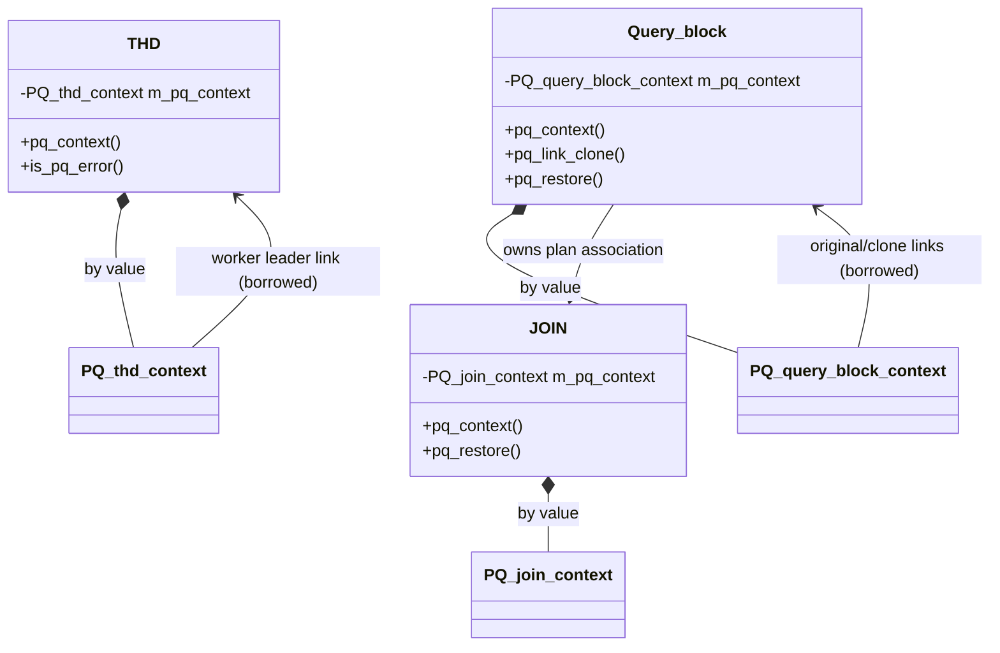
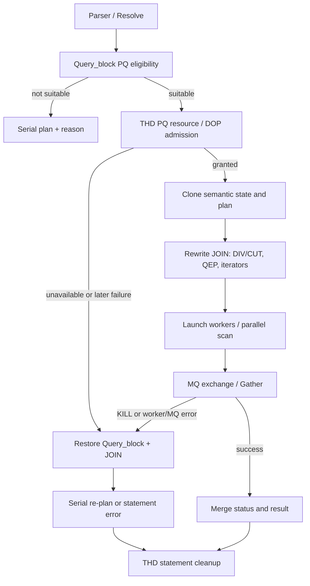
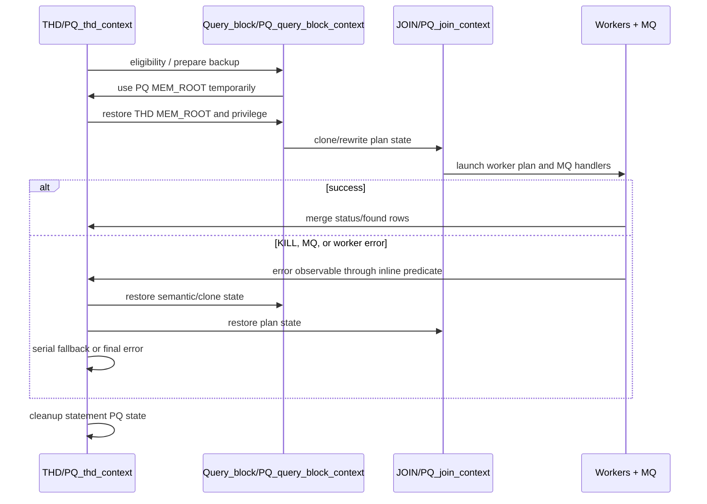

# PQ Context Ownership Refactor Design

> 文档 ID：`PQ-ARCH-DESIGN-014`
> 状态：`implemented; runtime-and-performance-validation-partial`
> 实现提交：`f9970c78a249b486195293b94e8b69d4da3c2b91`
> 稳定对照基线：`1b9ffd755d4`
> MySQL 基线：8.0.41 / TaurusDB on store
> 范围：将 THD、Query_block、JOIN 中的 PQ 成员变量和接口迁移为三个按值持有的 context

## 1. 文档定位

本文是 Parallel Query（PQ）context 重构的设计入口，解释**为何重构、重构的边界、
代码如何组织、如何证明等价以及后续如何演进**。它不替代以下文档：

- [`13_context_ownership_refactor.md`](features_for_opensource/01_parallel_query/spec/current/13_context_ownership_refactor.md)：当前源码、等价性合同和验收门禁；
- [`context_refactor_review_2026-07-21.md`](features_for_opensource/01_parallel_query/spec/current/quality/context_refactor_review_2026-07-21.md)：独立审核结论；
- [`verification_evidence.md`](features_for_opensource/01_parallel_query/spec/current/quality/verification_evidence.md)：已实际执行的构建和测试证据。

本文的“已实现”仅表示代码路径存在于上述提交；没有明确运行证据的结论必须标注为
`static-evidence` 或 `pending-validation`。

## 2. 背景、问题与价值

### 2.1 重构前的问题

PQ 是跨 Parser/Resolve/Optimizer/Executor/Handler 的大特性。其连接级资源、
Query_block clone 语义和 JOIN 计划改写状态曾分别直接散落在 `THD`、`Query_block`、
`JOIN` 的通用成员区。问题不在于单个字段，而在于维护者难以回答：

1. 新增状态的 owner 是连接、query block 还是一次 JOIN 改写？
2. statement cleanup、worker copy、clone unlink 和 serial fallback 是否遗漏该状态？
3. 一个新的调用是否绕过了原/clone、leader/worker 或 plan restore 不变量？
4. PQ 修改是否误伤 MySQL 原生的非 PQ 生命周期和 ABI/布局？

这种散落结构会提高质量加固成本：代码走读需要跨越三个大类的远距离成员，测试失败也难以
直接归属到资源、语义 clone 或计划 rewrite。

### 2.2 目标

- 按原生宿主生命周期把现有 PQ 状态聚合，而不改变 PQ 支持 SQL、hint、DOP、选计划和
  fallback 语义；
- 让 PQ 状态的 owner、初始化、清理、clone、restore 和错误传播可在局部代码中审阅；
- 为后续窄 API、资源审计、状态机和测试映射建立稳定边界；
- 保持 MQ 错误轮询、scan/iterator 等热路径不引入额外所有权层或同步开销。

### 2.3 非目标

- 不新增 PQ 支持场景，不改变 CBO/RBO、DIV_TAB/CUT_TAB、Gather、worker 计划或
  InnoDB parallel scan 算法；
- 不把三个 context 合并为一个总对象；
- 不引入 pimpl、virtual dispatch、`shared_ptr`、新 mutex 或新的 PQ heap owner；仅将既有
  worker-to-leader cancellation flag 实现为 `std::atomic<bool>`，不把它用作诊断信息或计划状态的
  发布机制；
- 不混入 DStore gate、MTR 框架/result、C API 或其他 stable baseline 修复；
- 不在本轮一次性把所有 context 字段改为 private。

### 2.4 特性价值

| 维度 | 直接收益 | 可度量方式 |
| --- | --- | --- |
| 正确性 | 状态与宿主生命周期同位，减少漏 reset/restore/owner 写错 | 字段→owner→cleanup→测试 traceability |
| 可读性 | PQ 字段不再散落在三个核心类的通用成员区 | 代码走读从 `pq_context.h/.cc` 起步 |
| 扩展性 | 新状态先选择 owner，再定义状态转换与测试 | 新字段评审检查表、窄 API 演进 |
| 可测试性 | clone、fallback、KILL、worker error 的状态边界显式 | 定向 MTR 生命周期矩阵 |
| 性能风险控制 | 按值嵌入而非额外指针所有权；保持 MQ predicate 内联 | Release 符号/反汇编和 workload 基准 |

## 3. 开源/公开实现调研

本节只依据公开文档；它提炼设计原则，不把不同产品的分布式执行实现直接移植到
TaurusDB 的单机 MySQL PQ。

| 系统 | 公开实现要点 | 可借鉴原则 | 不可直接迁移的部分 |
| --- | --- | --- | --- |
| TiDB / TiFlash MPP | CBO 在可用时选择 MPP；Exchange 承担跨节点 shuffle；不支持、副本不可用等原因可通过 warning 观察；具备查询级内存和 spill 治理 | 将“资格/不选中原因”和“资源/执行事实”分开记录；用 EXPLAIN/warning 解释不选 PQ；把内存上限和 spill 作为独立资源合同 | TiFlash 是分布式列存 MPP，跨节点 exchange、replica 选择和 shuffle 并不等价于本项目的 THD worker + 本地 MQ |
| OceanBase PX | DFO producer/consumer、DTL 传输层、granule 切分；PX worker pool、admission 和排队显式建模 | 任务粒度、数据流边界、worker 准入和释放必须有清晰 owner；控制消息和数据消息使用同一协议时要定义错误/结束语义 | DFO/DTL 面向分布式多节点与租户资源治理；本项目不应为此轮 context 重构引入 DFO、网络层或独立线程池 |
| PostgreSQL | leader/worker 由 Gather 协调；parallel-safe/restricted/unsafe 明确区分；worker 不可得时可由 leader 串行执行计划下部 | 将 eligibility、执行期 worker 不可得和 serial fallback 分开；明确 stored program、cursor、prepared state 等与 worker-local 状态的边界 | PostgreSQL 的 process/shared-memory 模型、函数标注和 planner/executor 结构与 MySQL 不同，不能复制其 API 或安全分类实现 |

### 3.1 对当前设计的结论

1. **当前三个 owner 的划分正确。**它对应连接/worker（THD）、语义 clone（Query_block）和
   计划 rewrite（JOIN）三个不同的生命周期，而不是把所有并行状态塞入一个调度对象。
2. **不选 PQ 原因、资源准入与运行期错误应继续分层。**现有 `PQUnsuiteInfo`、worker manager、
   MQ error/KILL 已有雏形；后续不要为了“统一”把它们合并为一个布尔状态。
3. **可观测性优先于强制并行。**TiDB 的 CBO/force/warning 和 PostgreSQL 的 worker 不可得
   行为说明：用户和测试需要知道“不选中/降级”的原因；本项目应保持 optimizer trace、
   EXPLAIN 和 fallback reason 的稳定性。
4. **资源治理是后续特性，不是本次字段迁移。**OceanBase 的 admission/queue 与 TiDB 的
   memory/spill 值得作为 roadmap 参考，但需要独立设计、性能模型和测试，不能混入等价重构。

### 3.2 公开资料

- [TiDB: Use TiFlash MPP Mode](https://docs.pingcap.com/tidb/v7.1/use-tiflash-mpp-mode/)
- [TiDB: Configure TiFlash](https://docs.pingcap.com/tidb/stable/tiflash-configuration/)
- [OceanBase: Mastering Parallel Execution, Part 1](https://oceanbase.github.io/docs/blogs/tech/parallel-execution-I)
- [OceanBase: Concurrency Control and Queuing](https://en.oceanbase.com/docs/common-oceanbase-database-10000000001718121)
- [PostgreSQL: Parallel Query](https://www.postgresql.org/docs/17/parallel-query.html)
- [PostgreSQL: When Can Parallel Query Be Used?](https://www.postgresql.org/docs/17/when-can-parallel-query-be-used.html)
- [PostgreSQL: Parallel Safety](https://www.postgresql.org/docs/current/parallel-safety.html)

## 4. High Level Design

### 4.1 所有权模型



三个 context 都是宿主对象的按值成员。它们不独立分配、不独立调度，也不改变宿主对象的
构造、析构、浅 clone 或语句 cleanup 的责任边界。

| Owner | Context | 状态职责 | 生命周期责任 |
| --- | --- | --- | --- |
| `THD` | `PQ_thd_context` | PQ MEM_ROOT、leader/worker、gather、DOP、retry/error/executed、found rows、phase | THD 构造/析构、statement cleanup、worker copy/status merge |
| `Query_block` | `PQ_query_block_context` | eligibility、unsuite reason、where/having、Item clone 标记、clone link、window/group/order backup | resolve/prepare、clone link/unlink、serial fallback restore |
| `JOIN` | `PQ_join_context` | optimizer snapshot、QEP/ref/tmp table、DIV/CUT、sort/group、MQ handler、having/count distinct | plan rewrite、worker/leader plan 构造、fallback restore |

### 4.2 主流程



### 4.3 关键设计原则

- **物理迁移，不改变策略。**现有 PQ eligibility、CBO、fallback reason 与执行路径不因
  context 本身改变。
- **宿主负责时序，context 负责状态。**`THD`、`Query_block`、`JOIN` 保留对外薄包装和
  原调用时序；context 实现只接收必要的 owner 参数。
- **借用关系显式化。**leader、original/clone、QEP 和 handler 指针的所有权不因迁移改变；
  context 不能假定其指向对象比宿主更长寿。
- **热路径零 wrapper 约束。**MQ 轮询中的 `THD::is_pq_error()` 保持头内联。
- **窄 API 只用于跨线程状态。**`m_error` 为私有原子字段；其余字段继续保持当前可审计的迁移
  形态，避免在同一提交中扩大封装范围。
- **布局断言不充当安全证明。**移除四个 `is_standard_layout` 断言：它们既未被 `offsetof`、ABI
  或序列化代码使用，也不能证明线程安全或可复制性；`m_error` 私有化后继续维持该断言只会制造
  无关的布局约束。

## 5. Low Level Design

### 5.1 文件与依赖

| 文件 | 责任 |
| --- | --- |
| `sql/parallel_query/pq_context.h` | 三个 context、clone phase 和迁移后的数据布局声明 |
| `sql/parallel_query/pq_context.cc` | THD 资源、Query_block clone/restore、JOIN plan restore 的实现 |
| `sql/sql_class.h` / `sql/sql_class.cc` | THD 按值成员、生命周期接入、热路径 inline predicate |
| `sql/sql_lex.h` | Query_block 按值成员和兼容薄包装 API |
| `sql/sql_optimizer.h` | JOIN 按值成员和计划 rewrite 薄包装 API |
| `sql/parallel_query/pq_clone.cc` / `pq_optimizer.cc` | 迁移后的 clone、plan rewrite 和 fallback 调用点 |
| `sql/parallel_query/msg_queue.cc` | MQ send/receive 错误轮询调用点 |

### 5.2 THD context

`PQ_thd_context` 承载连接和 worker 级状态：

| 类别 | 成员/接口 | 合同 |
| --- | --- | --- |
| 内存 | `mem_root`、`initialize_mem_root()`、`destroy_mem_root()` | THD 构造创建；析构 `Clear()`、delete、置空；PQ clone/plan 分配继续使用该 root |
| worker 拓扑 | `leader`、`worker_info`、`is_worker()`、`is_real_worker()`、`is_leader()` | worker 只借用 leader；不得由 context 释放 leader/worker manager |
| 运行状态 | `has_pq`、`dop`、`threads_running`、`no_pq`、`executed`、`retry_without_pq` | statement cleanup 按基线时序 reset；`retry_without_pq` 保持 caller 侧无条件复位 |
| 跨线程取消 | 私有 `m_error`、`has_error()`、`set_error()`、`clear_error_after_workers_join()` | worker/leader 仅用它传播“停止 PQ”的单调信号；load/store 使用 `memory_order_relaxed`；只可在 worker 全部 join 后清零 |
| 结果与可观测性 | `gathers`、`current_found_rows`、`leader_create_fake_iter`、`explain_analyze` | status merge 与 EXPLAIN ANALYZE 语义保持 |
| worker 复制 | `copy_from()`、`merge_status()` | 只复制基线已有 `has_pq`/DOP；found rows 合并规则不变 |

`THD::is_pq_error()` 的语义固定为：leader 为空时只检查本地 error；worker 时按
local error → leader killed → leader PQ error → leader THD error 的短路顺序检查。该函数
不得改为 `pq_context.cc` 内的 wrapper。`has_error()` 保持头内联；它使用 relaxed atomic load
消除 worker 写、leader 读之间的 C++ data race，但不为 Diagnostics_area 或计划数据建立新的
发布顺序。

### 5.3 Query_block context

`PQ_query_block_context` 只承载 query-block 语义与 clone/fallback 状态：

| 类别 | 成员/接口 | 合同 |
| --- | --- | --- |
| eligibility | `m_suite_for_pq`、`pq_unsuite_info`、`suite_for_parallel_query()`、`check_table_list()` | 不支持原因保持可观测；不能用 result 归一化掩盖资格变化 |
| 语义备份 | `saved_where_cond`、`saved_having_cond`、saved group/order 指针与映射 | clone 前保存；serial fallback 必须恢复 Item、where/having、group/order |
| clone 拓扑 | `m_pq_last_clone`、`m_pq_is_clone_of`、`link_clone()`、`unlink_clone()` | 双向链接使用 assert 维护；unlink 后不得留悬挂 last clone |
| prepare 状态 | `pq_try_clone_item`、`saved_windows_elements`、`parallel_exec` | 临时切换 PQ MEM_ROOT 和 privilege 后必须恢复原 THD 状态 |
| distinct | `disable_distinct_in_pq_worker` | found-rows 语义不迁入 Query_block；它仍属于 THD context |

`Query_block` 继续保留 `pq_link_clone()`、`pq_unlink_clone()`、`pq_backup()`、`pq_restore()`
和 `pq_is_clone()` 等薄包装，以维持调用点语义与可读性。

### 5.4 JOIN context

`PQ_join_context` 承载一次 JOIN 计划改写及其回滚状态：

| 类别 | 成员/接口 | 合同 |
| --- | --- | --- |
| 优化器快照 | `saved_optimized_vars`、`save_optimized_vars()`、`restore_optimized_vars()` | group/order/having、flags 和 ordered-index 状态应按原顺序恢复 |
| QEP/ref | `qep_tab0`、`qep_tab1`、`ref_items0`、`ref_items1`、`allocate_qep()`、`allocate_indirection_slices()` | PQ 重写的对象仍从既有 MEM_ROOT 分配；`JOIN::shallow_clone()` 不复制 PQ state |
| 临时表 | `saved_tmp_table_param`、`tmp_fields0/1`、`setup_tmp_table_info()` | worker/leader 临时表字段与参数按原计划创建与还原 |
| 选择/排序 | `idx_div_tab`、`idx_cut_tab`、`pq_rebuilt_group`、`pq_stable_sort`、`pq_last_sort_idx` | DIV/CUT、sort/group 选择不是本重构的策略变更 |
| 交换/聚合 | `m_msg_handler`、`pq_pushdown_having`、`has_count_distinct` | MQ handler 和 having/count distinct 语义留在 JOIN plan owner |
| restore | `restore_plan()` | 清理 parallel scan、ref/reverse-scan 状态，复位 DIV/CUT index，再走 serial re-plan |

### 5.5 生命周期与错误路径



## 6. 等价性、兼容性与性能设计

### 6.1 等价性合同

以下事实属于不可接受的回归：Gather 或 DOP 消失/新增、access path 或 join order 改变、
fallback reason 改变、clone 链接残留、worker error/KILL hang、MEM_ROOT 泄漏或 serial
fallback 使用已改写计划。动态 cost、rows 或 EXPLAIN ANALYZE 时间可做最小化归一化，
但不得掩盖这些结构事实。

提交隔离以 `1b9ffd755d4..HEAD` 审查。禁止把 DStore include、C API、MTR framework、
非 PQ result 选择或稳定性修复并入 context 重构；此类修复先进入 `stable_branch`。

### 6.2 兼容性

主仓已经迁移旧 PQ 成员访问，但该重构会影响直接引用旧 `THD` PQ public 字段或
`THD::PQ_CLONE_PHASE` 的仓外 C++ 代码。后续发布前必须检索并构建产品私有插件/扩展：

- 若不存在依赖，在 release note/兼容性记录中声明这是 server-internal API 变更；
- 若存在依赖，提供 deprecated 类型别名或窄 accessor；不要重新暴露可变 raw fields。

三个 context 当前可隐式 copy/move，但内部有借用指针和资源状态。主仓当前没有独立复制
context 的路径；后续 API 收敛时应显式禁止 copy/move，防止未来误用。

### 6.3 性能合同

已具备的 `static-evidence`：context 按值嵌入；未新增 mutex、atomic、virtual dispatch、
shared ownership 或由 context 引入的额外 heap indirection；MQ predicate 已恢复内联。
Debug DWARF 测得 THD 和 JOIN 各增加 8 bytes，Query_block 不变。

因此当前结论只能是 `pending-validation`：对象布局、成员偏移和少量控制面 wrapper 可能
影响 cache locality、连接内存或 optimizer/clone 开销。不得宣传绝对“性能无影响”。

## 7. 测试设计

### 7.1 测试层次

| 层次 | 目标 | Oracle |
| --- | --- | --- |
| 静态迁移检查 | 无旧 raw-member 残留；owner 与字段映射完整 | `rg`、code review、`git diff --check` |
| 构建/二进制 | context 可链接；MQ 热路径无 wrapper | Release/Debug/ASAN build、`nm`、必要时反汇编 |
| 定向生命周期 MTR | clone、fallback、KILL、error、read view、record buffer 等价 | 结果、EXPLAIN 结构、错误码、无 hang/crash |
| 全量 PQ 矩阵 | main + parallel_query 在 PQ 开启/关闭下相对稳定基线不退化 | 成功/失败/skip 分类、reject 日志、计划差异审查 |
| 故障注入 | worker launch、MQ、memory、handler/scan 失败后的 restore | fallback reason、资源回收、串行重建 |
| 性能/内存 | 不引入可重复回归 | 吞吐、median/P95/P99、CPU、RSS、对象布局 |

### 7.2 必须覆盖的定向场景

| 风险 | 代表用例 |
| --- | --- |
| clone/Item refix | `parallel_query.pq_clone_item`、`parallel_query.refactor_fix_fields` |
| fallback/restore | `parallel_query.pq_fallback`、`parallel_query.pq_record_buffer` |
| worker/read view | `parallel_query.pq_read_view` |
| KILL/error/MQ | `parallel_query.pq_kill`、`parallel_query.pq_kill_query`、`parallel_query.pq_worker_error`、`parallel_query.pq_mq_error` |
| stored program/trigger negative path | `parallel_query.pq_sp_trigger` |
| plan shape | `pq_fullscan`、`pq_range_sec`、`pq_icp`、`pq_hash_join`、`pq_agg_distinct` |

已取得的定向证据和完整矩阵缺口见
[`verification_evidence.md`](features_for_opensource/01_parallel_query/spec/current/quality/verification_evidence.md)。禁止使用 `--record`
自动接受 Gather、DOP、join/access path、表名或 fallback reason 的变化。

### 7.3 完整验收命令

在相应 build 目录的 `mysql-test/` 下运行；同一 build 目录一次只运行一个 MTR 进程：

```bash
./mtr --force --max-test-fail=0 --retry=0 --parallel=8 --suite=main
./mtr --force --max-test-fail=0 --retry=0 --parallel=8 \
  --pq --suite=main,parallel_query
```

Release、Debug、ASAN 都需要与 stable 对照；ASAN 命令增加 `--sanitize`。每轮记录可执行数、
成功数、失败数、framework skip、用例自身 capability skip、skip 原因和日志摘要。

### 7.4 性能验收设计

在同机、同 Release 配置、同数据集、无并发干扰条件下，让 stable/refactor 交替执行至少
五轮。覆盖：

1. parallel full/range/index scan 与大结果集 MQ-Gather；
2. hash join、partial/final aggregation、排序；
3. 短 PQ 查询的并发吞吐和 P95/P99；
4. 连接创建与大量空闲连接的 RSS/每连接内存。

保留原始值，并报告 median/P95/P99、CPU 与 RSS。性能阈值须在项目层面确认；超阈值时先
对比 profile/plan/对象布局，再决定是否恢复 clone accessor 内联或调整实现。

## 8. 后续演进与决策

| 优先级 | 决策 | 触发条件 | 约束 |
| --- | --- | --- | --- |
| P0 | 保持 `is_pq_error()` 内联 | 任意 MQ 相关改动 | 不得增加跨编译单元 wrapper |
| P1 | 完成性能与仓外兼容性验收 | 合入/发布前 | 无数据不宣称无劣化 |
| P1（可选） | 恢复五个 Query_block clone 小 accessor 内联 | 基准显示可重复控制面回归 | 不改变 owner 或 API 语义 |
| P2 | 提取 `pq_types.h` | 头文件编译扇出成为问题 | 只移动轻量 enum/type，不混入策略重写 |
| P2 | 分批收敛窄 API | 新增 PQ 状态或清理路径时 | 按 THD lifecycle、Query_block clone、JOIN rewrite 分批；不一次替换所有调用点 |
| P2 | 禁止 context copy/move | API 收敛变更时 | 保留 host 按值成员，不允许独立复制借用状态 |
| 不建议 | 合并三个 context 或引入 pimpl/shared ownership/额外锁 | 无 | 会损害 owner 边界、局部性和等价重构可审计性 |

## 9. 代码与文档追踪

| 主题 | 主要源码/文档 |
| --- | --- |
| context 声明/实现 | `sql/parallel_query/pq_context.h`、`sql/parallel_query/pq_context.cc` |
| THD 接入 | `sql/sql_class.h`、`sql/sql_class.cc` |
| Query_block 接入 | `sql/sql_lex.h`、`sql/parallel_query/pq_clone.cc` |
| JOIN 接入 | `sql/sql_optimizer.h`、`sql/parallel_query/pq_optimizer.cc` |
| MQ 热路径 | `sql/parallel_query/msg_queue.cc` |
| 等价性与验收 | [`13_context_ownership_refactor.md`](features_for_opensource/01_parallel_query/spec/current/13_context_ownership_refactor.md) |
| 独立审核 | [`context_refactor_review_2026-07-21.md`](features_for_opensource/01_parallel_query/spec/current/quality/context_refactor_review_2026-07-21.md) |
| 当前验证证据 | [`verification_evidence.md`](features_for_opensource/01_parallel_query/spec/current/quality/verification_evidence.md) |

任何后续 PQ 改动都应先回答：状态属于哪个 owner、何时初始化/清理、是否会跨 clone/worker
借用、fallback 如何恢复、错误/KILL 如何传播，以及哪条测试 oracle 能证明其未破坏现有合同。
